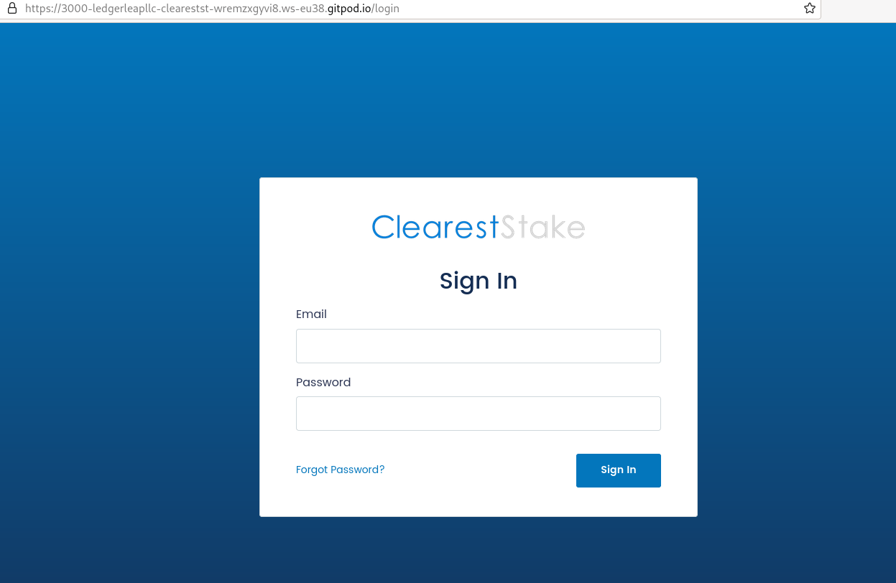
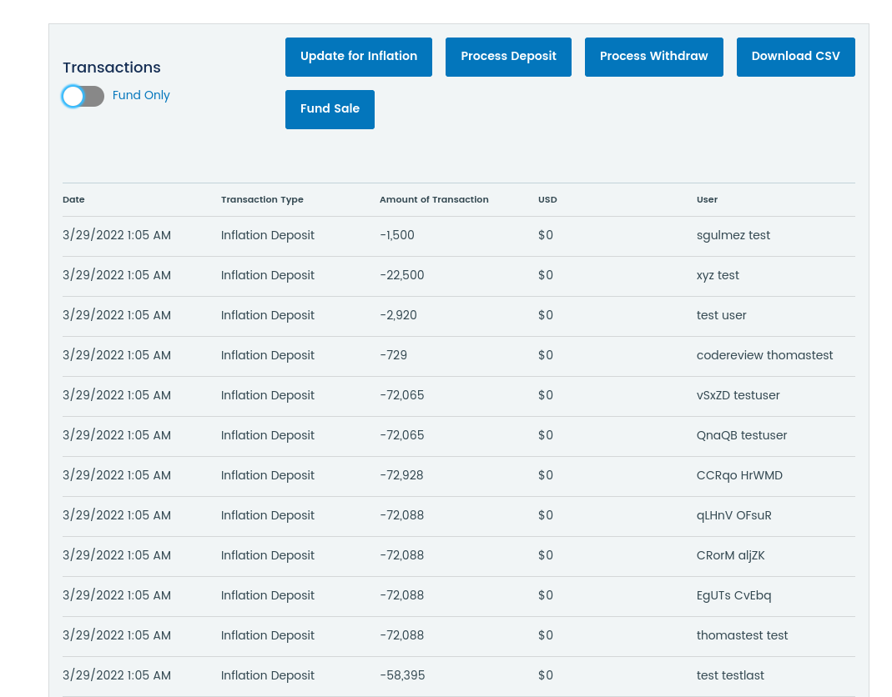

Grant Proposal | [128 - ClearestStake staking asset manager for Node operators and groups](https://portal.devxdao.com/public-proposals/128)
------------ | -------------
Milestone | 3
Milestone Title | Administration interface, accounting system, and all backend
OP | LedgerLeap
Reviewer | Muhammet Kara

# Milestone Details

## Details & Acceptance Criteria

**Details of what will be delivered in milestone:**

This milestone will deliver the final needed parts of the system, including an admin panel and the back end for accounting and administration. The admin panel will track total holders amongst a group, show all transactions, allow user administration functions, support withdrawals, deposits, and new user's invitations and token holdings. The accounting back end will track each deposit against the total tokens held by all users in the system to keep an up-to-date pro-rata breakdown of each user's percentage. This percentage will be used to divide to 8 decimal places any new inflationary tokens in the system. An emailer system will alert admins to user support or withdrawal request needing admin action. The ability to onboard users will be linked to a new user form and invite tracking system. Global settings will encompass any needed settings to make the system quickly adaptable to the colors, brand, logo, and needs of any organization deploying the system. Based on current resources and bandwidth, we expect to have a team of 3 developers, 1 engineer, and 1 project manager work a cumulative 280 hours for these front-end deliverables and 220 for the back-end systems. Because the team has other projects to balance time between, this milestone will require up to 60 days from the delivery of the prior milestone.

**Acceptance criteria:**

The following items will be delivered in the repository and also testable on a demonstration domain: 

• Admin front-end built out in NEXT.JS for Admin user views.
• Admin database will be delivered to support the other functions delivered in this phase.
•Transaction database will be delivered for logging actual ( not demo ) withdrawals and inflation rewards.
• Back-end engine to be delivered for serializing transactions (first come, first served), proving the baseline for proper asset accounting.  This will be tested by inputting inflation and withdrawal requested in the systems detailed below and making sure that % of pool ownership stay accurate to 6 decimal places.
• Withdrawal system will be delivered, allowing admin to log a withdrawal. This system will reduce the balance of the subject user's token holdings and recalculate the pro-rata holdings of the subject user and every other user to fairly allocate token inflation credits that happen after this transaction.
• Inflation credit system will be delivered, allowing a user to update the master node balance and the system to automatically allocate these tokens to the proper users across the system to 6 decimal places.
• An invite system will allow for the generation of new users and the ability for these users to claim their tokens by setting a password.
• Registration, password, and password reset will function. 
• An IP logging system will be in place for all logins by token holders.
• An email verification system will function.
• User dashboard will be live and include sections to show balance, pricing, and transactions.
• User balance section will show live update of sample user test data with a converted price for token holdings and last distribution date for staking rewards.
• A withdrawal function will be deployed. This will be a form process designed to alert the admin to the need to process a user withdrawal. The front-end ONLY will be delivered in this phase. Admin side to be developed in next phase.
• A pricing chart will integrate CoinMarketCap APIs to display pricing on a chart with adjustable timelines. In addition, crons will fill the database with log data over time to support independent display of price info.
• A transaction tracking system will be implemented to support the withdrawal and inflation functions delivered in the new phase.
• A settings page will be delivered supporting password change and serving as a place to host any future settings needs.
• Log out function will be implemented.
• All user-required APIs, crons, and database structures to support the user system will be delivered in this phase.

Please see acceptance criteria as opposed to KPIs for the definition of done/delivered. KPIs are less applicable for this build as we are not measuring performance in this situation but rather the delivery of assets. The team will present the functionality of any and all systems detailed in 
the "Acceptance Criteria" section during a schedule zoom accessible to the public and record this session for proof of delivery.

**Additional notes regarding submission from OP:**

Repos updated for this Not 15th submission as per the CRDAO requirements.

Please enjoy exploring the delivered fund management software ClearestStake. A demo version of the portal is hosted.

## Milestone Submission

The following milestone assets/artifacts were submitted for review:

Repository | Revision Reviewed
------------ | -------------
https://github.com/ledgerleapllc/cleareststake-frontend | 0c8257f
https://github.com/ledgerleapllc/cleareststake-backend | 814eb41

# Install & Usage Testing Procedure and Findings

Following the instructions in the README files of the frontend and the backend repositories of the project, reviewer was able to successfully build and run the project on the cloud in an `Ubuntu 20.04` environment.

## Installation

It was observed that the OP has improved the installation instructions and brought the installation procedure to a level which allows auto installation and run of it through standard commands. Reviewer praises the OP for their efforts to achieve these improvements.

## Usage Testing

After building and verifying successful installation of the app in the test environment, reviewer proceeded with the manual usage testing in the test deployment provided by the OP on cleareststake.com

Then the promised functionalities for the milestone were tested manually by using `Firefox 95.0 (64-bit)` as the browser, on the production deploy provided by the OP.

### First check

The issues reported by the previous review seem to have been fixed. All other functions were observed to be at an acceptable state, except the following points observed by the reviewer, which need to be fixed for this final milestone of the project to be accepted:

* After entering a larger new total stake value by clicking on the `Update for Inflation` button, caused a series of **negative inflation deposit transactions**, which means that the **users lost tokens where they should have gained**. Moreover, the total tokens value after this operation was observed to be different than the entered one. Reviewer suspects this to be due to **an overflow**. Reviewer suggests adding one or more test cases for this issue after fixing it, to make sure it never appears again in the future.

* Pool weights of user balances are represented in **4 decimals instead of 6 decimals**, as promised on the grant.

* The price chart on the user page, and the price table at the bottom of the admin page both seem to have **outdated price data**, with the most recent value being from January 2022. Moreover, reviewer **couldn't find any way to adjust the data range of the price chart**.

### Final check

After reporting the issues above; OP promised to fix them quickly, and then informed the reviewer that all issues were fixed. Then a final check were done by the reviewer on the following assets/artifacts:

Repository | Revision Reviewed
------------ | -------------
https://github.com/ledgerleapllc/cleareststake-frontend | 92d7b21
https://github.com/ledgerleapllc/cleareststake-backend | 9eba4d4

**Based on the last/final check, all functions appeared to be working as expected, and all of the previously reported issues were observed to have been fixed.**

## Overall Impression of usage testing

All of the major functionality is observed to be working properly, after the fixes by the OP, following the initial reporting of the issues.

Reviewer praises the OP for being responsive all the time, and fixing all issues encountered while also providing an always-up-to-date deployment for manual tests.

Requirement | Finding
------------ | -------------
Project builds without errors | PASS
Documentation provides sufficient installation/execution instructions | PASS
Project functionality meets/exceeds acceptance criteria and operates without error | PASS

# Unit / Automated Testing

Project contains [UI and integration tests](assets/test.spec.js.mp4) on the frontend side, and [API tests](assets/backend-tests.md) on the backend side, covering the critical functionality. However, reviewer highly suggests adding more tests, especially towards the regressions encountered, to avoid repetitive bugs in the future.

Requirement | Finding
------------ | -------------
Unit Tests - At least one positive path test | PASS
Unit Tests - At least one negative path test | PASS
Unit Tests - Additional path tests | PASS with Notes

# Code Analysis & CI Facilities

The project has automated code analysis setup on the frontend repository and continuous integration setup on the backend repository. The reviewer praises the OP for having these setup as they are crucial for any open-source project to resist regressions. However, it would be highly suggested to also add a UI test action to the frontend repository.

Requirement | Finding
------------ | -------------
Code Analysis | PASS
Continuous Integration | PASS with Notes

# Documentation

### Code Documentation

Code documentation is observed to be at bare minimum on both the frontend and the backend side. Reviewer [was able to generate](assets/docs.tar.gz) the api documentation by using `phpDocumentor`, and observed that the code-level documentation for the critical functions has room for improvement although it is possible to have a basic understanding of the code-base due to easy-to-understand structure and naming of the entities. Reviewer recommends improving the code-level documentation, and highly suggests adding proper instructions on the README to generate the api documentation and also to provide an auto-generated version of the documentation, updated on new commits on the `master` branch.

Requirement | Finding
------------ | -------------
Code Documented | PASS with Notes

### Project Documentation

README.md has sufficient general information about the project, along with installation instructions, and the usage documentation.

Usage documentation is brief. The reviewer suggests detailing the usage documentation with specific usage scenarios and steps.

Requirement | Finding
------------ | -------------
Usage Documented | PASS

## Overall Conclusion on Documentation

Based on the reviewer's findings, this review should pass with notes.

# Open Source Practices

## Licenses

The Project is released under the Apache-2.0 License.

Requirement | Finding
------------ | -------------
OSI-approved open source software license | PASS

## Contribution Policies

Pull requests and Issues are enabled on the repository. The project also has a CONTRIBUTING policy and a security policy.

Requirement | Finding
------------ | -------------
OSS contribution best practices | PASS

# Coding Standards

## Dependencies

The project previously had a number of dependencies with high or critical-level security vulnerabilities, which were recommended to be fixed. Reviewer observed that all of the reported vulnerabilities were fixed by the OP.

## General Observations

Code is generally well-structured and readable. The project as committed to GitHub and both the automated tests and the manual tests pass.

# Final Conclusion

The project provides the functionalities described in the grant application and milestone acceptance criteria. The reviewer praises the OP for the general stability and the fluid user experience of the app. The reviewer also would like to thank the OP for including the open-source policies, which are very important for the long-term sustainability of any open-source project, in the project's repositories.

It was observed that the build and installation experience/documentation has been improved, and all of previously reported issues have been fixed by the OP. However, although the minimum requirements are met, reviewer suggests improving code-level documentation and adding regression tests to ensure the project's long term success. More over, it would be very helpful to have an auto-generated/updated version of teh code-level documentation published by the OP.

Thus, in the reviewer's opinion, this submission should PASS with Notes.

# Recommendation

Recommendation | PASS with Notes
------------ | -------------
