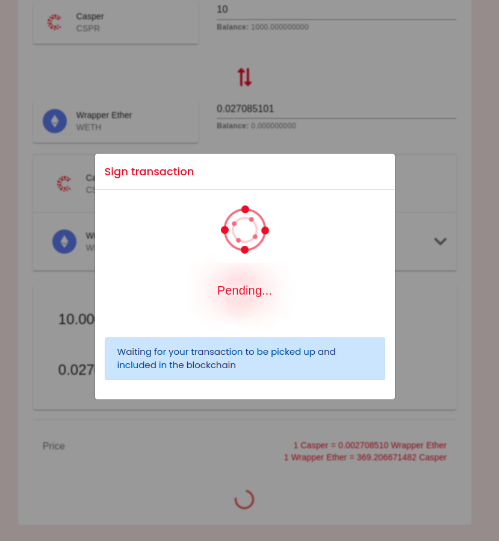
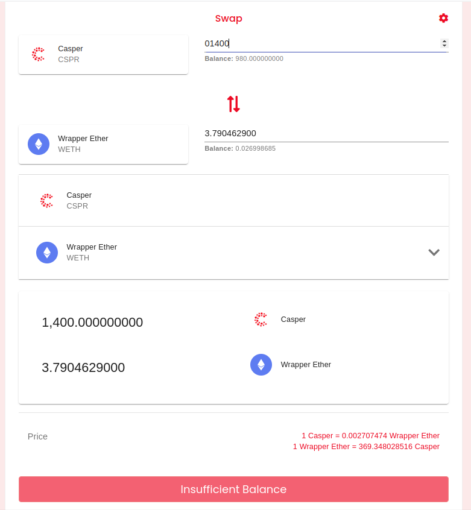
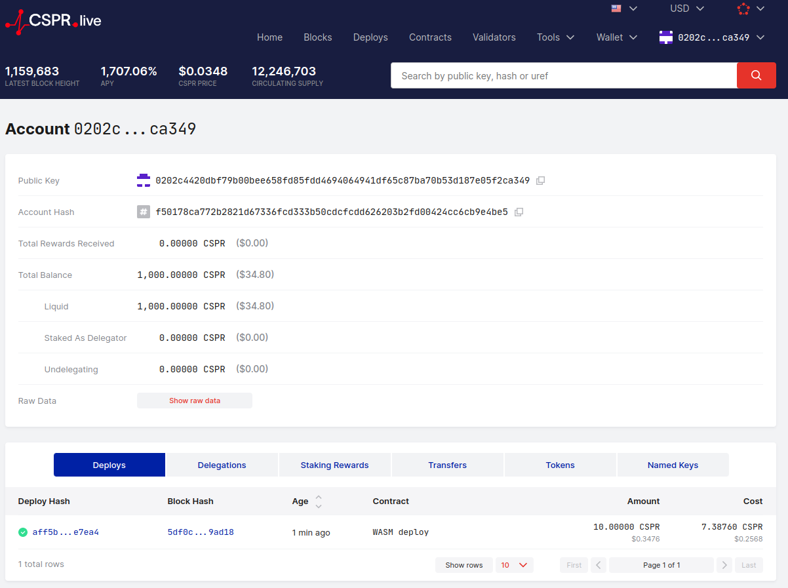
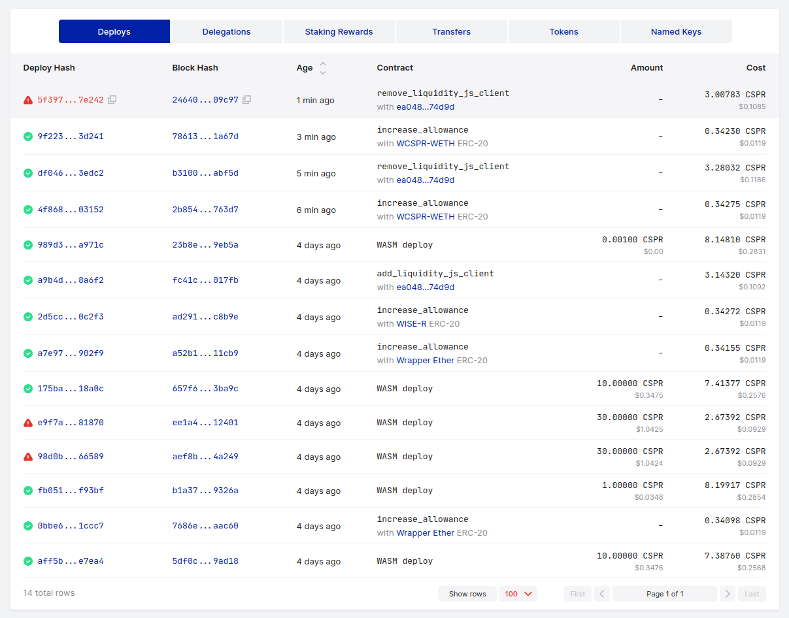

Grant Proposal | [153 - Uniswap Clone for Casper](https://portal.devxdao.com/public-proposals/153)
------------ | -------------
Milestone | 2
Milestone Title | Backend Port - 2 Engineers
OP | Bernardo Herzer
Reviewer | Gökhan Gurbetoğlu <crdao@ggurbet.com>

# Milestone Details

This is the second milestone of grant. The review will cover the second milestone criteria set forth below.

## Details & Acceptance Criteria

**Details of what will be delivered in milestone:**

Website GraphQL backend.  
The original website uses thegraph.com to index events.  
As Casper doesn’t support events, and thegraph.com doesn’t support casper, we will build a graphql adapter layer based on Make Software’s event-store to index events and serve aggregated data.

**Acceptance criteria:**

We have a graphql event indexer and api that work with the uniswap contracts

**Additional notes regarding submission from OP:**

Completed per requirements

## Milestone Submission

The following milestone assets/artifacts were submitted for review:

Repository | Revision Reviewed
------------ | -------------
https://github.com/Rengo-Labs/CasperLabs-Uniswap-DemoApp | 5944f82
https://github.com/Rengo-Labs/CasperLabs-UniswapV2-GraphQL | 0343ce1


# Install & Usage Testing Procedure and Findings

Reviewer used an Ubuntu 20.04 LTS GitPod cloud machine and a Pardus 21.3 GNU/Linux local machine for this review.

## Casper_Uniswap_V2 GraphQL

Reviewer was able to successfully install the GraphQL API with a single command, `npm install`, provided in the README. After, that running `npm start` started a live server for the API backend.

Reviewer used both this backend and the one provided by OP (https://casper-uniswap-v2-graphql.herokuapp.com/) to test example API calls.

Reviewer used example queries provided by OP to test the API calls. All calls were running accordingly and to the acceptance criteria. Example queries and their responses are below:

- [Example queries and their responses](assets/graphql-test.md)

These examples, however, are not presented in a documentation form. Reviewer suggests adding these and additional query examples for better understandability of the usage of the API.

All values and their corresponding deployments can also be checked through cspr.live, which is mentioned thoroughly in the following section.

## Uniswap Demo App For Casper

There are some dependencies that have critical security vulnerabilities. Some of these were updated during the review, however a high risk one is still remaining. This issue is needed to be addressed in future milestones.

Note: The command for installation is provided as `npm Install` but the second part should also be in lowercase letters: `npm install`.

Reviewer ran the `npm install` and `npm start` commands provided in the README to setup the project. There are numerous warnings that needs to be addressed. Also, the installation was done using the `--legacy-peer-deps` flag since the command refused to run without it. This also needs to be worked on in the future milestones.

- [Installation logs](assets/install.md)
- [Build logs (production)](assets/build.md)

After the installation, running the `npm start` command started a web server and the website was reachable at `localhost:3000`:


All parts of the app were available for navigation but it asked user to connect with a wallet to make operations, as expected. Reviewer was able to successfully sign in using Casper Signer.

Using the provided test document, reviewer was able to extensively test the features of the app and found it to be running as intended. While manual testing is possible, creating a test suite for the frontend is also possible and suggested by the reviewer.

There are some parts of the app that has minor annoyances, like needing to refresh the page, choosing a different tab and going back to refresh the current page, non functioning "change swap direction" button at times, and similar that needs attention in future milestones. These do not directly affect the operations but hinders the user interaction to a degree.

Here are some screenshots from the interface and operations:





Here is the final screenshot of the deploys, both successful and unsuccessful (note that some operations are shown as WASM Deploy):



## Overall Impression of usage testing

Requirement | Finding
------------ | -------------
Project builds without errors | PASS / FAIL / PASS with Notes
Documentation provides sufficient installation/execution instructions | PASS / FAIL / PASS with Notes
Project functionality meets/exceeds acceptance criteria and operates without error | PASS / FAIL / PASS with Notes

# Unit / Automated Testing

The README tells that running `npm test` would invoke the unit tests, however there seems to be no tests prepared for the project.

```sh
gitpod /workspace/CasperLabs-Uniswap-DemoApp (main) $ npm test
No tests found, exiting with code 0
```

Using the provided test document, reviewer was able to extensively test the features of the app and found it to be running as intended. While manual testing is possible, creating a test suite for the frontend is also possible and suggested by the reviewer.

Requirement | Finding
------------ | -------------
Unit Tests - At least one positive path test | PASS
Unit Tests - At least one negative path test | PASS
Unit Tests - Additional path tests | PASS with Notes

# Documentation

### Code Documentation

There are many parts of code that lack proper code documentation. Also, there are some extra commented code that is still in production. These need to be addressed in future milestones.

Requirement | Finding
------------ | -------------
Code Documented | PASS with Notes

### Project Documentation

The README has sufficient instructions to set up and run the application. Some additional [usage examples](https://docs.google.com/document/d/1QPKbuqXWy6ysWkEhNJWoz9d2X_yeIYp978AjA14OtCk/edit) were also provided by OP.

Requirement | Finding
------------ | -------------
Usage Documented | PASS
Example Documented | PASS

## Overall Conclusion on Documentation

The documentation is sufficient for this milestone.

# Open Source Practices

## Licenses

The project is released under GPL-3.0 license. However, in the proposal at DEVxDAO Portal, the project is expected to have the Apache-2.0 license. This issue has been addressed in the first milestone's review but the license is yet to be updated.

Requirement | Finding
------------ | -------------
OSI-approved open source software license | PASS with Notes

## Contribution Policies

Project contains clear CONTRIBUTING, SECURITY and CODE OF CONDUCT policies. Pull requests and Issues are enabled on the repository and the project is set up for public participation.

Requirement | Finding
------------ | -------------
OSS contribution best practices | PASS

# Coding Standards

## General Observations

Source code is well written, easily readable, and conforms to good coding practices overall.

# Final Conclusion

The project is evolving as intended. Documentation is enough for this milestone but code documentation need improvements. Usage testing was done using manual testing but additional automated tests for the frontend would be a better addition. The license is not matching the one described in the proposal and needs to be updated. The project conforms to open source standards. App works according to its needs and meets the acceptance criteria for this milestone. Because of these reasons, reviewer suggests this milestone to PASS with Notes.

# Recommendation

Recommendation | PASS with Notes
------------ | -------------
