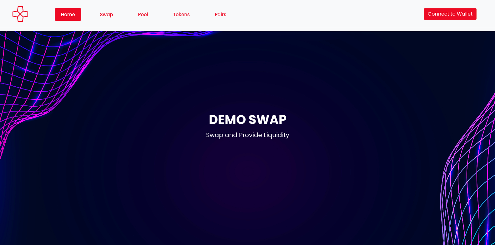

Grant Proposal | [153 - Uniswap Clone for Casper](https://portal.devxdao.com/public-proposals/153)
------------ | -------------
Milestone | 2
Milestone Title | Backend Port - 2 Engineers
OP | Bernardo Herzer
Reviewer | Gökhan Gurbetoğlu <crdao@ggurbet.com>

# Milestone Details

This is the second milestone of grant. The review will cover the first milestone criteria set forth below.

## Details & Acceptance Criteria

**Details of what will be delivered in milestone:**

Website GraphQL backend.  
The original website uses thegraph.com to index events.  
As Casper doesn’t support events, and thegraph.com doesn’t support casper, we will build a graphql adapter layer based on Make Software’s event-store to index events and serve aggregated data.

**Acceptance criteria:**

We have a graphql event indexer and api that work with the uniswap contracts

**Additional notes regarding submission from OP:**

Completed per requirements

## Milestone Submission

The following milestone assets/artifacts were submitted for review:

Repository | Revision Reviewed
------------ | -------------
https://github.com/Rengo-Labs/CasperLabs-Uniswap-DemoApp | 5944f82


# Install & Usage Testing Procedure and Findings

Reviewer used an Ubuntu 20.04 LTS GitPod cloud machine and a Debian 10 local machine for this review.

Note: The command for installation is provided as `npm Install` but the second part should also be in lowercase letters: `npm install`.

Reviewer ran the `npm install` and `npm start` commands provided in the README to setup the project and started it.



## Overall Impression of usage testing

There are some dependencies that have critical security vulnerabilities. Some of these were updated during the review, however others are remaining. This issue is needed to be addressed in future milestones.

Requirement | Finding
------------ | -------------
Project builds without errors | PASS / FAIL / PASS with Notes
Documentation provides sufficient installation/execution instructions | PASS / FAIL / PASS with Notes
Project functionality meets/exceeds acceptance criteria and operates without error | PASS / FAIL / PASS with Notes

# Unit / Automated Testing

The README tells that running `npm test` would invoke the unit tests, however there seems to be no tests prepared for the project.

```sh
gitpod /workspace/CasperLabs-Uniswap-DemoApp (main) $ npm test
No tests found, exiting with code 0
```

Requirement | Finding
------------ | -------------
Unit Tests - At least one positive path test | PASS / FAIL / PASS with Notes
Unit Tests - At least one negative path test | PASS / FAIL / PASS with Notes
Unit Tests - Additional path tests | PASS / FAIL / PASS with Notes

# Documentation

### Code Documentation

_Summarize the code level documentation you encountered. Provide a `PASS`, `FAIL`, or `PASS With Notes` for the requirements
below. In the case of `PASS With Notes`, make sure that the notes for improvement are clearly spelled out in this section._

Requirement | Finding
------------ | -------------
Code Documented | PASS / FAIL / PASS with Notes

### Project Documentation

_Summarize the project level documentation you encountered. This covers the information provided in the README for the project, 
as well any exampled provided. Provide a `PASS`, `FAIL`, or `PASS With Notes` for the requirements
below. In the case of `PASS With Notes`, make sure that the notes for improvement are clearly spelled out in this section._

Requirement | Finding
------------ | -------------
Usage Documented | PASS / FAIL / PASS with Notes
Example Documented | PASS / FAIL / PASS with Notes

## Overall Conclusion on Documentation

_Summarize your review of the documentation in this project, including code, usage and examples_

# Open Source Practices

## Licenses

The project is released under GPL-3.0 license. However, in the proposal at DEVxDAO Portal, the project is expected to have the Apache-2.0 license. This issue has been addressed in the first milestone's review but the license is yet to be updated.

Requirement | Finding
------------ | -------------
OSI-approved open source software license | PASS with Notes

## Contribution Policies

Project contains clear CONTRIBUTING, SECURITY and CODE OF CONDUCT policies. Pull requests and Issues are enabled on the repository and the project is set up for public participation.

Requirement | Finding
------------ | -------------
OSS contribution best practices | PASS

# Coding Standards

## General Observations

_Provide any general observations about the project you want to add to your review. These can be subjective in nature as well, and do not
contribute to your recommendation to pass or fail the submission._

# Final Conclusion

_Summarize your final conclusion, and provide your motivation for your recommendation below. For example, you may say 'Reviewer recommends that this
submission should fail code review, because it does not contain an OSI-approved open source license'_

# Recommendation

Recommendation | PASS / FAIL / PASS with Notes
------------ | -------------
