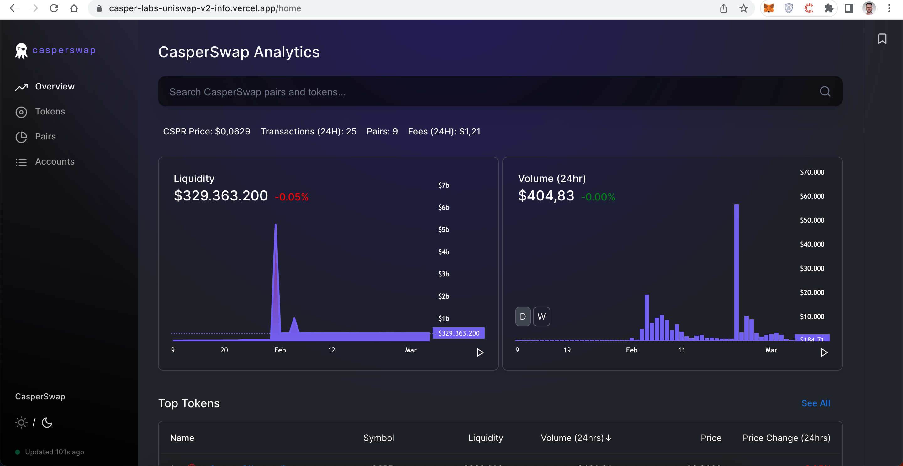
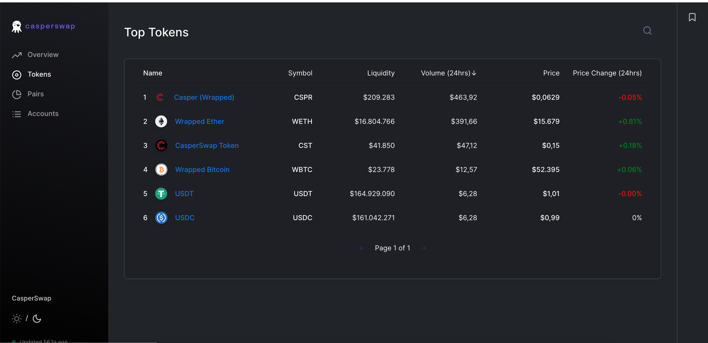
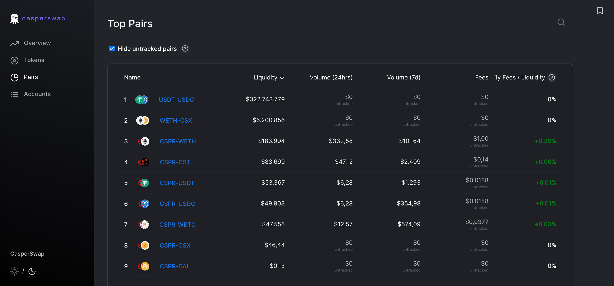
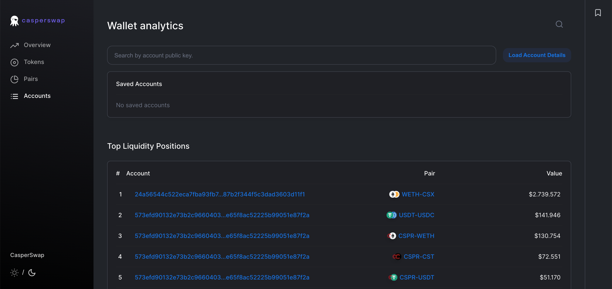

Grant Proposal | [153 - Uniswap Clone for Casper](https://portal.devxdao.com/app/proposal/153)
------------ | -------------
Milestone | 3
Milestone Title | Information Website Port - 2 Engineers 
OP | CaptainBernardo
Reviewer | Muhammed Didin <mdidin80@gmail.com>

# Milestone Details

## Details & Acceptance Criteria

**Details of what will be delivered in milestone:**

A website that can render what is in the graphql database.

**Acceptance criteria:**

We have a website that can render what is in the graphql database

**Additional notes regarding submission from OP:**

https://casper-labs-uniswap-v2-info.vercel.app/home

## Milestone Submission

The following milestone assets/artifacts were submitted for review:

Repository | Revision Reviewed
------------ | -------------
https://github.com/Rengo-Labs/CasperLabs-UniswapV2-Info | b05a2e1

# Install & Usage Testing Procedure and Findings

Following the instructions in the README file of the repository, the reviewer was able to successfully build and run the source code and use the project on macOS Monterey.

### Build

[Full Build Logs](assets/build.txt)

### Usage

After building, the overview page welcomes the user. 

The website has 3 another pages.

#### Tokens:

#### Pairs:

#### Accounts:

## Overall Impression of usage testing

The project builds without errors, the documentation provides sufficient installation and execution instructions, and the project functionality meets the acceptance criteria and operates without errors.

Requirement | Finding
------------ | -------------
Project builds without errors | PASS 
Documentation provides sufficient installation/execution instructions | PASS
Project functionality meets/exceeds acceptance criteria and operates without error | PASS

# Unit / Automated Testing

The reviewer was able to successfully run the unit tests. The bash script file was able to run the unit tests. The project has sufficient amount of unit tests which covers all critical classes and methods.

[Full Test Logs](assets/tests.txt)

Requirement | Finding
------------ | -------------
Unit Tests - At least one positive path test | PASS
Unit Tests - At least one negative path test | PASS
Unit Tests - Additional path tests | PASS

# Documentation

### Code Documentation

Properly formatted inline comments on the critical classes and the methods are added to the project. The reviewer thinks that there is a sufficient amount of code documentation.

Requirement | Finding
------------ | -------------
Code Documented | PASS

### Project Documentation

The Readme file has sufficient basic usage instructions for the implemented methods. The reviewer was able to build and run the project using project documentation.

Requirement | Finding
------------ | -------------
Usage Documented | PASS 
Example Documented | PASS

## Overall Conclusion on Documentation

In the reviewer's opinion, the project has sufficient documentation. 

# Open Source Practices

## Licenses

The project is released under GPL-3.0 license. However, in the proposal at DEVxDAO Portal, the project is expected to have the Apache-2.0 license. This issue has been addressed in the previous milestones' reviews but the license is yet to be updated. **It is recommended for the next milestones to replace the license with the correct one by the reviewer.**

Requirement | Finding
------------ | -------------
OSI-approved open source software license | PASS with Notes

## Contribution Policies

The project has Contributing and Security Policies and a Code of Conduct.

Requirement | Finding
------------ | -------------
OSS contribution best practices | PASS

# Coding Standards

## General Observations

The project has well-structured and readable code. Code and project documentation is sufficient and they provide the necessary information to use the program. The project complies with open source standards overall.

# Final Conclusion

The project is evolving as intended. Documentation is enough for this milestone. Usage testing was done using manual and unit testing. The license is not matching the one described in the proposal and needs to be updated. The project conforms to open source standards. App works according to its needs and meets the acceptance criteria for this milestone. Because of these reasons, reviewer suggests this milestone to PASS with Notes.

# Recommendation

Recommendation | PASS with Notes
------------ | -------------

