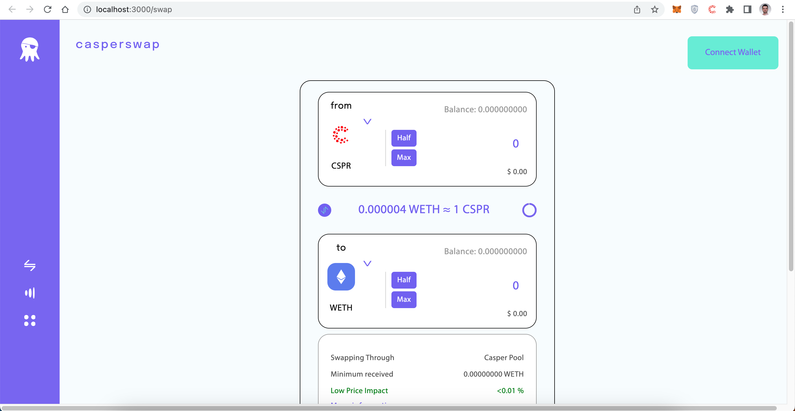
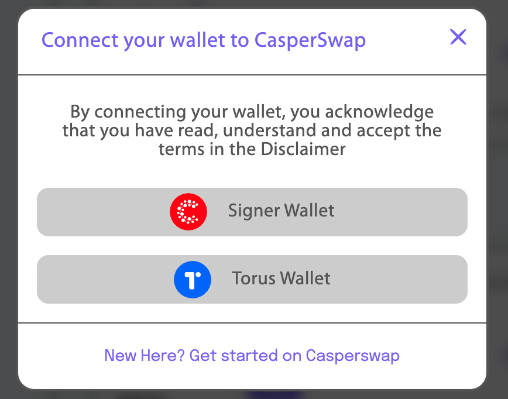
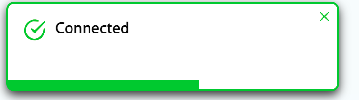
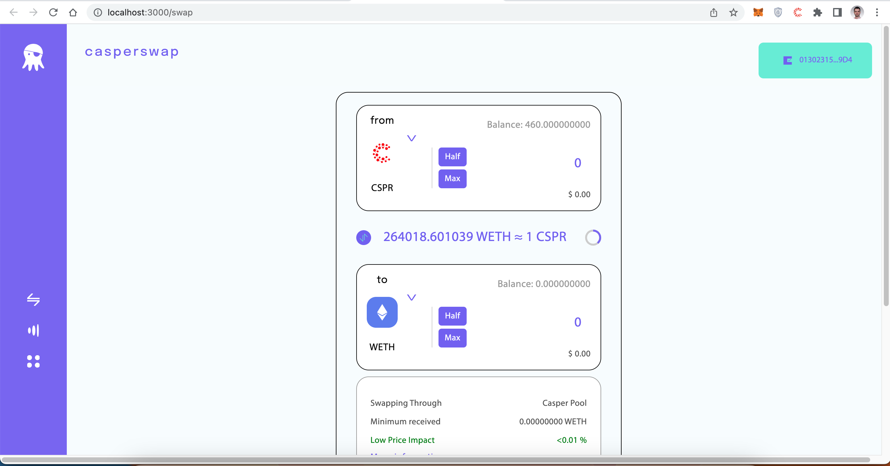
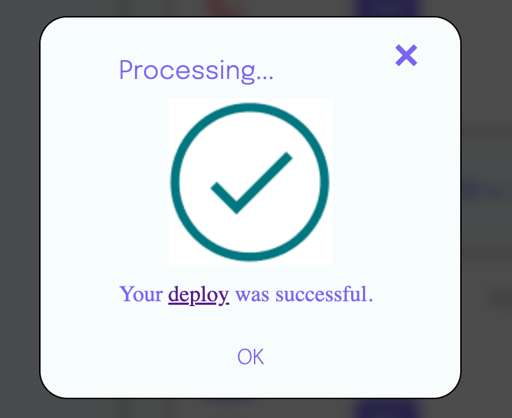

Grant Proposal | [153 - Uniswap Clone for Casper](https://portal.devxdao.com/public-proposals/153)
------------ | -------------
Milestone | 4
Milestone Title | Uniswap Interface Website Port, Wallet/Signer Integration, and SDK Port - Submission 2
OP | CaptainBernardo
Reviewer | Muhammed Didin <mdidin80@gmail.com>

# Milestone Details

## Details & Acceptance Criteria

**Details of what will be delivered in milestone:**

A website to add liquidity and to swap between two test currencies.

**Acceptance criteria:**

We can use the website to add liquidity and to swap between two test currencies.

**Additional notes regarding submission from OP:**

https://github.com/Rengo-Labs/CasperLabs-UniswapV2-GraphQL

https://github.com/CodeReviewDAO/dxd_codereview/tree/main/Reviews/153%20-%20Uniswap%20Clone%20for%20Casper/2%20-%20Backend%20Port%20-%202%20Engineers

Resubmitting - review should already been complete from milestone 2...

## Milestone Submission

The following milestone assets/artifacts were submitted for review:

Repository | Revision Reviewed
------------ | -------------
https://github.com/Rengo-Labs/uniswap-casper-interface/tree/develop | 4bce1f1

# Install & Usage Testing Procedure and Findings

Following the instructions in the README file of the repository, the reviewer was able to successfully build and run the source code and use the project on macOS Monterey.

### Install

[Full Install Logs](assets/install.txt)

### Build

[Full Build Logs](assets/build.txt)

### Usage

After building, the mainpage welcomes the user. 

The user needs to connect to wallet.

After connecting, the webpage alerts that you are connected and your public key is shown at the top.

Mainpage after sign in:

The reviewer tried to perform swap and liquidity transactions to test the acceptance criteria and the operations successfully completed.

Sample swap deploy: https://testnet.cspr.live/deploy/c179c16fa35c11e7f2ad76aedeb951ae1beb326c1384bfc4f41173eae9a60462

Sample liquidity deploy: https://testnet.cspr.live/deploy/41d43a2ab1d2c5647bdb283fb7131702f597174fc21821f217b350d57f762cbc

## Overall Impression of usage testing

The project builds without errors, the documentation provides sufficient installation and execution instructions, and the project functionality meets the acceptance criteria and operates without errors. 

Requirement | Finding
------------ | -------------
Project builds without errors | PASS 
Documentation provides sufficient installation/execution instructions | PASS
Project functionality meets/exceeds acceptance criteria and operates without error | PASS

# Unit / Automated Testing

The reviewer was able to successfully run the unit tests. The bash script provided in the README file was able to run the unit tests. The project has sufficient amount of unit tests which covers all critical classes and methods.

[Full Test Logs](assets/test.txt)

Requirement | Finding
------------ | -------------
Unit Tests - At least one positive path test | PASS
Unit Tests - At least one negative path test | PASS
Unit Tests - Additional path tests | PASS

# Documentation

### Code Documentation

Properly formatted inline comments on the critical classes and the methods are added to the project. The reviewer thinks that there is a sufficient amount of code documentation.

Requirement | Finding
------------ | -------------
Code Documented | PASS

### Project Documentation

The Readme file has sufficient basic usage instructions for the implemented methods. The reviewer was able to build, run and use the project using project documentation.

Requirement | Finding
------------ | -------------
Usage Documented | PASS 
Example Documented | PASS

## Overall Conclusion on Documentation

In the reviewer's opinion, the project has sufficient documentation. 

# Open Source Practices

## Licenses

The Project is released under the Apache License.

Requirement | Finding
------------ | -------------
OSI-approved open source software license | PASS

## Contribution Policies

The project has Contributing and Security Policies and a Code of Conduct.

Requirement | Finding
------------ | -------------
OSS contribution best practices | PASS

# Coding Standards

## General Observations

The project has well-structured and readable code. Code and project documentation is sufficient and they provide the necessary information to use the program. The project complies with open source standards.

# Final Conclusion

The project provides the functionality described in the grant application and milestone acceptance criteria. 

Thus, in the reviewer's opinion, this submission should PASS.

# Recommendation

Recommendation | PASS
------------ | -------------

