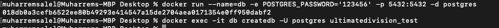
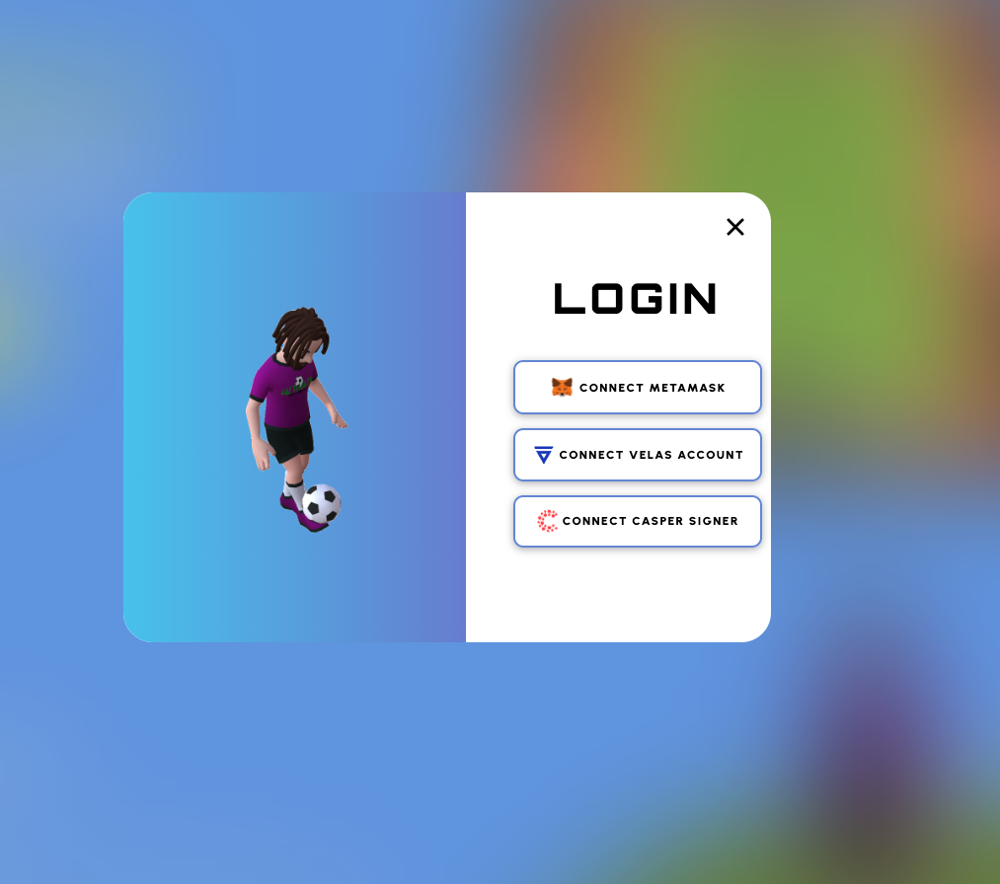
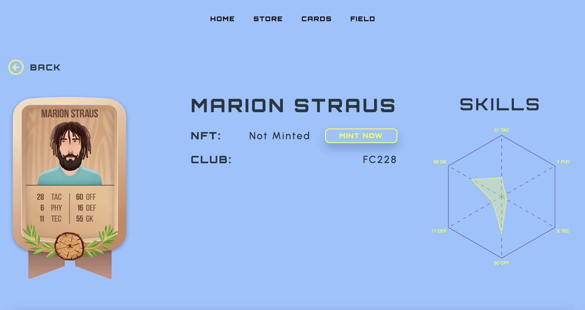
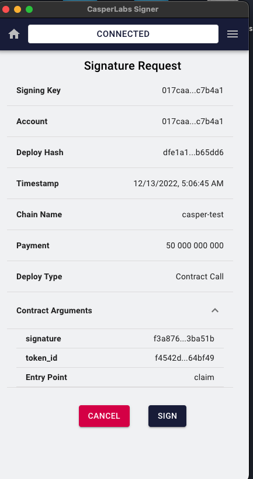
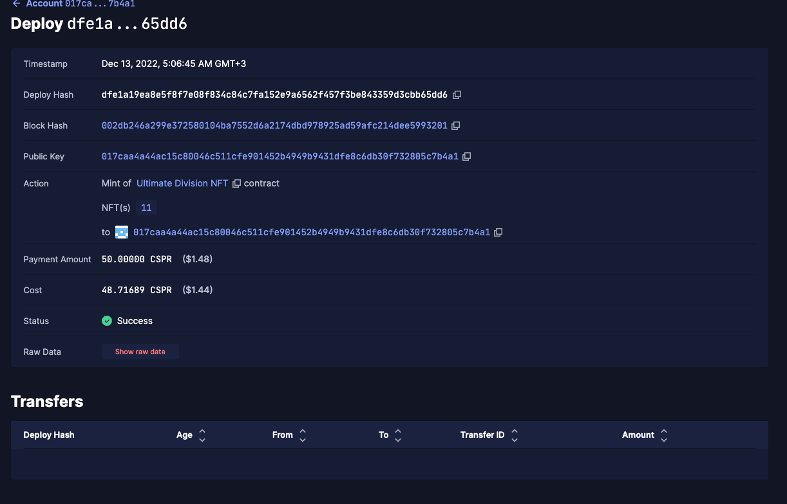
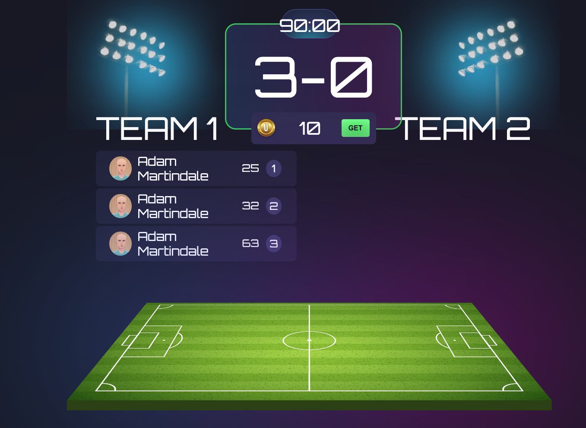
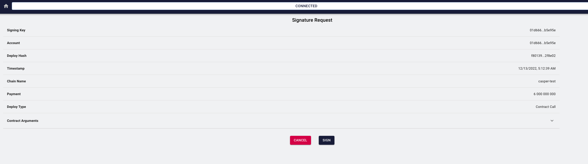
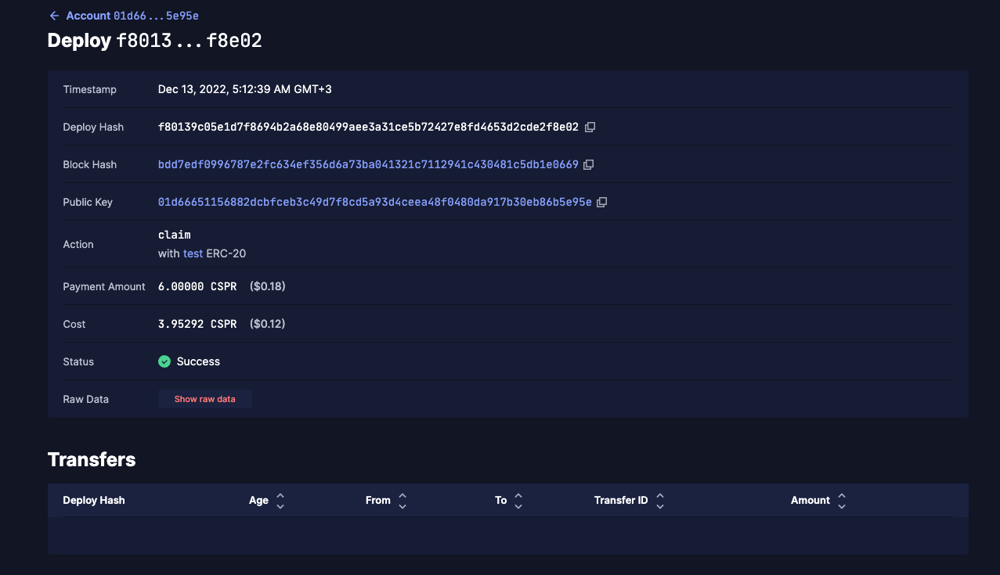
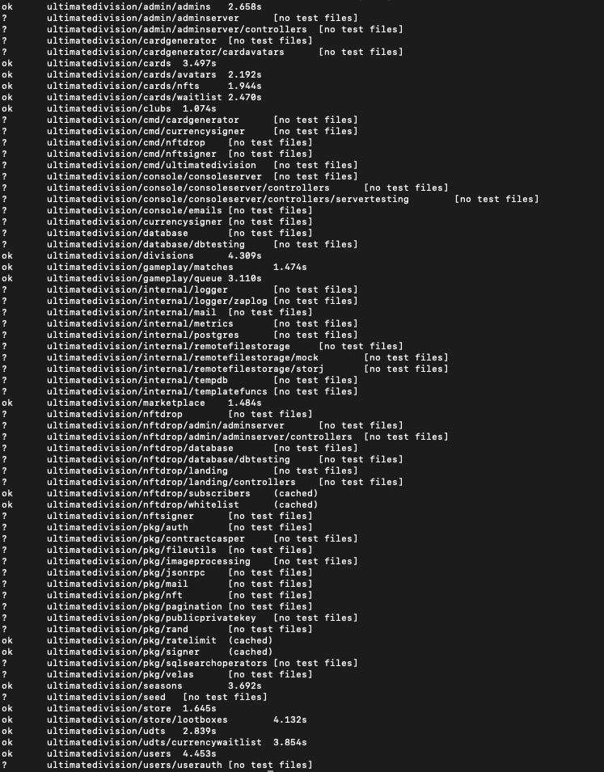

Grant Proposal | [174 - Ultimate Division - decentralized game with true ownership](https://portal.devxdao.com/app/proposal/174)
------------ | -------------
Milestone | 1
Milestone Title | Playable game with internal coins and NFTs on Casper 
OP | Ruslan Azarov
Reviewer | Muharrem Salel

# Milestone Details
The review will cover the first milestone criteria set forth below.

## Details & Acceptance Criteria

**Details of what will be delivered in milestone:**

-This version is aimed to introduce a playable game to our first users.

-They will join Ultimate Division, create their first clubs, and procure NFTs of player cards.

-The NFTs can be used to build versatile squads to compete against other players.

-The rewards for winning will be distributed in the form of $UDT on the Casper blockchain.

-The gameplay of this version will be limited to tactical squad composition and the results will be generated by the server.

 **Acceptance criteria:**

1. User game authorization with CasperLabs Signer 
2. UDT token contract will be deployed 
3. The contract will feature a public key function that is used to check signed transactions 
4. NFT contract will be deployed 
5. The game will have a minting mechanism for new items that the player gets through the use of CasperLabs Signer 

When a player opens a loot box or gets a P2E reward in the form of an NFT, the server will generate all the card’s parameters including gameplay stats in JSON format. The id of the item will correspond to a link on the server. A private key will be then used to sign an authorization for the particular user’s wallet and the NFT’s id and the signature will be passed onto the wallet to initiate a minting operation on the smart contract. After accepting the transaction, the user will pass on the signature and parameters of the NFT and the smart contract will mint the card to his wallet. 

6. Rewards for game results will be available to receive via the authorized wallets 

Once rewards are distributed by the game on the server side it’s then upon the user to claim it to his wallet. To avoid unnecessary risks of hijacking the NFTs, each will have to be minted with a signature that is only generated for a specific wallet to be used. 

7. The game must be available for new users with CasperLabs Signer wallets. They must be able to create new football clubs, mint player NFTs, play against other users, and receive $UDT rewards.

 **Additional notes regarding submission from OP:**

Within the submission, you will find the open-source project in its entirety as described in the milestone.
Most of the code relates to the game itself, but we have described the Casper-related functionality of the grant separately.
The game can be deployed for tests locally if needed.

 ## Milestone Submission

The following milestone assets/artifacts were submitted for review:

Repository | Revision Reviewed
------------ | -------------
https://github.com/BoostyLabs/ultimatedivision | bbfaed3

# Install & Usage Testing Procedure and Findings

Instructions in the README.md file in the repository(https://github.com/BoostyLabs/ultimatedivision) were containing running instructions however, they did not include usage instructions for the project. The reviewer communicated with OP and inform them about the issue and OP extend the instructions. After, improvements of the instructions project start to show a clear path for users, and following instructions step by step helps the user to run and test the codebase. The reviewer followed these steps from a Mac (macOS Monterey - MacBook Pro Intel i9 2019) and successfully run both tests and the project itself.

However, the first version that was submitted to the system was not sufficient for the project to pass, because it had some bugs in created contract and does not cover OSS best practices. The reviewer communicated with the OP about the situation, and the OP and their team took quick action and fixed the issues.

## Overall Impression of usage testing

The project builds without errors, and documentation provides sufficient installation and execution instructions.  The project functionality meets the acceptance criteria and operates without errors.

Requirement | Finding
------------ | -------------
The project builds without errors | PASS
Documentation provides sufficient installation/execution instructions | PASS
Project functionality meets/exceeds acceptance criteria and operates without error | PASS

# Unit / Automated Testing

The project has unit tests for all critical classes and methods.

Requirement | Finding
------------ | -------------
Unit Tests - At least one positive path test | PASS
Unit Tests - At least one negative path test | PASS 
Unit Tests - Additional path tests | PASS

# Documentation

### Code Documentation

A sufficient amount of low-level documentation exists on the project via properly formatted inline comments on the critical classes and the methods. However, the OP is highly encouraged to improve the code documentation such as adding more detail to the documentation of the classes and methods.

Requirement | Finding
------------ | -------------
Low-level function documentation | PASS with Notes

### Project Documentation

The README file for the project had some issues as explained above, however, after some feedback now it is acceptable since it shows a clear path for users and reviewers. However, the OP is highly encouraged to improve the structure of instructions such as separating different parts of instructions into different files and extending them to give an easier path to follow.

Requirement | Finding
------------ | -------------
Sufficient Project Documentation | PASS with Notes

# Open Source Practices

## Licenses

The project is released under the MIT License.

Requirement | Finding
------------ | -------------
OSI-approved open-source software license | PASS

## Contribution Policies

The project repository did not contain any CONTRIBUTING and SECURITY policy that links to a Code of Conduct. The reviewer communicated with the OP about the situation, and the team took quick action about the problem and solved it.

Requirement | Finding
------------ | -------------
OSS contribution best practices | PASS

# Coding Standards

## General Observations

The code is generally well-structured and readable. The project is committed to GitHub and both the unit tests and the manual tests pass.

# Final Conclusion

The project provides the functionality described in the grant application and milestone acceptance criteria. However, there are certain points noted above that could be improved on the project.

Thus, in the reviewer's opinion, this submission should pass with notes.

# Recommendation

Recommendation | PASS with Notes
------------ | -------------
