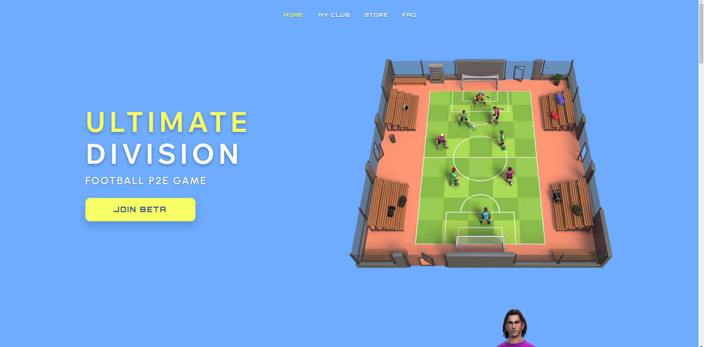
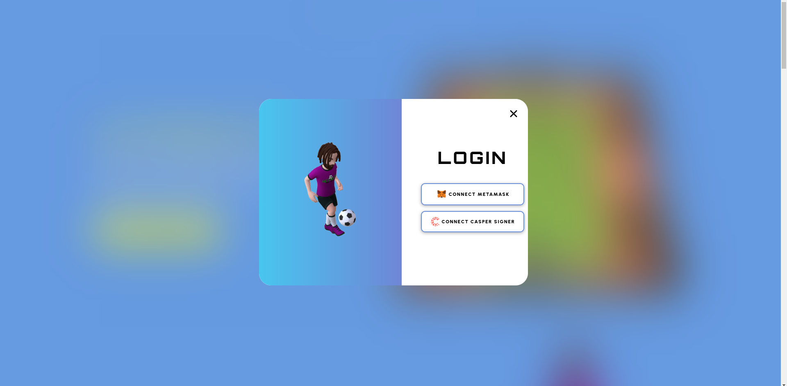
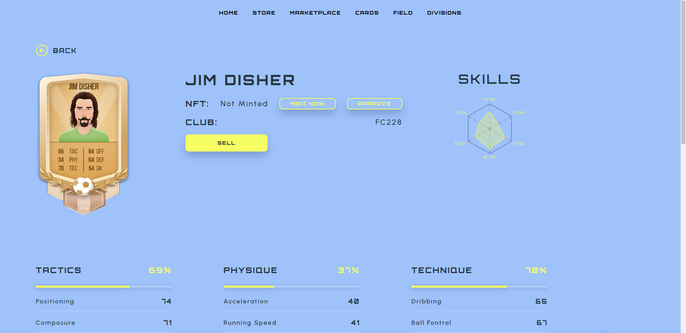

Grant Proposal | [174 - Ultimate Division - decentralised game with true ownership](https://portal.devxdao.com/public-proposals/174)
------------ | -------------
Milestones | 2
Milestone Titles | Tactical gameplay, NFT marketplace, weekly competition and ranked divisions
OP | ChickenFish
Reviewer | Gökhan Gurbetoğlu <crdao@ggurbet.com>

# Milestone Details

## Details & Acceptance Criteria

**Details of what will be delivered in milestone:**

At this stage of the game we will be ready to introduce tactical football gameplay.  
Each game will be 4.6 minutes long and the game client will be loaded as a webGL project exported from unity3D.  
The gameplay will be built upon the game parameters stored as metadata in the NFTs.  
In-game ranking will be divided into 10 divisions that allow players to be distributed into different skill-groups.  
Weekly competition will be held to promote and relegate players, and rewards will be distributed in accordance to ranking.  

**Acceptance criteria:**

1. Authorized CasperLabs Signer users can play tactical football matches
2. The gameplay recognizes NFTs and their metadata as in-game stats
3. Match results impact player standing in the division  
    First 30 games are counted towards division standing every week. Like in football, a win nets 3 points, a draw - 1 point and no points for losses. There are 10 divisions, every club starts from the bottom one. To get promoted, the club needs to be among the 10th percentile of said division’s participants.  
    Getting to higher divisions leads to the opportunity of getting better rewards.  

4. Weekly competition concludes every Sunday and distributes $UDT rewards via the cryptography signer service

    Just like with the NFT rewards, token rewards will be allocated by the server, but it will always be up to the user to claim them. Given the reward amount and the user’s wallet address, the server will use a securely stored private key to generate a signature. Once the smart contract receives the signature, it compares it to the public key it has and transfers the tokens to the given address.

5. NFTs can be traded on the Ultimate Division marketplace  
The marketplace will be organized in a timed auction format.  
The contract will have the following functions:

    5.1. Setup Timed Auction - set up an auction with given parameters: final time and time period for auto continuation of the auction in case of the new bid, buyout bid.  
    5.2. Bid for Timed auction - the bid sends money to new escrow and sends previous escrow to the previous bidder. Time and price monotonicity checks must be performed.  
    5.3. Revert bid - cancels bid and withdraw escrow funds.  
    5.4. Finalize Timed auction - finalize the auction. A time check must be performed. Can be called by either party (or even publicly)  

    The back-end and frontend will be built to display the current information about ongoing auctions. For a user to perform any auction-related action, a transaction will be send to his wallet. The user will have to confirm the transaction and incur the gas fees.

6. The tactical football game must be fully functional for all users. Every user should be able to participate in weekly competitions and get a ranked-based reword in $UDT for playing.
The marketplace must be functional for all users to buy and sell in-game NFTs in a timed auction manner.

7. The submitted code base includes:  
    7.1. WebGL Gameplay module  
    7.2. Weekly competition ledger service  
    7.3. Reward system service that handles individual game results alongside weekly competition results  
    7.4. NFT marketplace for in-game items  

**Additional notes regarding submission from OP:**

The process of launching and testing the app is described in the GitHub, but please feel free to reach me for any help in telegram @azarov

## Milestone Submission

The following milestone assets/artifacts were submitted for review:

Repository | Revision Reviewed
------------ | -------------
https://github.com/BoostyLabs/ultimatedivision | d1a1333

# Install & Usage Testing Procedure and Findings

The reviewer used a cloud GitPod instance running Ubuntu 22.04.2 LTS, a local Pardus 21.3 GNU/Linux machine, a debug server provided by OP at https://develop.ultimatedivision.com/ and a remote machine also provided by OP.

At the start of the review, the README file was not up to date, and the installation instructions were not very clear due to the document's structure and the assumption that the user already knew some parts of the installation process and dependencies. After discussing these issues with OP, they revised the structure of the steps, added additional information, and clarified the ambiguous parts. In its final state, the README is well prepared.

Also, at the beginning of the review, some errors were encountered during the deployment while attempting to mint new player cards for a user. These errors resulted in the failure of the minting operation on the chain. By investigating the errors, the OP identified that the issue was related to gas fee adjustments. After implementing the necessary changes to address this problem, the issue was resolved, and the minting process functioned as intended without any further difficulties.

There were some redundant modules in the app that were no longer in use, and the same problem extended to some dependencies as well. These extra packages had security issues due to their outdated package dependencies, as they were not updated along with the rest of the application. After informing the OP about these concerns, they took prompt action to address the situation. They removed the unused modules from their application and updated the rest of the dependency packages used by the main modules, ensuring they passed security audits. It's worth noting that there is one string-related issue in a library file provided by Unity, which has been omitted from this part of the review.

## Installation

The reviewer initiated the installation process by following the instructions provided in the README. After running the individual setup files for each module, empty config files were created at `~/.local/share/ultimatedivision/config.json`, `~/.local/share/ultimatedivision/currencysigner/config.json` and `~/.local/share/ultimatedivision/nftsigner/config.json`, respectively. Then the reviewer used the values from the provided example config files from `configsexamples` folder of the repository to continue the setup process. Following the completion of the installation, the application became accessible at localhost:8088 on the server.

- [Installation Logs](assets/installation-logs.md)

## Usage Testing

After starting the application, the reviewer did the user testing. Following user testing is told step by step as they appear in the acceptance criteria.

1. The reviewer used Casper Signer to login to the application.

    #### Dashboard
    
    #### Login
    

2. The gameplay recognizes NFTs and their metadata as in-game stats. The minting operation is done after creating randomly generated player cards. After the creation, the reviewer used the option to mint the specific cards and after some time, respective NFT were minted on chain. These operations can be checked from the deployments. Here are some example deploys for verification:

    - https://testnet.cspr.live/deploy/d1959ffda946aee578d4d5debd770883c885088da53f42e213b76745a5ec99ca
    - https://testnet.cspr.live/deploy/0848404c44efc935aedbc9b9e73f789ea13c77ab5b4c0d45e14196be0ffe2206
    - https://testnet.cspr.live/deploy/97a3b95b9e98984752852fae7b96dac5ff957a1e62366e5e2be3c7ead56c475e

    #### Player stats and mint option
    

## Overall Impression of usage testing

_Summarize your impression following detailed usage testing and provide a `PASS`, `FAIL`, or `PASS With Notes` for the requirements
below. In the case of `PASS With Notes`, make sure that the notes for improvement are clearly spelled out in this section._

Requirement | Finding
------------ | -------------
Project builds without errors | PASS / FAIL / PASS with Notes
Documentation provides sufficient installation/execution instructions | PASS / FAIL / PASS with Notes
Project functionality meets/exceeds acceptance criteria and operates without error | PASS / FAIL / PASS with Notes

# Unit / Automated Testing

_Summarize the result of the unit testing / automated testing / integration testing provided in the Milestone. Feel free to include
automated test output, either as text, image or other artifact. Provide a `PASS`, `FAIL`, or `PASS With Notes` for the requirements
below. In the case of `PASS With Notes`, make sure that the notes for improvement are clearly spelled out in this section._

Requirement | Finding
------------ | -------------
Unit Tests - At least one positive path test | PASS / FAIL / PASS with Notes
Unit Tests - At least one negative path test | PASS / FAIL / PASS with Notes
Unit Tests - Additional path tests | PASS / FAIL / PASS with Notes

# Documentation

### Code Documentation

Code documentation is very well prepared and is of high quality. All critical functionality of the code is commented. Many other helping comments and documentation are provided within the code and they are well prepared and detailed.

Requirement | Finding
------------ | -------------
Code Documented | PASS

### Project Documentation

Project documentation is sufficient. There are proper instructions about the installation, testing and deployment requirements in the README file. Additional documentation is readily available for developers.

Requirement | Finding
------------ | -------------
Usage Documented | PASS
Example Documented | PASS

## Overall Conclusion on Documentation

Both the code documentation and the project documentation for the project is sufficiently prepared for this milestone.

# Open Source Practices

## Licenses

The project is released under MIT license.

Requirement | Finding
------------ | -------------
OSI-approved open source software license | PASS

## Contribution Policies

Project contains CONTRIBUTING, SECURITY and CODE OF CONDUCT policies. However, there are some missing parts inside the CONTRIBUTING policy, while not directly affecting the policy, the reviewer suggests that these should either be expanded, or removed completely, to prevent confusion. Pull requests and Issues are enabled on the repositories and the project is set up for public participation.

Requirement | Finding
------------ | -------------
OSS contribution best practices | PASS

# Coding Standards

## General Observations

Source code is well written, easily readable, and conforms to good coding practices overall. The project also uses `golangci-lint` as its linter, which adds additional value to its syntax and structure.

# Final Conclusion

_Summarize your final conclusion, and provide your motivation for your recommendation below. For example, you may say 'Reviewer recommends that this
submission should fail code review, because it does not contain an OSI-approved open source license'_

# Recommendation

Recommendation | PASS / FAIL / PASS with Notes
------------ | -------------
