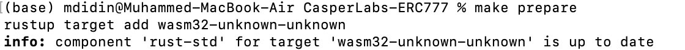
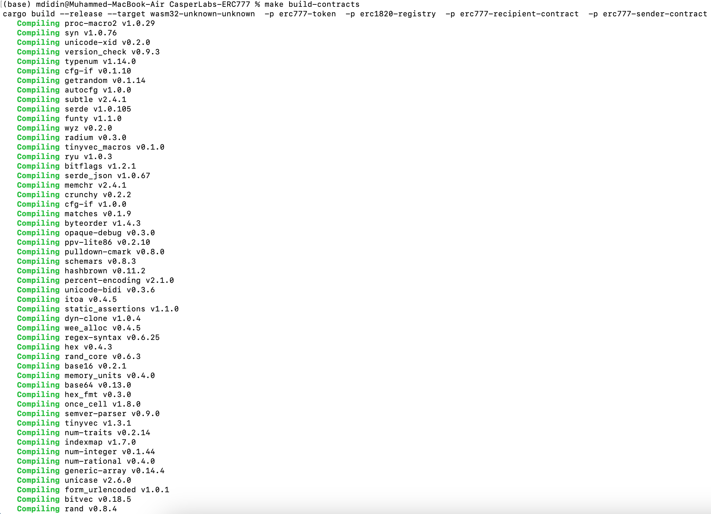
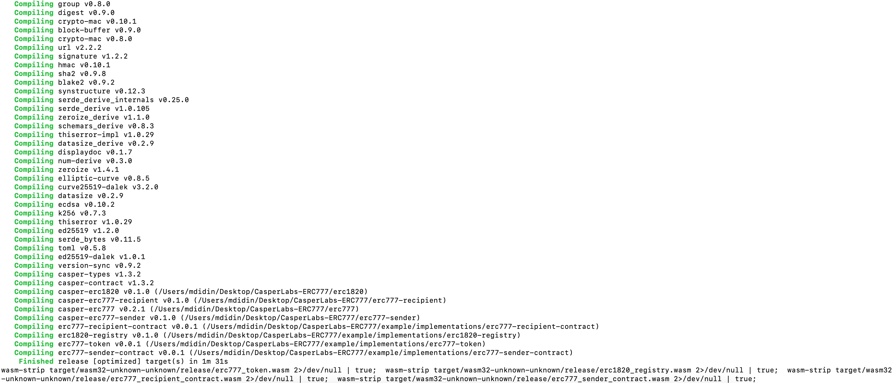
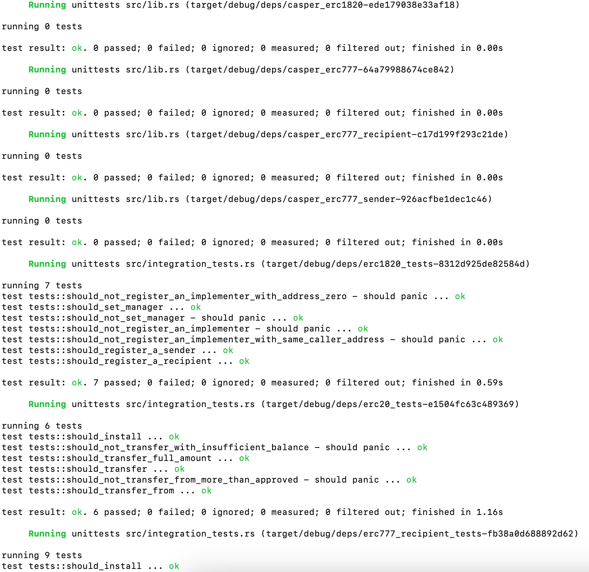
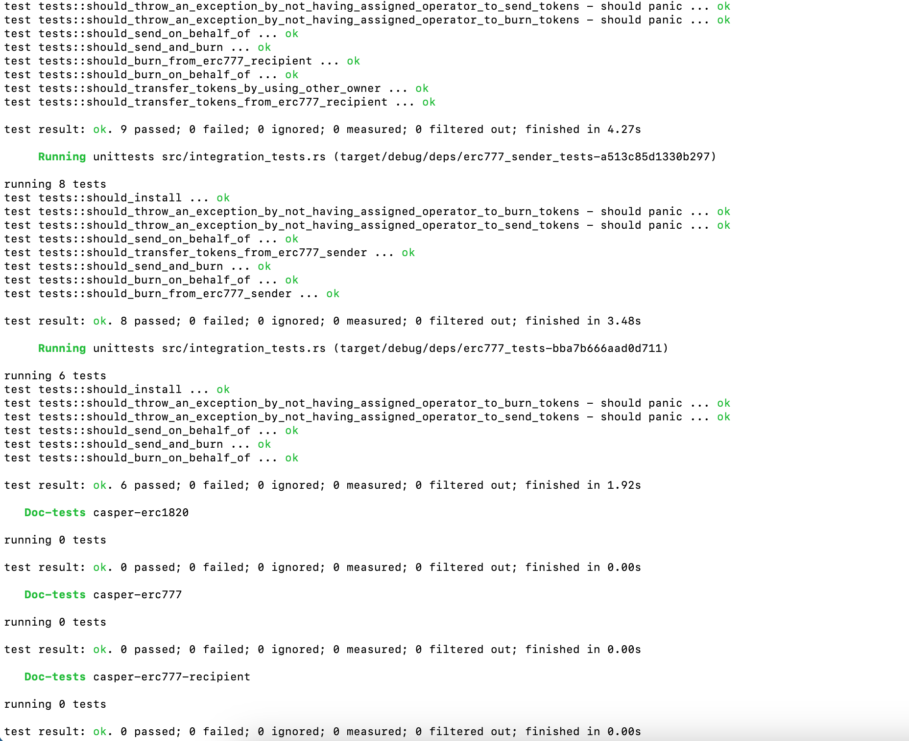

Grant Proposal | [184 - ERC-777 Native Rust Implementation](https://portal.devxdao.com/app/proposal/184)
------------ | -------------
Milestone | 1
Milestone Title | Contract Implementation
OP | CaptainBernardo
Reviewer | Muhammed Didin <mdidin80@gmail.com>

# Milestone Details
The review will cover the first milestone criteria set forth below.


## Details & Acceptance Criteria

**Details of what will be delivered in milestone:**

The ERC-777 contract.

**Acceptance criteria:**

The ERC 777 contract will be made available on github, have basic documentation, be deployable on the blockchain, and pass tests The KPI for this milestone will be adoption of the final contract by the community.

**Additional notes regarding submission from OP:**

Completed per acceptance criteria

## Milestone Submission

The following milestone assets/artifacts were submitted for review:

Repository | Revision Reviewed
------------ | -------------
https://github.com/Rengo-Labs/CasperLabs-ERC777 | 20e6447


# Install & Usage Testing Procedure and Findings

The reviewer used a macOS Monterey for this review.

README provides sufficient installation instructions. It is stated in the README that Rust target is the prerequisite for this milestone, and installation guidelines are linked. By following the README;

### Prepare

The reviewer used the ```make prepare``` command to install the prerequisites.



### Build




[Full Build Logs](assets/build.md)


## Overall Impression of usage testing

The project builds without errors, the documentation provides sufficient installation and execution instructions, and the project functionality meets the acceptance criteria and operates without errors. All builds were successful, and all unit tests ran without errors.

Requirement | Finding
------------ | -------------
Project builds without errors | PASS 
Documentation provides sufficient installation/execution instructions | PASS
Project functionality meets/exceeds acceptance criteria and operates without error | PASS

# Unit / Automated Testing

The reviewer was able to successfully run the unit tests. The bash script provided in the README file was able to run the unit tests. Tests cover critical functionality. Tests cover critical functionality and the acceptance criteria for this milestone.




[Full Test Logs](assets/test_logs.md)

Requirement | Finding
------------ | -------------
Unit Tests - At least one positive path test | PASS
Unit Tests - At least one negative path test | PASS
Unit Tests - Additional path tests | PASS

# Documentation

### Code Documentation

Properly formatted inline comments on the critical classes and the methods are added to the project. The reviewer thinks that there is a sufficient amount of code documentation.

Requirement | Finding
------------ | -------------
Code Documented | PASS

### Project Documentation

The Readme file has sufficient basic usage instructions for the implemented methods. The reviewer was able to build, run and use the project using project documentation.


Requirement | Finding
------------ | -------------
Usage Documented | PASS 
Example Documented | PASS

## Overall Conclusion on Documentation

Code documentation is sufficient. General documentation is sufficient and includes usage examples. In the reviewer's opinion, the project has sufficient documentation. 

# Open Source Practices

## Licenses

The Project is released under the Apache 2.0 License.

Requirement | Finding
------------ | -------------
OSI-approved open source software license | PASS

## Contribution Policies

The project has Contributing and Security Policies and a Code of Conduct.

Requirement | Finding
------------ | -------------
OSS contribution best practices | PASS

# Coding Standards

## General Observations

The project has well-structured and readable code. Code and project documentation is sufficient and they provide the necessary information to use the project. The project complies with open source standards.

# Final Conclusion

The tests show that the project covers its acceptance criteria. README file and the provided documentation contains necessary information about the prerequisites and how to run and build the project and tests. The project accommodates open-source practices. So in the reviewer's opinion, this milestone should PASS.

# Recommendation

Recommendation | PASS
------------ | -------------

