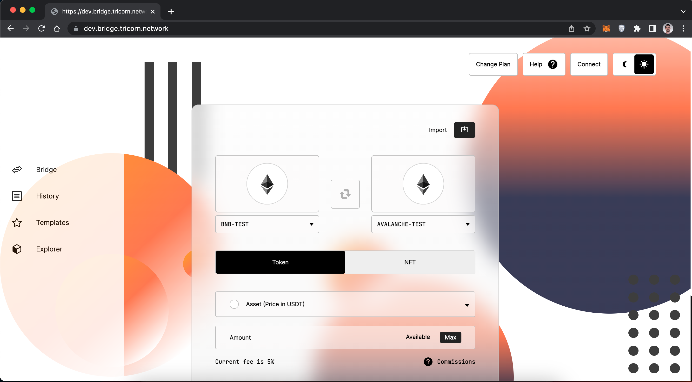
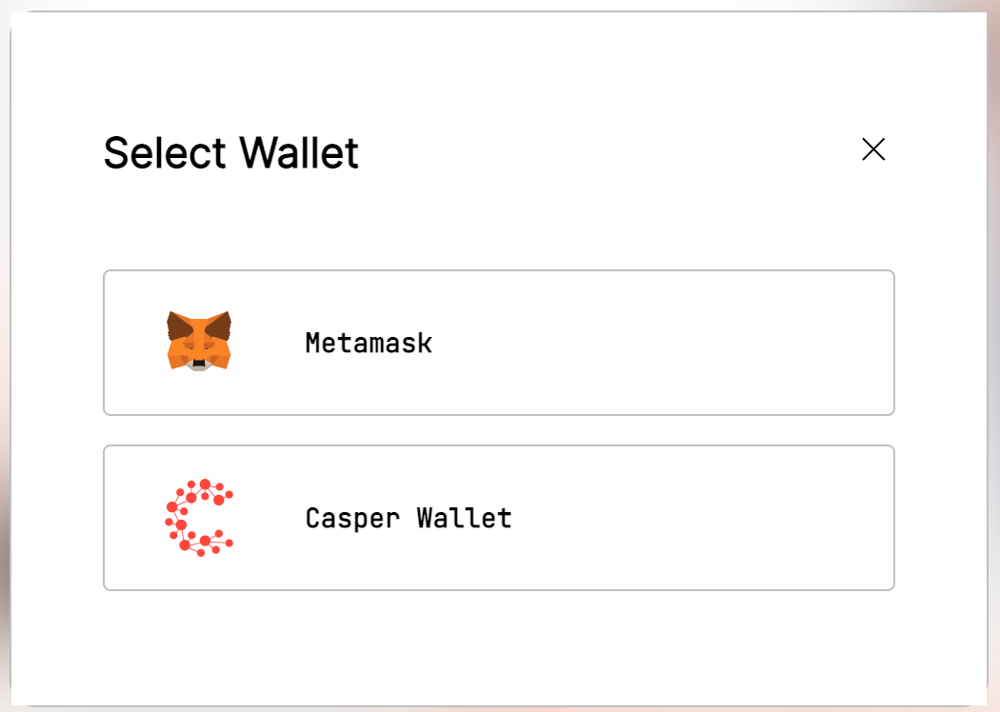
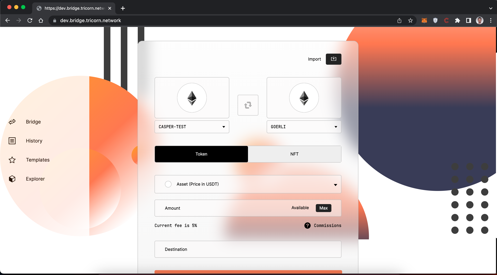
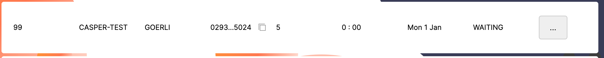
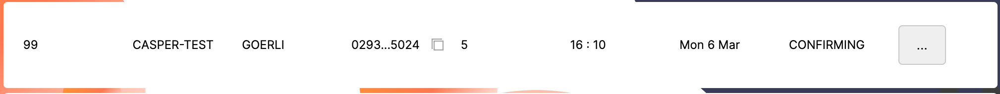
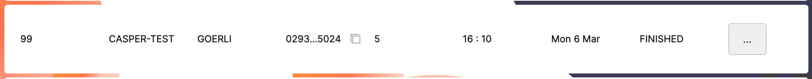

Grant Proposal | [192 - Development of Bridge Casper - Ethereum](https://portal.devxdao.com/app/proposal/192)
------------ | -------------
Milestone | 1-3
Milestone Title | Smart contracts for cross-chain swap - Submission 3
OP | Boosty
Reviewer | Muhammed Didin <mdidin80@gmail.com>

# Milestone Details

## Details & Acceptance Criteria

**Details of what will be delivered in milestone:**

A Casper to Ethereum Bridge.

**Acceptance criteria:**

smart contracts are deployed in two blockchains and its possible to make crosschain swap manually. Smart contract on Casper and Ethereum should accept/lock tokens that should be wrapped/minted/unlocks on Ethereum and Casper accordingly. Smart contracts admin should be able to move digital assets from one wallet to another and cancel transactions.

**Additional notes regarding submission from OP:**

"In the archive is the current state of the Casper-Eth Bridge POC. Relevant to milestone #1, the smart contracts for Casper and Ethereum are in the components-Casper/contract-bridge and components-Ethereum/contract  folders respectively."

## Milestone Submission

The following milestone assets/artifacts were submitted for review:

Repository | Revision Reviewed
------------ | -------------
https://github.com/BoostyLabs/casper-eth-bridge/ | 2b7a6dd

# Install & Usage Testing Procedure and Findings

Following the instructions in the README file of the repository, the reviewer was able to successfully build and run the source code and use the project on macOS Monterey.

### Build

[Create Docker Instance](assets/create-docker.txt)

[Run Bridge](assets/run-bridge.txt)

[Run Casper](assets/run-casper.txt)

[Run Ethereum](assets/run-eth.txt)

[Run Signer](assets/run-signer.txt)

[Run Gateway](assets/run-gateway.txt)

[Run Wepabb](assets/run-webapp.txt)

### Usage

After building, the mainpage welcomes the user. 

The user needs to sign in to wallets.

The mainpage after sign into wallets:

Swap steps:

Example deploy into CSPR-Testnet: https://testnet.cspr.live/deploy/597168d3504111f82a0405a71644226a4c2c60e233f3b087823fb058dcf9cb53

Example deploy into Goerli-ETH: https://goerli.etherscan.io/tx/0xd2e276c9b54dbb00b03d04a42842745c0619215f0d5f29918ca57c0aa14b076b

## Overall Impression of usage testing

The project builds without errors, the documentation provides sufficient installation and execution instructions, and the project functionality meets the acceptance criteria and operates without errors. Although it is not in the Acceptance criteria, the reviewer recommends improving the mainpage user interface and considering the user experience.

Requirement | Finding
------------ | -------------
Project builds without errors | PASS 
Documentation provides sufficient installation/execution instructions | PASS
Project functionality meets/exceeds acceptance criteria and operates without error | PASS

# Unit / Automated Testing

The reviewer was able to successfully run the unit tests. The bash script provided in the README file was able to run the unit tests. The project has sufficient amount of unit tests which covers all critical classes and methods.

[Full Test Logs](assets/tests.txt)

Requirement | Finding
------------ | -------------
Unit Tests - At least one positive path test | PASS
Unit Tests - At least one negative path test | PASS
Unit Tests - Additional path tests | PASS

# Documentation

### Code Documentation

Properly formatted inline comments on the critical classes and the methods are added to the project. The reviewer thinks that there is a sufficient amount of code documentation.

Requirement | Finding
------------ | -------------
Code Documented | PASS

### Project Documentation

The Readme file has sufficient basic usage instructions for the implemented methods. The reviewer was able to build, run and use the project using project documentation.

Requirement | Finding
------------ | -------------
Usage Documented | PASS 
Example Documented | PASS

## Overall Conclusion on Documentation

In the reviewer's opinion, the project has sufficient documentation. 

# Open Source Practices

## Licenses

The Project is released under the MIT License.

Requirement | Finding
------------ | -------------
OSI-approved open source software license | PASS

## Contribution Policies

The project has Contributing and Security Policies and a Code of Conduct.

Requirement | Finding
------------ | -------------
OSS contribution best practices | PASS

# Coding Standards

## General Observations

The project has well-structured and readable code. Code and project documentation is sufficient and they provide the necessary information to use the program. The project complies with open source standards.

# Final Conclusion

The project provides the functionality described in the grant application and milestone acceptance criteria. 

Thus, in the reviewer's opinion, this submission should PASS.

# Recommendation

Recommendation | PASS
------------ | -------------

