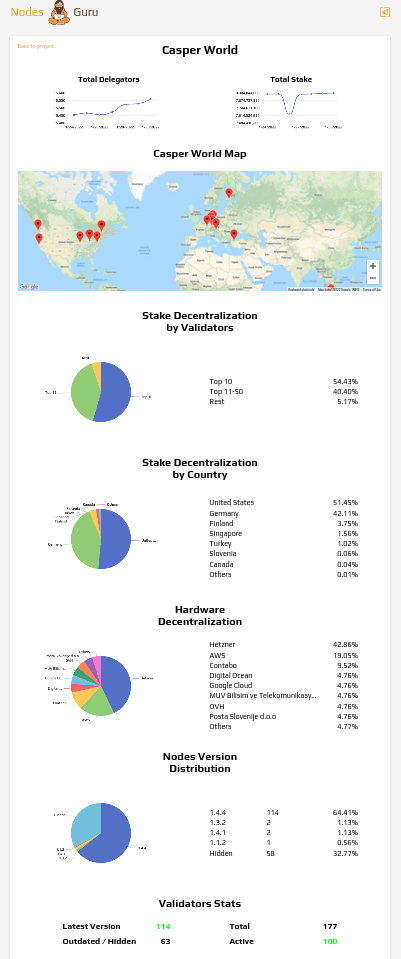

Grant Proposal | [206 - Casper Network Stats & Decentralization Map](https://portal.devxdao.com/public-proposals/206)
------------ | -------------
Milestone | 1
Milestone Title | Working solution
OP | Sergio [Nodes.Guru]
Reviewer | Muhammet Kara

# Milestone Details
This is the first, only, and thus the final milestone of the grant. 

## Details & Acceptance Criteria

**Details of what will be delivered in milestone:**

A working, continually updated and enhanced web-based application of a network health&decentralisation monitoring tool, which can be used by everyone, without installing any third party tools.

**Acceptance criteria:**

This milestone will provide a fully working application, ready to use.

**Additional notes regarding submission from OP:**

Working solution: https://nodes.guru/casper/casperworld We've got 2 repositories: - casper-world stands for front-end https://github.com/NodesGuru/casper-world

## Milestone Submission

The following milestone assets/artifacts were submitted for review:

Repository | Revision Reviewed
------------ | -------------
https://github.com/NodesGuru/casper-world | 8ff534a
https://github.com/nodesguru/casper-world-backend | 35b7408

# Install & Usage Testing Procedure and Findings

The reviewer was able to build and make a test installation of the project on the cloud, by following the instructions on the README. Then observations were made both on the test deploy and the production deploy provided by the OP. The major issue encountered during the install and usage testing was the project not being able to become fully functional due to a need for a paid & proprietary service (`ip-api`). Upon contacting about the issue, the OP quickly improved the project to make it possible to run without it. The reviewer praises the OP for acting swiftly.

## Overall Impression of usage testing

It was observed that the project builds without errors, documentation provides sufficient installation/execution instructions, and project functionality meets/exceeds acceptance criteria and operates without error.

Requirement | Finding
------------ | -------------
Project builds without errors | PASS
Documentation provides sufficient installation/execution instructions | PASS
Project functionality meets/exceeds acceptance criteria and operates without error | PASS

# Unit / Automated Testing

The project contains 17 tests in total, covering both the positive and the negative paths. The reviewer has observed that [all tests run successfully](assets/test.md) without errors.

Requirement | Finding
------------ | -------------
Unit Tests - At least one positive path test | PASS
Unit Tests - At least one negative path test | PASS
Unit Tests - Additional path tests | PASS

# Documentation

### Code Documentation

Reviewer has observed that most of the critical functions have standard code-level documentation, and the rest are named to be self-explanatory. Although this can be considered acceptable, reviewer suggests adding code-level comments also to the rest of the code-base for the sake of completeness and maintainability in the future.

Requirement | Finding
------------ | -------------
Code Documented | PASS with Notes

### Project Documentation

The reviewer thinks the documentation is sufficient for the project as it is a one-page web app without almost any interactivity, and it contains straightforward instructions for deployment along with a brief description of the project.

Requirement | Finding
------------ | -------------
Usage Documented | PASS
Example Documented | PASS

## Overall Conclusion on Documentation

In the reviewer's opinion, the project and usage documentation are sufficient. However the code-level documentation has room for improvement although it is acceptable.

# Open Source Practices

## Licenses

The Project is correctly released under the MIT License.

Requirement | Finding
------------ | -------------
OSI-approved open source software license | PASS

## Contribution Policies

Pull requests and issues are enabled on the repository. The project has a contribution and a security policy. However, the repository lacks relevant tags, hindering its discoverability.

Requirement | Finding
------------ | -------------
OSS contribution best practices | PASS with Notes

# Coding Standards

## General Observations

Code is generally well-structured and readable. The project has been committed to GitHub and all unit tests pass.

# Final Conclusion

The project meets/exceeds the functional requirements, and is generally in a very good shape in terms of open-source guidelines. However, the code-level documentation is suggested to be improved. It is also suggested to add relevant tags to the repository to improve its discoverability.

Thus, in the reviewers opinion, this submission should pass with notes.

# Recommendation

Recommendation | PASS with Notes
------------ | -------------
