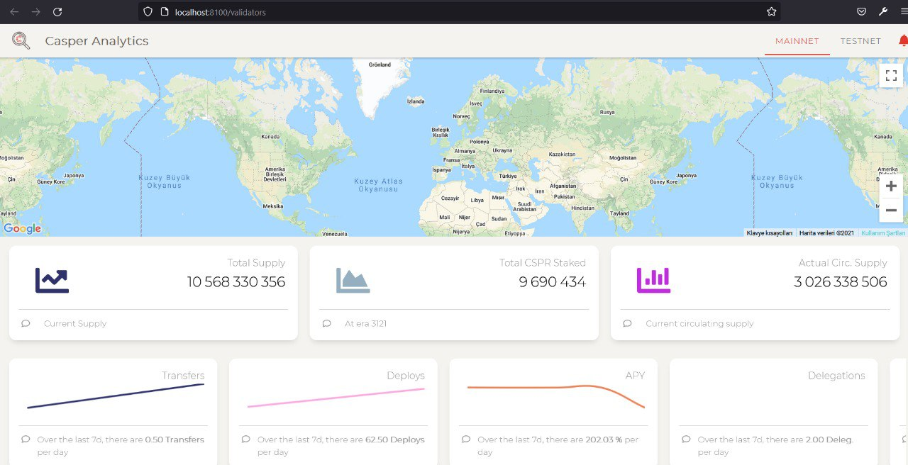
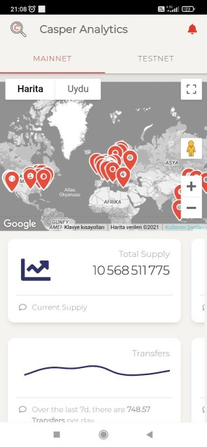

Grant Proposal | [219 - Casper Analytics - iOS/Android/Web](https://portal.devxdao.com/public-proposals/219)
------------ | -------------
Milestone | 1-4
Milestone Title | All milestones
OP | Mikael - CasperCommunity.io
Reviewer | Ebubekir Yardımcı <ebubekir.yrd@gmail.com>

# Milestone Details

## Details & Acceptance Criteria

**Details of what will be delivered in milestone:**

- Installation of Casper Analytics web and api project with Readme file.
- Control of web pages.
- Control of mobile application.
- Project's casper signer connection control.

**Acceptance criteria:**

- Link to the repository of the API 
- Link to the repository of the Webapp 
- Webpp published on a specific website (the name of the website have to be defined) with pages
- App available on the PlayStore
- App available on the AppStore
- Create an alert via your smartphone or via a compatible browser.
- Make a delegation using the casper signer

**Additional notes regarding submission from OP:**

## Milestone Submission

The following milestone assets/artifacts were submitted for review:

Repository | Revision Reviewed
------------ | -------------
https://github.com/caspercommunityio/casper-analytics-api | c7c08e1
https://github.com/caspercommunityio/casper-analytics-app | 03d40c8

# Install & Usage Testing Procedure and Findings

Reviewer was able to build and run the project by using the instructions given on the README of the project, after needed parameters entering to the environment.ts file as per the instructions for the app project.

Reviewer was able to build and run the project by using the instructions given on the README of the project, after needed parameters entering to the .env file as per the instructions for the api project.

The reviewer was able to run the api methods successfully.
 

Reviewer observed that the errors in the previous review have been fixed.  

Pages on the website are working properly :

Mobile application working properly : 

Notifications working properly : 

While the 'cspr.live' redirect for the 'stake with us' button in the mobile app works fine but it still gives a js error in the web app.  

## Overall Impression of usage testing

The reviewer was able to build and run the project following the instructions.
And also the documentation also provides adequate installation/execution instructions for different scenarios. 
The reviewer thinks that the project functionality will meet the acceptance criteria.

Requirement | Finding
------------ | -------------
Project builds without errors | PASS
Documentation provides sufficient installation/execution instructions | PASS
Project functionality meets/exceeds acceptance criteria and operates without error | PASS with Notes

# Unit / Automated Testing

After installing the requirements and adding the necessary configuration settings, following the instructions given in the README in the project, the tests were run. No error was received during the tests for app and api. 

Requirement | Finding
------------ | -------------
Unit Tests - At least one positive path test | PASS
Unit Tests - At least one negative path test | PASS
Unit Tests - Additional path tests | PASS

# Documentation

### Code Documentation

Reviewer observed that all critical functions of the project had low-level code documentation which could be used for automated documentation generation.

Requirement | Finding
------------ | -------------
Code Documented | PASS

### Project Documentation

The reviewer observed that the README of the project has detailed general and usage documentation.

Requirement | Finding
------------ | -------------
Usage Documented | PASS

## Overall Conclusion on Documentation

The reviewer concludes that the project has sufficient comprehensive general documentation. 

# Open Source Practices

## Licenses

The Project is released under the MIT License

Requirement | Finding
------------ | -------------
OSI-approved open source software license | PASS

## Contribution Policies

Pull requests and Issues are enabled. And, the project contain a CONTRIBUTING policy. 

Requirement | Finding
------------ | -------------
OSS contribution best practices | PASS

# Coding Standards

## General Observations

Code is generally well-structured and readable. The Github linked project is easy and successful to install, no error was encountered during the installation phase of the app project. No error was received in the unit tests of the project. Manual tests fail for making a delegation using the casper signer. Although this error does not prevent the project from being successful, this error needs to be fixed.

# Final Conclusion
The project provides the most of the functionalities described in the grant application and milestone acceptance criteria. 
The reviewer praises the OP for the general stability and the fluid user experience of the app.
However the "delegate using casper signer" in the milestone doesn't work properly. 
Thus, in the reviewer's opinion, this submission should pass with notes.

# Recommendation

Recommendation | PASS with Notes
------------ | -------------

