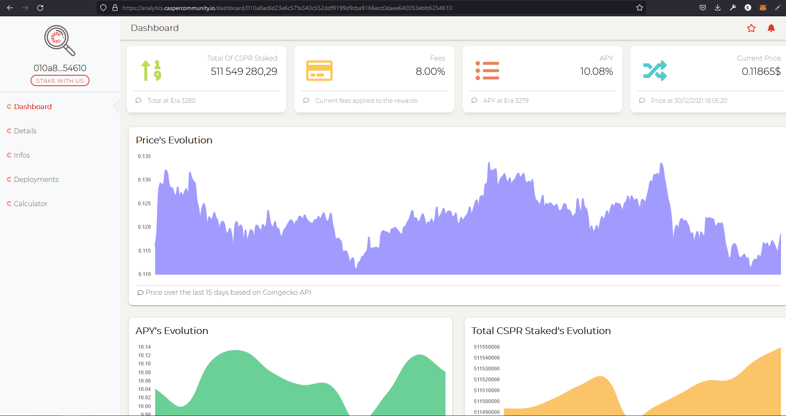
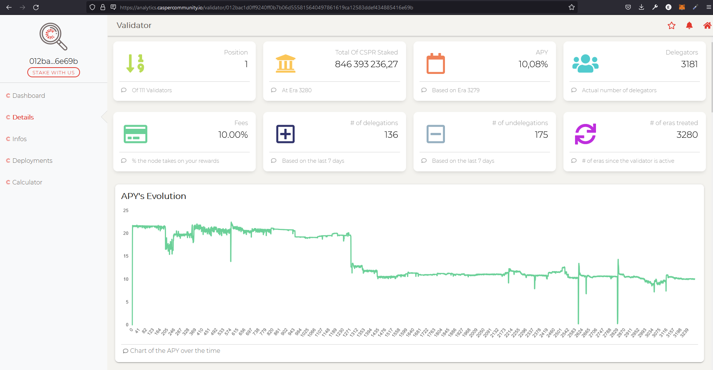
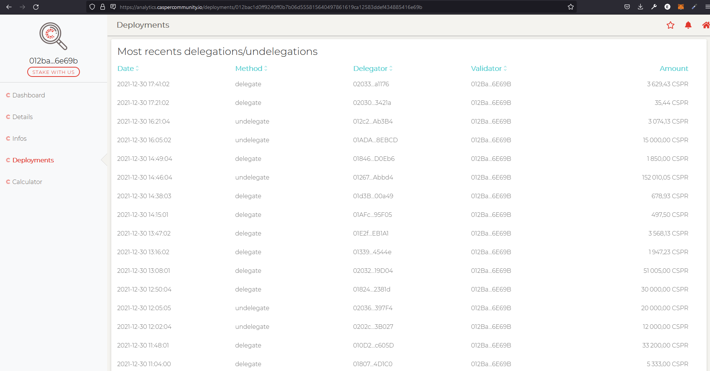
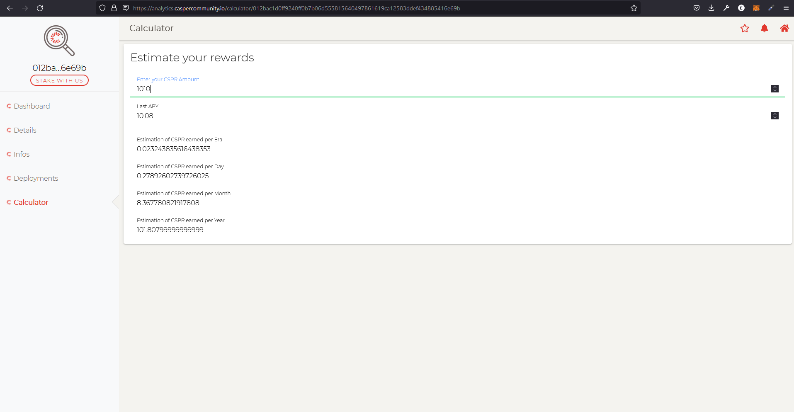
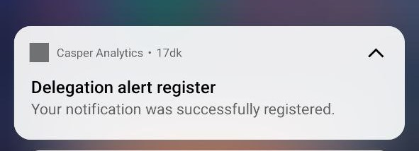
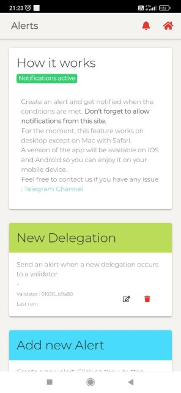
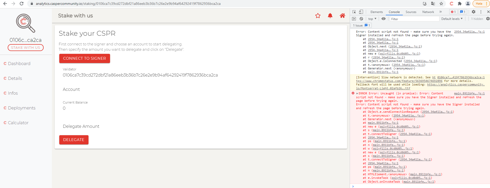

Grant Proposal | [219 - Casper Analytics - iOS/Android/Web](https://portal.devxdao.com/public-proposals/219)
------------ | -------------
Milestone | 1-5
Milestone Title | All milestones
OP | Mikael - CasperCommunity.io
Reviewer | Ebubekir Yardımcı <ebubekir.yrd@gmail.com>

# Milestone Details

## Details & Acceptance Criteria

**Details of what will be delivered in milestone:**

- Installation of Casper Analytics web and api project with Readme file.
- Control of web pages.
- Control of mobile application.
- Project's casper signer connection control.

**Acceptance criteria:**

- Link to the repository of the API 
- Link to the repository of the Webapp 
- Webpp published on a specific website (the name of the website have to be defined) with pages
- App available on the PlayStore
- App available on the AppStore
- Create an alert via your smartphone or via a compatible browser.
- Make a delegation using the casper signer

**Additional notes regarding submission from OP:**


## Milestone Submission

The following milestone assets/artifacts were submitted for review:

Repository | Revision Reviewed
------------ | -------------
https://github.com/caspercommunityio/casper-analytics-api | 3377681
https://github.com/caspercommunityio/casper-analytics-app | 08fa0a6

# Install & Usage Testing Procedure and Findings


Reviewer was able to build and run the project by using the instructions given on the README of the project, after needed parameters entering to the .env file as per the instructions for the api project.
```
Laravel development server started: http://127.0.0.1:8000
[Thu Dec 30 20:17:33 2021] PHP 7.4.27 Development Server (http://127.0.0.1:8000) started
```

Reviewer got the following error when following the instructions in the readme file,but was able to run the project when reviewer changed the 'es2018' package to 'es2020' in the lib variable in the 'tsconfig.json' file for the webapp project.  

```
ng] 70 unchanged chunks
[ng] Build at: 2021-12-30T17:13:23.002Z - Hash: 83a329b9e80215f07ed8 - Time: 1191ms
[ng] Error: node_modules/buffer/index.d.ts:23:38 - error TS2583: Cannot find name 'BigInt'. Do you need to change your target library? Try changing the lib compiler option to 'es2020' or later.   
[ng] 23     readBigUInt64LE(offset: number): BigInt;
[ng]                                         ~~~~~~
[ng] Error: node_modules/buffer/index.d.ts:24:38 - error TS2583: Cannot find name 'BigInt'. Do you need to change your target library? Try changing the lib compiler option to 'es2020' or later.   
[ng] 24     readBigUInt64BE(offset: number): BigInt;
[ng]                                         ~~~~~~
[ng] Error: node_modules/buffer/index.d.ts:30:37 - error TS2583: Cannot find name 'BigInt'. Do you need to change your target library? Try changing the lib compiler option to 'es2020' or later.   
[ng] 30     readBigInt64LE(offset: number): BigInt;
[ng]                                        ~~~~~~
[ng] Error: node_modules/buffer/index.d.ts:31:37 - error TS2583: Cannot find name 'BigInt'. Do you need to change your target library? Try changing the lib compiler option to 'es2020' or later.   
[ng] 31     readBigInt64BE(offset: number): BigInt;
[ng]                                        ~~~~~~
[ng] Error: node_modules/buffer/index.d.ts:45:54 - error TS2583: Cannot find name 'BigInt'. Do you need to change your target library? Try changing the lib compiler option to 'es2020' or later.   
[ng] 45     writeBigUInt64LE(value: number, offset: number): BigInt;
[ng]                                                         ~~~~~~
[ng] Error: node_modules/buffer/index.d.ts:46:54 - error TS2583: Cannot find name 'BigInt'. Do you need to change your target library? Try changing the lib compiler option to 'es2020' or later.   
[ng] 46     writeBigUInt64BE(value: number, offset: number): BigInt;
[ng]                                                         ~~~~~~
[ng] Error: node_modules/buffer/index.d.ts:52:53 - error TS2583: Cannot find name 'BigInt'. Do you need to change your target library? Try changing the lib compiler option to 'es2020' or later.   
[ng] 52     writeBigInt64LE(value: number, offset: number): BigInt;
[ng]                                                        ~~~~~~
[ng] Error: node_modules/buffer/index.d.ts:53:53 - error TS2583: Cannot find name 'BigInt'. Do you need to change your target library? Try changing the lib compiler option to 'es2020' or later.   
[ng] 53     writeBigInt64BE(value: number, offset: number): BigInt;
```
Change in tsconfig.json file :

```
//"lib": ["es2018", "dom"],
"lib": ["es2020", "dom"],
```

After the change :

```
[ng] ✔ Browser application bundle generation complete.
[ng] 70 unchanged chunks
[ng] Build at: 2021-12-30T17:27:51.614Z - Hash: 5f27c798b72c0eea15be - Time: 1370ms
[ng] √ Compiled successfully.
```

Pages on the website are working properly :







Mobile application working properly : 


Notifications working properly : 




While the 'cspr.live' redirect for the 'stake with us' button in the mobile app works fine but it gives a js error in the web app.  



## Overall Impression of usage testing

The reviewer was unable to build and run the project following the instructions provided due to a target error in the lib file.
But apart from this error the documentation also provides adequate installation/execution instructions for different scenarios.
The reviewer thinks that the project functionality will meet the acceptance criteria once the bugs are fixed.


Requirement | Finding
------------ | -------------
Project builds without errors | FAIL
Documentation provides sufficient installation/execution instructions | PASS
Project functionality meets/exceeds acceptance criteria and operates without error | FAIL

# Unit / Automated Testing

After installing the requirements and adding the necessary configuration settings, following the instructions given in the README in the project, the tests were run. One error was received during the tests. 

```
   RUNS  Tests\Unit\ExampleTest      
  • basic test

  Tests:  21 pending

   PASS  Tests\Unit\ExampleTest      
  ✓ basic test

   RUNS  Tests\Feature\DelegatorsTest
  • get delegators list success      

  Tests:  1 passed, 20 pending       

   RUNS  Tests\Feature\DelegatorsTest
  • get delegators list error1

  Tests:  2 passed, 19 pending

   RUNS  Tests\Feature\DelegatorsTest
  • get delegators list error2

  Tests:  3 passed, 18 pending

   RUNS  Tests\Feature\DelegatorsTest
  • get delegators list error3

  Tests:  4 passed, 17 pending

   PASS  Tests\Feature\DelegatorsTest
  ✓ get delegators list success
  ✓ get delegators list error1
  ✓ get delegators list error2
  ✓ get delegators list error3

   RUNS  Tests\Feature\HoldersTest
  • get holders list success

  Tests:  5 passed, 16 pending

   RUNS  Tests\Feature\HoldersTest
  • get holders list error404

  Tests:  6 passed, 15 pending

   PASS  Tests\Feature\HoldersTest
  ✓ get holders list success
  ✓ get holders list error404

   RUNS  Tests\Feature\NotificationsTest
  • get holders list success

  Tests:  7 passed, 14 pending

   RUNS  Tests\Feature\NotificationsTest
  • get holders list error404

  Tests:  8 passed, 13 pending

   PASS  Tests\Feature\NotificationsTest
  ✓ get holders list success
  ✓ get holders list error404

   RUNS  Tests\Feature\ValidatorsTest
  • get validators success

  Tests:  9 passed, 12 pending

   RUNS  Tests\Feature\ValidatorsTest
  • get validators error

  Tests:  10 passed, 11 pending

   RUNS  Tests\Feature\ValidatorsTest
  • get validator details


   RUNS  Tests\Feature\ValidatorsTest
  • get validators json success

  Tests:  12 passed, 9 pending

   FAIL  Tests\Feature\ValidatorsTest
  ✓ get validators success
  ✓ get validators error
  ✓ get validator details
  ✕ get validators json success

  Tests:  1 failed, 12 passed, 8 pending
```

Error in test :

```
Failed asserting that null is identical to '012bac1d0ff9240ff0b7b06d555815640497861619ca12583ddef434885416e69b'.

  at C:\Users\EKON3\source\VsRepos\casper-analytics-api\vendor\phpunit\phpunit\src\Framework\Constraint\Constraint.php:119
    115|         if (!empty($description)) {
    116|             $failureDescription = $description . "\n" . $failureDescription;
    117|         }
    118|
  > 119|         throw new ExpectationFailedException(
    120|             $failureDescription,
    121|             $comparisonFailure
    122|         );
    123|     }

  1   C:\Users\EKON3\source\VsRepos\casper-analytics-api\vendor\phpunit\phpunit\src\Framework\Constraint\IsIdentical.php:102
      PHPUnit\Framework\Constraint\Constraint::fail("")

  2   C:\Users\EKON3\source\VsRepos\casper-analytics-api\vendor\phpunit\phpunit\src\Framework\Assert.php:2924
      PHPUnit\Framework\Constraint\IsIdentical::evaluate("")
```


Requirement | Finding
------------ | -------------
Unit Tests - At least one positive path test | PASS
Unit Tests - At least one negative path test | PASS
Unit Tests - Additional path tests | PASS

# Documentation

### Code Documentation

Reviewer observed that all critical functions of the project had low-level code documentation which could be used for automated documentation generation.

Requirement | Finding
------------ | -------------
Code Documented | PASS

### Project Documentation

The reviewer observed that the README of the project has detailed general and usage documentation.

Requirement | Finding
------------ | -------------
Usage Documented | PASS

## Overall Conclusion on Documentation

The reviewer concludes that the project has sufficient comprehensive general documentation. 

# Open Source Practices

## Licenses

The Project is released under the MIT License

Requirement | Finding
------------ | -------------
OSI-approved open source software license | PASS

## Contribution Policies

Pull requests and Issues are enabled. And, the project contain a CONTRIBUTING policy. 

Requirement | Finding
------------ | -------------
OSS contribution best practices | PASS

# Coding Standards

## General Observations

Code is generally well-structured and readable. The Github linked project is easy and successful to install, but an error was encountered during the installation phase of the app project. An error was received in the unit tests of the project. Manual tests fail for making a delegation using the casper signer. These errors prevent the project from succeeding.

# Final Conclusion
The project provides the most of the functionalities described in the grant application and milestone acceptance criteria. 
The reviewer praises the OP for the general stability and the fluid user experience of the app.
However, it is recommended to fix test errors in the lib file. Also the "delegate using casper signer" in the milestone doesn't work properly. 
Thus, in the reviewer's opinion, this submission should fail.

# Recommendation

Recommendation | FAIL
------------ | -------------

