Review | [79 - 219-5 - Casper Analytics - iOS/Android/Web](https://crdao.ossa.dev/Job-Detail/79)
------------ | -------------
Milestone | 5
Milestone Title | Integrate Casper Signer
OP | tmesser
Reviewer | Ebubekir Yardımcı

# Milestone Details

The [first review](Review-1.md) of this milestone had FAILED. A second review of the milestone has been requested, after it was asserted by the OP that the FAIL conditions have been addressed in their milestone. This review will, while checking for the entire milestone, especially focus on the previously failed points.

## Details & Acceptance Criteria

**Details of what will be delivered in milestone:**

- Installation of Casper Analytics web and api project with Readme file.
- Control of web pages.
- Control of mobile application.
- Project's casper signer connection control.

**Acceptance criteria:**

- Link to the repository of the API 
- Link to the repository of the Webapp 
- Webpp published on a specific website (the name of the website have to be defined) with pages
- Create an alert via your smartphone or via a compatible browser.
- Make a delegation using the casper signer

**Additional notes regarding submission from OP:**

## Milestone Submission

The following milestone assets/artifacts were submitted for review:

Repository | Revision Reviewed
------------ | -------------
https://github.com/caspercommunityio/casper-analytics-api | c7c08e1
https://github.com/caspercommunityio/casper-analytics-app | 03d40c8

# Install & Usage Testing Procedure and Findings

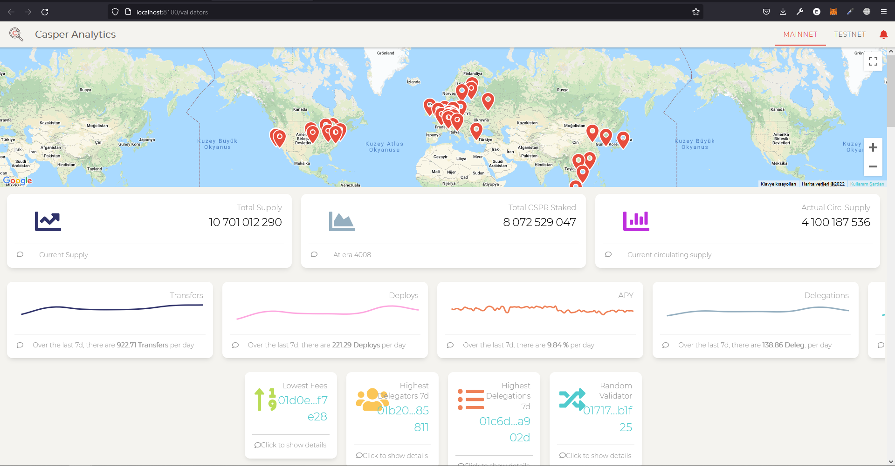

Reviewer was able to build and run the project by using the instructions given on the README of the project, after needed parameters entering to the .env file as per the instructions for the api project.

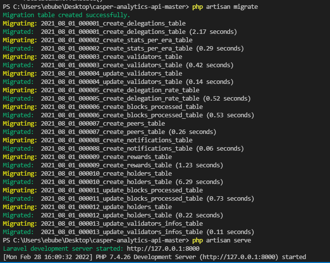

The reviewer was able to run the api methods successfully :
 
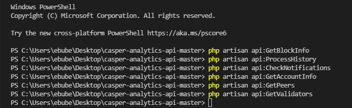

Reviewer reviewed that the errors in the previous review have been fixed :  

The pages on the website work properly both locally and on the website :

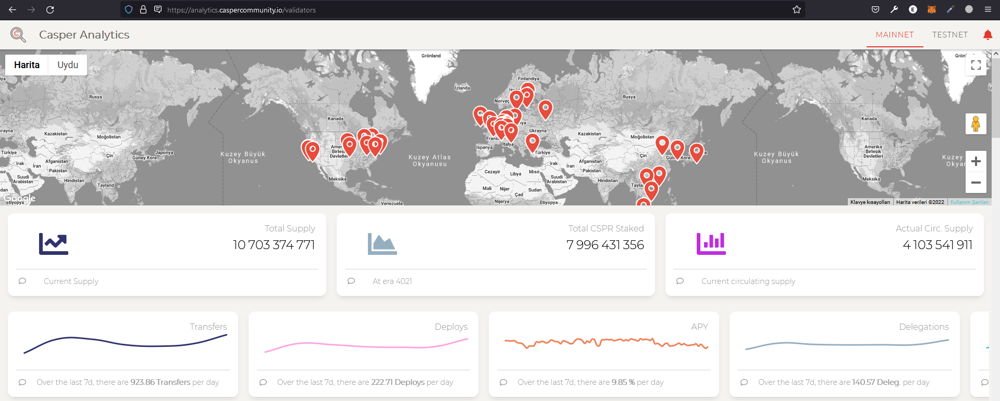
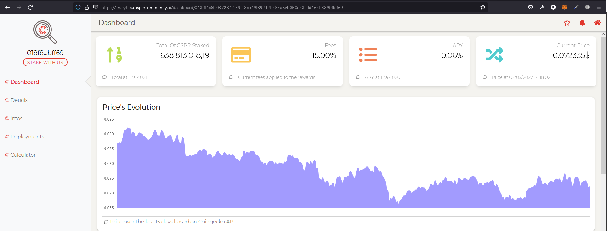
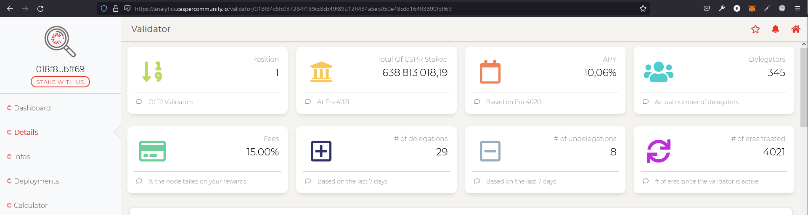
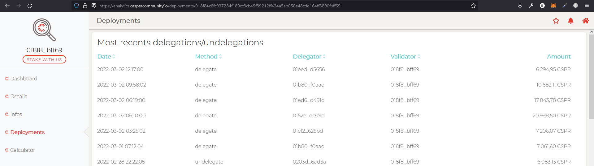
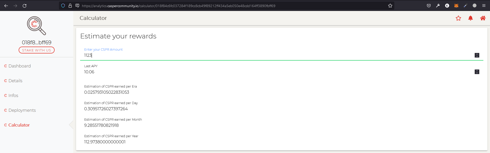
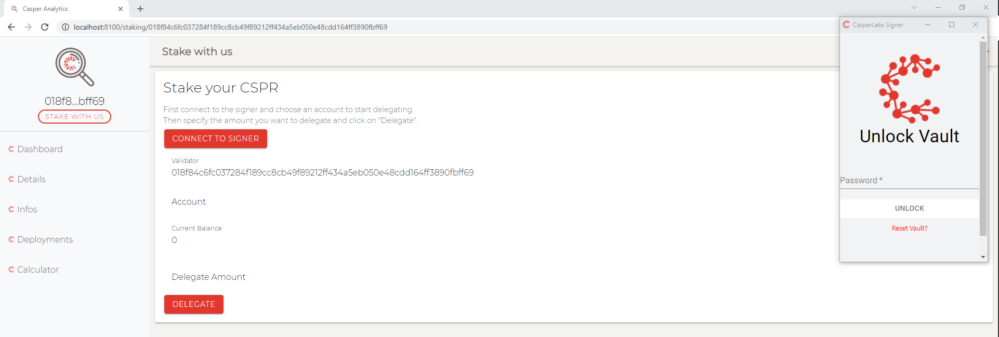

Reviewer observed successful 'casper signer integration' and 'cspr.live' redirection :

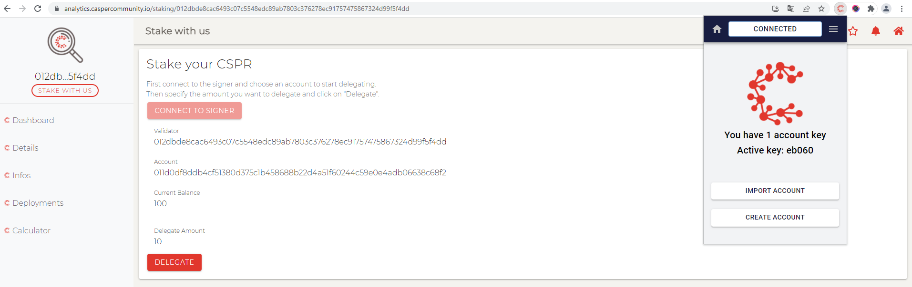
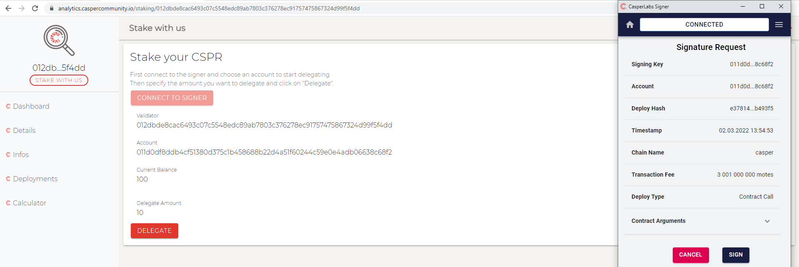
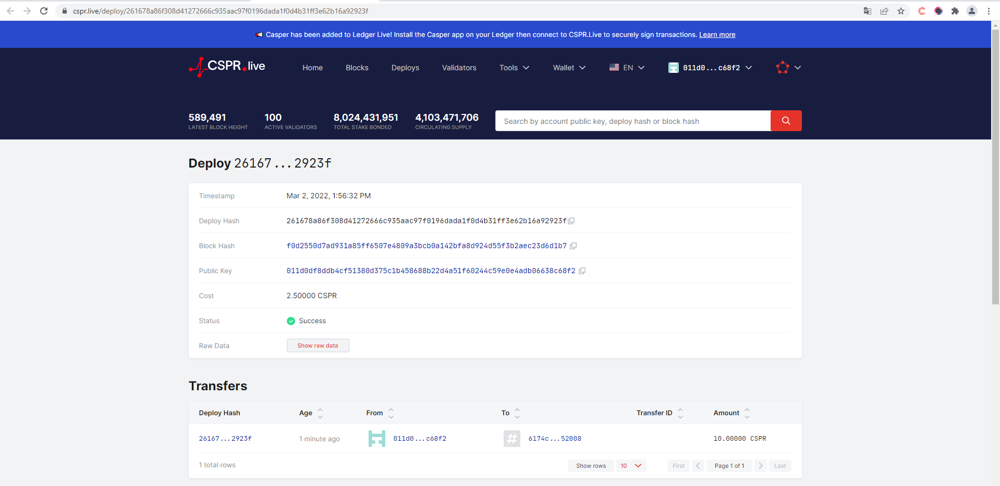

Mobile application working properly : 

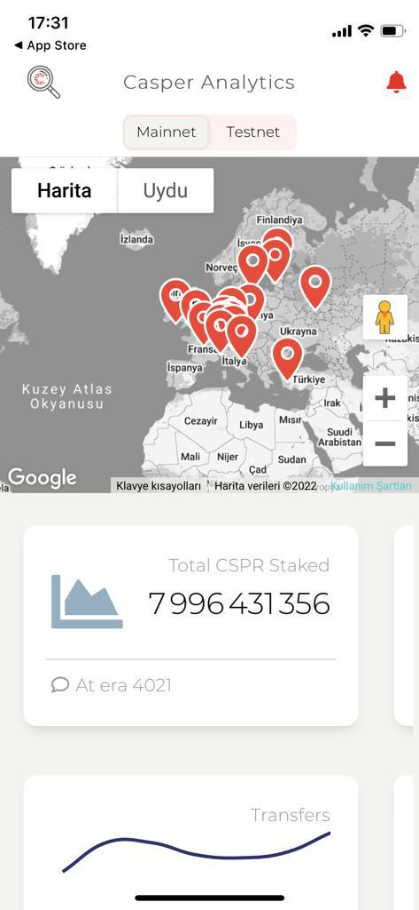
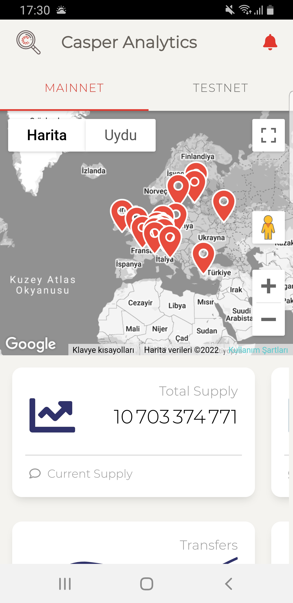

Notifications working properly : 

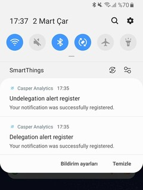

## Overall Impression of usage testing

The reviewer was able to build and run the project following the instructions. And also the documentation also provides adequate installation/execution instructions for different scenarios. The reviewer thinks that the project functionality will meet the acceptance criteria.

Requirement | Finding
------------ | -------------
Project builds without errors | PASS
Documentation provides sufficient installation/execution instructions | PASS
Project functionality meets/exceeds acceptance criteria and operates without error | PASS

# Unit / Automated Testing

After installing the requirements and adding the necessary configuration settings, following the instructions given in the README in the project, the tests were run. No error was received during the tests for app and api. 

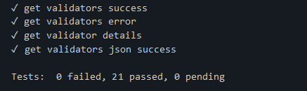
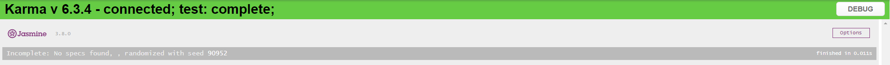

Requirement | Finding
------------ | -------------
Unit Tests - At least one positive path test | PASS
Unit Tests - At least one negative path test | PASS
Unit Tests - Additional path tests | PASS

# Documentation

### Code Documentation

Reviewer observed that all critical functions of the project had low-level code documentation which could be used for automated documentation generation.

Requirement | Finding
------------ | -------------
Code Documented | PASS

### Project Documentation

The reviewer observed that the README of the project has detailed general and usage documentation.

Requirement | Finding
------------ | -------------
Usage Documented | PASS

## Overall Conclusion on Documentation

The reviewer concludes that the project has sufficient comprehensive general documentation. 

# Open Source Practices

## Licenses

The Project is released under the MIT License

Requirement | Finding
------------ | -------------
OSI-approved open source software license | PASS

## Contribution Policies

Pull requests and Issues are enabled. And, the projects has contain a CONTRIBUTING and README policy. 

Requirement | Finding
------------ | -------------
OSS contribution best practices | PASS

# Coding Standards

## General Observations

Code is generally well-structured and readable. The Github linked project is easy and successful to install. 
The reviewer observed that the test bugs in the previous review were fixed and did not encounter any errors in the tests that would require the project to fail. 

# Final Conclusion

The project provides the functionality described in the grant application and milestone acceptance criteria. It also meets the standards required by the CRDAO. The reviewer praises the OP for the general stability and the fluid user experience of the app. Thus, in the reviewer's opinion, this submission should pass.

# Recommendation

Recommendation | PASS
------------ | -------------

