Grant Proposal | [225 - An Open Source Smart Contract Market Model for Tokenized Real Estates](https://portal.devxdao.com/app/proposal/225)
------------ | -------------
Milestone | 2
Milestone Title | Tokens created on Casper chain
OP | Vincent Peikert 
Reviewer | Muharrem Salel

# Milestone Details
The review will cover the second milestone criteria set forth below.

## Details & Acceptance Criteria

**Details of what will be delivered in milestone:**

- In accordance with the described deliverables for Milestone 2, we have created a token based on the CEP-78 enhanced NFT standard that will serve as the basis for Milestone 3 and 4. This token will be used to represent ownership shares of a real estate investment special purpose vehicle. 

- A detailed description of the work done within Milestone 2 can be found in the README.md file in the above repository. 
It contains an explanation of the various decisions taken throughout the work ("Background Information") and detailed instructions for building and testing the added functionality for the CEP-78 token standard on a local machine ("Code Documentation").

 **Acceptance criteria:**

- Real Estate Token example implementations on Casper chain (+ potentially other chains) have been completed. (Code uploaded on github)

 **Additional notes regarding submission from OP:**

- Furtheremore, the section "Manual Testing" in the README.md file provides 3 test account hashes that contain examples of the results and history of executing the steps outlined in this section.

 ## Milestone Submission

The following milestone assets/artifacts were submitted for review:

Repository | Revision Reviewed
------------ | -------------
https://github.com/NoumenaDigital/devxdao-m2 | d4eec5c

# Install & Usage Testing Procedure and Findings

Instructions at the README.md file in the repository(https://github.com/NoumenaDigital/devxdao-m2) are well-written that makes usage of project really easy. They explain a clear path for users, and following instructions step by step helps the user to run and test the codebase. The reviewer followed these steps from a Mac (macOS Monterey - MacBook Pro Intel i9 2019) and an Ubuntu Machine (Ubuntu 18.04.6) and successfully run both tests and the project itself.

However, first version that submitted to system was not sufficient for project to pass, because it was a private repository that does not cover OSS best practices. The reviewer communicated with the OP about the situation, and OP and their team took a quick action and fixed the issues.

## Overall Impression of usage testing

The project builds without errors, and documentation provides sufficient installation and execution instructions.  The project functionality meets the acceptance criteria and operates without errors.

[Installation](./assets/make_prepare_first.md)
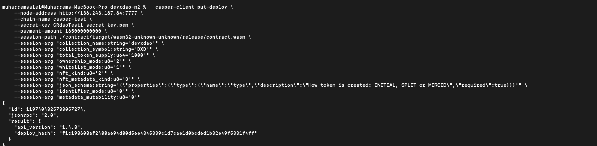
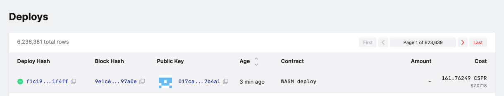
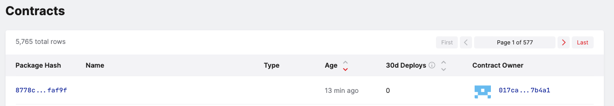
[Deploy Check Casper Client](./assets/deploy_check_with_casper_client.md)

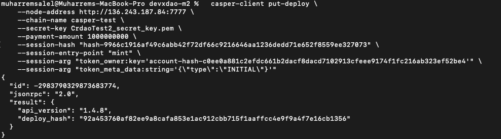
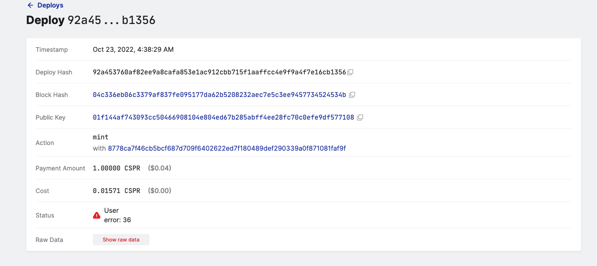

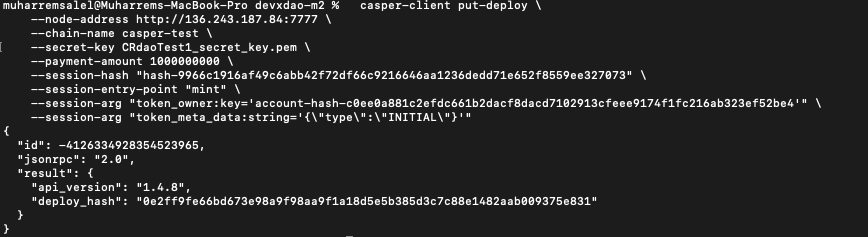
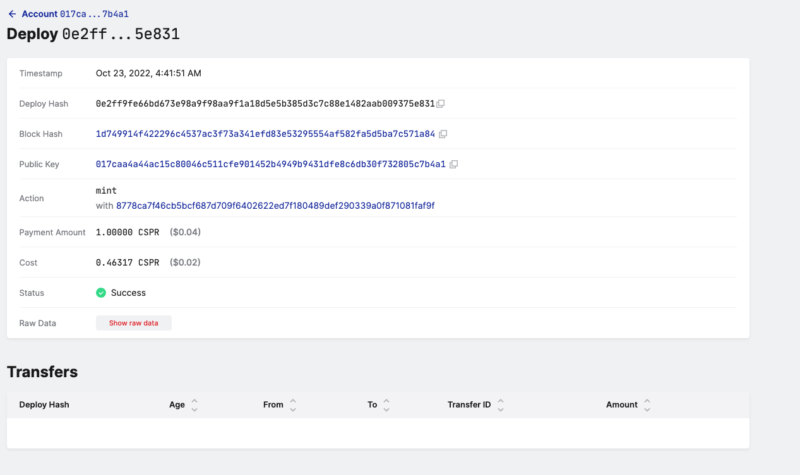

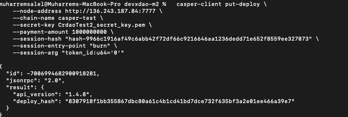
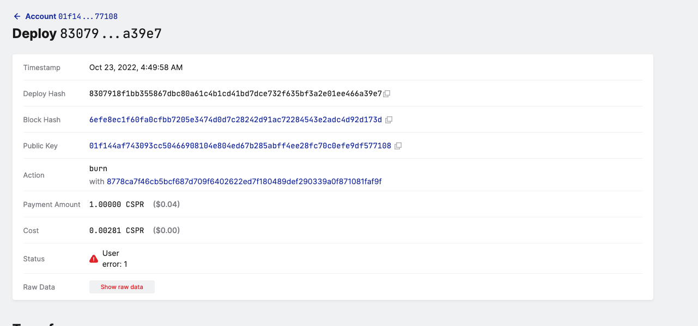

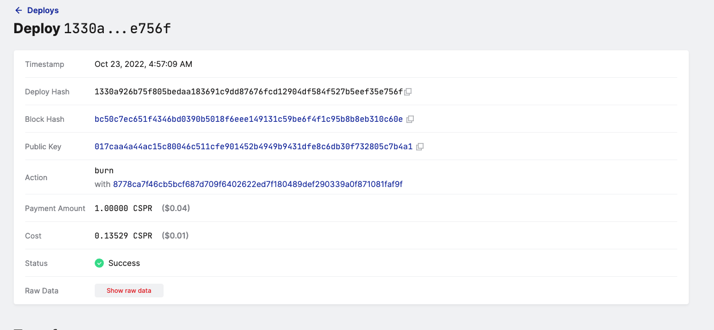

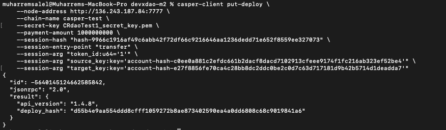
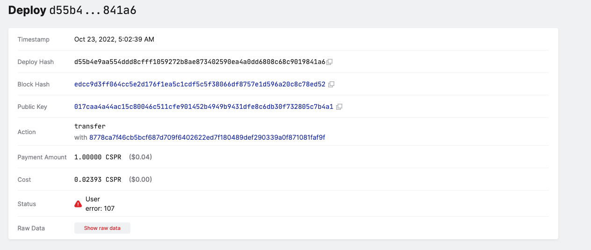

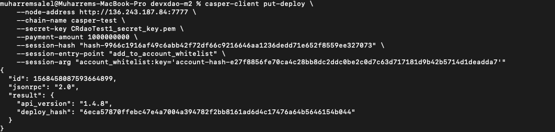
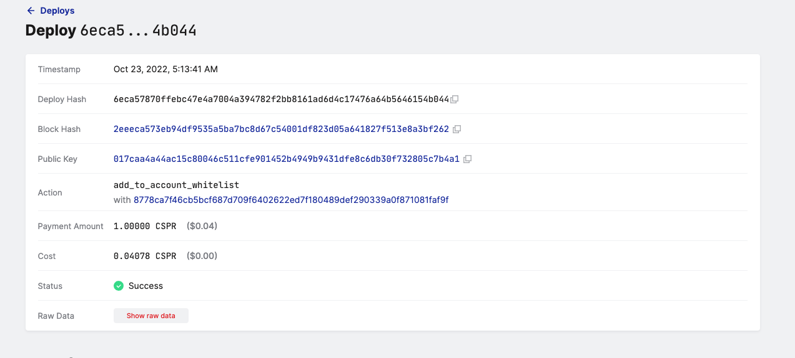
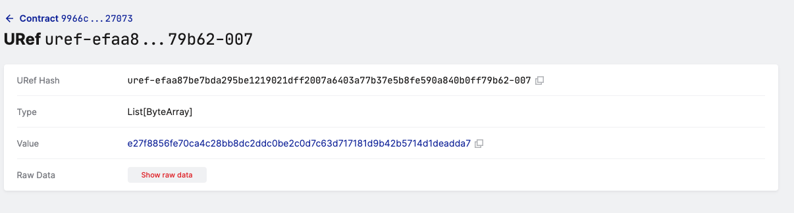

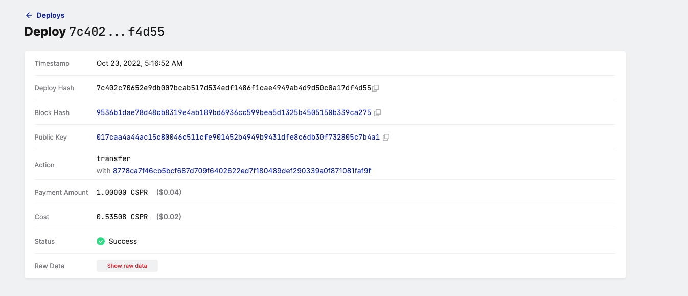
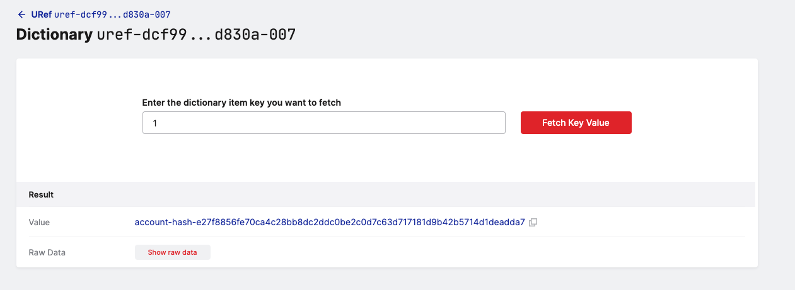

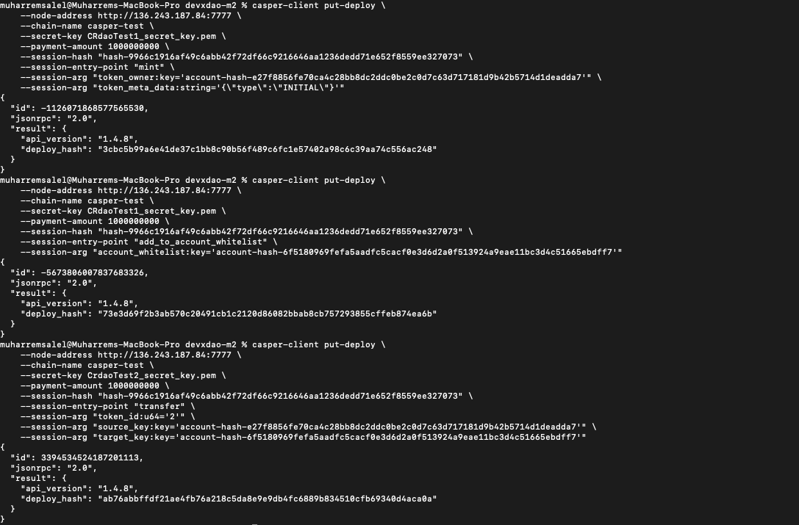
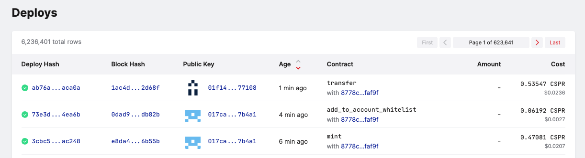

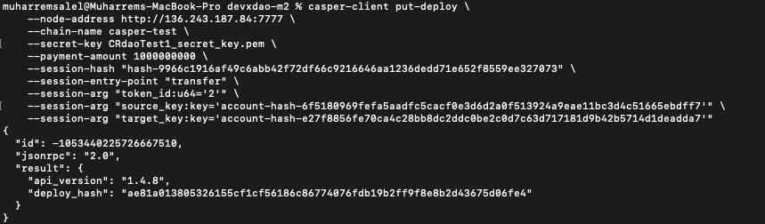

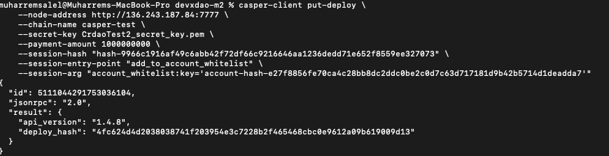
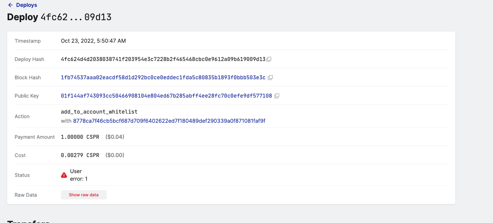

Requirement | Finding
------------ | -------------
The project builds without errors | PASS
Documentation provides sufficient installation/execution instructions | PASS
Project functionality meets/exceeds acceptance criteria and operates without error | PASS

# Unit / Automated Testing

The project has unit tests for all critical classes and methods.

[Tests](assets/make_clean_test.md)

Requirement | Finding
------------ | -------------
Unit Tests - At least one positive path test | PASS
Unit Tests - At least one negative path test | PASS 
Unit Tests - Additional path tests | PASS

# Documentation

### Code Documentation

A sufficient amount of low-level documentation exists on the project via properly formatted inline comments on the critical classes and the methods. However, the OP is highly encouraged to improve the code documentation such as adding more detail to the documentation of the classes and methods.

Requirement | Finding
------------ | -------------
Low-level function documentation | PASS with Notes

### Project Documentation

The README file is so readable and clear that it is a must-have for the project. It contains all the necessary information for the project build and execution.

Requirement | Finding
------------ | -------------
Sufficient Project Documentation | PASS

# Open Source Practices

## Licenses

The project is released under the Apache-2.0 License.

Requirement | Finding
------------ | -------------
OSI-approved open source software license | PASS

## Contribution Policies

The project repository was private and did not contain any CONTRIBUTING and SECURITY policy that links to a Code of Conduct. The reviewer communicated with the OP about the situation, and the team took quick action about the problem

Requirement | Finding
------------ | -------------
OSS contribution best practices | PASS

# Coding Standards

## General Observations

The code is generally well-structured and readable. The project is committed to GitHub and both the unit tests and the manual tests pass.

# Final Conclusion

The project provides the functionality described in the grant application and milestone acceptance criteria. 

Thus, in the reviewer's opinion, this submission should pass.

# Recommendation

Recommendation | PASS
------------ | -------------
