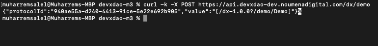
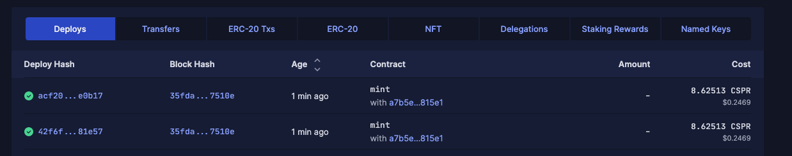

 Grant Proposal | [225 - An Open Source Smart Contract Market Model for Tokenized Real Estates](https://portal.devxdao.com/app/proposal/225)
------------ | -------------
Milestone | 3
Milestone Title | Initial version of prototype implemented
OP | Vincent Peikert 
Reviewer | Muharrem Salel

# Milestone Details
The review will cover the third milestone criteria set forth below.

## Details & Acceptance Criteria

**Details of what will be delivered in milestone:**

In accordance with the described deliverables for Milestone 3, we have created the framework for a Real Estate Equity Financing platform. From a code perspective, this covers Milestones 3 and 4. The validation as referenced in Milestone 4 has already taken place and the respective considerations have been built into Milestone 3. For Milestone 4 we will thus submit a rationalization document with regard to this validation. 

A detailed description of the work done within Milestone 3 can be found in the README.md file in the above repository. 
It contains an explanation of the various decisions taken throughout the work ("Background Information") and detailed instructions for building and testing the Real Estate Platform ("Code Documentation").

The License restrictions are covered in LICENSE.md file. 
Any security vulnerabilities can be reported as outlined in the SECURITY.md file and the CONTRIBUTING.md file outlines how contributions can be submitted.

 **Acceptance criteria:**

Key elements of the processes (covering the end-to-end process from onboarding of real estate assets, initial due diligence, and the issuance of tokens over the trading and settlement of real estate tokens to the “holding”, information, and servicing phase) are modeled as smart contracts (Code uploaded on GitHub): 
- Real estate token issuance and placement process (e.g., generation of tokens on the blockchain and assigning to multiple owners) 
- THA implementation (e.g., minimal regulatory lockup period, right of first refusal by token owners, simple governance process such as change of Asset Manager) 
- Trade validation and settlement process (e.g., trade cancellation due to breach of minimal lockup period)
- Token servicing process (e.g., right of first refusal or drag)

 **Additional notes regarding submission from OP:**

With the above linked GitHub repository, we submit Milestone 3.

 ## Milestone Submission

The following milestone assets/artifacts were submitted for review:

Repository | Revision Reviewed
------------ | -------------
https://github.com/NoumenaDigital/devxdao-m3 | effd42f

# Install & Usage Testing Procedure and Findings

Instructions in the README.md file in the repository(https://github.com/NoumenaDigital/devxdao-m3) are well-written that make usage of the project easy. They explain a clear path for users, and following instructions step by step helps the user to demo the project. The reviewer followed these steps from a Mac (macOS Monterey - MacBook Pro Intel i9 2019) and an Ubuntu Machine (Ubuntu 18.04.6) and successfully demo the project itself. However, to run the project, it needs "NPL Platform" tools and artifacts which are not accessible externally. It might be a problem but OP stated that they discussed this issue with DevXDao and agreed with the current solution which is acceptable because OP and the team exposed their API for testing without the authentication process which makes the review easy and applicable. 

However, the first version that was submitted to the system was not sufficient for the project to pass, because code documentation was missing and one of the environments for the demo was broken. Then the reviewer communicate with OP and they fixed the problems.

## Overall Impression of usage testing

The project builds without errors, and documentation provides sufficient installation and execution instructions.  The project functionality meets the acceptance criteria and operates without errors.

Requirement | Finding
------------ | -------------
The project builds without errors | PASS
Documentation provides sufficient installation/execution instructions | PASS
Project functionality meets/exceeds acceptance criteria and operates without error | PASS

# Unit / Automated Testing

The project has unit tests for all critical classes and methods.

Requirement | Finding
------------ | -------------
Unit Tests - At least one positive path test | PASS
Unit Tests - At least one negative path test | PASS 
Unit Tests - Additional path tests | PASS

# Documentation

### Code Documentation

A sufficient amount of low-level documentation was missing then the reviewer communicated with OP, then the team took quick action and added properly formatted inline comments on the critical classes and the methods to the project. However, the OP is highly encouraged to improve the code documentation such as adding more detail to the documentation of the classes and methods.

Requirement | Finding
------------ | -------------
Low-level function documentation | PASS with Notes

### Project Documentation

The README file is so readable and clear that it is a must-have for the project. It contains all the necessary information for the project to demo.

Requirement | Finding
------------ | -------------
Sufficient Project Documentation | PASS

# Open Source Practices

## Licenses

The project is released under the Apache-2.0 License.

Requirement | Finding
------------ | -------------
OSI-approved open-source software license | PASS

## Contribution Policies

Pull requests and Issues are enabled on the repository. The project also has CONTRIBUTING and SECURITY policies.

Requirement | Finding
------------ | -------------
OSS contribution best practices | PASS

# Coding Standards

## General Observations

The code is generally well-structured and readable. The project is committed to GitHub and both the unit tests and the manual tests pass.

# Final Conclusion

The project provides the functionality described in the grant application and milestone acceptance criteria. 

Thus, in the reviewer's opinion, this submission should pass.

# Recommendation

Recommendation | PASS
------------ | -------------
