Grant Proposal | [243 - Bot-optimized Validator Information Library](https://portal.devxdao.com/public-proposals/243)
------------ | -------------
Milestone | 2
Milestone Title | Telegram Bot
OP | furkanahmetk
Reviewer | Chad <elmabahma@gmail.com>

# Milestone Details

## Details & Acceptance Criteria

**Details of what will be delivered in milestone:**

-Bot Development : Bot will be designed and developed with python.
-Command for getting updates with specific time intervals.
-Commands to get Active/Inactive state of validator.
-Setting alerts for crucial information.
-Commands to get general information like APY, uptime,total stake, rewards, total delegators.

Source code will be uploaded to github.

**Acceptance criteria:**

-BOT will be live and available on telegram with given functionalities.. 
-Documentation or Help will be available about bot. Source code will be available with README and HOW TOs.


**Additional notes regarding submission from OP:**

-API side is updated according to requirements
-Reviewer can use our live API, If s/he does not want to run it locally. Here is our api url: http://38.242.242.73:5555
-Reviewer also can check updated endpoints of API from: http://38.242.242.73:5555/swagger-ui/#/
-Note for the reviewer: for any questions or issues during review feel free the contact furkanahmetkara.fk@gmail.com or via telegram.

## Milestone Submission

The following milestone assets/artifacts were submitted for review:

Repository | Revision Reviewed
------------ | -------------
https://github.com/furkanahmetk/telegram-validator-bot | 8da3cb4

# Install & Usage Testing Procedure and Findings

Following the instructions in the README of https://github.com/furkanahmetk/telegram-validator-bot, reviewer was
able to successfully install Prerequisites (Python3, pip) ,build and run the source code for this milestone :

-Run back-end (Milestone 1) 

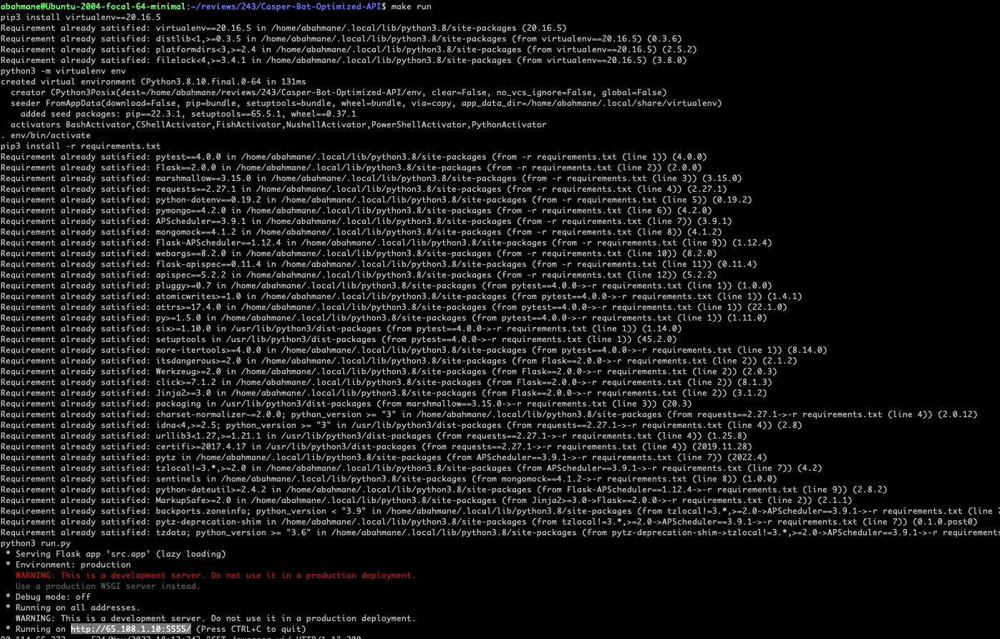

-Run MongoDB

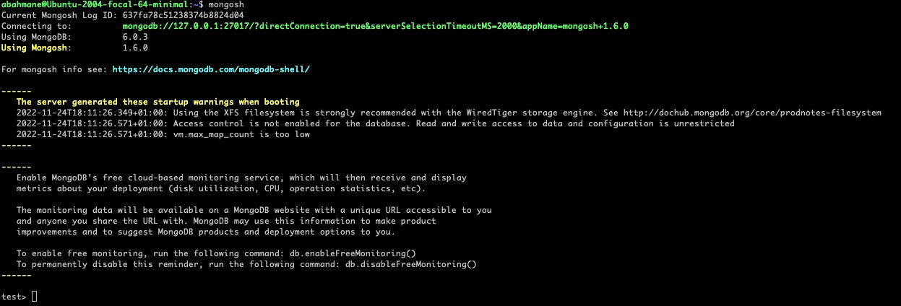

-Run validator-bot scripts

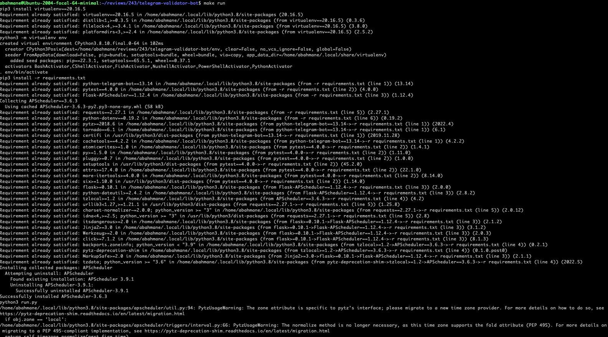

Reviewer was able to create a Telegram bot and test it :

-Create Telegram Bot

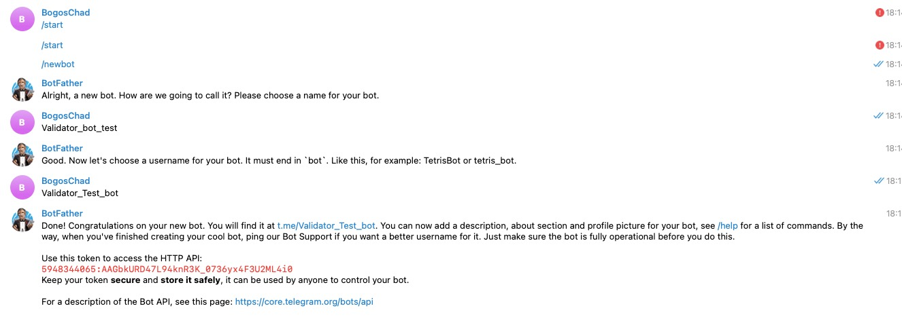

-Test Telegram Bot using the M1 backed 

 * Node status 

   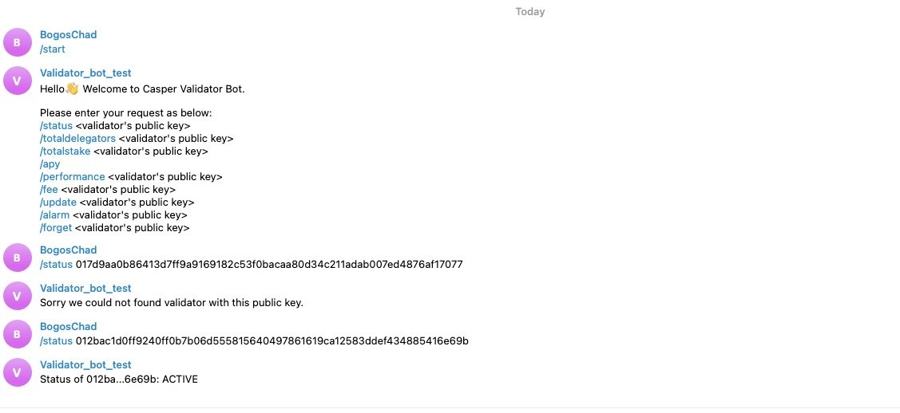

* Node fees

  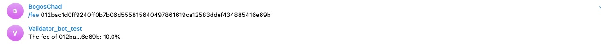

* Node alarm

  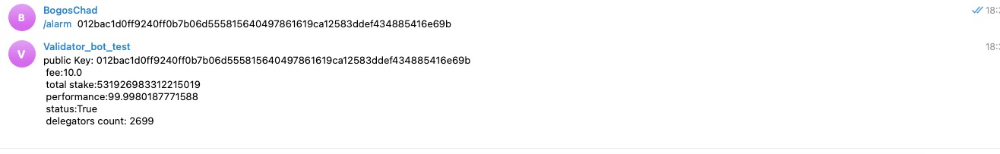

* Node update

  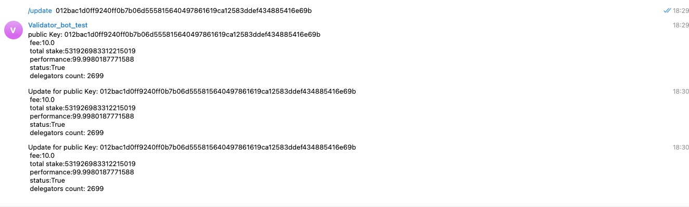

* Node forget

  

* Node total delegators

  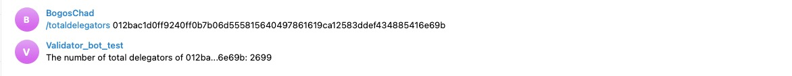

* Node total stake

  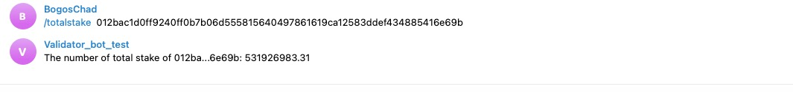

* Node apy

  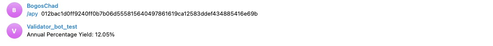

* Node performance

  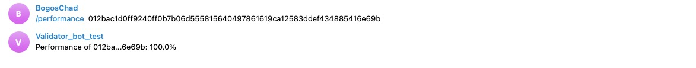

## Overall Impression of usage testing

The reviewer was able to build and run the application.
The build instructions are sufficient and clear. 

Requirement | Finding
------------ | -------------
Project builds without errors | PASS
Documentation provides sufficient installation/execution instructions | PASS
Project functionality meets/exceeds acceptance criteria and operates without error | PASS
Can connect to a Casper node | PASS

# Unit / Automated Testing

This Milestone contains 20 unit and integration tests. 
The tests can be executed from the console and cover both positive and negative test paths

```bash
make test
```

```bash
make test
python3 -m pytest
====================================================================================================== test session starts =======================================================================================================
platform linux -- Python 3.8.10, pytest-4.0.0, py-1.11.0, pluggy-1.0.0 -- /usr/bin/python3
cachedir: .pytest_cache
rootdir: /home/abahmane/reviews/243/telegram-validator-bot, inifile: pytest.ini
collected 20 items

tests/integration/test_alarm_me.py::test_alarm_me PASSED                                                                                                                                                                   [  5%]
tests/integration/test_alarm_me.py::test_update_me_negative PASSED                                                                                                                                                         [ 10%]
tests/integration/test_apy.py::test_apy PASSED                                                                                                                                                                             [ 15%]
tests/integration/test_apy.py::test_apy_negative PASSED                                                                                                                                                                    [ 20%]
tests/integration/test_fee.py::test_fee PASSED                                                                                                                                                                             [ 25%]
tests/integration/test_fee.py::test_fee_negative PASSED                                                                                                                                                                    [ 30%]
tests/integration/test_forget_validator.py::test_forget_validator PASSED                                                                                                                                                   [ 35%]
tests/integration/test_performance.py::test_performance PASSED                                                                                                                                                             [ 40%]
tests/integration/test_performance.py::test_performance_negative PASSED                                                                                                                                                    [ 45%]
tests/integration/test_start.py::test_start PASSED                                                                                                                                                                         [ 50%]
tests/integration/test_start.py::test_start_negative PASSED                                                                                                                                                                [ 55%]
tests/integration/test_status.py::test_status PASSED                                                                                                                                                                       [ 60%]
tests/integration/test_status.py::test_status_negative PASSED                                                                                                                                                              [ 65%]
tests/integration/test_total_delegators.py::test_total_delegators PASSED                                                                                                                                                   [ 70%]
tests/integration/test_total_delegators.py::test_total_delegators_negative PASSED                                                                                                                                          [ 75%]
tests/integration/test_total_stake.py::test_total_stake PASSED                                                                                                                                                             [ 80%]
tests/integration/test_total_stake.py::test_total_stake_negative PASSED                                                                                                                                                    [ 85%]
tests/integration/test_update_me.py::test_update_me PASSED                                                                                                                                                                 [ 90%]
tests/integration/test_update_me.py::test_update_me_negative PASSED                                                                                                                                                        [ 95%]
tests/unit/test_models.py::test_provider_validater PASSED                                                                                                                                                                  [100%]

=================================================================================================== 20 passed in 0.12 seconds ====================================================================================================
```


Requirement | Finding
------------ | -------------
Unit Tests - At least one positive path test | PASS
Unit Tests - At least one negative path test | PASS


# Documentation

### Code Documentation

The code is now overall well documented and almost all classes and critical functions have acceptable code-level documentation.

Requirement | Finding
------------ | -------------
Code Documented | PASS

### Project Documentation

The project documentation is generally sufficient and the instructions for building and running project are clear.
The -Bot Usage- paragraph  on the usage of the Telegram bot in the Readme file details the different operations exposed by the endpoint
that will be used by the Bot.


Requirement | Finding
------------ | -------------
Usage Documented | PASS
Example Documented | PASS

## Overall Conclusion on Documentation

Based on the reviewer's findings, this review should pass.

# Open Source Practices

## Licenses

The Project is released under the Apache License

Requirement | Finding
------------ | -------------
OSI-approved open source software license | PASS

## Contribution Policies

The project contains a CONTRIBUTING policy that links to a Code of Conduct policy. Pull requests and Issues are enabled.

Requirement | Finding
------------ | -------------
OSS contribution best practices | PASS

# Coding Standards

## General Observations

Code is generally well-structured and very readable. The project as committed to GitHub and both the unit tests and the manual tests pass.

# Final Conclusion

The project provides the functionality described in the grant application and milestone acceptance criteria.

# Recommendation

Recommendation | PASS 
------------ | -------------
