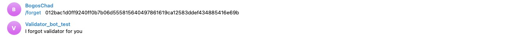

Grant Proposal | [243 - Bot-optimized Validator Information Library](https://portal.devxdao.com/public-proposals/243)
------------ | -------------
Milestone | 2
Milestone Title | Telegram Bot
OP | furkanahmetk
Reviewer | Chad <elmabahma@gmail.com>

# Milestone Details

## Details & Acceptance Criteria

**Details of what will be delivered in milestone:**

-Bot Development : Bot will be designed and developed with python.
-Command for getting updates with specific time intervals.
-Commands to get Active/Inactive state of validator.
-Setting alerts for crucial information.
-Commands to get general information like APY, uptime,total stake, rewards, total delegators.

Source code will be uploaded to github.

**Acceptance criteria:**

-BOT will be live and available on telegram with given functionalities.. 
-Documentation or Help will be available about bot. Source code will be available with README and HOW TOs.


**Additional notes regarding submission from OP:**

-API side is updated according to requirements
-Reviewer can use our live API, If s/he does not want to run it locally. Here is our api url: http://38.242.242.73:5555
-Reviewer also can check updated endpoints of API from: http://38.242.242.73:5555/swagger-ui/#/
-Note for the reviewer: for any questions or issues during review feel free the contact furkanahmetkara.fk@gmail.com or via telegram.

## Milestone Submission

The following milestone assets/artifacts were submitted for review:

Repository | Revision Reviewed
------------ | -------------
https://github.com/furkanahmetk/telegram-validator-bot | 8da3cb4

# Install & Usage Testing Procedure and Findings

Following the instructions in the README of https://github.com/furkanahmetk/telegram-validator-bot, reviewer was
able to successfully install Prerequisites (Python3, pip) ,build and run the source code for this milestone :

-Run back-end (Milestone 1) 


-Run MongoDB


-Run validator-bot scripts


Reviewer was able to create a Telegram bot and test it :

-Create Telegram Bot


-Test Telegram Bot using the M1 backed 

 * Node status 

   

* Node fees

  

* Node alarm

  

* Node update

  

* Node forget

  

* Node total delegators

  

* Node total stake

  

* Node apy

  

* Node performance

  

## Overall Impression of usage testing

The reviewer was able to build and run the application.
The build instructions are sufficient and clear. 

Requirement | Finding
------------ | -------------
Project builds without errors | PASS
Documentation provides sufficient installation/execution instructions | PASS
Project functionality meets/exceeds acceptance criteria and operates without error | PASS
Can connect to a Casper node | PASS

# Unit / Automated Testing
This small milestone being focused on the creation and testing of the bot, the operator did not consider it useful to set up unit tests.
The tests carried out by the reviewer above  can be considered as unit tests.


```bash
make test
```

```bash
abahmane@Ubuntu-2004-focal-64-minimal:~/reviews/243/telegram-validator-bot$ make tests
make: Nothing to be done for 'tests'.
```


Requirement | Finding
------------ | -------------
Unit Tests - At least one positive path test | N/A
Unit Tests - At least one negative path test | N/A
Unit Tests - Additional path tests | N/A

# Documentation

### Code Documentation

The code is now overall well documented and almost all classes and critical functions have acceptable code-level documentation.

Requirement | Finding
------------ | -------------
Code Documented | PASS

### Project Documentation

The project documentation is generally sufficient and the instructions for building and running project are clear.
The -Bot Usage- paragraph  on the usage of the Telegram bot in the Readme file details the different operations exposed by the endpoint
that will be used by the Bot.


Requirement | Finding
------------ | -------------
Usage Documented | PASS
Example Documented | PASS

## Overall Conclusion on Documentation

Based on the reviewer's findings, this review should pass.

# Open Source Practices

## Licenses

The Project is released under the Apache License

Requirement | Finding
------------ | -------------
OSI-approved open source software license | PASS

## Contribution Policies

The project contains a CONTRIBUTING policy that links to a Code of Conduct policy. Pull requests and Issues are enabled.

Requirement | Finding
------------ | -------------
OSS contribution best practices | PASS

# Coding Standards

## General Observations

Code is generally well-structured and very readable. The project as committed to GitHub and both the unit tests and the manual tests pass.

# Final Conclusion

The project provides the functionality described in the grant application and milestone acceptance criteria.

# Recommendation

Recommendation | PASS 
------------ | -------------
