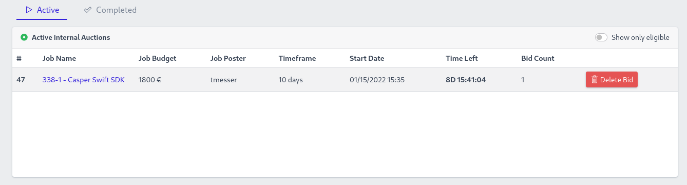

Grant Proposal | [246 - Development of Services DAO Platform](https://portal.devxdao.com/public-proposals/246)
------------ | -------------
Milestone | 2
Milestone Title | Milestone 2
OP | Ekin Keçeci
Reviewer | Muhammet Kara

# Milestone Details

## Details & Acceptance Criteria

**Details of what will be delivered in milestone:**

- Bid submission management
- Reputation management
- Voting Engine
- Authorization for three types of user(voter, member, admin)
- DEVxDAO portal integration

**Acceptance criteria:**

- Bid submission management must be developed
- Reputation management must be developed
- Voting Engine must be developed
- Authorization for user types must be checked. (voter, member, admin)

**Additional notes regarding submission from OP:**

Beta has been deployed on https://crdao.ossa.dev

## Milestone Submission

The following milestone assets/artifacts were submitted for review:

Repository | Revision Reviewed
------------ | -------------
https://github.com/EKON-YAZILIM/ServicesDAO | 3c36247

It was also observed that the project has one more repository which is not submitted together with the main repository above, but is an indispensable part of the project. Thus, it will also be included in this review as follows:

Repository | Revision Reviewed
------------ | -------------
https://github.com/EKON-YAZILIM/ServicesDAO_VotingEngine | 8221e05

# Install & Usage Testing Procedure and Findings

## Build

Following the instructions in the README of the project's repositories, the reviewer was able to successfully build the project for this milestone on Ubuntu 20.04 in a cloud environment as separate microservices:
* [DAO_ApiGateway](assets/build-DAO_ApiGateway.md)
* [DAO_DbService](assets/build-DAO_DbService.md)
* [DAO_IdentityService](assets/build-DAO_IdentityService.md)
* [DAO_LogService](assets/build-DAO_LogService.md)
* [DAO_NotificationService](assets/build-DAO_NotificationService.md)
* [DAO_WebPortal](assets/build-DAO_WebPortal.md)
* [DAO_ReputationService](assets/build-DAO_ReputationService.md)
* [DAO_VotingEngine](assets/build-DAO_VotingEngine.md)

## Installation

The reviewer was able to install the project on a test environment following the instructions on the repositories, only after certain changes and additions which are noted in the installation notes section below.


### Installation Notes
ServicesDAO's docker-compose file is simple and easily deployable, but the project's README file and the instructions seem to have some room for improvement.

Configs, covered poorly, that the reviewer had to find out by himself:
1. SMTP Configuration file
    * located at **DAO_NotificationService/appsettings.json**
2. DAO_WebPortal/appsettings.json contains **Service_ApiGateway_Url** field and its value is statically set to the developer's server address. This is **very critical information** but not provided in the README file. If you do not set this address correctly, your deployment will not run correctly.
3. Rabbitmq and MySQL passwords are static, and spread across many different files. Changing environment variable fields in the docker-compose file doesn't work.
    * Rabbitmq passwords:
    Except for the docker-compose files, files containing passwords are as follows.
    ```
    DAO_LogService/appsettings.json
    DAO_NotificationService/appsettings.json
    DAO_DbService/appsettings.test.json
    DAO_DbService/appsettings.json
    DAO_ApiGateway/appsettings.json
    DAO_IdentityService/appsettings.test.json
    DAO_IdentityService/appsettings.json
    DAO_WebPortal/appsettings.json
    ```
    * Mysql passwords: 
    Except for the docker-compose.test.yml files, files containing passwords are as follows.
    ```
    DAO_LogService/appsettings.json
    DAO_DbService/appsettings.test.json
    DAO_DbService/appsettings.json
    DAO_IdentityService/appsettings.test.json
    ```
    These passwords can easily be set with a simple find+sed command but the documentation does not cover this.

## Usage

The usage was first tested on the test deployment by the reviewer on a basic level, then judged based on the extensive usage of the beta deployment on https://crdao.ossa.dev

The reviewer was able to login to the portal with different user types (voter, member, admin), and see different options and views for each user type.


It was observed that the bid submission functionality exists and works on the portal.




The reviewer was able to see that different types of votes are taking place on the portal, producing proper outcomes as reputation minting and distribution and state changes of the jobs, evidencing the functionality of the voting engine and the reputation management.


## Overall Impression of usage testing

The project builds without errors, and the project functionality meets/exceeds the acceptance criteria and operates without errors. However, the reviewer thinks that the documentation still has room for improvement regarding the installation and execution instructions especially on the points noted in the Installation Notes section.

Requirement | Finding
------------ | -------------
Project builds without errors | PASS
Documentation provides sufficient installation/execution instructions | PASS with Notes
Project functionality meets/exceeds acceptance criteria and operates without error | PASS

# Unit / Automated Testing

The project has a number of tests, covering both positive and negative paths on different modules. However, although almost all modules seem to be tested because of their interconnected nature, the reviewer thinks that the tests are concentrated on a few modules, and thus recommends covering all modules independently if possible.

* [DAO_DbService-Test.md](assets/DAO_DbService-Test.md)
* [DAO_ReputationService.Tests.md](assets/DAO_ReputationService.Tests.md)
* [DAO_VotingEngine.Tests.md](assets/DAO_VotingEngine.Tests.md)

Requirement | Finding
------------ | -------------
Unit Tests - At least one positive path test | PASS with Notes
Unit Tests - At least one negative path test | PASS with Notes
Unit Tests - Additional path tests | PASS with Notes

# Documentation

### Code Documentation

The reviewer has observed that the critical functions of the code-base has an acceptable level of code-level documentation by means of standard inline comments which allow auto-generation of the documentation.

Requirement | Finding
------------ | -------------
Code Documented | PASS

### Project Documentation

Reviewer has observed that the project documentation is extremely sparse, thus needs to be improved before the submission of the project's final milestone.

Requirement | Finding
------------ | -------------
Usage Documented | PASS with Notes
Example Documented | PASS with Notes

## Overall Conclusion on Documentation

Based on the reviewer's findings, this review should pass with notes.

# Open Source Practices

## Licenses

The Project is released under the MIT License.

Requirement | Finding
------------ | -------------
OSI-approved open source software license | PASS

## Contribution Policies

Pull requests and Issues are enabled on the repositories, and the project contains CONTRIBUTING guidelines, but lacks a SECURITY policy. The reviewer recommends preparing and publishing a proper SECURITY policy on the repository as soon as possible.

Requirement | Finding
------------ | -------------
OSS contribution best practices | PASS with Notes

# Coding Standards

## General Observations

Reviewer finds the code to be generally well-structured and readable. The project as committed to GitHub and both the unit tests and the manual tests pass.

# Final Conclusion

The project provides the functionality described in the grant application and milestone acceptance criteria. The project is well-documented at the code level and has an acceptable level of tests.

However, **the usage documentation is extremely sparse and needs to be improved before the final milestone**. Moreover, although most of the functionalities are tested indirectly, the tests seem to be concentrated on half of the modules, and thus it is recommended to extend the tests to cover each module independently at least for the most basic functionalities.

The project also lacks a security policy. Furthermore, the installation instructions still have some room for improvement which should be handled before the final milestone.

Thus, in the reviewers opinion, this submission should pass with notes.

# Recommendation

Recommendation | PASS with Notes
------------ | -------------
