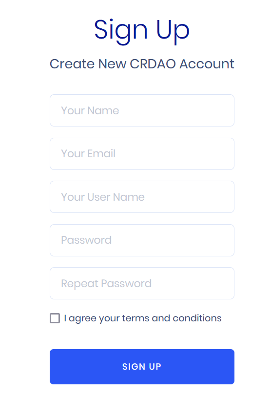
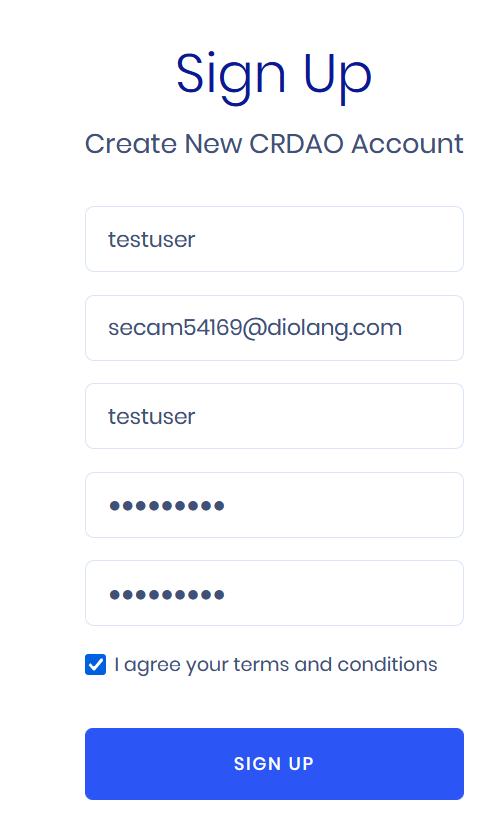
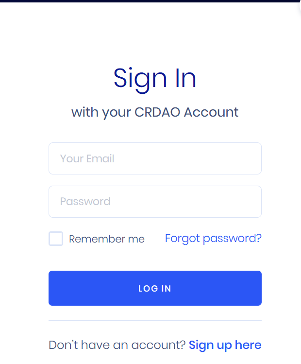
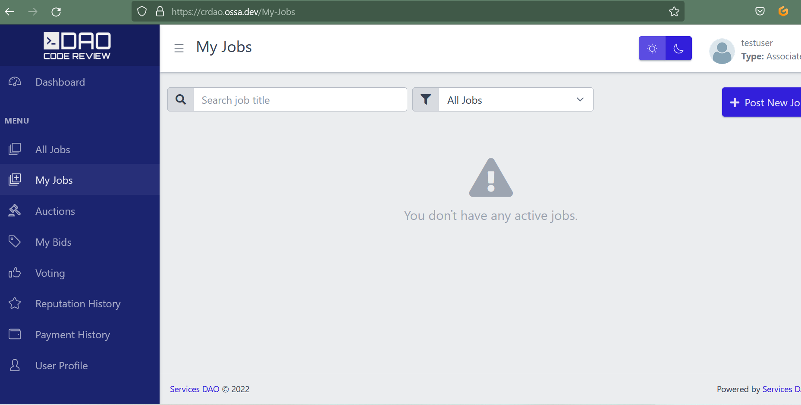

Grant Proposal | [246 - Development of Services DAO Platform](https://portal.devxdao.com/public-proposals/246)
------------ | -------------
Milestone | 3
Milestone Title | Milestone 3
OP | Ekin Keçeci
Reviewer | Hatice Kaya

# Milestone Details

## Details & Acceptance Criteria

**Details of what will be delivered in milestone:**

- Limited read only public API
- Integration Tests
- Containerization
- Documentation
- Final changes for production

**Acceptance criteria:**

- Documentation must be provided.
- Limited read only public API must be available.
- Final product must be released

**Additional notes regarding submission from OP:**

The project consists of 2 repos and the link sent in this milestone belongs to the VotingEngine module "DAO_VotingEngine" project.

## Milestone Submission

The following milestone assets/artifacts were submitted for review:

Repository | Revision Reviewed
------------ | -------------
https://github.com/EKON-YAZILIM/ServicesDAO | c5e57ba
https://github.com/EKON-YAZILIM/ServicesDAO_VotingEngine | e7f618e

# Install & Usage Testing Procedure and Findings

## Build

Following the instructions in the README of the project's repositories, the reviewer was able to successfully build the project for this milestone on Ubuntu 20.04 in a cloud environment as separate microservices:
* [DAO_ApiGateway](assets/build/build-DAO_ApiGateway.md)
* [DAO_DbService](assets/build/build-DAO_DbService.md)
* [DAO_IdentityService](assets/build/build-DAO_IdentityService.md)
* [DAO_LogService](assets/build/build-DAO_LogService.md)
* [DAO_NotificationService](assets/build/build-DAO_NotificationService.md)
* [DAO_WebPortal](assets/build/build-DAO_WebPortal.md)
* [DAO_ReputationService](assets/build/build-DAO_ReputationService.md)
* [DAO_VotingEngine](assets/build/build-DAO_VotingEngine.md)

## Installation

The reviewer was able to install the project on a test environment following the instructions on the repositories.

## Usage

The usage was first tested on the test deployment by the reviewer on a basic level, then judged based on the extensive usage of the beta deployment on https://crdao.ossa.dev

The reviewer was able to observe that the application works as expected.

## Overall Impression of usage testing

The project builds without errors, and the project functionality meets/exceeds the acceptance criteria and operates without errors. Installation instructions can be simplified and improved.

Requirement | Finding
------------ | -------------
Project builds without errors | PASS
Documentation provides sufficient installation/execution instructions | PASS with Notes
Project functionality meets/exceeds acceptance criteria and operates without error | PASS

# Unit / Automated Testing

The project has tests, covering both positive and negative paths. More tests are suggested.

* [DAO_DbService.Test.md](assets/tests/DAO_DbService.Test.md)
* [DAO_ReputationServise.Tests.md](assets/tests/DAO_ReputationServise.Tests.md)
* [DAO_VotingEngine.Tests.md](assets/tests/DAO_VotingEngine.Tests.md)
* [DAO_IdentityService.Test.md](assets/tests/DAO_IdentityService.Test.md)

Requirement | Finding
------------ | -------------
Unit Tests - At least one positive path test | PASS
Unit Tests - At least one negative path test | PASS
Unit Tests - Additional path tests | PASS with Notes

# Documentation

### Code Documentation

The critical functions of the code-base has an acceptable level of code-level documentation by means of standard inline comments which allow auto-generation of the documentation.

Requirement | Finding
------------ | -------------
Code Documented | PASS

### Project Documentation

The project documentation is acceptable with usage documentation. More examples are suggested but not required.

Requirement | Finding
------------ | -------------
Usage Documented | PASS
Example Documented | PASS with Notes

## Overall Conclusion on Documentation

Based on the reviewer's findings, this review should pass with notes.

# Open Source Practices

## Licenses

The Project is released under the MIT License.

Requirement | Finding
------------ | -------------
OSI-approved open source software license | PASS

## Contribution Policies

Pull requests and Issues are enabled on the repositories, and the project contains CONTRIBUTING guidelines, but lacks a SECURITY policy. Adding a SECURITY policy is recommended.

Requirement | Finding
------------ | -------------
OSS contribution best practices | PASS with Notes

# Coding Standards

## General Observations

Code is generally well-structured and readable. The project as committed to GitHub and both the unit tests and the manual tests pass.

# Final Conclusion

The project provides the functionality described in the grant application and milestone acceptance criteria. The project is generally well-documented and passes manual and automated tests.

The project lacks a security policy. Further small improvements are also suggested on documentation and test coverage.

Thus, in the reviewers opinion, this submission should pass with notes.

# Recommendation

Recommendation | PASS with Notes
------------ | -------------
