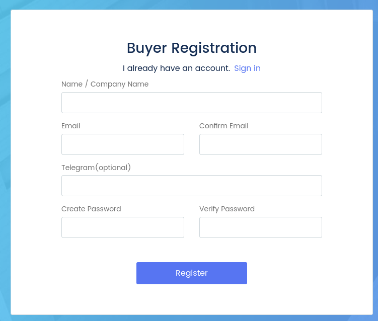
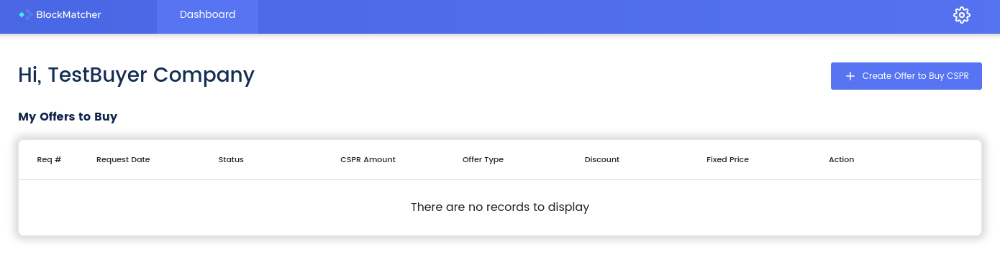
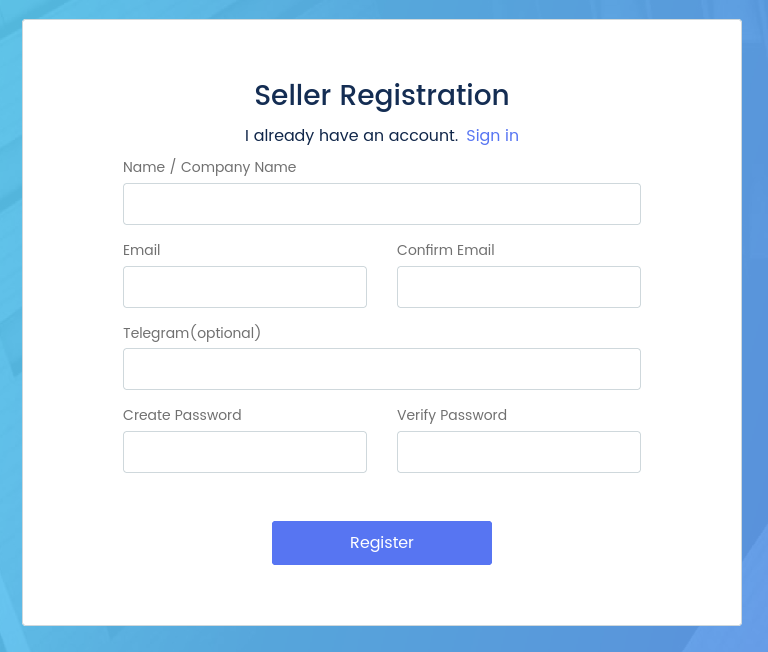
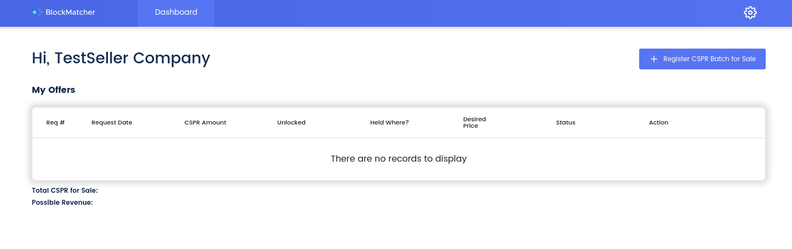

Grant Proposal | [252 - BlockMatcher - Private trade (OTC) platform for compliant brokers](https://portal.devxdao.com/public-proposals/252)
------------ | -------------
Milestone | 1
Milestone Title | Delivery of Entire Webapp
OP | LedgerLeap
Reviewer | Muhammet Kara

# Milestone Details

## Details & Acceptance Criteria

**Details of what will be delivered in milestone:**

A complete webapp will be delivered and hosted for demonstration along with the git repo containing all source code. The system will allow registration of buyers and sellers, posting of bids and offers, and an administration environment for batching these orders into transactions. This webapp will be complete (as defined by passing all acceptance criteria tests) and intuitive to use. Using the application, brokers will match deals directly between large audiences of both buyers and sellers, and rely on the system to track the accounting they need for compliance in "batches." For buyers, BlockMatcher will support registrations and submission of purchase requests, allowing potential purchasers to submit bid orders for matching with sellers and manage aspects of the purchase process. For sellers, BlockMatcher will allow submission of offers, including relevant pricing and quantity information. Administrators of the OTC platform will then be able to match sellers and buyer orders in "batches" for compliant manual processing. These batches will be stored for historical accounting and record keeping. The system will provide note adding and other convenience of use features, along with modifiable branding and colors.

**Acceptance criteria:**

Specific system tests will be demonstrated to test the operation of the system:
• Registration of a buyer user.
• Registration of a seller user.
• Login and password recovery tests.
• Placing a selling order (offer).
• Submission of price, lock, and location information.
• Placing a buying order (bid).
• Removing an order.
• Admin viewing of placed order.
• Admin creating of batch to match orders.
• Assignment of batch to both seller and buyer order listings.
• Adding notes to a batch.
• Downloading a CSV.
• Modifying a batch.

**Additional notes regarding submission from OP:**

Enjoy the delivery of BlockMatcher, a system designed for OTC brokers to match buyers and sellers who register their corresponding requests to purchase or sell token.

## Milestone Submission

The following milestone assets/artifacts were submitted for review:

Repository | Revision Reviewed
------------ | -------------
https://github.com/ledgerleapllc/blockmatcher-frontend | 764bf35
https://github.com/ledgerleapllc/blockmatcher-backend | 180a71c

# Install & Usage Testing Procedure and Findings

Following the instructions in the README files of the frontend and the backend repositories of the project, reviewer was able to successfully build the source code, and make a test deploy for this milestone on the cloud in an `Ubuntu 20.04` environment after certain modifications listed below for the installation steps of the backend repository:
* `apt install -y php7.4-cli` was needed after the `sudo apt-get install -y php7.4-{bcmath,bz2,intl,gd,mbstring,mysql,zip,common,curl,xml}` step to be able to follow the steps after that.
* Change `DB_HOST=localhost` for mysql to mitigate the SQL connection problem on `php artisan migrate`.
* `apt install -y mysql-server redis-server` was needed for `php artisan migrate`.
* `mysql -u root create database laravel; quit;` to mitigate the `No such database` issue on `php artisan migrate`.

Then the promised functionalities for the milestone were tested manually by using `Firefox 95.0 (64-bit)` as the browser:
* During the registration test, it was observed that **the registration functionality gives misleading feedback** with a `Try again later` message after submitting the registration form and the `The email is already in use` message for the following tries. Reviewer was able to login with the newly registered user credentials despite the misleading feedback and the lack of any registration emails. Since the registration was possible in the end, the reviewer doesn't see these issues as reasons for failure, but highly recommends improving the user experience for the registration process.

* Reviewer was **not able to recover password** for a registered user. When the error log of the browser was checked, it was seen that there was an error message appearing after clicking on the `Send Reset Link` button.

* Reviewer [observed](assets) that the rest of the functionalities were as expected.

Functionality | Finding
------------ | -------------
Registration of a buyer user | PASS with Notes
Registration of a seller user | PASS with Notes
Login and password recovery tests | **FAIL**
Placing a selling order (offer) | PASS
Submission of price, lock, and location information | PASS
Placing a buying order (bid) | PASS
Removing an order | PASS
Admin viewing of placed order | PASS
Admin creating of batch to match orders | PASS
Assignment of batch to both seller and buyer order listings | PASS
Adding notes to a batch | PASS
Downloading a CSV | PASS
Modifying a batch | PASS

## Overall Impression of usage testing

Both on the test deployment by the reviewer and the demo deployment provided by the OP, all of the major functionality is observed to be working properly except the misleading registration feedback, and the broken password recovery functionality.

Although the reviewer was able to build and install the application only after the modifications and the extra steps mentioned earlier in the review, these are not reasons for a failure in the reviewer's opinion. Nonetheless, the reviewer highly suggests revising and improving the documentation to cover these difficulties.

Requirement | Finding
------------ | -------------
Project builds without errors | PASS with Notes
Documentation provides sufficient installation/execution instructions | PASS with Notes
Project functionality meets/exceeds acceptance criteria and operates without error | **FAIL**

# Unit / Automated Testing

Project contains UI and integration tests on the frontend side, and API tests on the backend side, covering the critical functionality, both for positive and negative paths. In the reviewers opinion, these are sufficient, considering the general structure and the features of the project. However, the reviewer highly suggests also adding function-level unit tests in the traditional sense on both the frontend and the backend sides of the project.

Requirement | Finding
------------ | -------------
Unit Tests - At least one positive path test | PASS with Notes
Unit Tests - At least one negative path test | PASS with Notes
Unit Tests - Additional path tests | PASS with Notes

# Code Analysis & CI Facilities

The project doesn't have any continuous integration (CI) or code-analysis facilities on any of its repositories. As both are crucial for protecting the project against regressions and software decay as well as errors due to untested code changes, the reviewer recommends setting up at least one code analysis (similar to CodeQL) and one CI measure to the project, which would ideally run on every pull request and commit on the `master` branch.

Requirement | Finding
------------ | -------------
Code Analysis | FAIL
Continuous Integration | FAIL

# Documentation

### Code Documentation

Code documentation is sparse on the frontend side, but sufficient on the backend side. Reviewer [was able to generate the api documentation](assets/docs.zip) by using `phpDocumentor`, and observed that the code-level documentation for the critical functions are sufficient and enough to have a basic understanding of the code-base. Reviewer highly suggests suggests adding proper instructions on the README to generate the api documentation and also to provide an auto-generated version of the documentation, updated on new commits on the `master` branch.

Requirement | Finding
------------ | -------------
Code Documented | PASS with Notes

### Project Documentation

README.md has sufficient general information about the project, along with installation instructions, and the usage documentation. However, in the reviewer's opinion, the installation instructions should be improved to allow the individuals who are not devops/systems engineers to install the app with ease.

Usage documentation is brief. The reviewer suggests detailing the usage documentation with specific usage scenarios and steps.

Requirement | Finding
------------ | -------------
Usage Documented | PASS with Notes

## Overall Conclusion on Documentation

Based on the reviewer's findings, this review should pass with notes.

# Open Source Practices

## Licenses

The Project is released under the MIT license.

Requirement | Finding
------------ | -------------
OSI-approved open source software license | PASS

## Contribution Policies

Pull requests and Issues are enabled on the repository. The project also has a CONTRIBUTING policy and a security policy.

Requirement | Finding
------------ | -------------
OSS contribution best practices | PASS

# Coding Standards

## Dependencies
The project has a number of dependencies with high or critical-level security vulnerabilities, which are recommended to be fixed as soon as possible. Reviewer highly suggests enabling dependency checks on the project's repositories to be alerted about such vulnerabilities in the future.

### Frontend

Dependency | Vulnerability | Severity
------------ | ------------- | -------------
trim-newlines | [CVE-2021-33623](https://github.com/advisories/GHSA-7p7h-4mm5-852v) | High
ssri | [CVE-2021-27290](https://github.com/advisories/GHSA-vx3p-948g-6vhq) | High
axios | [CVE-2021-3749](https://github.com/advisories/GHSA-cph5-m8f7-6c5x) | High
tar | [GHSA-5955-9wpr-37jh](https://github.com/advisories/GHSA-5955-9wpr-37jh) | High
glob-parent | [CVE-2020-28469](https://github.com/advisories/GHSA-ww39-953v-wcq6) | High
next | [GHSA-25mp-g6fv-mqxx](https://github.com/advisories/GHSA-25mp-g6fv-mqxx) | High

### Backend

Dependency | Vulnerability | Severity
------------ | ------------- | -------------
axios | [GHSA-25mp-g6fv-mqxx](https://github.com/advisories/GHSA-25mp-g6fv-mqxx) | High

## General Observations

Code is generally well-structured and readable. The project as committed to GitHub and both the automated tests and the manual tests pass. However, the project has a number of dependencies with high or critical-level security vulnerabilities.

# Final Conclusion

The project provides the most of the functionalities described in the grant application and milestone acceptance criteria. The reviewer praises the OP for the general stability and the fluid user experience of the app. The reviewer also would like to thank the OP for including the open-source policies, which are very important for the long-term sustainability of any open-source project, in the project's repositories.

However, the password recovery feature, which is one of the explicitly listed functionalities as part of the acceptance criteria, is broken. Moreover, the project has a number of dependencies with high-level security vulnerabilities. Both of these are reasons for a failure.

Although they are not causes for failure, the build and the installation instructions, as well as the usage documentation have some room for improvements. Again although not a cause for an overall failure, the project lacks the code analysis and the CI facilities, which are very important for long term success of an open-source project.

Thus, in the reviewer's opinion, this submission should fail.

# Recommendation

Recommendation | FAIL
------------ | -------------
