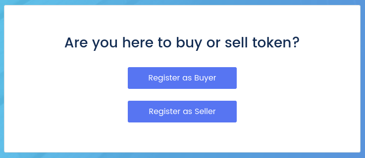
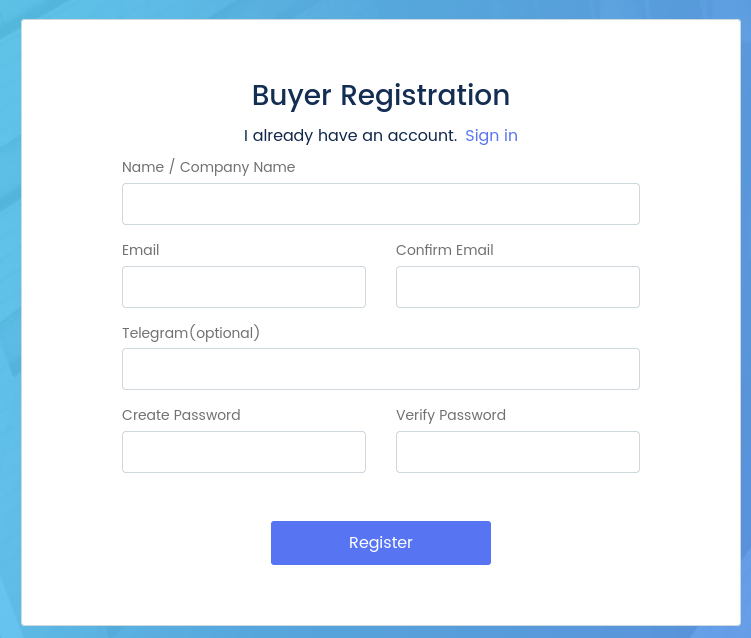
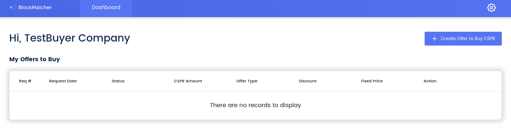
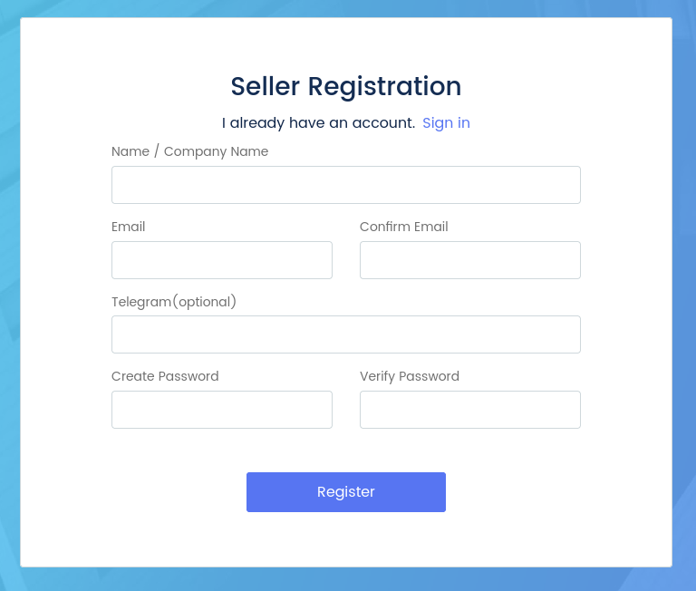
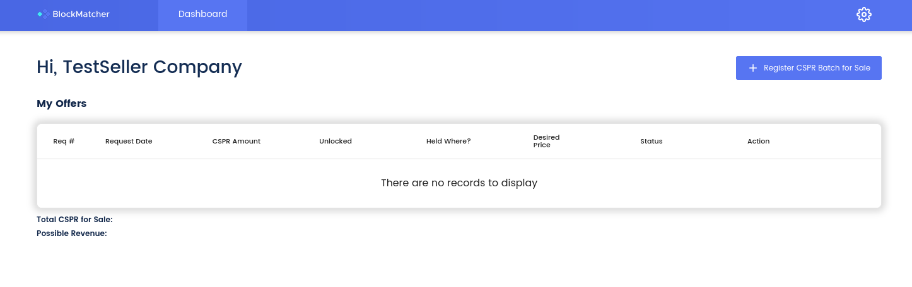
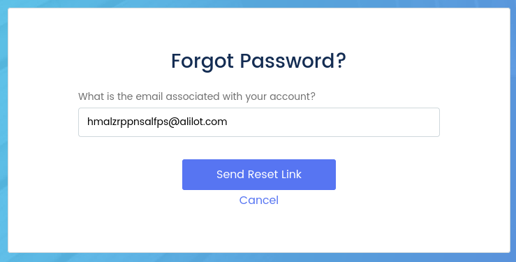

Grant Proposal | [252 - BlockMatcher - Private trade (OTC) platform for compliant brokers](https://portal.devxdao.com/public-proposals/252)
------------ | -------------
Milestone | 1 - Submission 2
Milestone Title | Delivery of Entire Webapp
OP | LedgerLeap
Reviewer | Muhammet Kara

# Milestone Details

The [first review](Review-1.md) of this milestone had FAILED. A second review of the milestone has been requested, after it was asserted by the OP that the FAIL conditions have been addressed in their milestone. This review will, while checking for the entire milestone, especially focus on the previously failed points.

## Details & Acceptance Criteria

**Details of what will be delivered in milestone:**

A complete webapp will be delivered and hosted for demonstration along with the git repo containing all source code. The system will allow registration of buyers and sellers, posting of bids and offers, and an administration environment for batching these orders into transactions. This webapp will be complete (as defined by passing all acceptance criteria tests) and intuitive to use. Using the application, brokers will match deals directly between large audiences of both buyers and sellers, and rely on the system to track the accounting they need for compliance in "batches." For buyers, BlockMatcher will support registrations and submission of purchase requests, allowing potential purchasers to submit bid orders for matching with sellers and manage aspects of the purchase process. For sellers, BlockMatcher will allow submission of offers, including relevant pricing and quantity information. Administrators of the OTC platform will then be able to match sellers and buyer orders in "batches" for compliant manual processing. These batches will be stored for historical accounting and record keeping. The system will provide note adding and other convenience of use features, along with modifiable branding and colors.

**Acceptance criteria:**

Specific system tests will be demonstrated to test the operation of the system:
• Registration of a buyer user.
• Registration of a seller user.
• Login and password recovery tests.
• Placing a selling order (offer).
• Submission of price, lock, and location information.
• Placing a buying order (bid).
• Removing an order.
• Admin viewing of placed order.
• Admin creating of batch to match orders.
• Assignment of batch to both seller and buyer order listings.
• Adding notes to a batch.
• Downloading a CSV.
• Modifying a batch.

**Additional notes regarding submission from OP:**

Enjoy the delivery of BlockMatcher, a system designed for OTC brokers to match buyers and sellers who register their corresponding requests to purchase or sell token.

## Milestone Submission

The following milestone assets/artifacts were submitted for review:

Repository | Revision Reviewed
------------ | -------------
https://github.com/ledgerleapllc/blockmatcher-frontend | 48e32a7
https://github.com/ledgerleapllc/blockmatcher-backend | d6d4363

# Install & Usage Testing Procedure and Findings

Following the instructions in the README files of the frontend and the backend repositories of the project, reviewer was able to successfully build the source code, and make a test deploy for this milestone on the cloud in an `Ubuntu 20.04` environment. It was observed that the install instructions on the README has been improved based on the feedback on the previous review.

Then the promised functionalities for the milestone were tested manually by using `Firefox 95.0 (64-bit)` as the browser:
* During the registration test, it was observed that the registration functionality no longer gives misleading feedback as an improvement after the previous review. The reviewer was able to register and login with two different users as buyer and seller successfully.

* Reviewer was able to recover password for both of the newly registered test users, observing that the password recovery functionality is now fixed since the previous review.

* Reviewer [observed](assets) that the rest of the functionalities were also as expected.

Functionality | Finding
------------ | -------------
Registration of a buyer user | PASS
Registration of a seller user | PASS
Login and password recovery tests | PASS
Placing a selling order (offer) | PASS
Submission of price, lock, and location information | PASS
Placing a buying order (bid) | PASS
Removing an order | PASS
Admin viewing of placed order | PASS
Admin creating of batch to match orders | PASS
Assignment of batch to both seller and buyer order listings | PASS
Adding notes to a batch | PASS
Downloading a CSV | PASS
Modifying a batch | PASS

## Overall Impression of usage testing

On the demo deployment, all of the major functionality is observed to be working properly including the registration and the password recovery functionalities which were broken during the previous review.

Reviewer spotted a small UI bug which lies outside the scope of this review, and reported to the OP, receiving acknowledgement of the bug entering their development workflow as a result. Reviewer then observed that the reported bug was quickly fixed before the completion of this review.

The reviewer has also observed that the project documentation has been improved since the previous review to cover the difficulties mentioned there.

The reviewer would like to thank the OP for taking the suggestions and reports seriously, and acting on them quickly.

Requirement | Finding
------------ | -------------
Project builds without errors | PASS
Documentation provides sufficient installation/execution instructions | PASS
Project functionality meets/exceeds acceptance criteria and operates without error | PASS

# Unit / Automated Testing

Project was containing UI and integration tests on the frontend side, and API tests on the backend side, covering the critical functionality, both for positive and negative paths, during the previous review. In the reviewers opinion, those were sufficient, considering the general structure and the features of the project. However, it was observed that the OP has also added function-level unit [tests](assets/test-run.md) in the traditional sense to the project, following the advice of the reviewer since the previous review.

Requirement | Finding
------------ | -------------
Unit Tests - At least one positive path test | PASS
Unit Tests - At least one negative path test | PASS
Unit Tests - Additional path tests | PASS

# Code Analysis & CI Facilities

It was observed that the OP acted on the advice from the previous review, and added CI and code analysis facilities to the project. The front-end repository now has a CodeQL analyis action for the JavaScript code whereas there is a Laravel test action on the back-end repository which runs on every pull request on the master branch. The reviewer praises the OP for these improvements.

Requirement | Finding
------------ | -------------
Code Analysis | PASS
Continuous Integration | PASS

# Documentation

### Code Documentation

Code documentation is sparse on the frontend side, but sufficient on the backend side. Reviewer [was able to generate the api documentation](assets/docs.zip) by using `phpDocumentor`, and observed that the code-level documentation for the critical functions are sufficient and enough to have a basic understanding of the code-base. Reviewer highly suggests adding proper instructions on the README to generate the api documentation and also to provide an auto-generated version of the documentation, updated on new commits on the `master` branch.

Requirement | Finding
------------ | -------------
Code Documented | PASS with Notes

### Project Documentation

README.md has sufficient general information about the project, along with installation instructions, and the usage documentation. Reviewer has also observed that the installation instructions have improved based on the suggestions from the previous review.

Usage documentation is brief. The reviewer suggests detailing the usage documentation with specific usage scenarios and steps.

Requirement | Finding
------------ | -------------
Usage Documented | PASS with Notes

## Overall Conclusion on Documentation

Based on the reviewer's findings, this review should pass with notes.

# Open Source Practices

## Licenses

The Project is released under the MIT license.

Requirement | Finding
------------ | -------------
OSI-approved open source software license | PASS

## Contribution Policies

Pull requests and Issues are enabled on the repository. The project also has a CONTRIBUTING policy and a security policy.

Requirement | Finding
------------ | -------------
OSS contribution best practices | PASS

# Coding Standards

## Dependencies
Previously, the project had a number of dependencies with high or critical-level security vulnerabilities, which were recommended to be fixed as soon as possible. It was observed that the OP has diligently worked to mitigate the reported issues, and updated the dependencies including the front-end library of the project.

During the review, the reviewer discovered the existence of a new dependency vulnerability, CVE-2022-0155, on the front-end repository, which appears to be published a few days ago, thus could not possibly be anticipated by the OP. The reviewer observed that the OP acted on the new report, and quickly fixed the issue, thus rendering the project free of all dependency vulnerabilities reported on the previous report.

## General Observations

Code is generally well-structured and readable. The project as committed to GitHub and both the automated tests and the manual tests pass.

# Final Conclusion

The project provides the functionalities described in the grant application and milestone acceptance criteria. The reviewer praises the OP for the general stability and the fluid user experience of the app. The reviewer also would like to thank the OP for including the open-source policies, which are very important for the long-term sustainability of any open-source project, in the project's repositories.

Moreover, the reviewer would like to thank and praise the OP for fixing all critical issues reported on the previous review, and also for acting on the non-critical suggestions and recommendations such as adding code analysis and the CI facilities, which are very important for long term success of an open-source project.

The reviewer now sees this submission having a much higher chance of survival as an open-source project while pointing out the minor notes on the documentation improvement possibilities.

Thus, in the reviewer's opinion, this submission should pass with notes.

# Recommendation

Recommendation | PASS with Notes
------------ | -------------

