Grant Proposal | [277 - The multi-currency payment gateway on the CSPR blockchain.](https://portal.devxdao.com/public-proposals/277)
------------ | -------------
Milestone | 1
Milestone Title | Main components of the payment gateway.
OP | Huy Tran
Reviewer | Kien Nguyen <kiennguyen@casperdash.io>

# Milestone Details

## Details & Acceptance Criteria

**Details of what will be delivered in milestone:**

Full version of the Payment gateway including Core, Client website and APIs to integrate with other applications. Integration with Casper signer to pay with CSPR token will be fully implemented.

**Acceptance criteria:**

The Payment gateway can perform the following functions: 
- Transfer cspr between wallets in the network
- Transaction status tracking
- Storing transaction information in the database
- Creating an invoice for payment
- Initializing a payment transaction
- Sending the status of a transaction to merchant via a callback function
- Registration and authorization of merchant
- Entering the necessary merchant information in the system
- API configuration
- Listing of merchant transactions

## Milestone Submission

The following milestone assets/artifacts were submitted for review:

Repository | Revision Reviewed
------------ | -------------
https://github.com/DHFinance/dhf-pay-front | a6f5f22
https://github.com/DHFinance/dhf-pay-back | 90b7d1e
https://github.com/DHFinance/dhf-pay-processor | 23b5e37

# Install & Usage Testing Procedure and Findings

Reviewer was able to successfully get dhf-pay-front, dhf-pay-back, dhf-pay-processor up and running using a single Docker command by following the instructions in the README file at https://github.com/DHFiance/dhf-pay-front.

Reviewer has also successfully built and run projects manually without Docker. However, the project uses the PostgreSQL database and there is no mention or instructions on how to install it. This can cause difficulties for those who want to install projects without Docker. 


1. Transfer CSPR between wallets on the network
   
* The transfer function works well, but the reviewers found some issues on the payment screen that could be improved.
  - Balance and amount values are displayed as motes, but the unit is CSPR, the values need to be converted to CSPR.
  - The Casper Signer extension remembers the website it has connected to. Websites don't have to ask for a connection to Casper Signer every time they want to receive information or sign by Casper Signer.

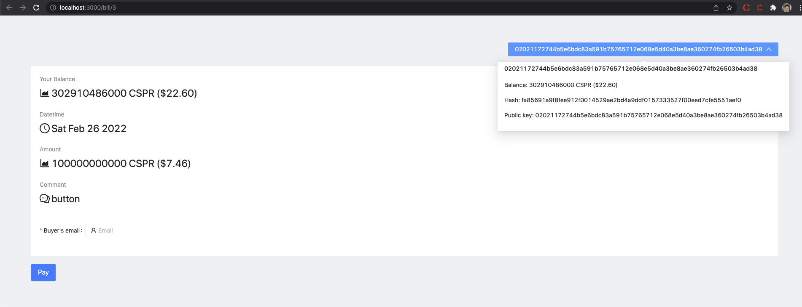
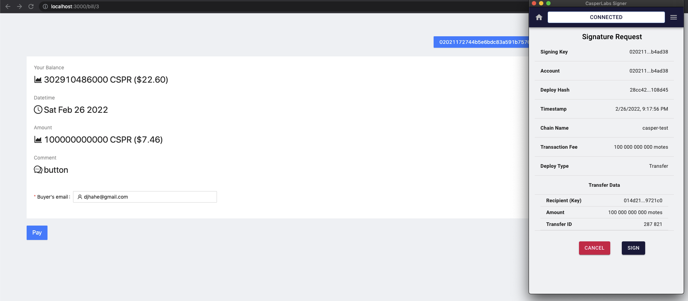


2. Tracking the transaction status

* Reviewer receives status update emails after payment is made.

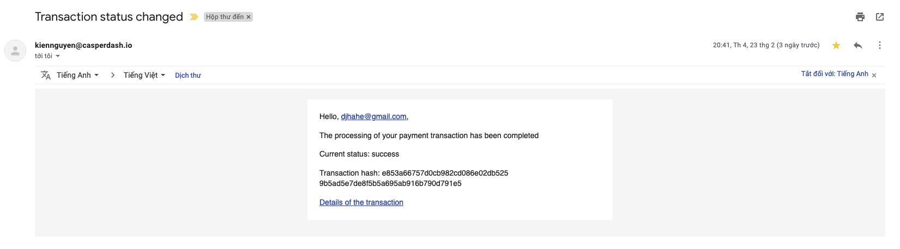
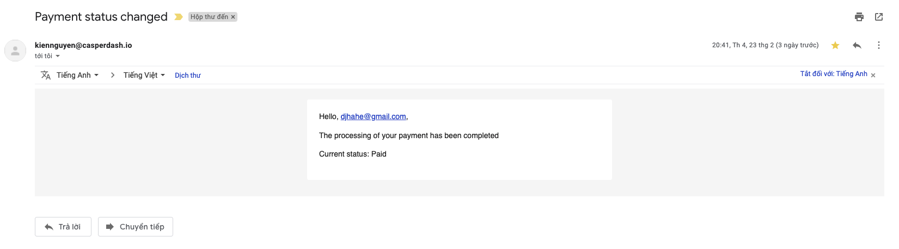

3. Storing transaction information in the database

* All transactions have been successfully saved after payment.

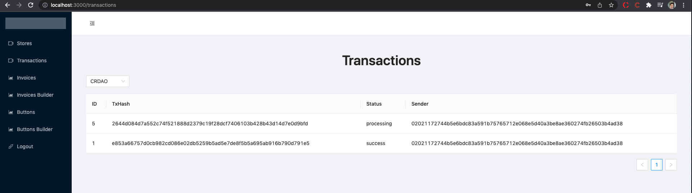

4. Creating an invoice for payment

* On the invoice screen, the amount value should also be converted to CSPR.

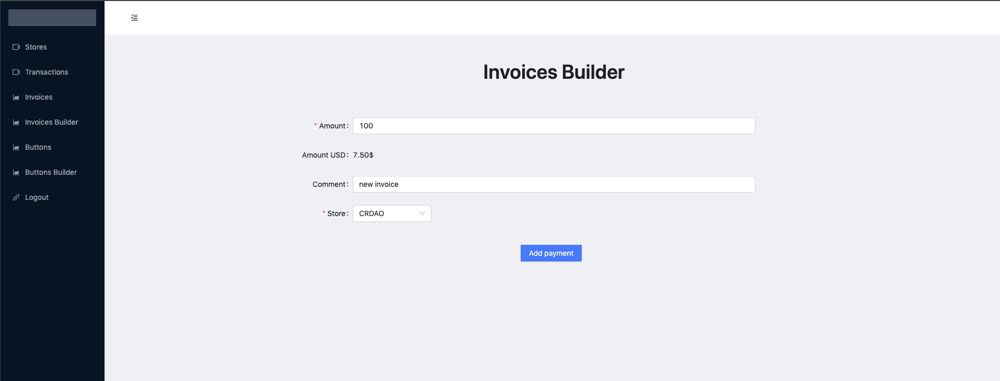

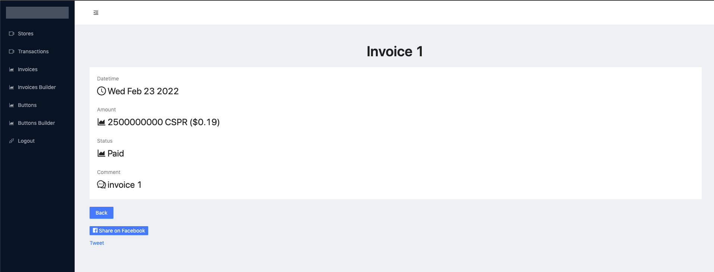

5. Initialization of the payment transaction.


6. Sending the status of a transaction to merchant via the "Callback URL"

* Reviewer sets up a simple API to handle callback. After the payment status becomes "successful", the API can receive payment information from the payment gateway.

7. Registration and authorization of the merchant

* Reviewer can register for the new store and log in successfully, but there is no API error handling on these screens, if reviewer tries to enter the wrong username or password, nothing will happen.
* Reviewer also found that there are no rules for passwords, and passwords can be set to a single character without warnings or errors. This is not required, but it is recommended to improve it to protect user accounts.

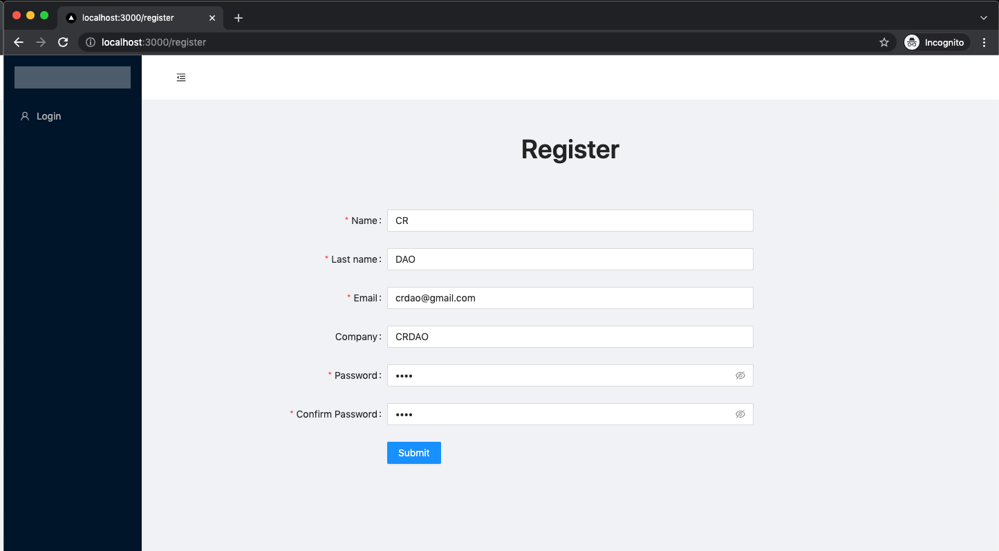
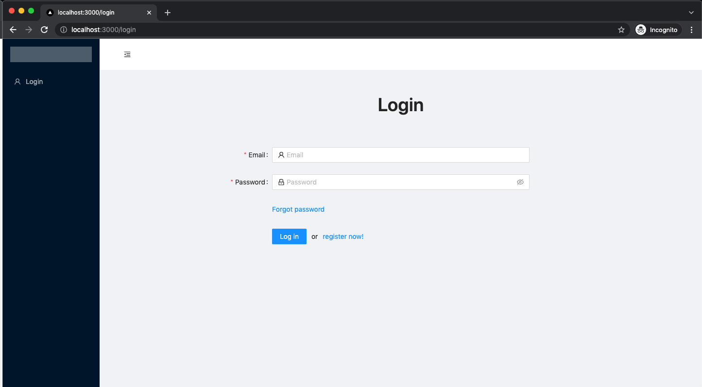
    
8. Entering the necessary merchant information into the system

* Once all required fields have been filled in, the store can be created successfully.

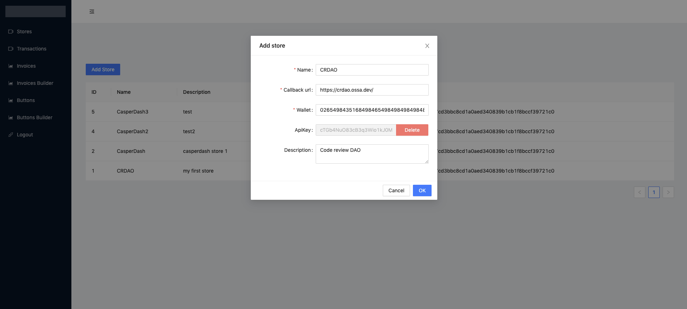
    
9. API Configuration

* Merchant information can be obtained through the APIs using an API token.

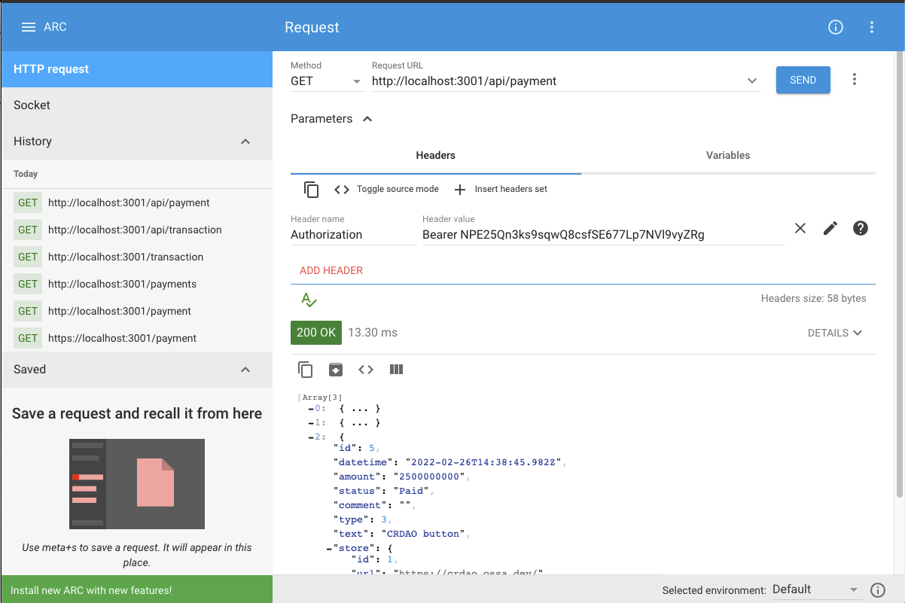


10.  Listing of merchant transactions

* Reviewer can see transaction list and transaction details.


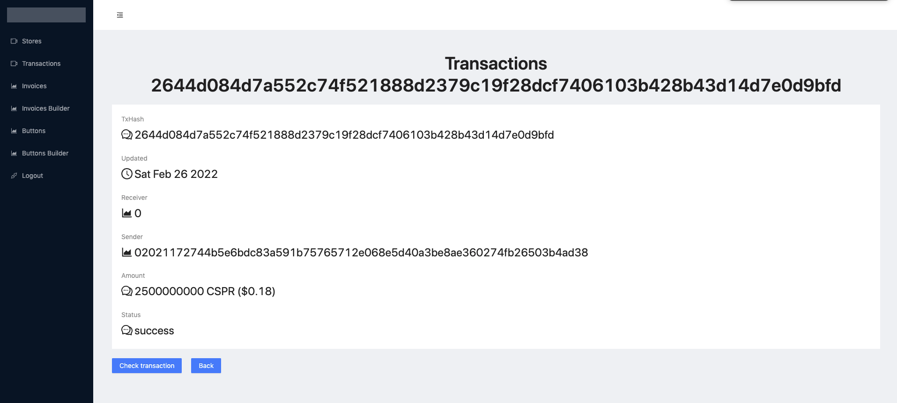
    


Requirement | Finding
------------ | -------------
Project builds and runs without errors | PASS
Documentation provides sufficient installation/execution instructions | PASS with Notes
Project functionality meets/exceeds acceptance criteria and operates without error | PASS with Notes
API Endpoints work without error | PASS 

# Unit / Automated Testing

Reviewer can find unit tests, but reviewer suggests OP to add more tests to increase the coverage.

## dhf-pay-font


```
 $ jest
  

at store/actions/transaction.js:30:122

 PASS  tests/transactions.action.spec.ts
  Transactions actions
    ✓ getTransaction returns data (3 ms)
    ✓ fires GET_TRANSACTION_FAILED on fail (24 ms)

 PASS  tests/auth.action.spec.ts
  Auth actions
    ✓ post login action fires (3 ms)
    ✓ fires POST_LOGIN_FAILED on fail

  

at store/actions/payment.js:32:114

 PASS  tests/payment.action.spec.ts
  Payment actions
    ✓ get all payments (3 ms)
    ✓ fires GET_PAYMENT_FAILED if server not available (5 ms)

Test Suites: 3 passed, 3 total
Tests:       6 passed, 6 total
Snapshots:   0 total
Time:        2.053 s
Ran all test suites.
Done in 2.98s.

```
Requirement | Finding
------------ | -------------
Unit Tests - At least one positive path test | PASS with Notes
Unit Tests - At least one negative path test | PASS with Notes
Unit Tests - Additional path tests | FAIL

## dhf-pay-back
```
$ jest --verbose
 PASS  src/stores/stores.service.spec.ts (6.378 s)
  Store Service
    ✓ should change blocked status (23 ms)
    ✓ should validate unblocked store (29 ms)

 PASS  src/user/user.service.spec.ts
  UserService
    ✓ should created user (177 ms)
    ✓ should get error the same users (72 ms)
    ✓ should get error at verifying user (26 ms)
    ✓ should changed block (82 ms)
    ✓ find user by email (11 ms)

 PASS  src/transaction/transaction.service.spec.ts
  Transaction Service
    ✓ should create a transaction (15 ms)

 PASS  src/payment/payment.service.spec.ts
  Payment Service
    ✓ should create a payment (17 ms)

Test Suites: 4 passed, 4 total
Tests:       9 passed, 9 total
Snapshots:   0 total
Time:        9.965 s
Ran all test suites.

```

Requirement | Finding
------------ | -------------
Unit Tests - At least one positive path test | PASS with Notes
Unit Tests - At least one negative path test | PASS with Notes
Unit Tests - Additional path tests | FAIL

## dhf-pay-processor

```
$ jest --verbose
 PASS  src/payment/payment.service.spec.ts (10.325 s)
  PaymentService
    ✓ should create payment  (23 ms)
    ✓ should get error for invalid apikey  (16 ms)
    ✓ should update a payment (2601 ms)
    ✓ should get an exception if wrong connection (2253 ms)

 PASS  src/transaction/transaction.service.spec.ts
  Transaction Service
    ✓ should update a transaction (28 ms)
    ✓ don`t change data if got an exception (11 ms)

 PASS  src/stores/stores.service.spec.ts
  Stores Service
    ✓ find store by Api Key (15 ms)
    ✓ should throw an exception if invalide Api Key (7 ms)

 PASS  src/user/user.service.spec.ts
  UserService
    ✓ should created user (13 ms)
    ✓ should get error the same users (16 ms)
    ✓ should get error at verifying user (3 ms)
    ✓ find user by email (2 ms)

Test Suites: 4 passed, 4 total
Tests:       12 passed, 12 total
Snapshots:   0 total
Time:        13.228 s
Ran all test suites.


```

Requirement | Finding
------------ | -------------
Unit Tests - At least one positive path test | PASS with Notes
Unit Tests - At least one negative path test | PASS with Notes
Unit Tests - Additional path tests | FAIL

# Documentation


### Code Documentation

Reviewer found that all key functions of the project have low-level code documentation that can be used to automatically generate documentation. 

Requirement | Finding
------------ | -------------
Low level function documentation | PASS

### Project Documentation

The README file provides minimum but sufficient documentation on how to install and run the project, build a docker image.


Requirement | Finding
------------ | -------------
Sufficient Project Documentation | PASS

### API Documentation

Swagger API doc could be found at http://localhost:3001/api/swagger/


Requirement | Finding
------------ | -------------
API documentation | PASS


# Open Source Practices

## Licenses

Each of the projects is released under the Apache 2.0 License

Requirement | Finding
------------ | -------------
OSI-approved open source software license | PASS

## Contribution Policies

Each of the projects has CONTRIBUTING policy as well as a CODE OF CONDUCT for contributors. Issues and Pull Requests are enabled
for each project.

Requirement | Finding
------------ | -------------
OSS contribution best practices | PASS

# Coding Standards

## General Observations

In general, the code is well-structured and readable. Some issues that were observed:

- Reviewer found serious issues with logs, some logs contained sensitive information, such as user's password, API token. These logs can be exploited and put users at high risk when using the system. Reviewer informed the OP and OP quickly resolved the issue.

https://github.com/DHFinance/dhf-pay-back/blob/master/src/auth/auth.controller.ts#L30
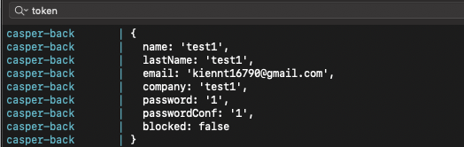
- Unused environment configuration, in dhf-pay-back, reviewer expects the password to be hashed with `SECRET_HASH`, but only hashes the password with a salt.

https://github.com/DHFinance/dhf-pay-back/blob/master/.env.sample#L9
https://github.com/DHFinance/dhf-pay-processor/blob/main/src/auth/auth.service.ts#L9
- Code duplication between dhf-pay-back and dhf-pay-processor, as noted by documentations and reviewer observed, dhf-pay-back is used as API and dhf-pay-processor is used as background processor, but reviewer states that dhf -pay-processor also has some public API controllers cloned from dhf-pay-back. OP should clean up the code.

https://github.com/DHFinance/dhf-pay-processor/blob/main/src/auth/auth.controller.ts
- Lack of test coverage.
# Final Conclusion

OP provided the project at https://dhfi.online/service.html, and very detailed guide on how to use the site. Reviewer can verify acceptance criteria effortlessly.OP also follows the review process closly and quick fix the major issue.

Reviewer sees that there is a security audit milestone and the code quality and unit test can be improved at the next submission.

Since the project met all acceptance criteria, reviewer considered this a **PASS** milestone submission with notes.

# Recommendation

Recommendation | PASS with Notes
------------ | -------------

Based on the shortcomings identified above, this project should **PASS with Notes** code review.


