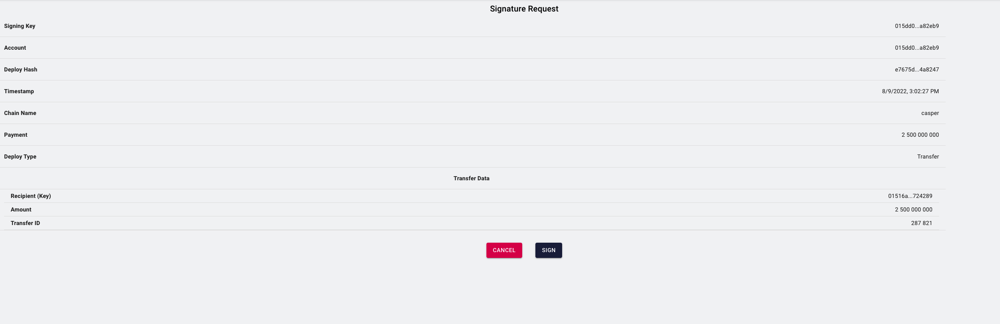

Grant Proposal | [277 - The multi-currency payment gateway on the CSPR blockchain](https://portal.devxdao.com/public-proposals/277)
------------ | -------------
Milestone | 2
Milestone Title | Integration with Bitrix24 platform - Submission 1
OP | Huy Tran <tqhuy2018@gmail.com>
Reviewer | Muharrem Salel <muharremsalel@gmail.com>

# Milestone Details

## Details & Acceptance Criteria

**Details of what will be delivered in milestone:**

- Integration between the payment gateway and Bitrix24
- Use case: Enterprises using Bitrix24 can send invoices via email to customers with a link to make payment via the payment gateway. After receiving the invoice, customers follow the link and click on the CSPR icon on the invoice, then they are automatically transferred to the payment gateway. Customers only need to sign the confirmation to transfer funds on Casper Signer. Payment status will be updated in Bitrix24.

**Acceptance criteria:**

- Integration between the payment gateway and Bitrix24
- Use case: Enterprises using Bitrix24 can send invoices via email to customers with a link to make payment via the payment gateway. After receiving the invoice, customers follow the link and click on the CSPR icon on the invoice, then they are automatically transferred to the payment gateway. Customers only need to sign the confirmation to transfer funds on Casper Signer. Payment status will be updated in Bitrix24.

**Additional notes regarding submission from OP:**

- Integration between the payment gateway and Bitrix24
- Use case:  
Enterprises using Bitrix24 can send invoices via email to customers with a link to make payment via the payment gateway. 
After receiving the invoice, customers follow the link and click on the CSPR icon on the invoice, 
then they are automatically transferred to the payment gateway. Customers only need to sign the confirmation to transfer funds on Casper Signer. 
Payment status will be updated in Bitrix24.

## Milestone Submission

The following milestone assets/artifacts were submitted for review:

Repository | Revision Reviewed
------------ | -------------
https://github.com/DHFinance/dhf-pay-bitrix | c0b75bc

# Install & Usage Testing Procedure and Findings

Instructions at the README.md file in the repository(https://github.com/DHFinance/dhf-pay-bitrix) explain a clear path for users, following instructions step by step helps the user to run and test the codebase. Also, video support for this milestone which also included in the repository, which is a useful touch for users aiming to use this project.

## Overall Impression of usage testing

The project builds without errors, the documentation provides sufficient installation and execution instructions, and the project functionality meets the acceptance criteria and operates without errors.

Requirement | Finding
------------ | -------------
The project builds without errors | PASS
Documentation provides sufficient installation/execution instructions | PASS
Project functionality meets/exceeds acceptance criteria and operates without error | PASS

# Unit / Automated Testing

The reviewer has observed that all tests run successfully without errors. Feature and installation were also tested over the system. 

[End 2 End Test](assets/End2EndTest.md)

Requirement | Finding
------------ | -------------
Unit Tests - At least one positive path test | PASS
Unit Tests - At least one negative path test | PASS
Unit Tests - Additional path tests | PASS

# Documentation

### Code Documentation

The code documentation is sufficient for the project.

Requirement | Finding
------------ | -------------
Code Documented | PASS

### Project Documentation

The project documentation is a sufficient and visual support for usage is also helpful.

Requirement | Finding
------------ | -------------
Usage Documented | PASS
Example Documented | PASS

## Overall Conclusion on Documentation

In the reviewer's opinion, the project usage and code-level documentation are sufficient. 

# Open Source Practices

## Licenses

All of the SDKs are released under Apache License 2.0 as stated in the grant.

Requirement | Finding
------------ | -------------
OSI-approved open source software license | PASS

## Contribution Policies

The project contains a CONTRIBUTING and SECURITY policy. Pull requests and Issues are enabled.

Requirement | Finding
------------ | -------------
OSS contribution best practices | PASS

# Coding Standards

## General Observations

Code is generally well-structured and very readable. The project is committed to GitHub and both the unit tests and the manual tests pass.

# Final Conclusion

The project provides the functionality described in the grant application and milestone acceptance criteria. 

Thus, in the reviewer's opinion, this submission should pass.
# Recommendation

Recommendation | PASS
------------ | -------------
