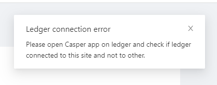
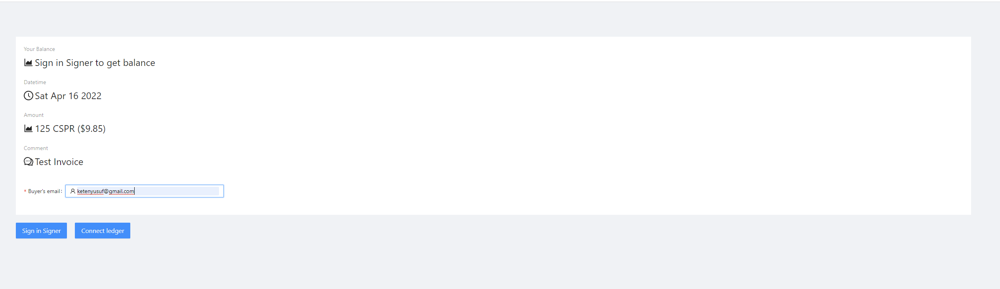
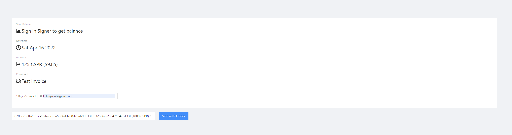
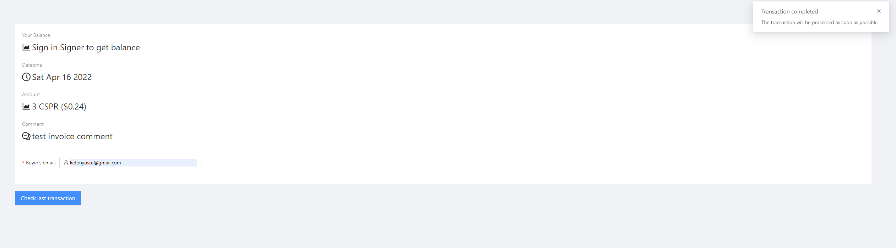

Grant Proposal | [277 - The multi-currency payment gateway on the CSPR blockchain](https://portal.devxdao.com/public-proposals/277)
------------ | -------------
Milestone | 4
Milestone Title | Integration with Ledger - Submission 1
OP | Huy Tran <tqhuy2018@gmail.com>
Reviewer | Yusuf Keten <ketenyusuf@gmail.com>

# Milestone Details
The review will cover the 4th milestone criteria set forth below.

## Details & Acceptance Criteria

**Details of what will be delivered in milestone:**

Add the ability to use Ledger for transfer operations.

**Acceptance criteria:**

Users should be able to use Ledger for transfer operations.

**Additional notes regarding submission from OP:**

Users should be able to use Ledger for transfer operations.

## Milestone Submission

The following milestone assets/artifacts were submitted for review:

Repository | Revision Reviewed
------------ | -------------
https://github.com/DHFinance/dhf-pay-front | [6cc9d2a](https://github.com/DHFinance/dhf-pay-front/commit/6cc9d2a3e03073be7e796e3beef8ce49c3c4e647)
https://github.com/DHFinance/dhf-pay-back | [bbc84d6](https://github.com/DHFinance/dhf-pay-back/commit/bbc84d6c2a43cbbc3803efdefeb127e6c653a0e9)
https://github.com/DHFinance/dhf-pay-processor | [8a11b57](https://github.com/DHFinance/dhf-pay-processor/commit/8a11b57b59f56b1b0feb2bc2d740d1b1b3323c27)

# Install & Usage Testing Procedure and Findings

Following the instructions in the README file of the repository(https://github.com/DHFiance/dhf-pay-front), the reviewer was able to successfully build the application using a single Docker command(docker-compose up).

[Docker Compose Logs](assets/docker.md)

After setting up the environment, the reviewer was able to successfully run the application. The test device was a Ledger Nano S and the application was able to successfully transfer funds from one account to another on Casper Mainnet.

[Transfer Link](https://cspr.live/deploy/8057206535f4e4372b0b43b239518126aeac4bd5d292f8c4f0cdfb47363d3394)

## Overall Impression of usage testing

The project builds without errors, the documentation provides sufficient installation and execution instructions, and the project functionality meets the acceptance criteria and operates without errors.

Requirement | Finding
------------ | -------------
Project builds without errors | PASS
Documentation provides sufficient installation/execution instructions | PASS
Project functionality meets/exceeds acceptance criteria and operates without error | PASS

# Unit / Automated Testing

The project has unit tests for most of the critical classes and methods. There is no specific test for the integration with Ledger. The OP is highly encouraged to increase the coverage of the unit tests. However, the integration with Ledger is tested by the reviewer manually. 

Requirement | Finding
------------ | -------------
Unit Tests - At least one positive path test | PASS with Notes
Unit Tests - At least one negative path test | PASS with Notes
Unit Tests - Additional path tests | PASS with Notes

# Documentation

### Code Documentation

A sufficient amount of low-level documentation exists on the project via properly formatted inline comments on the critical classes and the methods.

Requirement | Finding
------------ | -------------
Code Documented | PASS

### Project Documentation

The project has sufficient documentation on how to install, run, and test the project. The README file has Docker instructions. Also, the project has detailed [documentation on how to use the project.](https://github.com/DHFinance/dhf-pay-front/blob/main/UserGuide.pdf)

Requirement | Finding
------------ | -------------
Usage Documented | PASS
Example Documented | PASS

## Overall Conclusion on Documentation

In the reviewer's opinion, the project and usage documentation are sufficient. 

# Open Source Practices

## Licenses

The Project is released under the Apache License 2.0.

Requirement | Finding
------------ | -------------
OSI-approved open source software license | PASS

## Contribution Policies

Pull requests and Issues are enabled on the repository, and the project contains a CONTRIBUTING and a SECURITY policy.

Requirement | Finding
------------ | -------------
OSS contribution best practices | PASS

# Coding Standards

## General Observations

Code is generally well-structured and very readable. The project has been committed to GitHub and both the unit tests and the manual tests pass.

# Final Conclusion

The project provides the functionality described in the grant application and milestone acceptance criteria. However, the OP is highly encouraged to increase the coverage of the unit tests. The reviewer also suggests that the OP should test the project manually and ensure that the project works with the Ledger during the development phase.

Thus, in the reviewer's opinion, this submission should pass with notes.

# Recommendation

Recommendation | PASS with Notes
------------ | -------------
