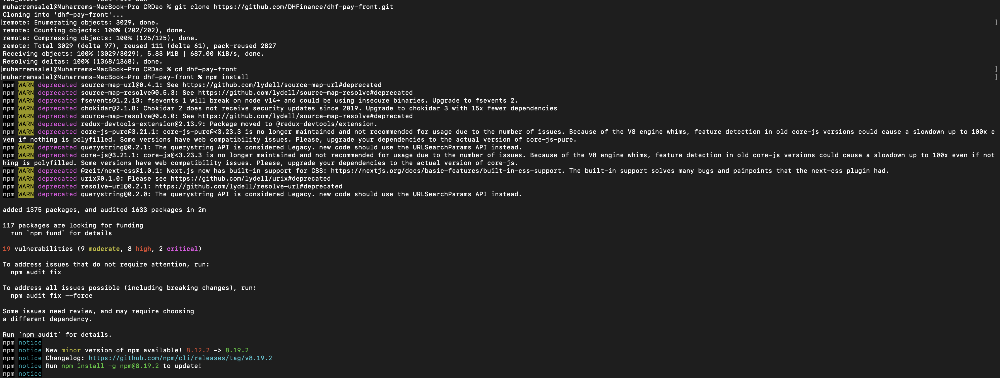
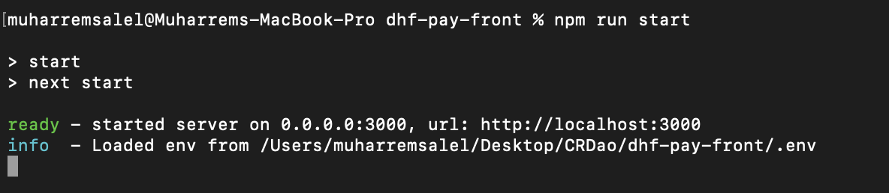
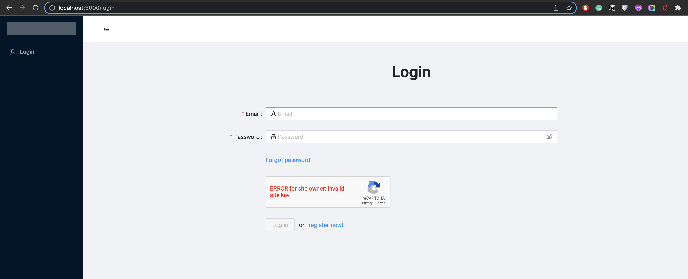
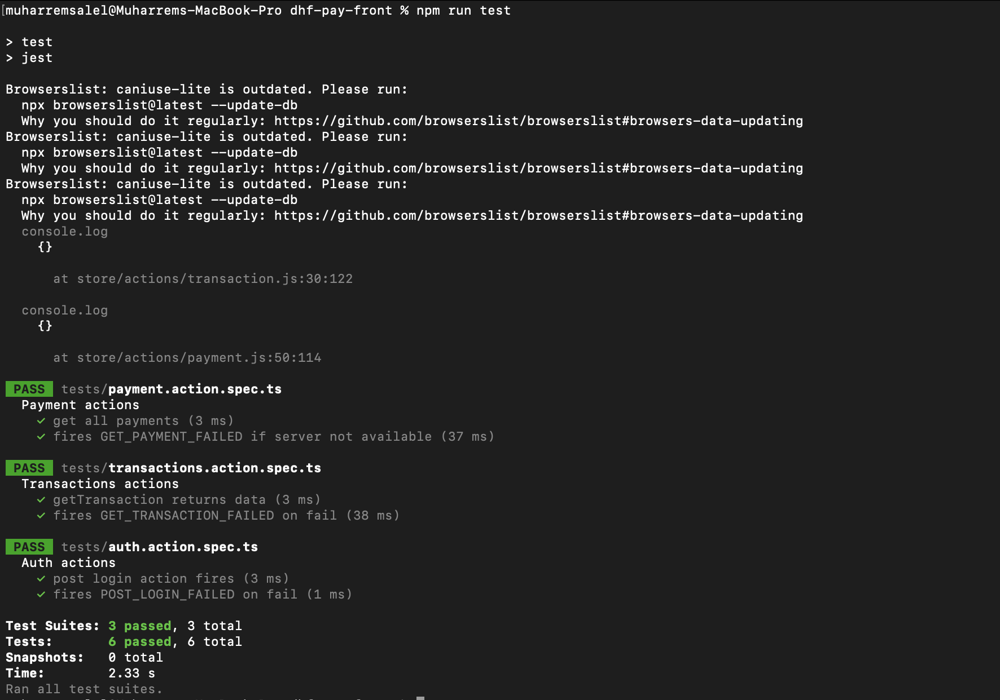

Grant Proposal | [277 - The multi-currency payment gateway on the CSPR blockchain](https://portal.devxdao.com/public-proposals/277)
------------ | -------------
Milestone | 5
Milestone Title | Audit - Submission 1
OP | Huy Tran <tqhuy2018@gmail.com>
Reviewer | Muharrem Salel <muharremsalel@gmail.com>

# Milestone Details

## Details & Acceptance Criteria

**Details of what will be delivered in milestone:**

- We have a full security review from a security review partner and fixes committed to the code base.

**Acceptance criteria:**

- We have a full security review from a security review partner and fixes committed to the code base.

**Additional notes regarding submission from OP:**

- We have a full security review from a security review partner and fixes committed to the code base.

## Milestone Submission

The following milestone assets/artifacts were submitted for review:

Repository | Revision Reviewed
------------ | -------------
https://github.com/DHFinance/dhf-pay-front | ceca00f

# Install & Usage Testing Procedure and Findings

Instructions at the README.md file in the repository(https://github.com/DHFinance/dhf-pay-front) explain a clear path for users, following instructions step by step helps the user to run and test the codebase. However, the reviewer also investigated the findings of the security audit and how they were solved. These solutions exist in the codebase and all codebase is easy to use.

## Overall Impression of usage testing

The project builds without errors, the documentation provides sufficient installation and execution instructions, and the project functionality meets the acceptance criteria and operates without errors.

Requirement | Finding
------------ | -------------
The project builds without errors | PASS
Documentation provides sufficient installation/execution instructions | PASS
Project functionality meets/exceeds acceptance criteria and operates without error | PASS

# Unit / Automated Testing

The reviewer has observed that all tests run successfully without errors. Feature and installation were also tested over the system. 

[npm run build](assets/npm_run_build.md)

Requirement | Finding
------------ | -------------
Unit Tests - At least one positive path test | PASS
Unit Tests - At least one negative path test | PASS
Unit Tests - Additional path tests | PASS

# Documentation

### Code Documentation

The code documentation is sufficient for the project.

Requirement | Finding
------------ | -------------
Code Documented | PASS

### Project Documentation

The project documentation is sufficient and security audit documentation exists. 

Requirement | Finding
------------ | -------------
Usage Documented | PASS
Example Documented | PASS

## Overall Conclusion on Documentation

In the reviewer's opinion, the project usage and code-level documentation are sufficient. 

# Open Source Practices

## Licenses

All of the SDKs are released under Apache License 2.0 as stated in the grant.

Requirement | Finding
------------ | -------------
OSI-approved open source software license | PASS

## Contribution Policies

The project contains a CONTRIBUTING and SECURITY policy. Pull requests and Issues are enabled.

Requirement | Finding
------------ | -------------
OSS contribution best practices | PASS

# Coding Standards

## General Observations

The code is generally well-structured and very readable. The project is committed to GitHub and both the unit tests and the manual tests pass.

# Final Conclusion

The project provides the functionality described in the grant application and milestone acceptance criteria. 

Thus, in the reviewer's opinion, this submission should pass.
# Recommendation

Recommendation | PASS
------------ | -------------
