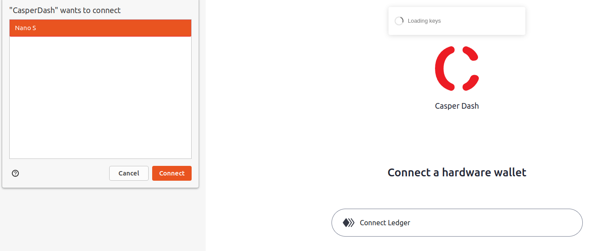
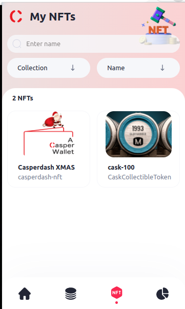
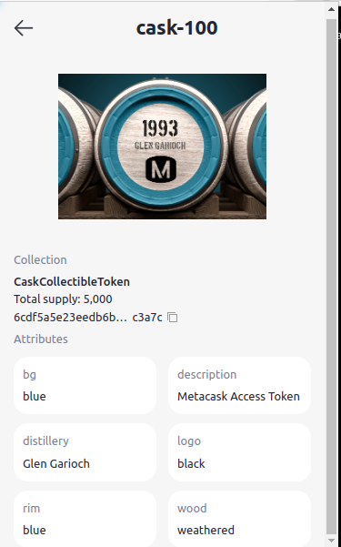
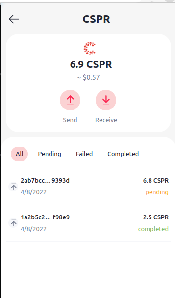

Grant Proposal | [286-2 casperdash.io wallet ( web, extension, mobile app )](https://portal.devxdao.com/app/proposal/286)
------------ | -------------
Milestone | 2
Milestone Title | Web extension wallet - Submission 2
OP | Kien Nguyen
Reviewer | Yusuf Keten

# Milestone Details
The review will cover the 2nd milestone criteria set forth below.

## Details & Acceptance Criteria

**Details of what will be delivered in milestone:**

Web extension
   
**Acceptance criteria:**

We will release a stable version working on mainnet and the extension will be available in chrome marketplace.

- Dashboard ( View CRPR balance, send/receive CRPR )
- Tokens (ERC20)
- History
- NFTs
- Stacking
- Integrate with Ledger

## Milestone Submission

The following milestone assets/artifacts were submitted for review:

Repository | Revision Reviewed
------------ | -------------
https://github.com/CasperDash/casperdash-client/tree/master | e92f618

# Install & Usage Testing Procedure and Findings

Following the instructions in the README file of repository, the reviewer was able to successfully build the source code on Ubuntu 20.04.

[Build Logs](assets/build-run.md)

## Overall Impression of usage testing

The project builds without errors, the documentation provides sufficient installation and execution instructions, and the project functionality meets the acceptance criteria and operates without errors.

Requirement | Finding
------------ | -------------
Documentation provides sufficient installation/execution instructions | PASS
Project builds without errors | PASS
Project functionality meets/exceeds acceptance criteria and operates without error | PASS

# Unit / Automated Testing

The project has unit tests for all critical classes and methods. There are 454 tests in total. The reviewer was able to run all tests successfully.

[Test Logs](assets/test-run.md)

Requirement | Finding
------------ | -------------
Unit Tests - At least one positive path test | PASS
Unit Tests - At least one negative path test | PASS
Unit Tests - Additional path tests | PASS

# Documentation

### Code Documentation

The project has sufficient code-level documentation with summaries and comments, especially on critical classes and methods.

Requirement | Finding
------------ | -------------
Code Documented | Pass 

### Project Documentation

The reviewer observed that the project README has detailed general and usage documentation. The project README includes an architecture section that describes the project architecture and the project's components.

Requirement | Finding
------------ | -------------
Usage Documented | PASS 
Example Documented | PASS

## Overall Conclusion on Documentation

The project is well  documented and the reviewer has observed that the project README has detailed general, roadmap, and usage documentation. Also, the project has external documentation on https://hackmd.io/@casperdash/r1wtIVYVt .

# Open Source Practices

## Licenses

The Project is released under the MIT License.

Requirement | Finding
------------ | -------------
OSI-approved open source software license | PASS

## Contribution Policies

Pull requests and Issues are enabled. The project contains a CONTRIBUTING and SECURITY policy. 

Requirement | Finding
------------ | -------------
OSS contribution best practices | PASS

# Coding Standards

## General Observations

Code is generally well-structured and readable. The project as committed to GitHub and both the unit tests and the manual tests pass.

# Final Conclusion

The project provides the functionality described in the grant application and milestone acceptance criteria.

Thus, in the reviewer's opinion, this submission should pass.

# Recommendation

Recommendation | PASS
------------ | -------------
