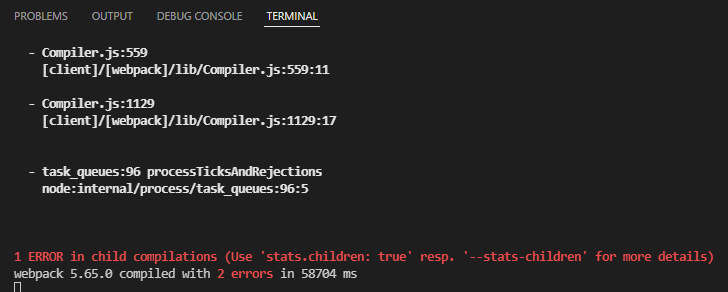
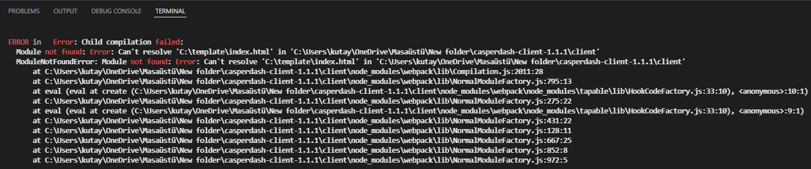
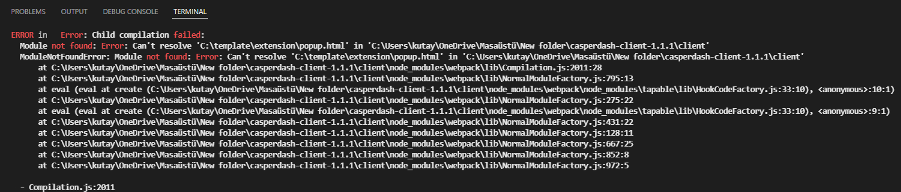
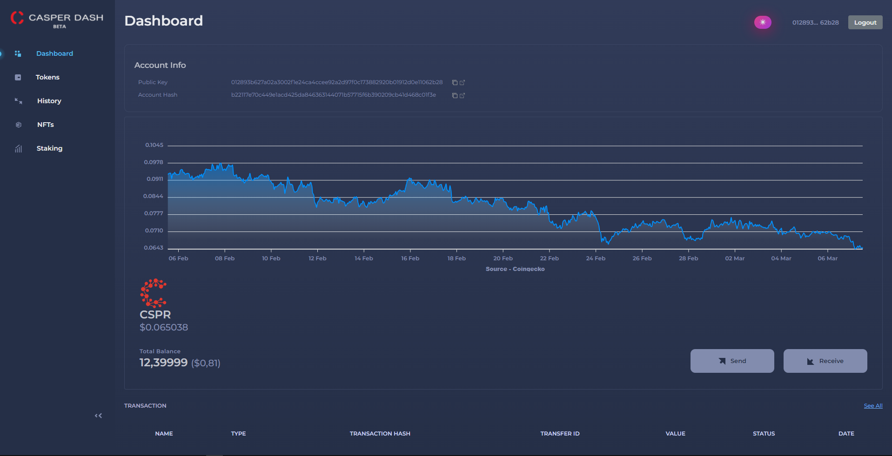
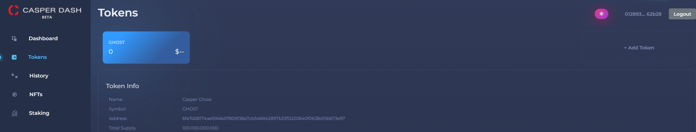
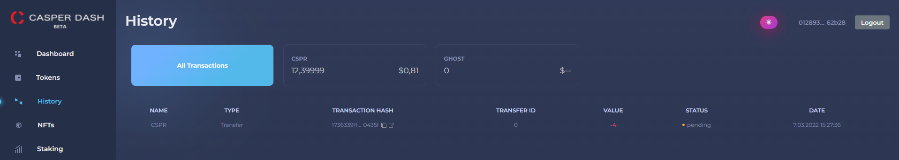
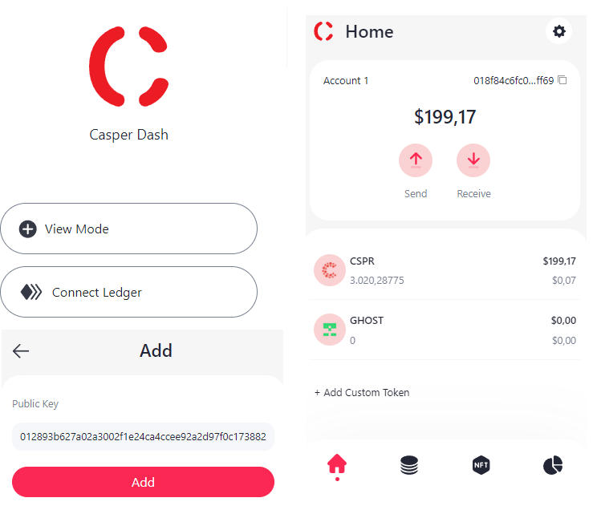

Grant Proposal | [286-2 casperdash.io wallet ( web, extension, mobile app )](https://portal.devxdao.com/app/proposal/286)
------------ | -------------
Milestone | 2
Milestone Title | Web extension wallet - Submission 1
OP | Kien Nguyen
Reviewer | Kutay Karademir <eee.kutay@gmail.com>
# Milestone Details

## Details & Acceptance Criteria

**Details of what will be delivered in milestone:**

- Control of Integration with Ledger
- Control of Dashboard
  - View CSPR balance
  - Send/Receive CRPR
- Control of Tokens
  - View token info/balance
  - Send/Receive tokens
  - Add custom token by contract hash
- Control of History
- Control of Stacking  
- Control of NFT 
   
**Acceptance criteria:**

- Release a stable version working on mainnet and the extension will be available in chrome marketplace.

## Milestone Submission

The following milestone assets/artifacts were submitted for review:

Repository | Revision Reviewed
------------ | -------------
https://github.com/CasperDash/casperdash-client/releases/tag/1.1.1 | 7bd87d5

# Install & Usage Testing Procedure and Findings

Reviewer was able to build and run the project by using the instructions given on the README of the project, after needed parameters entering to the .env file as per the instructions for the api project.
```
[nodemon] starting `node server.js`
secp256k1 unavailable, reverting to browser version
RESTful API server started on: 3001
testnet
```
The reviewer got the following error while following the instructions in the readme file in project Client (I.Web), but the reviewer was able to run the project by making the following changes in the 'webConfig.js' file.




webConfig.js additions and changes :
```
//template: path.resolve(dir, '/template/index.html'),
template: path.resolve(dir, 'template/index.html'),
```
```
//Added.
	stats:{children:true}
```
After the changes :

```
  Child HtmlWebpackCompiler compiled successfully
webpack 5.65.0 compiled successfully in 42517 ms
```

The reviewer got the following error while following the instructions in the readme file in project Client (II.Browser Extension), but the reviewer was able to run the project by making the following changes in the 'extensionConfig.js' file.



extensionConfig.js additions and changes :
```

//template: path.resolve(dir, '/template/extension/popup.html'),
//filename: 'popup.html'

//template: path.resolve(dir, '/template/extension/popup.html'),
//filename: 'home.html'

template: path.resolve(dir, 'template/extension/popup.html'),
filename: 'popup.html'
			
template: path.resolve(dir, 'template/extension/popup.html'),
filename: 'home.html'
			
```
```
//Added.
	stats:{children:true}
```
After the changes :

```
  Child HtmlWebpackCompiler compiled successfully
webpack 5.65.0 compiled successfully in 44928 ms
```


Following the instructions in the README of https://github.com/CasperDash/casperdash-client/releases/tag/1.1.1 and https://github.com/CasperDash/casperdash-api, The reviewer successfully compiled the api project. But the client project could not be compiled, an error was received. After the changes in the "webConfig.js" and "extensionConfig.js" files, both projects were made to work without any problems.


Pages on the website are working properly :





CasperDash extension working properly :



## Overall Impression of usage testing
The reviewer was unable to build and run the project following the instructions provided due to errors in the webConfig.js and extensionConfig.js But besides this error the documentation also provides adequate installation/execution instructions for different scenarios. The reviewer thinks that the project functionality will meet the acceptance criteria once the bugs are fixed.

Requirement | Finding
------------ | -------------
Project builds without errors | FAIL
Project functionality meets/exceeds acceptance criteria and operates without error | FAIL
Documentation provides sufficient installation/execution instructions | PASS


Requirement | Finding
------------ | -------------
Ledger integration test | PASS

Requirement |  Finding
------------ | ------------- 
View CSPR balance |  PASS
Send/Receive CRPR |  PASS
Control to View token info/balance | PASS
Control to Send/Receive tokens | PASS
Add custom token by contract hash | PASS
View NFTs | PASS
View transfer transactions history |  PASS
Stacking Operations | PASS

# Unit / Automated Testing

Unit testing was not reviewed due to the FAIL conditions outlines above.

Requirement | Finding
------------ | -------------
Unit Tests - At least one positive path test | to be tested in a future submission
Unit Tests - At least one negative path test | to be tested in a future submission
Unit Tests - Additional path tests | to be tested in a future submission

# Documentation

### Code Documentation
The reviewer says that all critical functions of the project have code documents that can be used for automated document generation.

Requirement | Finding
------------ | -------------
Code Documented | Pass 

### Project Documentation

The reviewer observed that the project README has detailed general and usage documentation.
Observes that the project has good project documentation.

All versions of the installations are specified properly, after the necessary installations are made in the required version and if the changes in the config files are provided, it can make the project work.

Requirement | Finding
------------ | -------------
Usage Documented | PASS 

## Overall Conclusion on Documentation

The reviewer concludes that the project has sufficient comprehensive general documentation.

# Open Source Practices

## Licenses

The Project is released under the MIT License.

Requirement | Finding
------------ | -------------
OSI-approved open source software license | PASS

## Contribution Policies

The project contains a CONTRIBUTION policy.

Requirement | Finding
------------ | -------------
OSS contribution best practices | PASS

# Coding Standards

## General Observations

The coding is well structured and readable. Github site setup is easy and successful.

# Final Conclusion
Web pages works flawlessly.

The code and project documentation and process are well explained.

Errors were encountered while compiling the projects, they could not be compiled with the instructions in the readme file, and the compilation was completed successfully after the changes were made.

In Milestone 1,
The Contribution Policies file could not be found. In Milestone 2, the problem was seen and the Contribution Policies file was included in the project.

The reviewer thinks that after the deficiencies in the project are corrected, the project will be pass.

# Recommendation

Recommendation | FAIL
------------ | -------------
