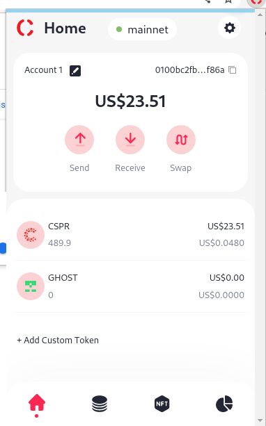
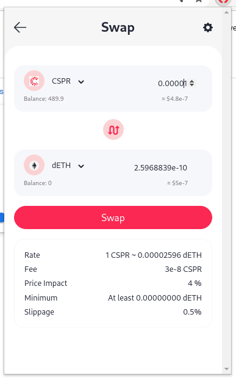
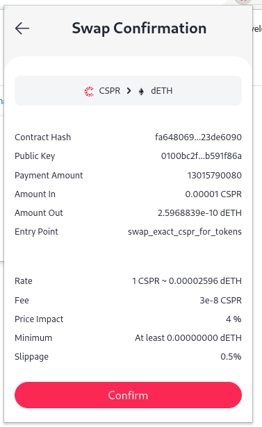
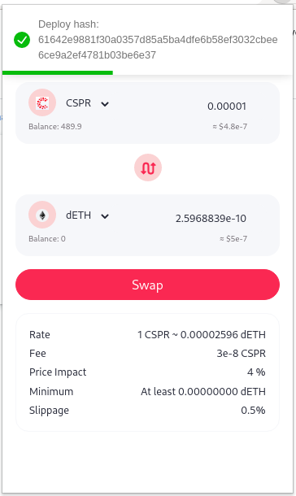
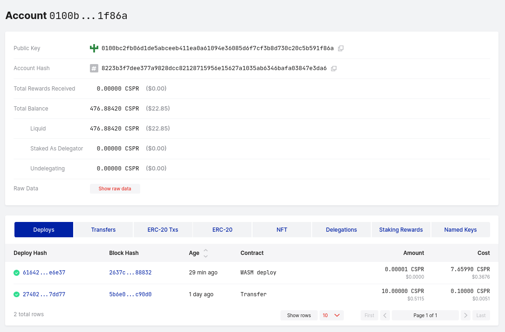
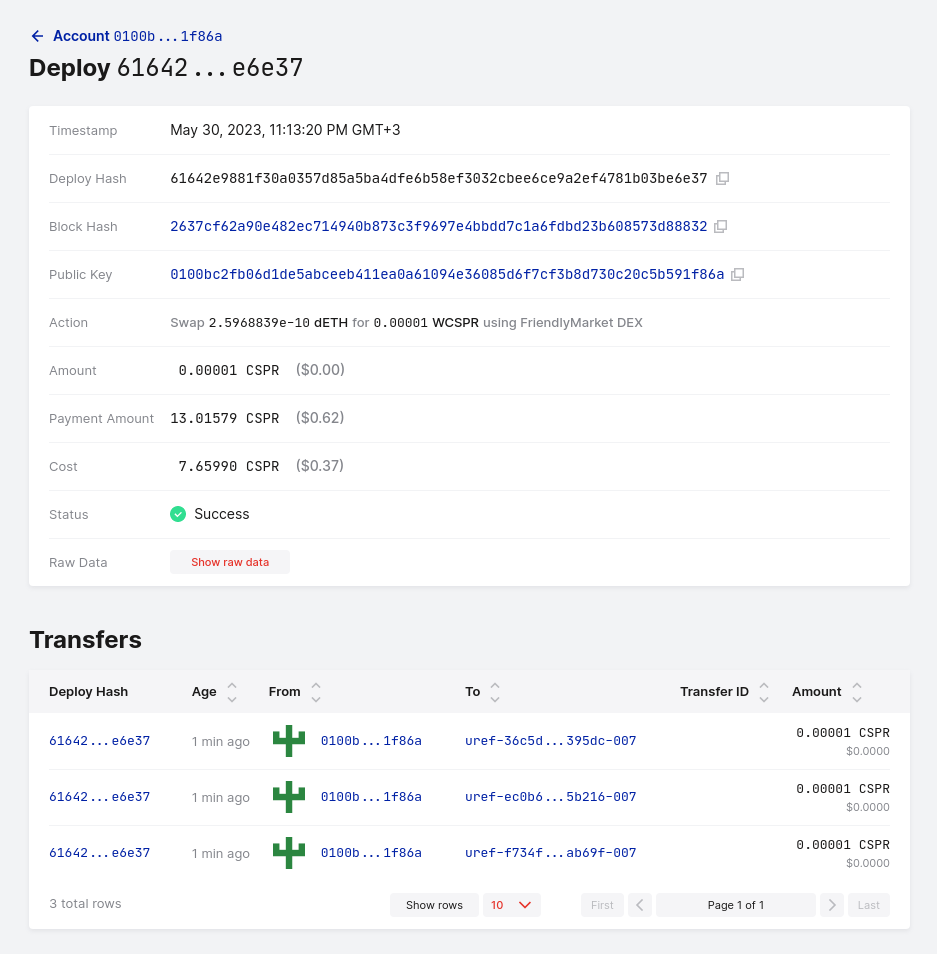
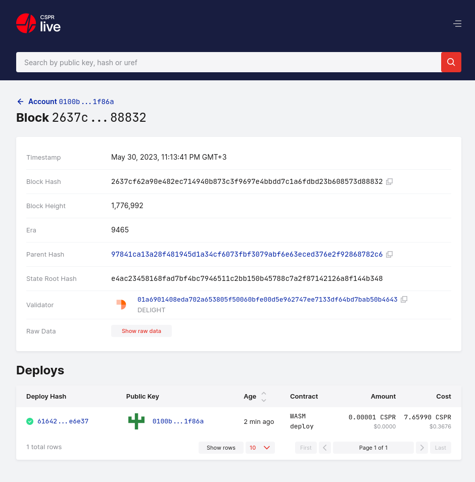

Grant Proposal | [286 - casperdash.io wallet ( web, extension, mobile app )](https://portal.devxdao.com/public-proposals/286)
------------ | -------------
Milestone | 5
Milestone Title | Swapping, Liquidity pools
OP | djhahe
Reviewer | Ömer ÇAKMAK <farukomercakmak@gmail.com>

# Milestone Details

## Details & Acceptance Criteria

**Details of what will be delivered in milestone:**

Integrate with other defi projects or self-implement to provide swapping, liquidity pools in wallet.

**Acceptance criteria:**

- User can swap tokens inside wallet
- User can provide liquidity for available pools in wallet

**Additional notes regarding submission from OP:**

Integrate swapping with friendly market AMM

## Milestone Submission

The following milestone assets/artifacts were submitted for review:

Repository | Revision Reviewed
------------ | -------------
https://github.com/CasperDash/casperdash-client | c08ac9e

# Install & Usage Testing Procedure and Findings

The reviewer used a Fedora 35 local installation for this review. The installation instructions for the wallet are available in the README. Following the instructions, the reviewer created a new `.env` file pointing to the servers provided by the OP and built the extension from source. After that, the built extension was imported to Chromium (Version 105.0.5195.125).

Installation and build logs ara below:

[Installation Log](assets/install.md)

[Build Log](assets/build-extension.md)

After installing the plugin, I swapped Casper to ethereum. The process was successful. Screenshots of this process and deploys are below:

## Overall Impression of usage testing

_Summarize your impression following detailed usage testing and provide a `PASS`, `FAIL`, or `PASS With Notes` for the requirements
below. In the case of `PASS With Notes`, make sure that the notes for improvement are clearly spelled out in this section._

Requirement | Finding
------------ | -------------
Project builds without errors | PASS / FAIL / PASS with Notes
Documentation provides sufficient installation/execution instructions | PASS / FAIL / PASS with Notes
Project functionality meets/exceeds acceptance criteria and operates without error | PASS / FAIL / PASS with Notes

# Unit / Automated Testing

_Summarize the result of the unit testing / automated testing / integration testing provided in the Milestone. Feel free to include
automated test output, either as text, image or other artifact. Provide a `PASS`, `FAIL`, or `PASS With Notes` for the requirements
below. In the case of `PASS With Notes`, make sure that the notes for improvement are clearly spelled out in this section._

Requirement | Finding
------------ | -------------
Unit Tests - At least one positive path test | PASS / FAIL / PASS with Notes
Unit Tests - At least one negative path test | PASS / FAIL / PASS with Notes
Unit Tests - Additional path tests | PASS / FAIL / PASS with Notes

# Documentation

### Code Documentation

Code documentation is excellently crafted and thorough. The essential aspects of the code have been extensively explained, ensuring that developers can comprehend and manage it with ease. Numerous helpful comments and documentation have been thoughtfully inserted throughout the code, displaying meticulous attention to detail and a strong commitment to providing comprehensive information. 

Requirement | Finding
------------ | -------------
Code Documented | PASS

### Project Documentation

_Summarize the project level documentation you encountered. This covers the information provided in the README for the project, 
as well any exampled provided. Provide a `PASS`, `FAIL`, or `PASS With Notes` for the requirements
below. In the case of `PASS With Notes`, make sure that the notes for improvement are clearly spelled out in this section._

Requirement | Finding
------------ | -------------
Usage Documented | PASS / FAIL / PASS with Notes
Example Documented | PASS / FAIL / PASS with Notes

## Overall Conclusion on Documentation

_Summarize your review of the documentation in this project, including code, usage and examples_

# Open Source Practices

## Licenses

The project is released under MIT license.

Requirement | Finding
------------ | -------------
OSI-approved open source software license | PASS

## Contribution Policies

Project contains clear CONTRIBUTING, SECURITY and CODE OF CONDUCT policies. Pull requests and Issues are enabled on the repositories and the project is set up for public participation.

Requirement | Finding
------------ | -------------
OSS contribution best practices | PASS

# Coding Standards

## General Observations

The source code adheres to good coding standards, displaying a highly organized and easily understandable structure. It is devoid of common errors and inconsistencies, enhancing code readability and maintainability. As a result, the codebase is of high quality and easily navigable.

# Final Conclusion

_Summarize your final conclusion, and provide your motivation for your recommendation below. For example, you may say 'Reviewer recommends that this
submission should fail code review, because it does not contain an OSI-approved open source license'_

# Recommendation

Recommendation | PASS / FAIL / PASS with Notes
------------ | -------------
