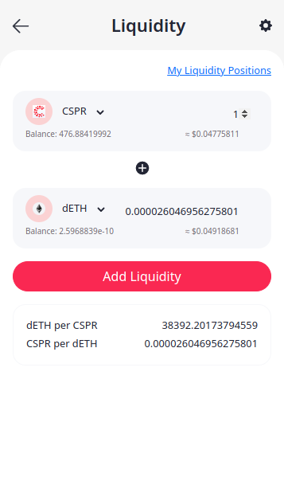
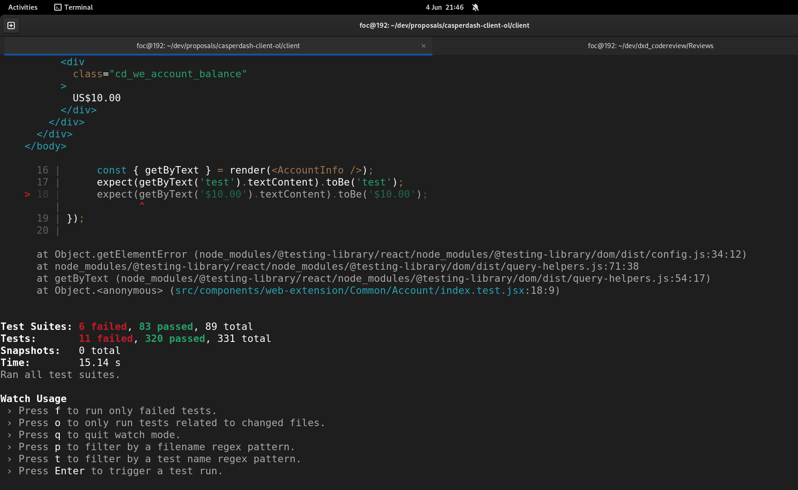

Grant Proposal | [286 - casperdash.io wallet ( web, extension, mobile app )](https://portal.devxdao.com/public-proposals/286)
------------ | -------------
Milestone | 5
Milestone Title | Swapping, Liquidity pools
OP | djhahe
Reviewer | Ömer ÇAKMAK <farukomercakmak@gmail.com>

# Milestone Details

## Details & Acceptance Criteria

**Details of what will be delivered in milestone:**

Integrate with other defi projects or self-implement to provide swapping, liquidity pools in wallet.

**Acceptance criteria:**

- User can swap tokens inside wallet
- User can provide liquidity for available pools in wallet

**Additional notes regarding submission from OP:**

Integrate swapping with friendly market AMM

## Milestone Submission

The following milestone assets/artifacts were submitted for review:

Repository | Revision Reviewed
------------ | -------------
https://github.com/CasperDash/casperdash-client | 5bbd520

# Install & Usage Testing Procedure and Findings

The reviewer used a Fedora 35 local installation for this review. The installation instructions for the wallet are available in the README. Following the instructions, the reviewer created a new `.env` file pointing to the servers provided by the OP and built the extension from source. After that, the built extension was imported to Chromium (Version 105.0.5195.125).

Installation and build logs are below:

[Installation Log](assets/install.md)

[Build Log](assets/build-extension.md)

After installing the plugin, the reviewer swapped CSPR to dETH. The process was successful. Screenshots of this process and deploys are below:

The option to add liquidity was initially missing. Although it was committed, it had not been pushed to the repository. After addressing this issue with the OP, they pushed the necessary code, and the functionality became visible on the interface. It was then implemented and tested using the wallet interface. Below is a screenshot of the liquidity interface:

Deploy of the operation:

https://cspr.live/deploy/c174bbb268313aed8c75a0c6688cec7ab35ef4b346ca6121395496f20124c100

## Overall Impression of usage testing

The reviewer successfully built the app using the instructions provided in the README. The documentation provides adequate installation and execution instructions. The application ran as expected. The swap functionality functions as intended. The interface for adding liquidity is operational. All required functionality is present and functioning properly.

Requirement | Finding
------------ | -------------
Project builds without errors | PASS
Documentation provides sufficient installation/execution instructions | PASS 
Project functionality meets/exceeds acceptance criteria and operates without error | PASS

# Unit / Automated Testing

During the initial runs of the unit tests, the reviewer encountered numerous errors. After investigating the issue and examining the error messages, the reviewer identified the problem with the defined locales and the hard-coded server selections. Subsequently, the reviewer discussed the matter with the OP, who promptly updated the code to make it independent of locales and relocated the server parameters to configuration files instead of hard-coding them.

Error received during initial build: 

The solution sent to developer. Solution implemented by developer.

* https://github.com/CasperDash/casperdash-client/commit/5bbd52023f82351b12237ca55b702cdf7f45b521 

Subsequently, the project was retested and successfully compiled without any errors. The installation instructions are clear, and the provided unit tests effectively validate the functionality of the new library, meeting the acceptance criteria.

[Unit Test logs](assets/yarn_test.md)

Requirement | Finding
------------ | -------------
Unit Tests - At least one positive path test | PASS
Unit Tests - At least one negative path test | PASS
Unit Tests - Additional path tests | PASS

# Documentation

### Code Documentation

Code documentation is excellently crafted and thorough. The essential aspects of the code have been extensively explained, ensuring that developers can comprehend and manage it with ease. Numerous helpful comments and documentation have been thoughtfully inserted throughout the code, displaying meticulous attention to detail and a strong commitment to providing comprehensive information. 

Requirement | Finding
------------ | -------------
Code Documented | PASS

### Project Documentation

The README consists of comprehensive instructions for the installation, execution, and testing of the application. These instructions provide a systematic and detailed guide on how to set up the application environment.
Requirement | Finding
------------ | -------------
Usage Documented | PASS
Example Documented | PASS

## Overall Conclusion on Documentation

Both the code documentation and general documentation are satisfactory, providing the essential information and guidance needed to understand and make effective use of the project. The documentation adequately covers all the necessary aspects, ensuring a comprehensive understanding of the codebase and giving users the insights they need to utilize the project's features effectively.

# Open Source Practices

## Licenses

The project is released under MIT license.

Requirement | Finding
------------ | -------------
OSI-approved open source software license | PASS

## Contribution Policies

Project contains clear CONTRIBUTING, SECURITY and CODE OF CONDUCT policies. Pull requests and Issues are enabled on the repositories and the project is set up for public participation.

Requirement | Finding
------------ | -------------
OSS contribution best practices | PASS

# Coding Standards

## General Observations

The source code adheres to good coding standards, displaying a highly organized and easily understandable structure. It is devoid of common errors and inconsistencies, enhancing code readability and maintainability. As a result, the codebase is of high quality and easily navigable.

# Final Conclusion

The application successfully fulfills the acceptance criteria set for requirement definition. Critical functionality is adequately covered by unit tests. Both the code and general documentation offer ample information, meeting the required standards. The project follows established open-source practices and adheres to coding standards, showcasing a high level of skill and craftsmanship. Consequently, the project satisfactorily meets the specified requirements. Based on these reasons, the reviewer recommends a PASS resolution for these milestone.

# Recommendation

Recommendation | PASS
------------ | -------------
