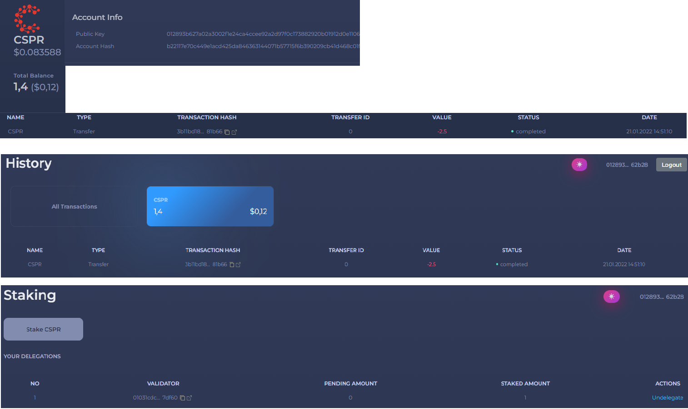
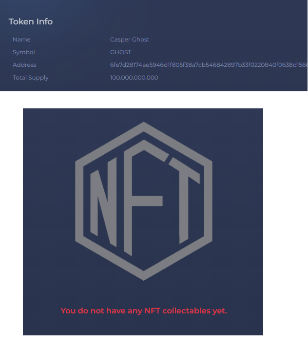

Grant Proposal | [286 - casperdash.io wallet ( web, extension, mobile app )](https://portal.devxdao.com/public-proposals/286)
------------ | -------------
Milestone | 1
Milestone Title | Web wallet - Submission 1
OP | Kien Nguyen
Reviewer | Ekin Keçeci <ekin@ekonteknoloji.com>
# Milestone Details

## Details & Acceptance Criteria

**Details of what will be delivered in milestone:**

- Control of Integration with Casper Singer
- Control of Dashboard
  - View CSPR balance
  - Send/Receive CRPR
  - CRPS price chart
- Control of Tokens
  - View token info/balance
  - Send/Receive tokens
  - Add custom token by contract hash
- Control of History
  - View transfer transactions history
- Control of Stacking  
- Control of NFT 
   
**Acceptance criteria:**

- Release a stable version working on mainnet with feature 

## Milestone Submission

The following milestone assets/artifacts were submitted for review:

Repository | Revision Reviewed
------------ | -------------
https://github.com/CasperDash/casperdash-client/tree/develop | 0f3d6be

# Install & Usage Testing Procedure and Findings
Following the instructions in the README of https://github.com/CasperDash/casperdash-client/tree/v1.0.0 and https://github.com/CasperDash/casperdash-api, the reviewer was able to successfully install the library. The reviewer was also able to successfully build the source code for this milestone by using the build script furnished in the root and readme of the repository.

Pages (Dashboard , History , Stacking , NFT and Token) on the website are working properly.

## Overall Impression of usage testing

The code was well crafted and well-printed for easy reading.
Everything was nicely aligned and it was easy to understand what was going on in the libraries as everything was so aptly named.
The project was successfully compiled and run, There was a difficulty because the code documentation was not prepared well.

Requirement | Finding
------------ | -------------
Casper signer integration test | PASS

Requirement | Part | Finding
------------ | ------------- | ------------
Control to View CSPR balance | Dashboard | PASS
Control to Send/Receive CRPR | Dashboard | PASS
Control to CRPS price chart  | Dashboard | PASS
Control to View token info/balance | Token | PASS
Control to Send/Receive tokens | Token | PASS
Control to Add custom token by contract hash | Token | PASS
Control to View NFTs | NFT | PASS
Control to View transfer transactions history | History | PASS
Control to Stacking Operations | Staking |PASS

# Documentation

### Code Documentation
The reviewer says that all critical functions of the project have code documents that can be used for automated document generation ,but that a little more information should be given so that the reviewer is not challenged.

Requirement | Finding
------------ | -------------
Code Documented | Pass with Notes

### Project Documentation

The reviewer observed that the README of the project has detailed general and usage documentation. 
Observes that the project does not have a good level of project documentation, but it is sufficient for the installation and launch of the project.
All versions of the installations are specified properly, after the necessary installations are made in the required version, it can make the project work.

Requirement | Finding
------------ | -------------
Usage Documented | PASS with Notes

## Overall Conclusion on Documentation

The reviewer concludes that the project does not have sufficient documentation.
The documents provided are only sufficient to run the project.
Code documentation is not good.
The reviewer has difficulty understanding the codes.

# Open Source Practices

## Licenses

The Project is released under the MIT License

Requirement | Finding
------------ | -------------
OSI-approved open source software license | PASS

## Contribution Policies

File not found. The project does not contain a CONTRIBUTION policy.

Requirement | Finding
------------ | -------------
OSS contribution best practices | FAIL

# Coding Standards

## General Observations

The coding is well structured and readable. Github site setup is easy and successful.

# Final Conclusion
Web pages and processes work flawlessly.
The code and project documentation and process are not well explained.
Difficulties arose as the milestones were not clearly explained. The audience may find it difficult to understand and more details are recommended.
The Contribution Policies file could not be found in the project so must be added.

# Recommendation

Recommendation | PASS with Notes
------------ | -------------