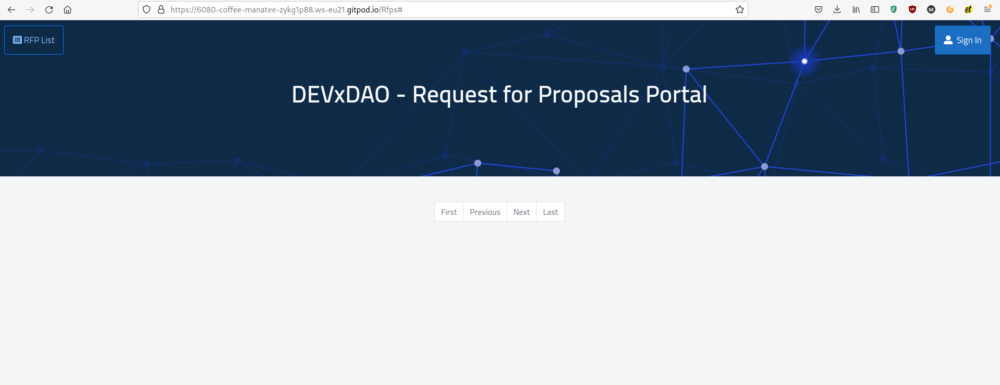
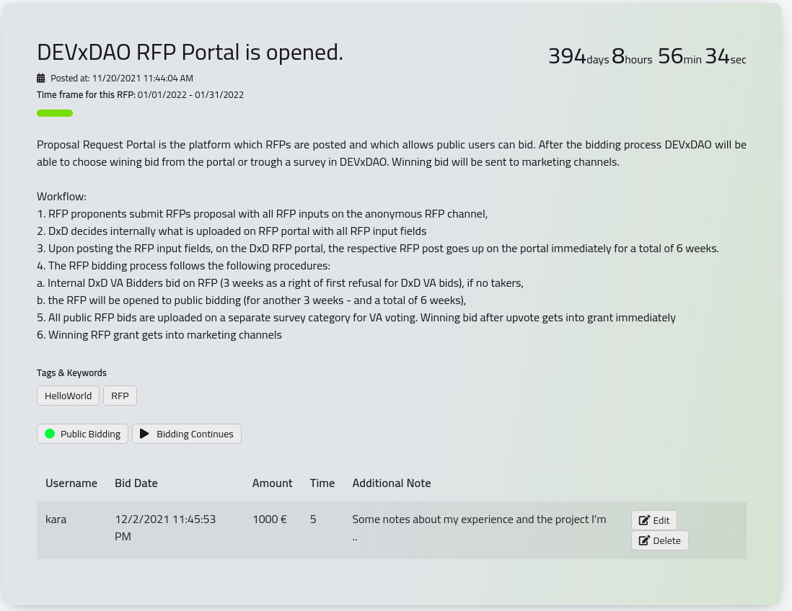
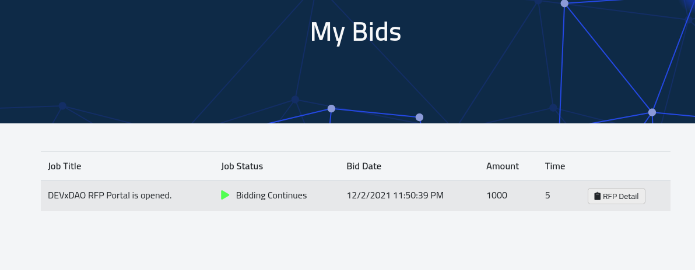
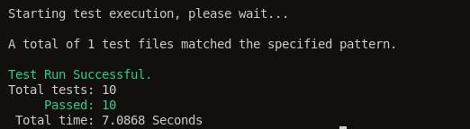
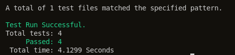
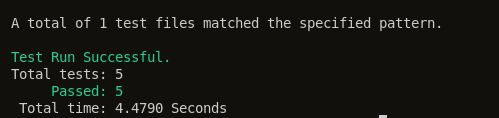

Grant Proposal | [302 - RFP Portal](https://portal.devxdao.com/public-proposals/302)
------------ | -------------
Milestone | 1
Milestone Title | Portal Development
OP | eknkcc
Reviewer | Muhammet Kara

# Milestone Details

## Details & Acceptance Criteria

**Details of what will be delivered in milestone:**

- RFP Portal project development will be completed and deployed on test environment.

**Acceptance criteria:**

- Source code will be accessible on GitHub.
- Portal will be working and accessible on test environment

**Additional notes regarding submission from OP:**


## Milestone Submission

The following milestone assets/artifacts were submitted for review:

Repository | Revision Reviewed
------------ | -------------
https://github.com/EKON-YAZILIM/RFPPortal | 90b7e7e

# Install & Usage Testing Procedure and Findings

Reviewer was able to build and run the project by using the instructions given on the README of the project, after entering the needed settings and the api key to the `appsettings.json` file as per the instructions.



Reviewer then examined the already deployed production installation on the `http://rfp.devxdao.com` URL for functionality. Reviewer successfully registered on and signed into teh portal, then placed a bid on an RFP.



Reviewer was able to edit and then delete the bid by using the buttons provided on the uer interface. The "My Bids" and the "RFP List" views were also observed to be functional.



Reviewer was also able to create a new RFP as an admin user, and select a winning bid on it.

## Overall Impression of usage testing

Reviewer was able to build and run the project by following the provided instructions, and test the functionality and usage on the already deployed instance. The documentation also provides sufficient installation/execution instructions for different scenarios. Reviewer observed that the project functionality meets/exceeds acceptance criteria and operates without error generally. It was seen that the production deployment didn't have a proper SSL configuration; however this does not cause a failure as it is a deployment-specific issue which can be fixed without changing the source code.


Requirement | Finding
------------ | -------------
Project builds without errors | PASS
Documentation provides sufficient installation/execution instructions | PASS
Project functionality meets/exceeds acceptance criteria and operates without error | PASS

# Unit / Automated Testing

After installing the requirements and adding the necessary configuration settings by following the given instructions on the project's README, the reviewer was able to run the tests under the `RFPPortal_Tests` directory. All positive, negative, and additional path tests were observed to run successfully.

```bash
cd RFPPortal_Tests
dotnet test --filter DisplayName~Authorization_Tests
```



```bash
dotnet test --filter DisplayName~BidController_Tests
```



```bash
dotnet test --filter DisplayName~RfpController_Tests
```



Requirement | Finding
------------ | -------------
Unit Tests - At least one positive path test | PASS
Unit Tests - At least one negative path test | PASS
Unit Tests - Additional path tests | PASS

# Documentation

### Code Documentation

Reviewer observed that all critical functions of the project had low-level code documentation which could be used for automated documentation generation. Reviewer praises the OP for the intensive code-level documentation.

Requirement | Finding
------------ | -------------
Code Documented | PASS

### Project Documentation

Reviewer observed that the project's README had detailed general and usage documentation, exceeding the requirements.

Requirement | Finding
------------ | -------------
Usage Documented | PASS

## Overall Conclusion on Documentation

Reviewer concludes that the project has extensive overall documentation, at both the high and the low level.

# Open Source Practices

## Licenses

The Project is released under the MIT License

Requirement | Finding
------------ | -------------
OSI-approved open source software license | PASS

## Contribution Policies

Pull requests and Issues are enabled. However, the project does not contain a CONTRIBUTING policy. It is highly suggested that the OP should add a proper contribution policy to provide guidelines for the potential contributors as it is crucial for the sustainability of an open-source project. However, this is not a reason to fail the whole submission, in the reviewer's opinion.

Requirement | Finding
------------ | -------------
OSS contribution best practices | FAIL

# Coding Standards

## General Observations

Code is generally well-structured and readable. The project as committed to GitHub and both the unit tests and the manual tests pass.

# Final Conclusion

The project provides the functionality described in the grant application and milestone acceptance criteria. It also meets or exceeds the standards required by the DEVxDAO. However, it is highly suggested to add a CONTRIBUTING policy to the project. Thus, in the reviewer's opinion, this submission should pass with notes.

# Recommendation

Recommendation | PASS (Improvements Suggested)
------------ | -------------

