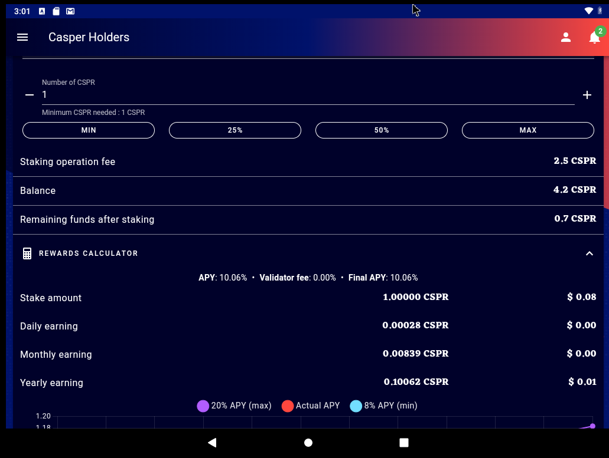

Grant Proposal | [308 - CasperHolders - Mobile Apps / PWA / High security accounts .](https://portal.devxdao.com/public-proposals/308)
------------ | -------------
Milestone | 1
Milestone Title | Make CasperHolders a PWA
OP | Killian Hascoet <killianh@live.fr>
Reviewer | Yusuf Keten <ketenyusuf@gmail.com>

# Milestone Details
 The review will cover the 1st milestone criteria set forth below.
 
## Details & Acceptance Criteria

**Details of what will be delivered in milestone:**

- Make CasperHolders available as a PWA (Progressive Web App). This will allow people to install the app pretty much on any platform.
- We will test the PWA Android 11 / Linux (Ubuntu 21.04) / Windows 10.
- Add the ability to use ledger for transfer & staking.

**Acceptance criteria:**

- CasperHolders will be able to be installed on Android / Linux / Windows & fully usable / responsive.

**Additional notes regarding submission from OP:**

https://docs.google.com/document/d/1hsWNFkgPv7jI9L_0yA7-jLchjScWPuXHKbVH1t73WfQ/edit?usp=sharing

## Milestone Submission

The following milestone assets/artifacts were submitted for review:

Repository | Revision Reviewed
------------ | -------------
https://github.com/casperholders/casperholdersfront | d48fb43

# Install & Usage Testing Procedure and Findings

Following the instructions in the README file of the repository(https://github.com/casperholders/casperholdersfront), the reviewer was able to successfully build the source code on Ubuntu 20.04.

[Build Logs](assets/build-log.md)

The application was tested on an Android, Windows 10, and Linux machine with a Ledger Nano S without any issues.

**Android**

**Linux**

**Windows**

## Overall Impression of usage testing

The project builds without errors, the documentation provides sufficient installation and execution instructions, and the project functionality meets/exceeds the acceptance criteria and operates without errors.

Requirement | Finding
------------ | -------------
Project builds without errors | PASS
Documentation provides sufficient installation/execution instructions | PASS
Project functionality meets/exceeds acceptance criteria and operates without error | PASS

# Unit / Automated Testing

The automated testing was performed on the project source code using Cypress. Also, the project was tested on the Android, Windows, and Linux machines with a Ledger Nano S manually to ensure the project functions as intended.

The project contains automated UI and integration tests covering the critical functionality. The tests are written in JavaScript and work with the Cypress framework. The reviewer was able to successfully run the tests on Linux. The tests are highly effective and the project is well tested as a PWA project.

The results of the tests are shown below.

Requirement | Finding
------------ | -------------
Unit Tests - At least one positive path test | PASS
Unit Tests - At least one negative path test | PASS
Unit Tests - Additional path tests | PASS

# Documentation

### Code Documentation

A sufficient amount of low-level documentation exists on the project via properly formatted inline comments on the critical classes and the methods.

Requirement | Finding
------------ | -------------
Code Documented | PASS

### Project Documentation

The reviewer highly recommends the documentation be improved. However, in terms of the milestone requirements, the documentation is sufficient to build, run and test the project. An example environment configuration is provided in the README.md file. The configuration structure example is enough to test the project by only changing the sensitive data like a private key.

Requirement | Finding
------------ | -------------
Usage Documented | PASS
Example Documented | PASS

## Overall Conclusion on Documentation

In the reviewer's opinion, the project usage and code-level documentation are sufficient. 

# Open Source Practices

## Licenses

The Project is released under the Apache-2.0 License

Requirement | Finding
------------ | -------------
OSI-approved open source software license | PASS

## Contribution Policies

Pull requests and Issues are enabled. The repository contains a CONTRIBUTING and a SECURITY policy.

Requirement | Finding
------------ | -------------
OSS contribution best practices | PASS

# Coding Standards

## General Observations

Code is generally well-structured and very readable. The project is committed to GitHub and both the automated tests and the manual tests pass.

# Final Conclusion

The project provides the functionality described in the grant application and milestone acceptance criteria.

Thus, in the reviewer's opinion, this submission should PASS.

# Recommendation

Recommendation | PASS
------------ | -------------
