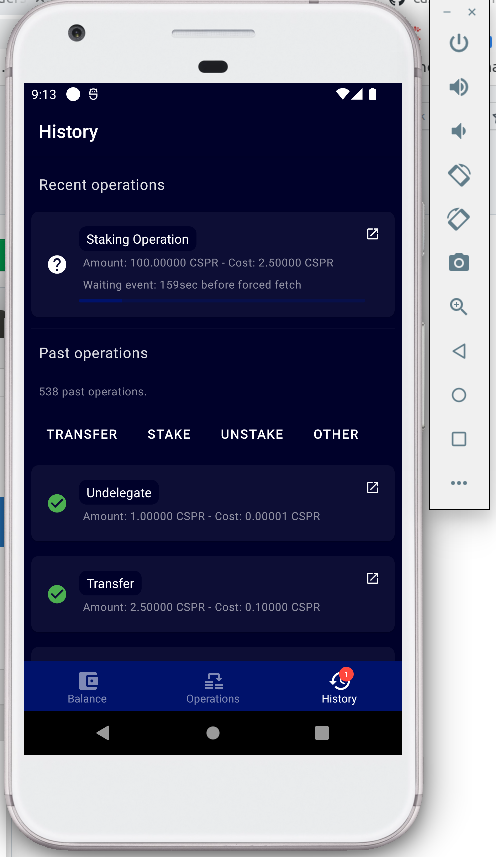

Grant Proposal | [308 - CasperHolders - Mobile Apps , PWA , High security accounts](https://portal.devxdao.com/public-proposals/308)
------------ | -------------
Milestone | 2
Milestone Title | Android & iOs Application
OP | Killian Hascoet <killianh@live.fr>
Reviewer | Mikael Grouwet <m.grouwet@gmail.com>

# Milestone Details

## Details & Acceptance Criteria

**Details of what will be delivered in milestone:**

Develop a native application for Android & iOs.

**Acceptance criteria:**

Casperholders will be available on Android & iOs app store.
All features that can be handle through a ledger implementation will be available.
- At least transfer operations & Staking operations.
All features will be available in the end with the grant #307. 

If some feature can't be implemented we will add a notice why we couldn't implement them with Ledger right away.

**Additional notes regarding submission from OP:**


## Milestone Submission

The following milestone assets/artifacts were submitted for review:

Repository | Revision Reviewed
------------ | -------------
https://github.com/casperholders/casperholders-mobile | b568e31


# Install & Usage Testing Procedure and Findings

The reviewer was able to install the project easily.


When following the step by step README , the reviewer faced some issues.  
Before building the app, it's important to have the simulator opened. It was mentionned in the part "Next Builds" but it should also be mentionned in the step "First Builds".  
Hoppefully the error message in the console is explicit :


After starting the Emulator, the reviewer had a second error :


Here again the message is explicit and the reviewer had to define the correct environment variable.en  
The OP advises the reviewer to define it like this :

```
export ANDROID_HOME=$HOME/Android/Sdk
export ANDROID_SDK_ROOT=$ANDROID_HOME
export PATH=$PATH:$ANDROID_HOME/emulator
export PATH=$PATH:$ANDROID_HOME/tools
export PATH=$PATH:$ANDROID_HOME/tools/bin
export PATH=$PATH:$ANDROID_HOME/platform-tools
```

Now the app is running and working using the "yarn start" command.

The reviewer encountered same kind of messages while testing on a Mac (except the export of the environment variable)


The reviewer was able to use the app correctly :



The app was also tested on an iOS device with a Ledger Nano X without any issues.

## Overall Impression of usage testing

The reviewer faced some issues to correctly install and run the app.  
The OP corrected the isues when requested and the reviewer was able to run and test the app locally.

The reviewer recommands to the OP to add more details in the README to prevent questions about how to build and run the app.
  
Except that, the app meets the acceptance criteria.

Requirement | Finding
------------ | -------------
Project builds without errors | PASS with Notes
Documentation provides sufficient installation/execution instructions | PASS with Notes
Project functionality meets/exceeds acceptance criteria and operates without error | PASS

# Unit / Automated Testing

While running the tests, the reviewer faced the same issues faced when building the app.

The first attempt with the tests gives the following error :


After setting the environment variable :

```
export ANDROID_HOME=$HOME/Android/Sdk
export ANDROID_SDK_ROOT=$ANDROID_HOME
export PATH=$PATH:$ANDROID_HOME/emulator
export PATH=$PATH:$ANDROID_HOME/tools
export PATH=$PATH:$ANDROID_HOME/tools/bin
export PATH=$PATH:$ANDROID_HOME/platform-tools
```

It was running correctly :


The reviewer advises the OP to complete the README so the test will works correctly directly.  
The code covergare is overall very good and the reviewer praises the OP’s efforts for that.

Requirement | Finding
------------ | -------------
Unit Tests - At least one positive path test | PASS
Unit Tests - At least one negative path test | PASS
Unit Tests - Additional path tests | PASS

# Documentation

### Code Documentation

The code is well documented.

Requirement | Finding
------------ | -------------
Code Documented | PASS

### Project Documentation

As mentionned earlier, the documentation should be improved to prevent error due to configuration.

The OP added videos for the user's documentation after the reviewer asked for user's documentation.
The reviewer recommands to add more videos so users will know how to use the app correctly.

Requirement | Finding
------------ | -------------
Usage Documented | PASS with Notes
Example Documented | PASS with Notes

## Overall Conclusion on Documentation

The reviewer concludes that the project has sufficient documentation but the README could be improved. 

# Open Source Practices

## Licenses

The Project is released under the Apache-2.0 License

Requirement | Finding
------------ | -------------
OSI-approved open source software license | PASS

## Contribution Policies

Pull requests and Issues are enabled. The repository does contain a CONTRIBUTING and a SECURITY policy.

Requirement | Finding
------------ | -------------
OSS contribution best practices | PASS

# Coding Standards

## General Observations

Code is generally well-structured and readable.

The README should be more detailed to prevent configuration's error messages like the reviewer had when he tried to test and build the app.


# Final Conclusion

The project meets the functional requirements. 
The reviewer was able to build and run the unit tests. 
The reviewer was also able to test the app with a Ledger Nano X directly from the app available on the AppStore.

The documentation could be improved. The reviewer recommands to the OP to structure his documentation and add additionnal videos for the users.

Thus, in the reviewer's opinion, this submission should PASS with notes.

# Recommendation

Recommendation | PASS with Notes
------------ | -------------
