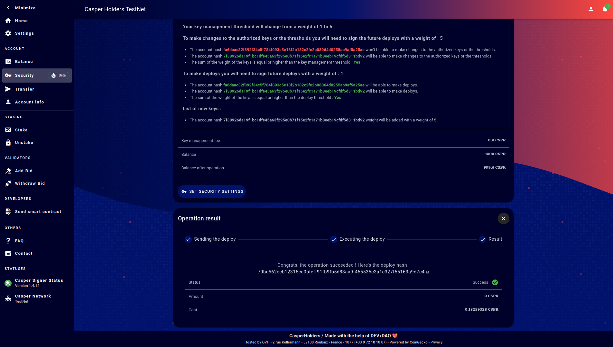

Grant Proposal | [308 - 3 - CasperHolders - Mobile Apps / PWA / High security accounts](https://portal.devxdao.com/public-proposals/308)
------------ | -------------
Milestone | 3
Milestone Title | High security account (Multi-sig implementation) - Submission 2
OP | Killian Hascoet <killianh@live.fr>
Reviewer | Gökhan Gurbetoğlu <ggurbet@gmail.com>

# Milestone Details

## Details & Acceptance Criteria

**Details of what will be delivered in milestone:**

Create a user friendly interface to:
 - add keys and modify the weight of them,
 - modify the weight needed to perform action on the Casper network.

This will allow users to have backup spare keys in case of loss of their main key and add the ability to multi-sign deploys offline for exemple. (Offline deploys are not part of this milestone/grant. They are implemented but still not part of this grant.) All of this make users accounts safer for them & for the network.

**Acceptance criteria:**

Users will be able to:
 - add key to their account and modify the weight of it,
 - modify the weight needed to perform actions on the Casper Network.

This feature will be implemented only on the WEB/PWA version until ledger as a way to make complex deploys.

## Milestone Submission

The following milestone assets/artifacts were submitted for review:

Repository | Revision Reviewed
------------ | -------------
https://github.com/casperholders/casperholdersfront | d48fb43

# Install & Usage Testing Procedure and Findings

Following the instructions in the README of https://github.com/casperholders/casperholdersfront, reviewer was able to successfully build the source code and serve the application for this milestone on Pardus GNU/Linux 21.2. All corresponding logs are listed below.

- [Installation logs](assets/install.md)
- [Build logs (Testnet)](assets/build-testnet.md)
- [Build logs (Mainnet)](assets/build-mainnet.md)
- [Docker build logs (Testnet)](assets/docker-testnet.md)
- [Docker build logs (Mainnet)](assets/docker-mainnet.md)

## Overall Impression of usage testing

Reviewer was able to conduct desired operations using the frontend. Many complex operations can be done using the tool. Here are some sample operations:

### Adding key and modifying weights

#### Security screen

#### Adding weight to added key

#### Confirmation of operation

#### Operation completed successfully

#### Validation

Additional to these, many different scenarios could easily be tested visually using the automated tests provided by the author.

Requirement | Finding
------------ | -------------
Project builds without errors | PASS
Documentation provides sufficient installation/execution instructions | PASS
Project functionality meets/exceeds acceptance criteria and operates without error | PASS

# Unit / Automated Testing

All automated unit tests PASS for this milestone. Testing is done via Cypress and contains automated UI and integration tests that cover critical functionality. Reviewer successfully run all automated tests on a Pardus GNU/Linux 21.2 machine. Overall quality of tests are remarkably sufficient. Test output is below.

- [Unit tests output](assets/unit-tests.md)

Requirement | Finding
------------ | -------------
Unit Tests - At least one positive path test | PASS
Unit Tests - At least one negative path test | PASS
Unit Tests - Additional path tests | PASS

# Documentation

### Code Documentation

Overall code comments are sufficient. Most of them are detailed enough to explain the methods but some of them can be expanded and there can be a few more added comments as a suggestion. As a reviewer's note, there are some minor typos in some places that can be fixed, but this does not affect the final conclusion of this part.

Requirement | Finding
------------ | -------------
Code Documented | PASS with Notes

### Project Documentation

Despite the possibility to have many different operations and also the complexity of them, reviewer suggest that it would be beneficial for the project to improve the usage and example documentation which could also enhance the user experience in a positive way.

Requirement | Finding
------------ | -------------
Usage Documented | PASS with Notes
Example Documented | PASS with Notes

## Overall Conclusion on Documentation

Documentation for the project is helpful but reviewer suggests improvements and expansion to it.

# Open Source Practices

## Licenses

The Project is released under the Apache-2.0 License.

Requirement | Finding
------------ | -------------
OSI-approved open source software license | PASS

## Contribution Policies

Project contains clear CONTRIBUTING and SECURITY policies and has a CODE OF CONDUCT included. Pull requests and Issues are enabled on the repository and the project is set up for public participation.

Requirement | Finding
------------ | -------------
OSS contribution best practices | PASS

# Coding Standards

## General Observations

Source code is well-written and thought out. It is easily readable. General best coding practices are used throughout the project.

# Final Conclusion

Project provides the acceptance criteria for this milestone. Unit tests are well prepared and useful. Documentation provides information but it would benefit greatly from improvements and expansion. Coding practices and visual presentation of the project are of desirable quality. Because of its sufficient deliverables, reviewers suggests the project to PASS with Notes.

# Recommendation

Recommendation | PASS with Notes
------------ | -------------
