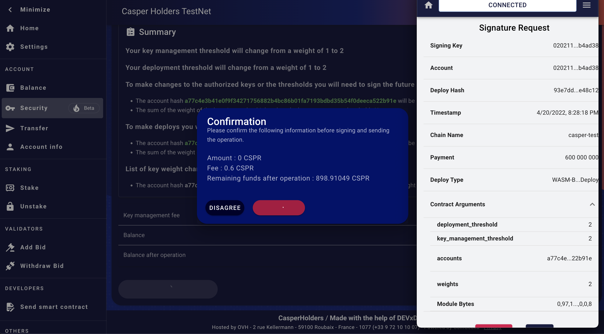

Grant Proposal | [308 - 3 - CasperHolders - Mobile Apps / PWA / High security accounts .](https://portal.devxdao.com/public-proposals/308)
------------ | -------------
Milestone | 3
Milestone Title | High security account (Multi-sig implementation)
OP | Killian Hascoet <killianh@live.fr>
Reviewer | Kien Nguyen <kiennguyen@casperdash.io>

# Milestone Details

## Details & Acceptance Criteria

**Details of what will be delivered in milestone:**

Create a user friendly interface to add keys and modify the weight of them and also modify the weight needed to perform action on the Casper network. (Deploy Action / Key Management Actions)

This will allow users to have backup spare keys in case of loss of their main key and add the ability to multi-sign deploys offline for example. (Offline deploys are not part of this milestone / grant. Could be added in the future).

All of this make users accounts safer for them & for the network.

**Acceptance criteria:**

Users will be able to add key to their account and modify the weight of it.
Users will be able to modify the weight needed to perform actions on the Casper Network. (Deploy Action / Key Management Actions)

With intensive tests to make sure users doesn't broke their accounts with bad key weights etc.

This feature will be implemented only on the WEB/PWA version until ledger as a way to make complex deploys.

## Milestone Submission

The following milestone assets/artifacts were submitted for review:

Repository | Revision Reviewed
------------ | -------------
https://github.com/casperholders/casperholdersfront | 971e2c2

# Install & Usage Testing Procedure and Findings

Following the instructions in the README of https://github.com/casperholders/casperholdersfront, reviewer was
able to successfully build and run the casper holder website at local environment.
 

1. Adding associated keys/ update key's weight

- With new account, reviewer can successfully add new associated key and update key's weights.

https://testnet.cspr.live/deploy/fecb7c8f06bb471ef843d6907b4e41d0d3837a5498ed0aff4bb133866801aa2d
https://testnet.cspr.live/deploy/36030642386298d62a28408b220608021b7422ee0f229e107d31e679b9207b45

- After update successfully, it's suggested to update the summary section. Currently, the summary remains the same as before the update. 

- For some existing accounts, reviewer cannot add a new associated key or update the weight of the key, both got `out of gas` error. Reviewer tried to increase fees, but the fee is hardcoded in `casperholderscore` library and cannot be updated on `casperholdersfront`. Reviewer also compared the parameters in deploy from new account vs deploy from old account but couldn't find a difference. The OP should troubleshoot this case. 

https://testnet.cspr.live/deploy/c72ee5b0e75667213090be940ea41c146de7059385b2a0143d2fbe28d9076840

2. Multi sign

- Reviewer can access multi sign feature from an account with a key weight below the key management threshold or deploy threshold. The multi sign feature is working as expected.

https://testnet.cspr.live/deploy/39ae432ca524ebbda6f19da7016d4e3977d9dbe0ad0f308824eacd025137adc4

Requirement | Finding
------------ | -------------
Project builds and runs without errors | PASS
Documentation provides sufficient installation/execution instructions | PASS
Project functionality meets/exceeds acceptance criteria and operates without error | FAIL
API Endpoints work without error | PASS 

# Unit / Automated Testing

Reviewer can not find any unit tests which related to the milestone. The automation tests are also fail when run.

Requirement | Finding
------------ | -------------
Unit Tests - At least one positive path test | FAIL
Unit Tests - At least one negative path test | FAIL
Unit Tests - Additional path tests | FAIL
Automation Tests | FAIL

# Documentation

### Code Documentation

Reviewer found that all key functions of the project have low-level code. 

Requirement | Finding
------------ | -------------
Low level function documentation | PASS

### Project Documentation

The README file provides documentation on how to install and run the project.

Requirement | Finding
------------ | -------------
Sufficient Project Documentation | PASS

# Open Source Practices

## Licenses

The projects is released under the Apache 2.0 License

Requirement | Finding
------------ | -------------
OSI-approved open source software license | PASS

## Contribution Policies

The projects has CONTRIBUTING policy as well as a CODE OF CONDUCT for contributors. Issues and Pull Requests are enabled.

Requirement | Finding
------------ | -------------
OSS contribution best practices | PASS

# Coding Standards

## General Observations

In general, the code is well-structured and readable. Some issues that were observed:

-  Reviewer found pointed out that some code from the `casperholdercore` repository should be included in this milestone submission. But the OP did not mention the dependency on `casperholdercore`, the OP should add unit tests for the relevant code in `casperholdercore`. 
https://github.com/casperholders/casperholderscore/blob/main/src/services/deploys/keyManagement/keyManagement.js
-  Reviewer can not add associated keys or modify the key's weight for some account, all got the out of gas error. 
-  Unit tests/ automation tests fail

# Final Conclusion

Since the acceptance criteria and tests did not work as expected reviewer considered this a **FAIL** milestone submission.

# Recommendation

Recommendation | FAIL
------------ | -------------