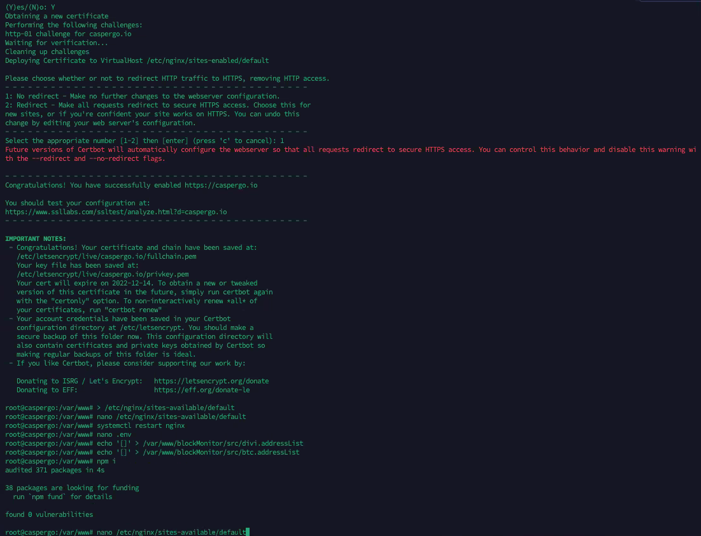
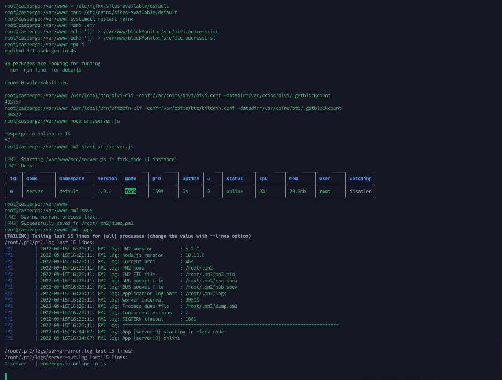

Grant Proposal | [317 - Integration of LetsGo Wallet with CasperLabs](https://portal.devxdao.com/public-proposals/317)
------------ | -------------
Milestone | 1
Milestone Title | White Labeling of LetsGo Wallet (Chat Platform) - Submission 2
OP | A1Labs
Reviewer | Gökhan Gurbetoğlu <crdao@ggurbet.com>

# Milestone Details

## Details & Acceptance Criteria

**Details of what will be delivered in milestone:**

Using the base code and concepts from the LetsGo Wallet, we will make a version which is to be used in all future developments (specifically the ones in this proposal). The chat platform will be capable of multiple message delivery, delivery of digital content (photos, videos, contact cards) as well as standard messages and templated messages. This system will be based on a multi-language capable system, allowing for additions of new languages as desired. The core will be able to use several messaging systems (included in other milestones in this project) leveraging APIs for message delivery, allowing for a broader scope to be contributed by the open-source community Casper has been supporting / developing.

We will deliver:
- Forked, open-source version of LetsGo Wallet. This version will include:
    - Multiple message delivery
    - Digital content delivery (photos, videos, contact cards)
    - Templated messaging
    - Multilingual (human language) support
    - Internationalization-ready infrastructure
    - API integrations with Price Servers (Coin Gecko, Coin Market Cap, FIAT Exchange Rate Services), IPFS Gateways Internal Block Server APIs, Internal Bitcoin Server API, Internal DIVI Server API
- Landing Page website and project information

**Acceptance criteria:**

The submitted code base is:
- Capable of preparing multiple messages to multiple users
- Capable of preparing multimedia digital content
- Capable of sending messages with programmable templates
- Has at least 3 human language translations
- Has a table of strings for internationalization at-will
- Has functioning API integrations with Price Servers (Coin Gecko, Coin Market Cap, FIAT Exchange Rate Services), IPFS Gateways, Internal Block Server APIs, Internal Bitcoin Server API, Internal DIVI Server API

Upon completion of this milestone, a code review will be requested pursuant to coding standards (https://portal.devxdao.com/app/proposal/185) and definition of done (https://portal.devxdao.com/app/proposal/196).

**Additional notes regarding submission from OP:**

As requested, the repository in GitHub is established as a private repository; therefore, users who would like to review the code will need to provide their GitHub username to LetsGo to be added and have access for review and comments. DevxDao will provide a list of GitHub usernames for access to the private repository.

Created CasperGo website (https://caspergo.io)

## Milestone Submission

The following milestone assets/artifacts were submitted for review:

Repository | Revision Reviewed
------------ | -------------
https://github.com/CasperGoApp/Chat-Bot-API | 91b9235

# Install & Usage Testing Procedure and Findings

OP provided an installation environment on a remote server that uses Ubuntu 20.04.5 LTS for the reviewer. Together with OP, reviewer was successfully able to install the project according to the instructions provided in the README without errors. The installation instructions are very detailed but requirements are very long. Talking to OP, they stated that they are planning to move to an installation script in future milestones to ease this process.

## Overall Impression of usage testing

This project has many milestones. For this milestone, usage testing was achieved with unit tests. All test cases cover the acceptance criteria and there were no errors.

These tests should also be tested again manually after Milestone 5 as a note.

Requirement | Finding
------------ | -------------
Project builds without errors | PASS
Documentation provides sufficient installation/execution instructions | PASS with Notes
Project functionality meets/exceeds acceptance criteria and operates without error | PASS

# Unit / Automated Testing

Unit tests cover all critical functionality required for this milestone's acceptance criteria.

- [Unit test logs](assets/unit-tests.md)

Requirement | Finding
------------ | -------------
Unit Tests - At least one positive path test | PASS
Unit Tests - At least one negative path test | PASS
Unit Tests - Additional path tests | PASS

# Documentation

### Code Documentation

Code is well documented. However, the quality of code comments are mediocre. They are mostly single words or for very obvious operations that can easily be understood by just looking at the code. These need improvements in the following milestones.

Requirement | Finding
------------ | -------------
Code Documented | PASS with Notes

### Project Documentation

Installation documentation is well prepared and useful. Further documentation does not exist and needs to be implemented in future milestones.

Requirement | Finding
------------ | -------------
Usage Documented | PASS with Notes
Example Documented | PASS with Notes

## Overall Conclusion on Documentation

Code documentation needs improvements and project documentation needs to be added.

# Open Source Practices

## Licenses

The project is licensed under MIT license.

Requirement | Finding
------------ | -------------
OSI-approved open source software license | PASS

## Contribution Policies

The project contains a CONTRIBUTING and SECURITY policies. Pull requests and Issues are enabled.

Requirement | Finding
------------ | -------------
OSS contribution best practices | PASS

# Coding Standards

## General Observations

Code is well prepared and general best practices for implementation are used throughout the source code.

# Final Conclusion

The project would benefit greatly from a Continuous Integration (CI) Action on GitHub.

Build process is tedious. A build script would make installation process automated and less prone to user errors.

Code documentation is not of high quality and further project documentation is needed.

Because of these reasons, reviewer suggests a resolution of PASS with Notes for this milestone.

# Recommendation

Recommendation | PASS with Notes
------------ | -------------
