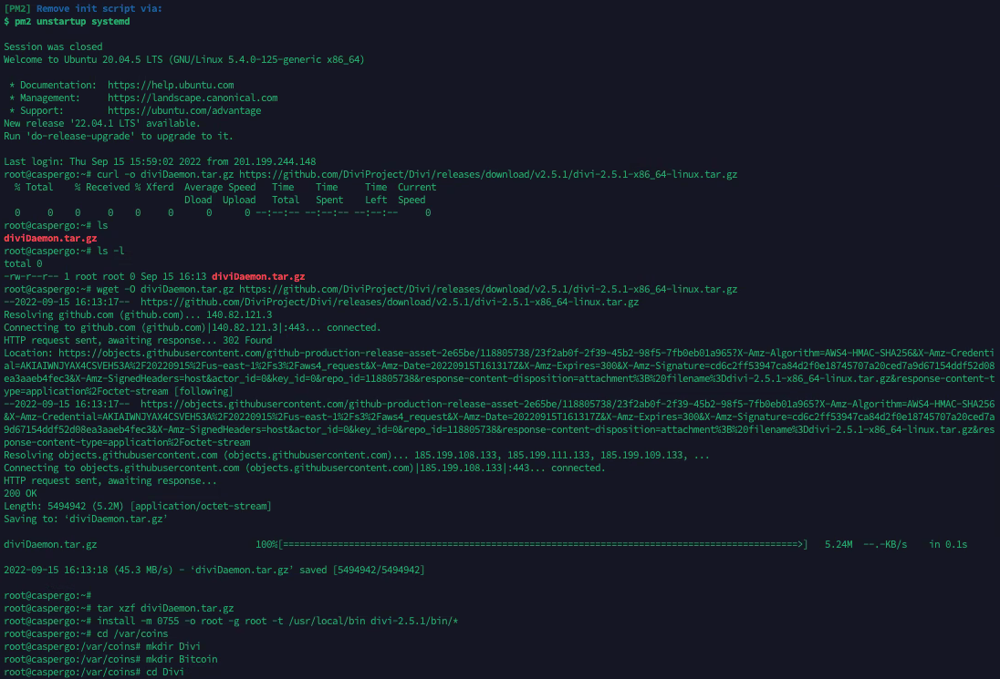

Grant Proposal | [317 - Integration of LetsGo Wallet with CasperLabs](https://portal.devxdao.com/public-proposals/317)
------------ | -------------
Milestone | 3
Milestone Title | Develop user custodial key management
OP | A1Labs
Reviewer | Gökhan Gurbetoğlu <crdao@ggurbet.com>

# Milestone Details

## Details & Acceptance Criteria

**Details of what will be delivered in milestone:**

Develop and integrate the ability to use the base custodial system to save, store and access user’s private keys for their account usage. Custodial wallets will allow only a maximum of $500 incoming each month. Custodial wallets are ‘one-click’ wallets as the information for usage is internally stored in the system and not available to the end-user.

We will deliver:
- Custodial System for Safe Storage of User keys
- Account Incoming Balance Monitor in USD
- Account Block at $500 (programmable)
- Enable / Disable Accounts (with simple Admin access)

**Acceptance criteria:**

The detailed acceptance will be based on following

- The Custodial system is available for testing on the test net
- Incoming Balance Monitor is configurable by user
- Account block limits are editable by admin
- Accounts can be enabled and disabled by admin

Upon completion of this milestone, a code review will be requested pursuant to coding standards (https://portal.devxdao.com/app/proposal/185) and definition of done (https://portal.devxdao.com/app/proposal/196) as well as an internal audit from Casper Labs

**Additional notes regarding submission from OP:**

Submission includes 
- Custodial System for Safe Storage of User keys 
- Account Incoming Balance Monitor in USD 
- Account Block at $500 (programmable) 
- Enable / Disable Accounts (with simple Admin access)

## Milestone Submission

The following milestone assets/artifacts were submitted for review:

Repository | Revision Reviewed
------------ | -------------
https://github.com/CasperGoApp/AccountManagementandAML | 3519888

*Note:* This milestone was submitted as a separate repository and later merged into the main one.

# Install & Usage Testing Procedure and Findings

OP provided an installation environment on a remote server that uses Ubuntu 20.04.5 LTS for the reviewer. Together with OP, reviewer was successfully able to install the project according to the instructions provided in the README without errors. The installation instructions are very detailed but requirements are very long. Talking to OP, they stated that they are planning to move to an installation script in future milestones to ease this process.

## Overall Impression of usage testing

This project has many milestones. For this milestone, usage testing was achieved with unit tests. All test cases cover the acceptance criteria and there were no errors.

These tests should also be tested again manually after Milestone 5 as a note.

Requirement | Finding
------------ | -------------
Project builds without errors | PASS
Documentation provides sufficient installation/execution instructions | PASS with Notes
Project functionality meets/exceeds acceptance criteria and operates without error | PASS

# Unit / Automated Testing

Unit tests cover all critical functionality required for this milestone's acceptance criteria.

- [Unit test logs](assets/unit-tests.md)

*Note:* Unit tests for this milestone has been put into the main repository and tests were done using those.

Requirement | Finding
------------ | -------------
Unit Tests - At least one positive path test | PASS
Unit Tests - At least one negative path test | PASS
Unit Tests - Additional path tests | PASS

# Documentation

### Code Documentation

Code is well documented. However, the quality of code comments are mediocre. They are mostly single words or for very obvious operations that can easily be understood by just looking at the code. These need improvements in the following milestones.

Requirement | Finding
------------ | -------------
Code Documented | PASS with Notes

### Project Documentation

Installation documentation is well prepared and useful. Further documentation does not exist and needs to be implemented in future milestones.

Requirement | Finding
------------ | -------------
Usage Documented | PASS with Notes
Example Documented | PASS with Notes

## Overall Conclusion on Documentation

Code documentation needs improvements and project documentation needs to be added.

# Open Source Practices

## Licenses

The project is licensed under MIT license.

*Note:* License file is in the main repository and has been merged.

Requirement | Finding
------------ | -------------
OSI-approved open source software license | PASS

## Contribution Policies

The project contains a CONTRIBUTING and SECURITY policies. Pull requests and Issues are enabled.

Requirement | Finding
------------ | -------------
OSS contribution best practices | PASS

# Coding Standards

## General Observations

Code is well prepared and general best practices for implementation are used throughout the source code.

# Final Conclusion

The project would benefit greatly from a Continuous Integration (CI) Action on GitHub.

Build process is tedious. A build script would make installation process automated and less prone to user errors.

Code documentation is not of high quality and further project documentation is needed.

Because of these reasons, reviewer suggests a resolution of PASS with Notes for this milestone.

# Recommendation

Recommendation | PASS with Notes
------------ | -------------
