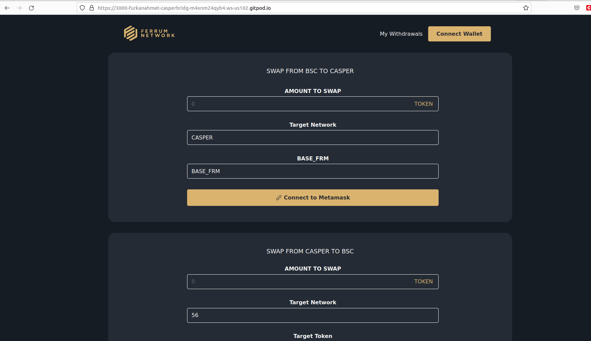
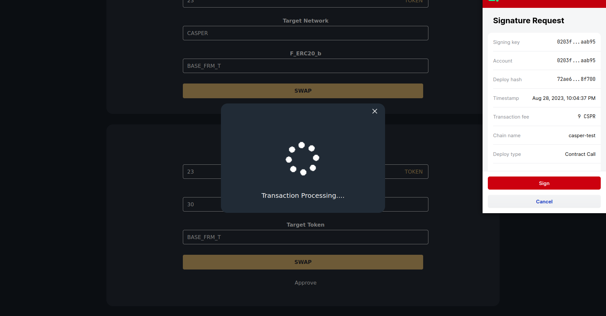
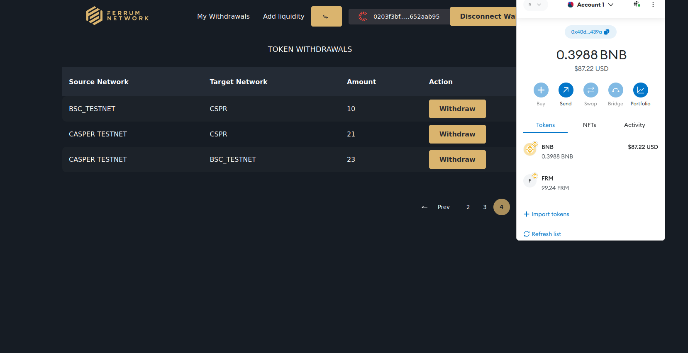
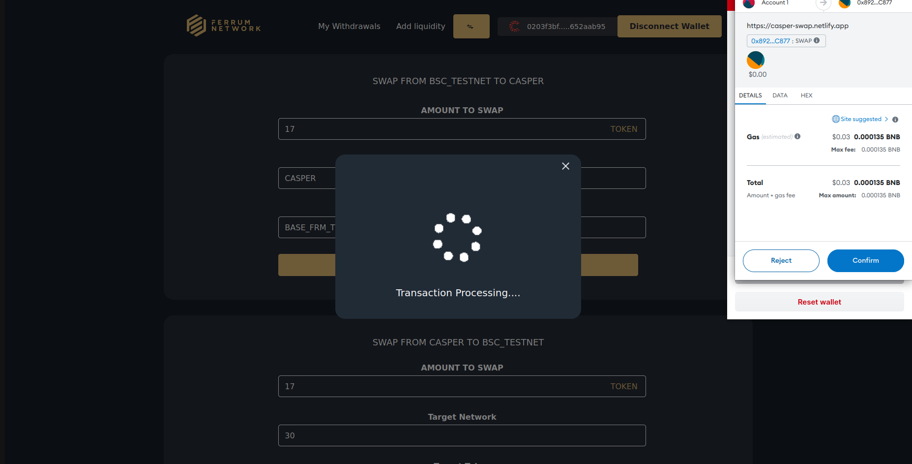
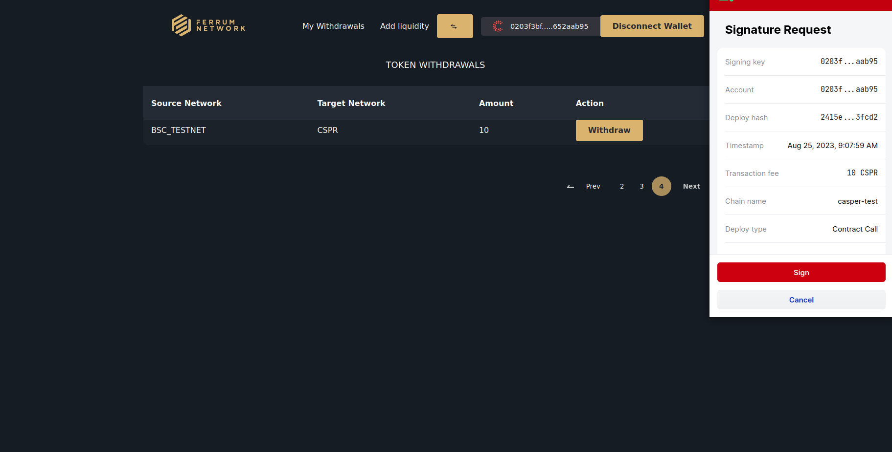

Grant Proposal | [318 - Cross Chain Token Bridge-Staking as a Service Solutions](https://portal.devxdao.com/public-proposals/318)
------------ | -------------
Milestone | 2
Milestone Title | Build, Deploy, and Internally QA Bridging Shell App
OP | nickodio_ferrum
Reviewer | Furkan Ahmet Kara

# Milestone Details

## Details & Acceptance Criteria

**Details of what will be delivered in milestone:**

- Build and deploy a shell app that will allow swaps among:
1. Casper <> Ethereum
2. Casper <> BSC
3. Casper <> Polygon

- Integrate bridge with one of the Casper’s compatible wallets

- Share Bridging shell app with internal QA and incorporate QA feedback

**Acceptance criteria:**

- UI deployment for bridge interaction
- Smart Contract Deployment of bridge
- Casper compatible wallet integration
- Ability to run swaps among:
1. Casper <> Ethereum
2. Casper <> BSC
3. Casper <> Polygon
- Internal QA feedback incorporation

**Additional notes regarding submission from OP:**

Release notes can be found in the repositories shared above. A demo of the shell app can be seen using the link below. https://ferrum.network/espast/2023/04/CasperBridgePresentation.mp4

Casper Bridge SmartContracts: 

https://github.com/ferrumnet/bridge-casper-smart-contracts

Casper Bridge Backend: 
https://github.com/ferrumnet/ferrum-gateway/tree/casper-bridge

For documentation, please refer to this: 
https://github.com/ferrumnet/ferrum-gateway/blob/casper-bridge/docs/Casper.Readme.md

Casper Bridge Frontend: 
https://github.com/ferrumnet/casper-bridge-frontend

## Milestone Submission

The following milestone assets/artifacts were submitted for review:

Repository | Revision Reviewed
------------ | -------------
https://github.com/ferrumnet/bridge-casper-smart-contracts | [4beb13d]
https://github.com/ferrumnet/casper_staking/tree/v0.3.3| [40be80b]
https://github.com/ferrumnet/staking-casper-frontend | [c3047b9]

# Install & Usage Testing Procedure and Findings

Repos were missing some instructions at the beginning and the reviewer sent a guide to OP to update the project's repos. OP updated this repo and informed the reviewer. Repos still had issues and the reviewer gave another feedback to OP before proceeding the final review.

By following the instructions in the README of the repository the reviewer was able to build and run the projects.

[front install](assets/frontnpminstall.md)

[front start](assets/frontnpmstart2.md)

[contracts build](assets/contractsmakebuild.md)

[back install](assets/backyarninstall.md)

[back run](assets/backrunbin.md)

[back node](assets/backnode.md)

## Overall Impression of usage testing

The project meets the acceptance criteria but there are few things to be fixed like decimal conversations and some ui dynamics. the documentation includes sufficient installation and execution instructions, and the project builds without issues. Below are some screenshots from front-end usage testing;

Here are some deploy hashes for the processes

[Add Liquidity](https://testnet.cspr.live/deploy/9a3790c489f9f53f542c9773183d1786ab4913cb09b09e312c90dc6859df4d68)

[Approve](https://testnet.cspr.live/deploy/02fe406c832e70d15458527ed35963b7e14232c3b9ef2e31a4c92c57822752b2)

[Swap](https://testnet.cspr.live/deploy/d36397f69b03a15da8ec3d5ee46aae12fb354ad65ac4cf7b1e05c90dd9cf2f02)

[Withdraw](https://testnet.cspr.live/deploy/3df5ecc18e3862b6b9c7d39f05f41678d3f92b6c84efd326f31d5e9e9f61c2ad)

Requirement | Finding
------------ | -------------
Project builds without errors | PASS
Documentation provides sufficient installation/execution instructions | PASS with Notes
Project functionality meets/exceeds acceptance criteria and operates without error | PASS with Notes

# Unit / Automated Testing

Test instructions are given ,and tests run successfully. Test coverage can be improved.

[front test](assets/frontnpmtest.md)

Requirement | Finding
------------ | -------------
Unit Tests - At least one positive path test | PASS 
Unit Tests - At least one negative path test | PASS 
Unit Tests - Additional path tests | PASS

# Documentation

### Code Documentation

The project has sufficient code-level documentation and the critical classes and methods have comments.

Requirement | Finding
------------ | -------------
Code Documented | PASS

### Project Documentation

Project Documentation is at an acceptable level for this milestone.

Requirement | Finding
------------ | -------------
Usage Documented | PASS
Example Documented | PASS

## Overall Conclusion on Documentation

The README of one of the repositories is not easily discoverable at the root level, which should be fixed by the OP before final submission. Thus, based on the reviewer's findings, this review should PASS with Notes.

# Open Source Practices

## Licenses

The Project is released under the MIT License.

Requirement | Finding
------------ | -------------
OSI-approved open source software license | PASS

## Contribution Policies

Pull requests and Issues are enabled on the repositories, however the frontend repository does not contain CONTRIBUTING.md and SECURITY.md files, and OP should fix it before final submission.

Requirement | Finding
------------ | -------------
OSS contribution best practices | PASS with Notes

# Coding Standards

## Dependencies

The project had a number of dependencies with high or critical-level security vulnerabilities which need to be fixed before the final milestone. 

## General Observations

The project as committed to GitHub and both the automated tests and the manual tests pass. Code is generally well-structured and readable. User experience on the UI should be improved along with the Reviewer's suggestions. Decimal conversation issue should be fixed before the final milestone

# Final Conclusion

Thusthis submission should PASS with Notes.

# Recommendation

Recommendation | PASS with Notes
------------ | -----------
