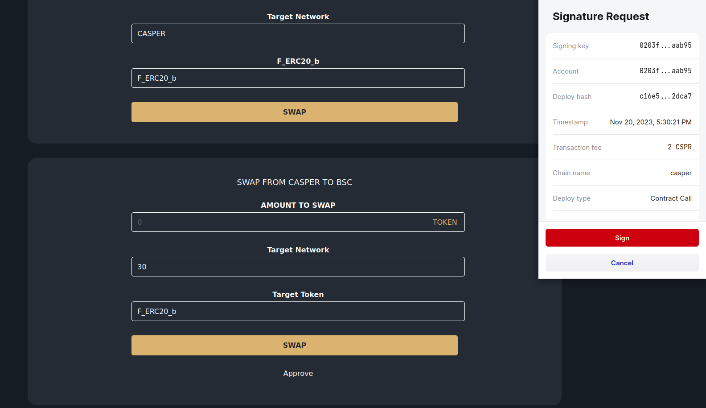
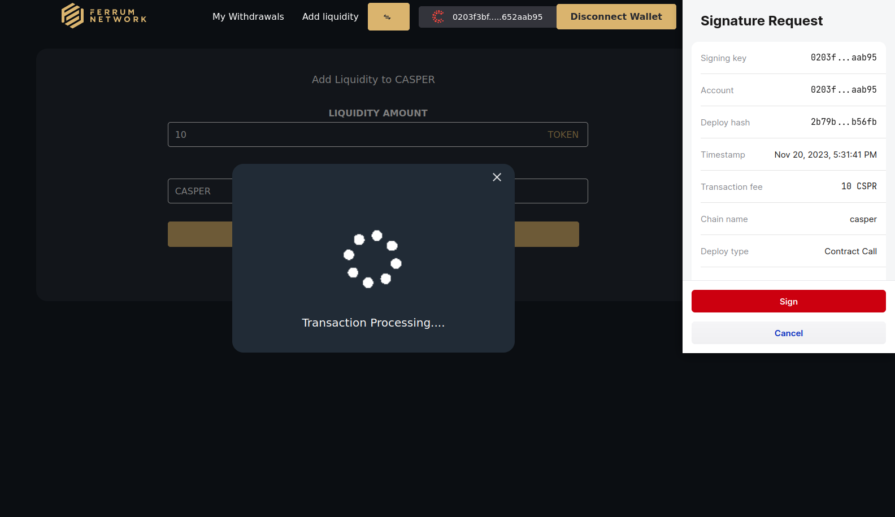
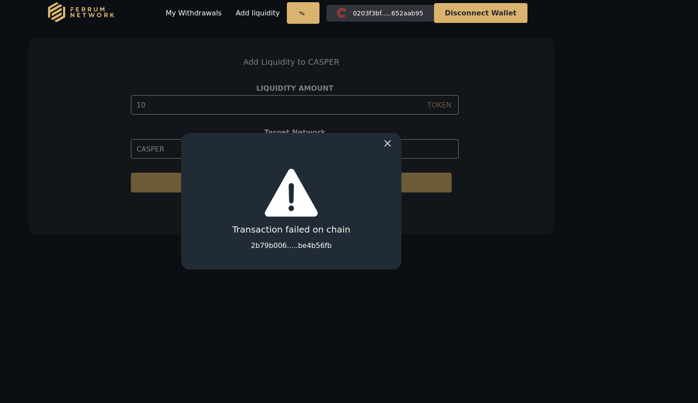
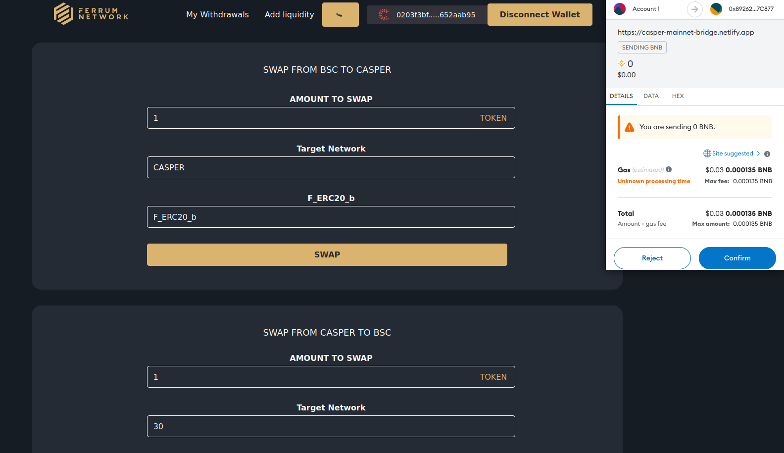
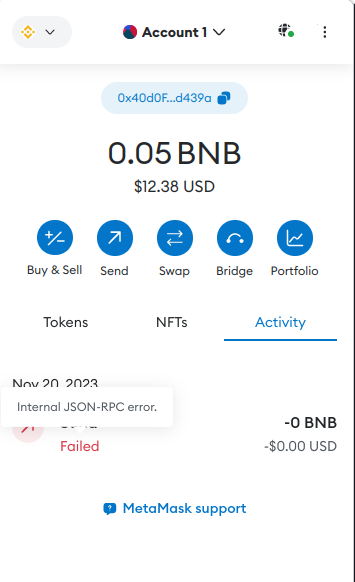
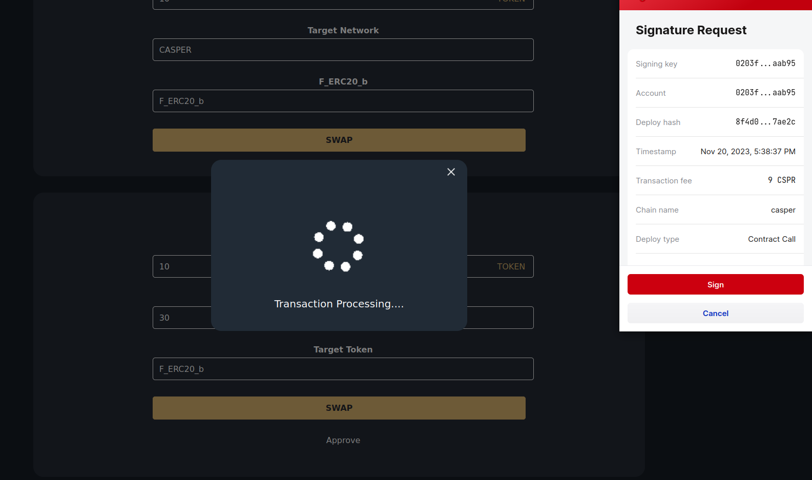
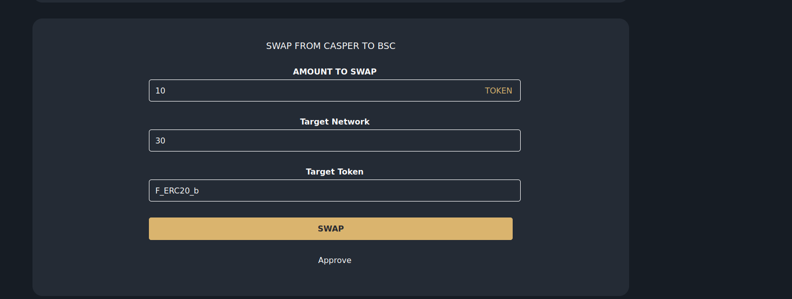
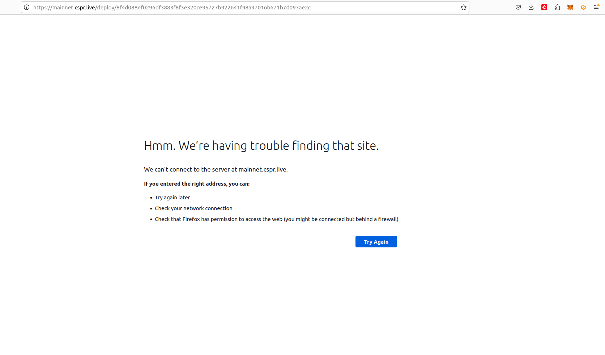
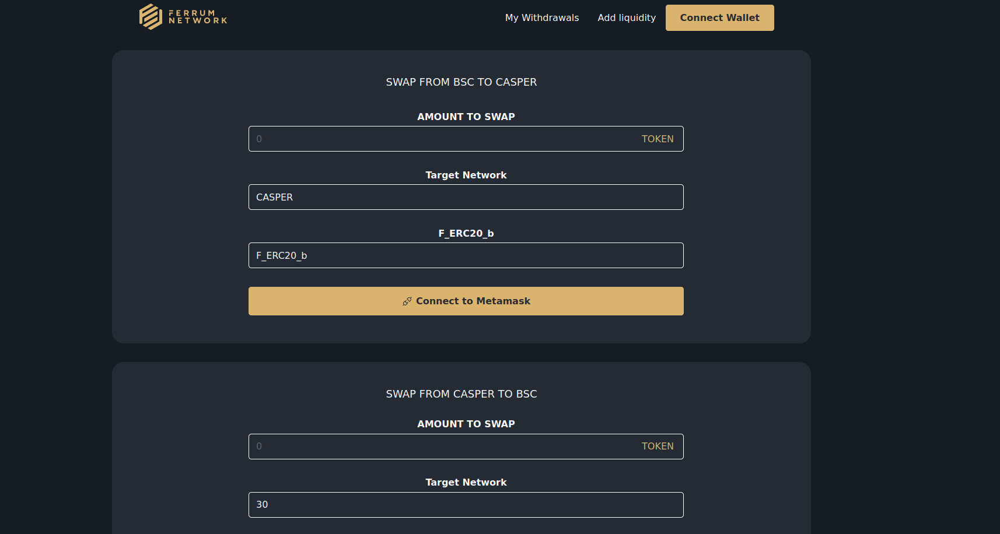
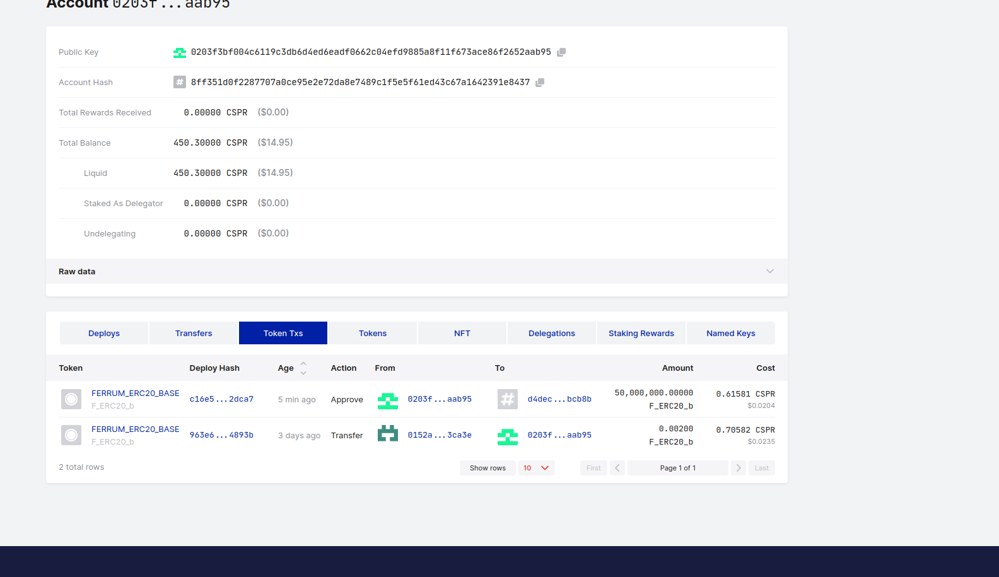

Grant Proposal | [318 - Cross Chain Token Bridge-Staking as a Service Solutions](https://portal.devxdao.com/public-proposals/318)
------------ | -------------
Milestone | 4:5
Milestone Title | Mainnet deployment, testing and incorporation of final feedback - Token Bridge & Incorporate audit feedback and launch - Token Bridge
OP | nickodio_ferrum
Reviewer | Furkan Ahmet Kara

# Milestone Details

## Details & Acceptance Criteria

**Details of what will be delivered in milestone:**

### Milestone 4

- Deploy bridge on mainnet 
- Incorporate audit feedback if audit is completed 
- Conduct internal testing 
- Share the bridge with DEVxDAO and incorporate the final feedback

### Milestone 5 

- Incorporate final audit feedback provided by a third party 
- Launching the bridge on production mainnet

**Acceptance criteria:**

### Milestone 4

- Ability to conduct swaps across below networks with Casper:
1. Casper <> Ethereum
2. Casper <> BSC
3. Casper <> Polygon

- Able to add/remove liquidity on all networks 

- DEVxDAO signs off on mainnet testing

### Milestone 5 

- Sign-off on audit completion by the third party auditor 
- Launch on production mainnet 
- Bridge is live and available to users to bridge token

**Additional notes regarding submission from OP:**

### Milestone 4

https://mail.google.com/mail/u/0?ui=2&ik=f20012be9d&attid=0.1&permmsgid=msg-a:r7591766417104732950&view=att&disp=safe&realattid=f_lkh0obzj0

https://casper-mainnet-bridge.netlify.app/

### Milestone 5 

https://mail.google.com/mail/u/0?ui=2&ik=f20012be9d&attid=0.1&permmsgid=msg-a:r7591766417104732950&view=att&disp=safe&realattid=f_lkh0obzj0

https://casper-mainnet-bridge.netlify.app/

## Milestone Submission

The following milestone assets/artifacts were submitted for review:

Repository | Revision Reviewed
------------ | -------------
https://github.com/ferrumnet/bridge-casper-smart-contracts | [9c25cf9]

# Install & Usage Testing Procedure and Findings

Repo is missing requirements.txt file and required versions of dependencies are missing so it cause problems while operating the automated testing. OP provided the versions that are required and proof of successfull testing to the Reviever. Repos still had issues and the reviewer gave another feedback to OP before proceeding the final review.

By following the instructions in the README of the repository the reviewer was able to build and run the project.

Project does not meet the acceptance criteria for milestone 4 as program only able conduct swaps for Casper <> BSC and missing other 2 chains. Links provided on the additional notes are broken so that reviewer could not reach them and OP did not provide the working links so that the reviewer could not conduct any process for the milestone 5. 

[contracts build](assets/makebuildcontract.txt)

## Overall Impression of usage testing

The project does not meets the acceptance criteria as it only works for Casper<>BSC pair and not other two pair. There is no navigation bar or anything like that to choose target and source networks which should be added.

The documentation includes sufficient installation instructions but more execution instructions should be provided. The project builds without issues. Below are some screenshots from front-end usage testing;

Approve process successfully conducted.

[Approve Hash](https://cspr.live/deploy/c16e51e568f1ae8909fed4550654bf3b0e89e8a91cd825262173cd078e52dca7)

Add liquidity fuction fails with error code ApiError::None [1] (PermissionDenied) while all permissions are given.

[Add Liquidity Hash](https://cspr.live/deploy/2b79b006c45861c1ffe29cdebee93f23d8bafd44ed4e3a73b9512fd9be4b56fb)

BSC to Casper swap fuction failed so withdraw fuction could not be tested.

Casper to BSC swap fuction failed so withdraw function could not be tested.

[Casper To BSC hash](https://cspr.live/deploy/8f4d088ef0296df3883f8f3e320ce95727b922641f98a97016b671b7d097ae2c)

After every transaction, hash of that transaction appear on the screen and directs user to cspr.live page of that transaction hash but it is broken. links should start with cspr.live not mainnet.cspr.live this should be fixed.

There is no main page button or logo of ferrum does not leads user to main page so user needs to refresh the page to go to main page when s/he is on the withdrawl or add liquidity pages. When user refresh the page it gives an erros then leads you to main page but everything will be resetted and user will needs to connect wallets again. Which effects user experience negatively ,so the reviewer strongly recommends to fix this.

Token amount of transactions that shown on the cspr.live is so much and not representing the correct amounts. That should be fixed

Here are some deploy hashes for the processes

[Add Liquidity](https://testnet.cspr.live/deploy/9a3790c489f9f53f542c9773183d1786ab4913cb09b09e312c90dc6859df4d68)

[Approve](https://testnet.cspr.live/deploy/02fe406c832e70d15458527ed35963b7e14232c3b9ef2e31a4c92c57822752b2)

[Swap](https://testnet.cspr.live/deploy/d36397f69b03a15da8ec3d5ee46aae12fb354ad65ac4cf7b1e05c90dd9cf2f02)

[Withdraw](https://testnet.cspr.live/deploy/3df5ecc18e3862b6b9c7d39f05f41678d3f92b6c84efd326f31d5e9e9f61c2ad)

Requirement | Finding
------------ | -------------
Project builds without errors | PASS
Documentation provides sufficient installation/execution instructions | PASS with Notes
Project functionality meets/exceeds acceptance criteria and operates without error | FAIL

# Unit / Automated Testing

Test instructions are given but since the required versions of dependencies are not provided, tests failed when the reviewer just followed the instructions. OP provided a proof of successfull unit tests. Test coverage can be improved.

[test logs](assets/maketest(1).txt)

Requirement | Finding
------------ | -------------
Unit Tests - At least one positive path test | PASS with Notes
Unit Tests - At least one negative path test | PASS with Notes
Unit Tests - Additional path tests | PASS with Notes

# Documentation

### Code Documentation

The project has sufficient code-level documentation and the critical classes and methods have comments but it can be improved.

Requirement | Finding
------------ | -------------
Code Documented | PASS with Notes

### Project Documentation

Project Documentation is at an acceptable level for this milestone but more instructions for usage testing can be added and can be improved with visuals. requirements.txt should be added or correct versions of dependencies should be mentioned in the README. 

Requirement | Finding
------------ | -------------
Usage Documented | PASS with Notes
Example Documented | PASS with Notes

## Overall Conclusion on Documentation

İmprovements mentioned above by the reviewer are important and should be applied. Thus, based on the reviewer's findings, this review should PASS with Notes.

# Open Source Practices

## Licenses

The Project is released under the MIT License.

Requirement | Finding
------------ | -------------
OSI-approved open source software license | PASS

## Contribution Policies

Pull requests and Issues are enabled on the repositories, however the repository does not contain CONTRIBUTING.md and SECURITY.md files, and as this is the last milestone left, OP should fix it.

Requirement | Finding
------------ | -------------
OSS contribution best practices | FAIL

# Coding Standards

## Dependencies

The project had a number of dependencies with high or critical-level security vulnerabilities which need to be fixed as this is the last milestone submitted. 

## General Observations

The project as committed to GitHub and automated tests fail since the correct version of the dependencies are not mentioned. Actions does not run successfull on GitHub and failed on last commit. Code is generally well-structured and readable. User experience on the UI should be improved along with the Reviewer's suggestions on the corresponding review section. Project only works for Casper<>BSC network and not other two pair of networks and functions for BSC fail too ,so it does not meet the acceptance criteria.

Link provided for the milestone 5 is broken so it could not be reviewed and OP does not provide the working link ,so it does not meet the acceptance criteria too.

# Final Conclusion

Project needs improvements that mentioned by the reviewer on above sections. Project does not meet the acceptance criteria as it only work for BSC network and not other two networks. Also, functions on BSC network fail too. Milestone 5 links are broken so it could not be reviewed. Thus this submission should FAIL.

# Recommendation

Recommendation | FAIL
------------ | -----------
