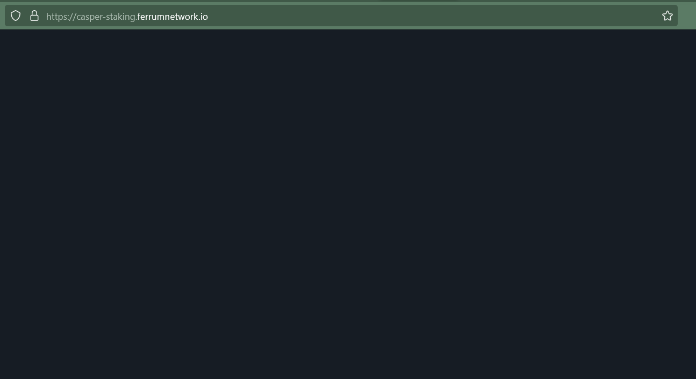
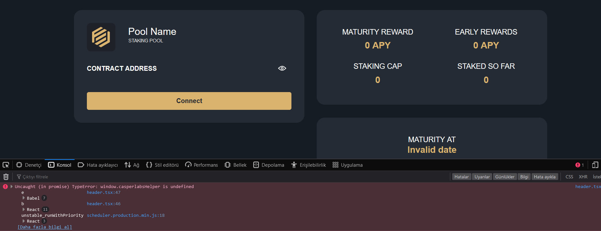
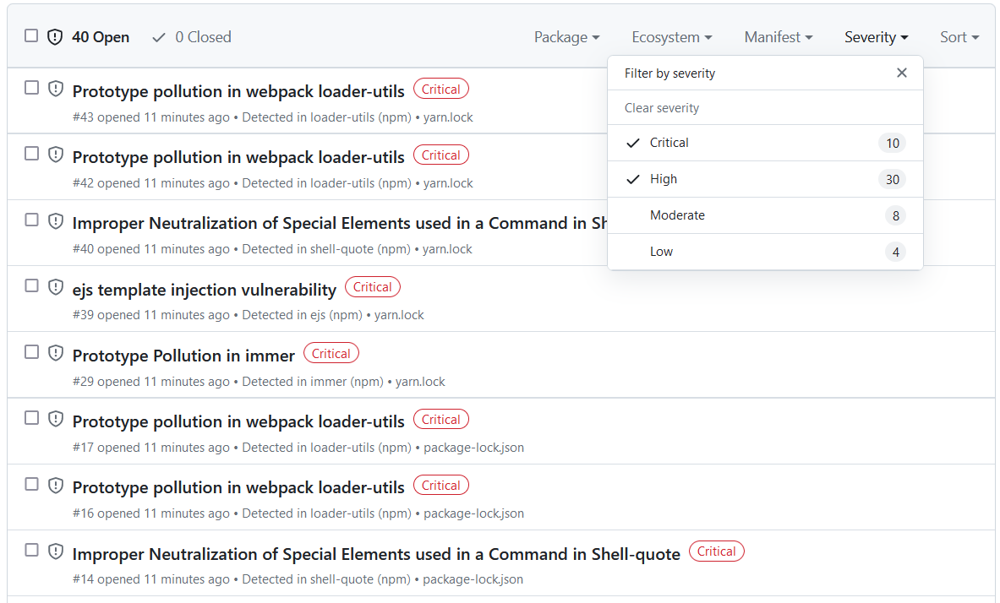

Grant Proposal | [318 - Cross Chain Token Bridge-Staking as a Service Solutions](https://portal.devxdao.com/public-proposals/318)
------------ | -------------
Milestone | 6
Milestone Title | Build, Deploy, and Internally QA Staking Shell App
OP | nickodio_ferrum
Reviewer | Hatice Kaya

# Milestone Details

## Details & Acceptance Criteria

**Details of what will be delivered in milestone:**

- Build and deploy a shell app that will allow traditional staking including: 
1. Deployment of pool
2. Staking Period
3. Mandatory Lock
4. Early Withdrawal
5. Redistribution of Early Withdrawal
6. Maturity
- Integrate bridge with one of the Casper’s compatible wallets
- Share Staking shell app with internal team for QA and incorporate QA feedback

**Acceptance criteria:**

- UI deployment for staking
- Smart Contract Deployment for traditional staking
- Casper compatible wallet integration
1. Ability to proceed through staking flow as described below:
2. Ability to deploy the pool.
3. Ability to set and test staking Periods
4. Ability to set mandatory lock and early withdrawal
5. Ability to set and test reward redistribution of Early Withdrawal
6. Ability to set and test rewards distribution for full maturity
- Internal QA feedback incorporation

**Additional notes regarding submission from OP:**

Regarding Milestone 6, we wanted to provide you with an update that Staking App is completed and is working as per the expectation. However, the URL (https://casper-staking.ferrumnetwork.io/) where the App is deployed needs to be whitelisted by Casper team, a request is already submitted. In the meantime, we have put together a step-by-step guide that will allow you to set up staking on your own end. The staking guide can be found here: https://github.com/ferrumnet/staking-casper-frontend Also, sharing the repos for staking for review: Casper staking frontend: https://github.com/ferrumnet/staking-casper-frontend/releases/tag/v0.5.0 Casper staking SmartContracts: https://github.com/ferrumnet/casper_staking/releases/tag/v0.3.1

## Milestone Submission

The following milestone assets/artifacts were submitted for review:

Repository | Revision Reviewed
------------ | -------------
https://github.com/ferrumnet/casper_staking/releases/tag/v0.3.1 | eacb280
https://github.com/ferrumnet/staking-casper-frontend | 827be5c

# Install & Usage Testing Procedure and Findings

A Gitpod cloud environment running Ubuntu 22.04.2 LTS was used for building and running the project accross two separate repositories.

The smart contract repository (`casper_staking`) was reviewed first. The README at the root level of the repository was empty, leaving the reviewer with no instructions for installing and running that part of the project. After checking the subdirectories, it was seen that there was  a basic README under the `erc20` folder, and a more comprehensive one under the `staking_contract` folder. Following the instructions in the `staking_contract` folder, the staking contracts were built successfully: [staking_contract_build.md](assets/staking_contract_build.md)

It was not possible to deploy or run the staking smart contract by following the instructions on the README.md file under the `staking_contract` directory due to multiple errors: [staking_contract_deploy_command_error.md](assets/staking_contract_deploy_command_error.md)

It was not possible to build, deploy or run the smart contract under the `erc20` directory due to a build error: [erc20_build_failure.md](assets/erc20_build_failure.md)

The frontend part was installed successfully following the instructions on the README.md file of the frontend repository: [frontend_npm_install.md](assets/frontend_npm_install.md)

It was not possible to run the frontend app by following the instructions due to an error: [frontend_start_error.md](assets/frontend_start_error.md)

When attempting to do usage testing on the OP's deployment at the given URL (https://casper-staking.ferrumnetwork.io/), an empty page was encountered.

After communication with the OP, a new url (https://casper-staking.ferrumnetwork.io/b9e3b671e577a7d7a4c53aa7010449b47fb8a811c76582dcc41f65a67a16e23d) was provided for usage testing. The app was loaded and visible on the new url. When the Connect Wallet button was clicked, nothing happened on the user interface, and an error was seen on the developer console of the browser.

## Overall Impression of usage testing

A number of errors were encountered during the build, installation, and usage of the project. It was not possible to do a complete usage testing due to the encountered errors mentioned above.
The documentation does not provide sufficient installation/execution instructions, and containes errors.
Due to the issues mentioned above, and because this is the late milestone of the project, the submission should FAIL on all of the criteria in this section.

Requirement | Finding
------------ | -------------
Project builds without errors | FAIL
Documentation provides sufficient installation/execution instructions | FAIL
Project functionality meets/exceeds acceptance criteria and operates without error | FAIL

# Unit / Automated Testing

The smart contract repository has 6 tests in total under the `staking_contract` directory, covering the positive paths, but there are no tests for negatives paths: [staking_contract_test.md](assets/staking_contract_test.md)

It was not possible to check the tests under the `erc20` directory due to the build error encountered.

The frontend repository does not have any tests apart from a single default test of the React framework.

The OP needs to improve test coverage by adding more tests to the smart contracts under the `staking_contract` directory to cover the negative paths, and make sure the smart contracts under the `erc20` directory also meets the same criteria.

The OP also needs to add tests to the frontend repository.

Due to the issues mentioned above, and because this is the late milestone of the project, the submission should FAIL on all criteria of this section.

Requirement | Finding
------------ | -------------
Unit Tests - At least one positive path test | FAIL
Unit Tests - At least one negative path test | FAIL
Unit Tests - Additional path tests | FAIL

# Documentation

### Code Documentation

The code-level documentation of the project is very limited, lacking standard inline comments which allow auto-generation of the documentation throughout the code-base. The OP needs to improve the code-level documentation significantly by adding standard code comments.

Due to the issues mentioned above, and because this is the late milestone of the project, this submission should fail on the criterion of this section.

Requirement | Finding
------------ | -------------
Code Documented | FAIL

### Project Documentation

The project documentation is not at an acceptable level for this late milestone. OP needs to improve the project level documentation significantly, and fix the errors in the existing documentation. Although there is a good attempt of documentation on the frontend repository, especially the given examples on the smart contract repository are not working.

Due to the issues mentioned above, and because this is the late milestone of the project, this submission should fail on all of the criteria of this section.

Requirement | Finding
------------ | -------------
Usage Documented | FAIL
Example Documented | FAIL

## Overall Conclusion on Documentation

Based on the reviewer's findings, this review should FAIL.

# Open Source Practices

## Licenses

The Project is released under the MIT License.

Requirement | Finding
------------ | -------------
OSI-approved open source software license | PASS

## Contribution Policies

Pull requests and Issues are enabled on the repositories, but the project lacks CONTRIBUTING.md and SECURITY.md.

Due to the issues mentioned above, and because this is the late milestone of the project, this submission should fail in this section.

Requirement | Finding
------------ | -------------
OSS contribution best practices | FAIL

# Coding Standards

## General Observations

Code is generally well-structured and readable. The project is committed to GitHub, but the automated tests are not sufficient, and manual tests were not possible to be done.

The project also has a number of security vulnerabilities dicovered by the dependabot alerts and the CodeQL analysis features of the code hosting platform. Both the smart contract and the frontend repositories have a high number of high and critical severity vulnerability alerts.

Due to the security issues on the repository, and because this is the late milestone of the project, the submission should fail in this section. OP needs to fix the security vulnerabilities for this submission to pass the next review.

# Final Conclusion

Due to all of the issues mentioned in the earlier sections, in the reviewers opinion, this submission should FAIL.

# Recommendation

Recommendation | FAIL
------------ | -------------
