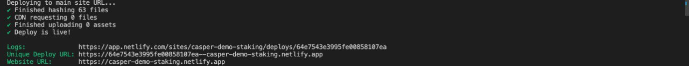
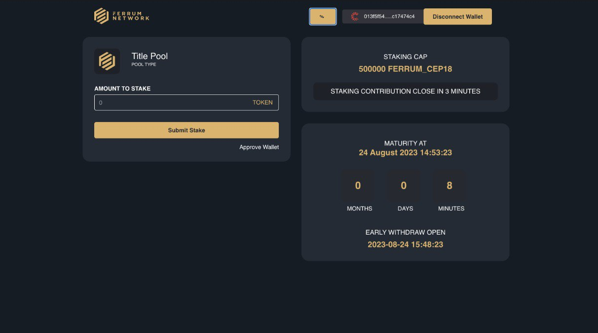
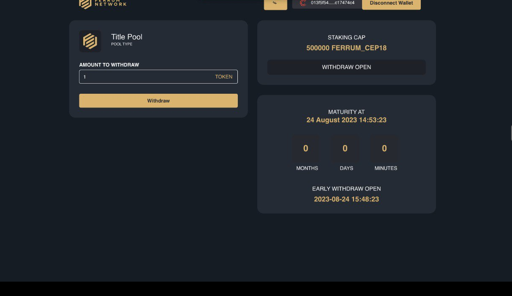

Grant Proposal | [318 - Cross Chain Token Bridge-Staking as a Service Solutions](https://portal.devxdao.com/public-proposals/318)
------------ | -------------
Milestone | 6
Milestone Title | 6 - Cross Chain Token Bridge/Staking as a Service Solutions
OP | nickodio_ferrum
Reviewer | Hatice Kaya

# Milestone Details

## Details & Acceptance Criteria

**Details of what will be delivered in milestone:**

- Build and deploy a shell app that will allow traditional staking including: 
1. Deployment of pool
2. Staking Period
3. Mandatory Lock
4. Early Withdrawal
5. Redistribution of Early Withdrawal
6. Maturity
- Integrate bridge with one of the Casper’s compatible wallets
- Share Staking shell app with internal team for QA and incorporate QA feedback

**Acceptance criteria:**

- UI deployment for staking
- Smart Contract Deployment for traditional staking
- Casper compatible wallet integration
1. Ability to proceed through staking flow as described below:
2. Ability to deploy the pool.
3. Ability to set and test staking Periods
4. Ability to set mandatory lock and early withdrawal
5. Ability to set and test reward redistribution of Early Withdrawal
6. Ability to set and test rewards distribution for full maturity
- Internal QA feedback incorporation

**Additional notes regarding submission from OP:**

Regarding Milestone 6, we wanted to provide you with an update that Staking App is completed and is working as per the expectation. However, the URL (https://casper-staking.ferrumnetwork.io/) where the App is deployed needs to be whitelisted by Casper team, a request is already submitted. In the meantime, we have put together a step-by-step guide that will allow you to set up staking on your own end. The staking guide can be found here: https://github.com/ferrumnet/staking-casper-frontend Also, sharing the repos for staking for review: Casper staking frontend: https://github.com/ferrumnet/staking-casper-frontend/releases/tag/v0.5.0 Casper staking SmartContracts: https://github.com/ferrumnet/casper_staking/releases/tag/v0.3.1

## Milestone Submission

The following milestone assets/artifacts were submitted for review:

Repository | Revision Reviewed
------------ | -------------
https://github.com/ferrumnet/casper_staking/tree/v0.3.3| [61ae850]
https://github.com/ferrumnet/staking-casper-frontend | [f6af0b3]

# Install & Usage Testing Procedure and Findings

A Gitpod cloud environment running Ubuntu 22.04.2 LTS was used for building and running the project across repositories.

The smart contract repository (`casper_staking`) was reviewed first. There was not any README at the root level of the repository, leaving the reviewer with no instructions for installing and running that part of the project. After checking the sub-directories, it was seen that there was a README under the `staking_contract` folder. Following the instructions in the `staking_contract` folder, the staking contracts were built successfully: [staking_contract_build.md](assets/staking_contract_build.md)

The staking smart contract was deployed successfully by following the instructions on the README.md file under the `staking_contract` directory:  [deploy.md](assets/deploy.md)

The frontend part was installed successfully following the instructions on the README.md file of the frontend repository. The frontend part was installed and runned successfully following the instructions on the README.md file of the frontend repository.

## Overall Impression of usage testing

The project builds without errors, the documentation provides sufficient installation and execution instructions, and the project functionality meets the acceptance criteria and operates without errors. Frontend build and run logs and Usage testing screenshots are given below;

Requirement | Finding
------------ | -------------
Project builds without errors | PASS
Documentation provides sufficient installation/execution instructions | PASS
Project functionality meets/exceeds acceptance criteria and operates without error | PASS

# Unit / Automated Testing

The smart contract repository has 11 tests in total under the `staking_contract` directory, covering the positive paths and negatives paths: [staking_contract_test.md](assets/staking_contract_test.md)

Due to the issues mentioned above, and because this is the late milestone of the project, the submission should PASS  on all criteria of this section.

Requirement | Finding
------------ | -------------
Unit Tests - At least one positive path test | PASS 
Unit Tests - At least one negative path test | PASS 
Unit Tests - Additional path tests | PASS

# Documentation

### Code Documentation

The reviewer has observed that the project has sufficient code-level documentation with properly formatted summaries and comments on the critical classes and methods.

Requirement | Finding
------------ | -------------
Code Documented | PASS

### Project Documentation

Project Documentation is at an acceptable level for this milestone.

Requirement | Finding
------------ | -------------
Usage Documented | PASS
Example Documented | PASS

## Overall Conclusion on Documentation

Based on the reviewer's findings, this review should PASS with Notes.

# Open Source Practices

## Licenses

The Project is released under the MIT License.

Requirement | Finding
------------ | -------------
OSI-approved open source software license | PASS

## Contribution Policies

Pull requests and Issues are enabled on the repositories, and also the project contains CONTRIBUTING.md and SECURITY.md.

Requirement | Finding
------------ | -------------
OSS contribution best practices | PASS

# Coding Standards

## Dependencies

The project had a number of dependencies with high or critical-level security vulnerabilities. 

## General Observations

Code is generally well-structured and readable. The project as committed to GitHub and both the automated tests and the manual tests pass. However, the project has a number of dependencies with high or critical-level security vulnerabilities.

Due to the security issues on the repository, and because this is the late milestone of the project, the submission should fail in this section. OP needs to fix the security vulnerabilities for this submission to pass the next review.

# Final Conclusion

Due to all of the issues mentioned in the earlier sections, in the reviewers opinion, this submission should PASS.

# Recommendation

Recommendation | PASS
------------ | -----------
