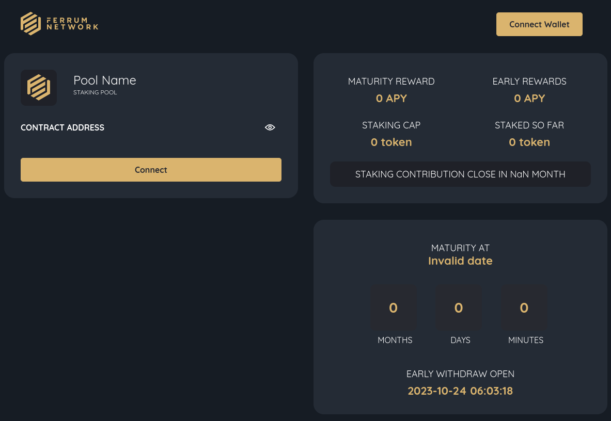
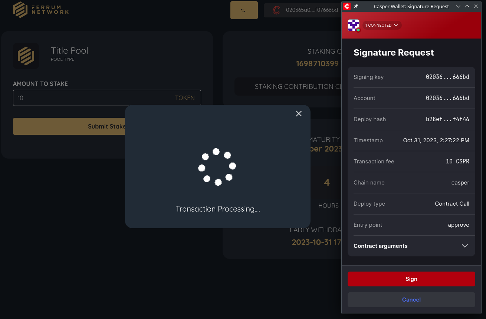
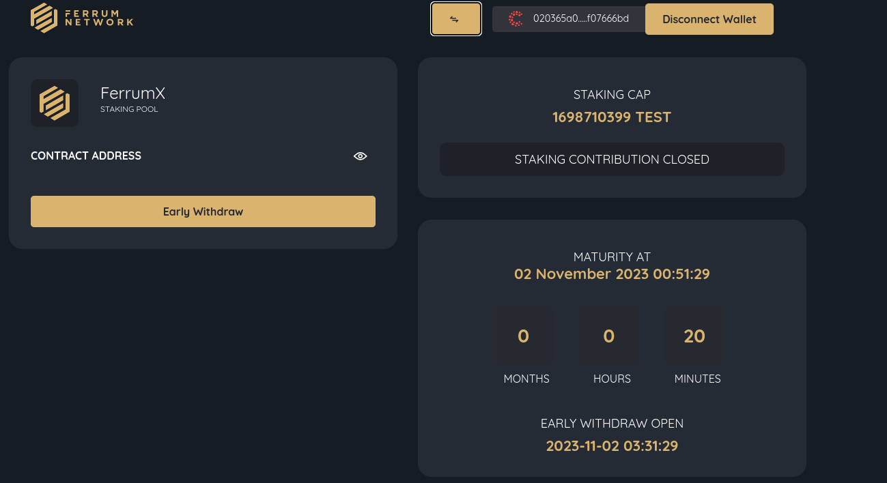
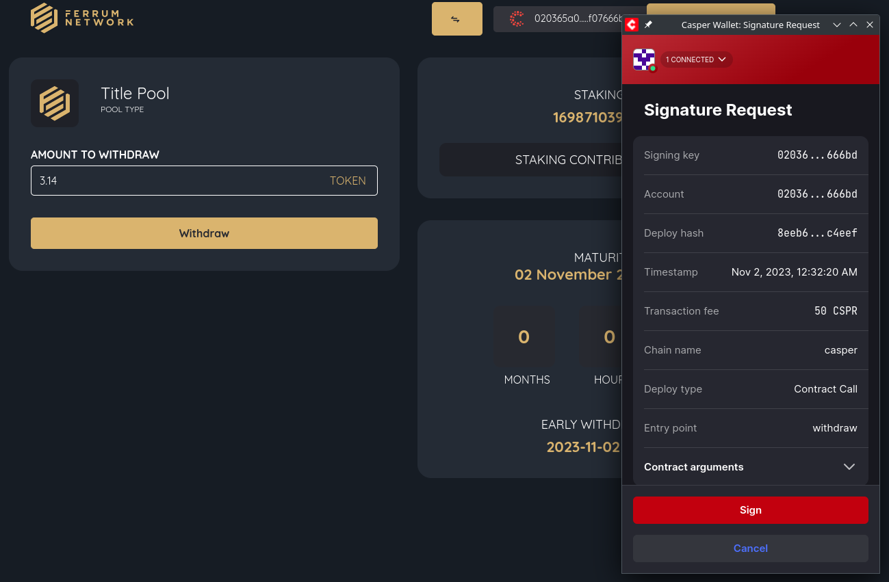
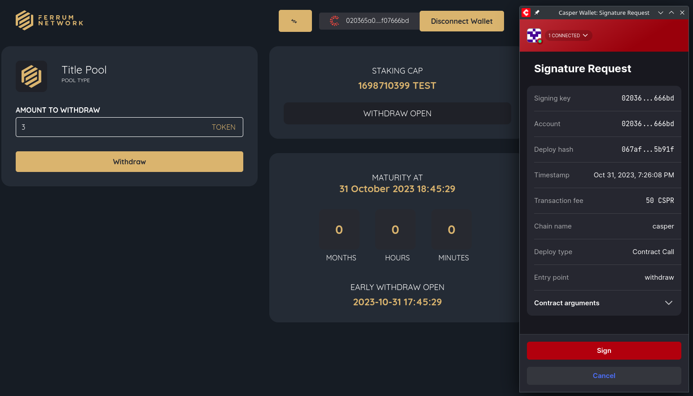
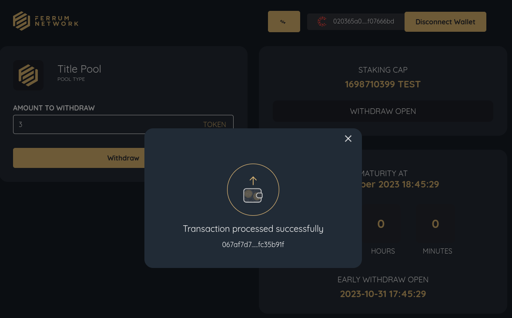

Grant Proposal | [318 - Cross Chain Token Bridge/Staking as a Service Solutions](https://portal.devxdao.com/public-proposals/318)
------------ | -------------
Milestone | 8:9
Milestone Titles | Mainnet deployment, testing and incorporation of final feedback - Staking & Incorporate audit feedback and launch - Staking
OP | Nick Odio - EVP of Growth at Ferrum Network
Reviewer | Gökhan Gurbetoğlu <crdao@ggurbet.com>

# Milestone Details

## Details & Acceptance Criteria

### Milestone 8

**Details of what will be delivered in milestone:**

- Deploy staking on mainnet
- Incorporate audit feedback if audit is completed
- Conduct internal testing
- Share the staking mainnet deployment with DEVxDAO and incorporate the final feedback

**Acceptance criteria:**

- Smart Contract Deployment for traditional staking
- Casper compatible wallet integration
    1. Ability to proceed through staking flow as described below:
    2. Ability to deploy the pool.
    3. Ability to set and test staking Periods
    4. Ability to set mandatory lock and early withdrawal
    5. Ability to set and test reward redistribution of Early Withdrawal
    6. Ability to set and test rewards distribution for full maturity
- DEVxDAO signs off on mainnet testing

**Additional notes regarding submission from OP:**

https://mail.google.com/mail/u/0?ui=2&ik=f20012be9d&attid=0.2&permmsgid=msg-a:r7591766417104732950&view=att&disp=safe&realattid=f_lkh0pgph1

https://casper-staking-mainnet.netlify.app/

### Milestone 9

**Details of what will be delivered in milestone:**

- Incorporate final audit feedback
- Launching the traditional staking pool on production mainnet

**Acceptance criteria:**

- Sign-off on audit completion
- Launch on production mainnet
- Staking pool is live for users to stake

**Additional notes regarding submission from OP:**

https://mail.google.com/mail/u/0?ui=2&ik=f20012be9d&attid=0.2&permmsgid=msg-a:r7591766417104732950&view=att&disp=safe&realattid=f_lkh0pgph1

https://casper-staking-mainnet.netlify.app/

## Milestone Submission

The following milestone assets/artifacts were submitted for review:

Repository | Revision Reviewed
------------ | -------------
https://github.com/ferrumnet/casper_staking | 32d8e45

# Install & Usage Testing Procedure and Findings

### Milestone 8

Reviewer used an Ubuntu 22.04.2 LTS cloud instance on GitPod and a local Pardus 23.0 GNU/Linux instance for this review.

Reviewer used the instructions in the `README` to successfully deploy the staking smart contract under `staking_contract` directory. There is also a brilliantly prepared GitHub workflow that automatically builds and deploys the app.

- [Build logs](assets/build.md)
- [GitHub Workflow Logs](assets/workflow.md)

After the installation, reviewer started testing the acceptance criteria on a live server provided by OP.

The ability to deploy was checked with a developer. The configurations were updated and valid deploys were created without any problems. Below is a link to a deploy created during these tests:

- [Local deploy](https://cspr.live/deploy/ab1d448f51907dc63c71962dd842e77b219fcff61f4f8900a8f1bf7ccd32f3b5)

For the UI side, reviewer first signed in using his Casper Wallet. Then, an approval was necessary to make a stake through the app. Reviewer clicked the `Approve` button and then signed it successfully, which then allowed him to make a stake.

- [Approval deploy](https://cspr.live/deploy/b28ef06aa22766815b87d59914d3fce81de078cdfeb5d10937780c51282f4f46)

- [Staking deploy](https://cspr.live/deploy/53cf73bc85ef8db6908ae5010058bbc99070737ea901f33403b9405e2fd7989e)

There is a period for staking, early withdrawal -with less rewards-, and finally a maturity withdrawal. Reviewer waited for the early withdrawal period to be reached after staking. When that is reached, reviewer tried to withdraw some amount of tokens and was successful at the operation without any problems.

- [Early withdrawal deploy](https://cspr.live/deploy/8eeb6ae88014bdfb3e08eba0a2ef0e0c6c8edec1d24e5f51825065ffb03c4eef)

After the early withdrawal window closes, we finally reach the maturity withdrawal period. When the maturity period was reached, reviewer received his rewards and withdrew some tokens using the interface.

- [Maturity withdrawal deploy](https://cspr.live/deploy/067af7d7217b0b89eef11bbc828b05c4bd8fbc8e8fc1b2fc57a10595fc35b91f)

### Milestone 9

The app is successfully deployed on the `mainnet`. However, as a reviewer's note, it should be noted that the app is residing on a Netlify URL which in the reviewer's opinion should be moved to a dedicated URL. This will not affect the outcome of the review since it is out of the scope for its acceptance criteria.

The provided audit document is not available at the links given in the job submission. Mentioning this, OP provided the reviewer with the document. Inspecting the document, reviewer concluded that the integrity of the codebase is securely provided and extensive coverage of improvements have been committed by the auditors. It is not necessary, but it could be a nice touch if OP could provide the audit document at a public URL, again, which is not in the scope of this review. Below are some useful links from the document that can shed some light to the process.

- [Initial commit submitted for the audit: eacb280](https://github.com/ferrumnet/casper_staking/commit/eacb2801c58216dbf9a35aea0cde9d89d40f41f8)
- [Last commit reviewed by the auditing team: 61ae850](https://github.com/ferrumnet/casper_staking/commit/61ae850fd925c18dfd8daf1e785277b6834c5a05)
- [Last audited tag: 0.3.6](https://github.com/ferrumnet/casper_staking/releases/tag/v0.3.6)

## Overall Impression of usage testing

Reviewer installed and ran the app without any problems. The app was meeting the acceptance criteria of the grant proposal.

There are some minor issues which can be added as a note from the reviewer but does not affect the outcome of this part. After every page reload, user needs to reconnect with the wallet. This is merely a choice on the developer's side but it could also benefit from keeping the session online for a bit longer. Also, the user interface buttons and text needs improvements to better visualize the steps of operations to be conducted by a user.

There were some rounding errors at the beginning of the review, which caused errors when staking or withdrawing fractional values such as `3.14`. This was later fixed by the devs. In its current state however, the fractional numbers are automatically rounded to the nearest integer. The OP stated this issue was discussed with the job giver and was decided this way. Since this is the accepted approach, reviewer kept this out of the scope of the review.

Requirement | Finding
------------ | -------------
Project builds without errors | PASS
Documentation provides sufficient installation/execution instructions | PASS
Project functionality meets/exceeds acceptance criteria and operates without error | PASS with Notes

# Unit / Automated Testing

Project has enough test cases that cover the critical functionality required for this milestone. There were some package dependencies for the test cases that were deprecated and would have caused security issues. Reviewer informed OP about this issue and they promptly updated their dependency lists and removed the problematic packages without breaking the tests.
It should also be added that, there are some minor warnings that can be updated for better compatibility and to prevent possible problems that can arise in the future. In its current state, unit tests are sufficient.

- [Unit Tests Logs](assets/test.md)

Requirement | Finding
------------ | -------------
Unit Tests - At least one positive path test | PASS with Notes
Unit Tests - At least one negative path test | PASS with Notes
Unit Tests - Additional path tests | PASS with Notes

# Documentation

### Code Documentation

The code documentation exhibits a high level of quality and thoroughness, having been carefully prepared to offer comprehensive coverage of the entire codebase. Critical code functionality is properly covered with comments, making it easier for developers to comprehend and manage the code effectively.

Requirement | Finding
------------ | -------------
Code Documented | PASS

### Project Documentation

At the start of the review, there were no `README` file present in the root of the repository. After telling this issue to the developers, it is stated that the instructions are inside the `staking_contract` directory. Developers then moved this file into the root of the repository.

In its current state, project documentation is sufficient and provides adequate instructions and information

Requirement | Finding
------------ | -------------
Usage Documented | PASS
Example Documented | PASS

## Overall Conclusion on Documentation

Both code documentation and project documentation is sufficient. There are quite useful code comments for describing the corresponding methods. Project documentation provides satisfactory content to set up and deploy the project properly.

# Open Source Practices

## Licenses

The project is released under MIT license.

Requirement | Finding
------------ | -------------
OSI-approved open source software license | PASS

## Contribution Policies

Project contains clear CONTRIBUTING, SECURITY and CODE OF CONDUCT policies. Pull requests and Issues are enabled on the repositories and the project is set up for public participation.

Requirement | Finding
------------ | -------------
OSS contribution best practices | PASS

# Coding Standards

## General Observations

Source code is well-written and thought out. It is easily readable. General best coding practices are used throughout the project.

# Final Conclusion

The application effectively meets the acceptance criteria set forth. Essential functionality is rigorously tested through unit tests, and the combination of code and general documentation offers comprehensive guidance. The project demonstrates a strong commitment to open-source practices and adheres to coding standards, reflecting a significant level of proficiency. Minor improvements can be made for a better usability experience for users. As a result, the reviewer suggests a resolution of PASS with Notes for these milestones.

# Recommendation

Recommendation | PASS with Notes
------------ | -------------
