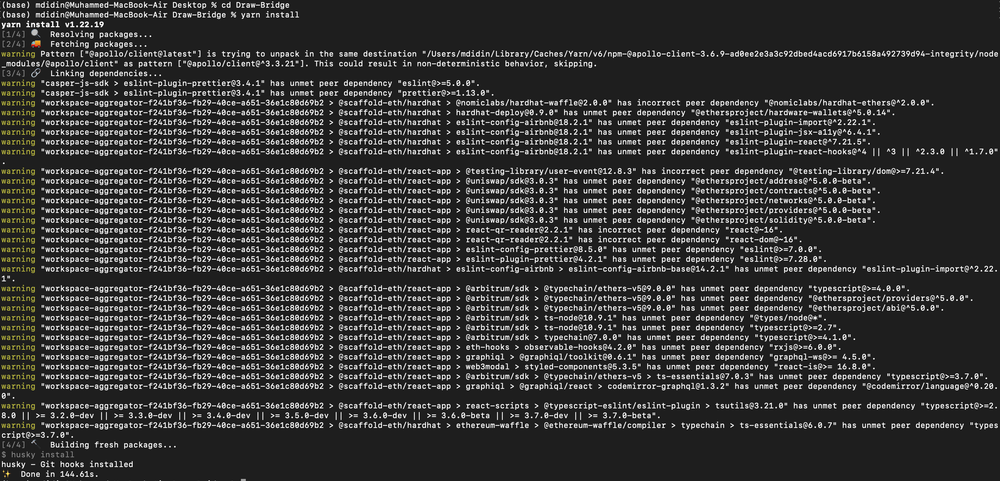
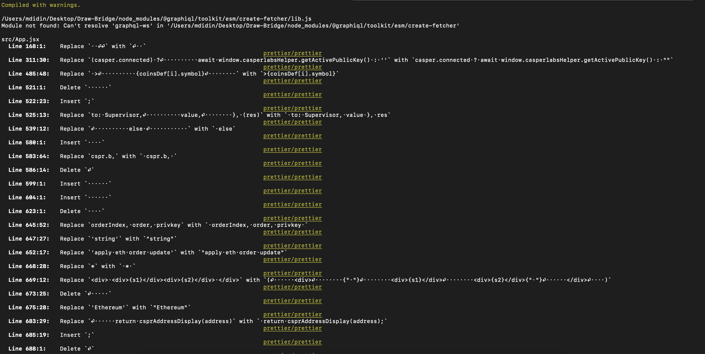
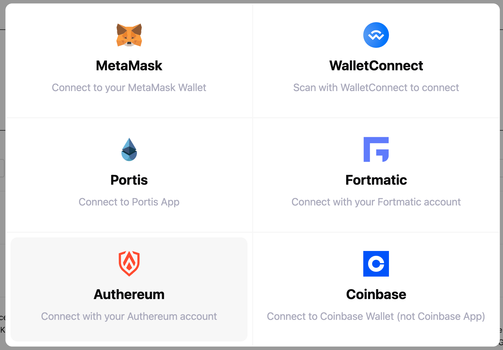
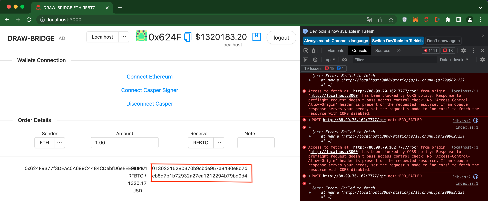
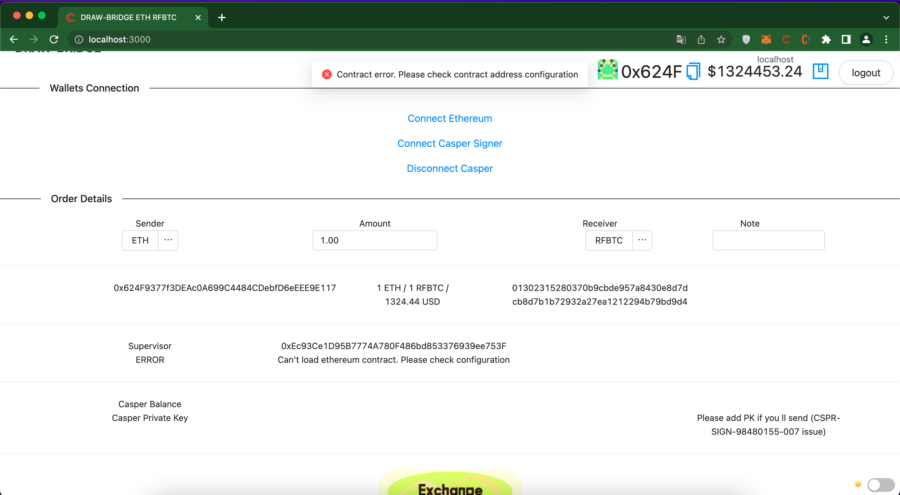
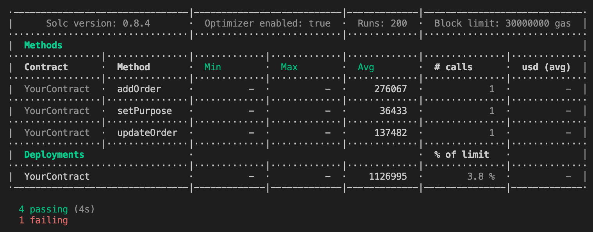

Grant Proposal | [337 - 1 - Royal web wallet and casper connector](https://portal.devxdao.com/public-proposals/337)
------------ | -------------
Milestone | 1
Milestone Title | Development
OP | web3crypto
Reviewer | Muhammed Didin <mdidin80@gmail.com>

## Details & Acceptance Criteria

Development - Submission 2

**Details of what will be delivered in milestone:**
Fully functional webpage, including:
- Login with metamask
- Login with Casper Signer
- Check balance of any token in logged in wallet
- Assignment of token assets (Requires 0x address, token amount, and CSPR address)
    - Repeatable for an arbitrary number of assignments
- CSV export of token assignments

**Acceptance criteria**: 
- Can log in with Metamask on an Ethereum testnet 
- Can log in with Casper Signer on Casper testnet 
- Accurately reports token wallet balance 
- Assignment of token assets takes 0x address, token amount, and CSPR address 
- Assignment fails if any of 0x address, token amount, or CSPR address is invalid 
- Assignment of token assets is shown for many (more than 10) recipients 
- CSV of assignments is accurate


## Milestone Submission

The following milestone assets/artifacts were submited for review:

Repository | Revision Reviewed
------------ | -------------
https://github.com/RoleFarming/Draw-Bridge | 0321555

# Install & Usage Testing Procedure and Findings

The reviewer was able to build the project using the command line instructions given in the README file on the repository.


**But, documentation and instructions are not sufficient for 'configure variables'. Information such as which variable is used, and why and where it should be obtained is not clear. The reviewer thinks that the documentation should be increased because there are too many variables and if possible, it should be visualized. In addition, this issue has been reported as one of the issues that should be corrected by the reviewer after the previous review.**


````bash
const Supervisor = "<supervisor> // supervisor casper address for manage transfers
const CHAIN_NAME = "casper-test" // cspr chain name
const contractRFBTC = "<contract_address>" // eth contract address for rfbtc
const NODE_ADDRESS="http://138.201.54.44:7777/rpc" // cspr node address
const EVENT_STREAM_ADDRESS="http://138.201.54.44:9999/events/main" // cspr event stream
const RFBTC_CONTRACT_HASH = '<contract_address>' // eth contract address for rfbtc

````
The OP mentions a few libraries as prerequisites to building the project:

```bash
node
yarn
```

**But he does not state which versions of these libraries should be used. For example, the reviewer tried to run the program with node version 18 but failed. On the recommendation in the previous reviewer's report, the reviewer used node version 16 and run the program. The reviewer thinks that the prerequisites should be clearly stated in the documentation. This is also one of the issues reported as needing correction by the previous reviewer.**

The reviewer used the following versions for these dependencies : 

```bash
node-16.13.1
yarn-1.22.18-1
```

Following the instructions in the README file, the reviewer was able to :

* Install the project (**runs with warnings**) :


[Full Install Logs](assets/build_1.txt)


* Start a JSON-RPC endpoint on localhost : 


[Full Endpoint Logs](assets/build_2.txt)

* Deploy a contract (**runs with warnings**):


[Full Deploy Logs](assets/deploy.txt)


* Start the frontend on port 3000:


[Full Start Logs](assets/start.txt)


* Connect to the frontend:

The reviewer was able to connect to the frontend 


The reviewer tried to run the test scenario given in the README file :

````bash
1. Connect Metamask
2. Connect Casper Signer
3. Grab ETH Faucet (for testent)
4. Grab CSPR Faucet (for testent) 
5. Enter amount
6. Push Exchane
7. If you are Supervisor:
7.1 enter CSPR privkey for order processing
7.2 Verify tx and push Approve
7.3 Push Cancel if not sure and back ETH manually
````


1- Connect Metamask

The reviewer was able to connect to the localhost ETH network via Metamask.




The informations about the current connected test ETH wallet and  the available test ETH balance seem to be correct.

**The OP is strongly recommended to give a more detailled step-by-step guide on how to use the application and if possible, the documentation should be visualized.**

2- Connect Casper Signer

The reviewer was able to connect to the Casper testnet via CasperSigner. The public key of Caper signer wallet was shown on the page. 



**The balance of the connected account was not displayed on the page 
and an error keeps  being thrown in the web console even while the CORS blocker was active. (Chrome and Brave)**

```console
Access to fetch at 'http://88.99.70.162:7777/rpc' from origin 'http://localhost:3000' has been blocked by CORS policy: Response to preflight request doesn't pass access control check: No 'Access-Control-Allow-Origin' header is present on the requested resource. If an opaque response serves your needs, set the request's mode to 'no-cors' to fetch the resource with CORS disabled.
```

**Also, there are problems with the user interface. Since the page is not responsive, as seen in the screenshot, the texts become intertwined as the page gets smaller.**

3. Grab ETH Faucet (for testnet) 

The reviewer used "Grab fund from the faucet" button in the screen to get test ETHs from the faucet. The process was successful and 1000 test ETH deposited to account.
  
4. Grab CSPR Faucet (for testent)
   
The reviewer used Casper Testnet Faucet to claim 1000 test cspr.

5. Enter amount = 1

6. Push Exchange

Hitting the Exchange button throws an error on the page : **ethContractError**


Since the documentation did not provide sufficient information, the reviewer asked the OP to send a video showing the instructions for use, regardless of quality. The OP didn't post the video and claimed the problem was with the Casper testnet. 


## Overall Impression of usage testing

The reviewer was able to build and run the application. 
**However, the build instructions are not very clear and some important informations are missing, especially on the use of configuration variables and how to set them in the project.**
**It is also not possible to successfully run the whole test scenario provided in the README file.
The reviewer managed to connect his metamask and  casper signer  wallets. But the web console shows continuous errors after connecting to the casper signer wallet. The reviewer also could not manage to send the ETH from the user to supervisor account with the information provided in the README.**


Requirement | Finding
------------ | -------------
Project builds without errors | PASS with Notes
Documentation provides sufficient installation/execution instructions | FAIL
Project functionality meets/exceeds acceptance criteria and operates without error | FAIL

# Code / Unit / Automated Testing

## Code

The reviewer was not able to successfully run the test scenario provided in the README file.
There are no documentation on unit or automated tests.
However, the reviewer run the command "yarn test" to see if there are some tests. 


[Full Test Logs](assets/test-logs.txt)


## Unit / Automated Testing

The project contains only 5 unit tests. 4 of the these tests run successfully but 1 of them failing. There are no negative path tests at all.

Requirement | Finding
------------ | -------------
Unit Tests - At least one positive path test | PASS with Notes
Unit Tests - At least one negative path test | FAIL
Unit Tests - Additional path tests | FAIL

# Documentation

### Code Documentation

The code is overall well documented, but the reviewer thinks that some improvements are needed  :

**- Unused code that gives warnings while installing and building can be removed in order to improve code readability** 

**- Secret informations (like API KEY) should not be committed to github (some "api key" found hardcoded in the repository in the constants.js)**
  
Requirement | Finding
------------ | -------------
Code Documented | PASS with Notes

### Project Documentation

 The reviewer thinks that the documentation needs to be increased and it needs to provide information in detail. Additional notes on documentation: 
- There is no detailed documentation describing the project, its purpose and its main features
- It's hard to understand and to use the "configure variables" part in the README file
- It should be explained why confidential information is requested, and they should not be requested if not required. For example, Casper private key information is requested. It is also not disclosed which Casper account's (User or supervisor) private key information is requested.
- There is no documentation on unit tests and  how to run them
- There is no documentation on the errors that can occur while running and testing the application and how to troubleshoot them.
- There is  lack of usage documentation on the webapp : how it works, what are the steps to use the application, which input should be taken from where and where it should be given.

**These issues have been reported as one of the issues that should be corrected by the reviewer after the previous review.**


Requirement | Finding
------------ | -------------
Usage Documented | FAIL
Example Documented | FAIL


## Overall Conclusion on Documentation

In the reviewer's opinion, the project and usage documentation are not sufficient. 

# Open Source Practices

## Licenses

The project licensed under  Apache-2.0 license.

Requirement | Finding
------------ | -------------
OSI-approved open source software license | PASS

## Contribution Policies

It is stated in README that the project is subject to Casper Labs' common contribution policy. And redirects to [Make Software's contributor guidline](https://github.com/make-software/how-to-casperlabs/blob/master/CONTRIBUTING.md). Also, issues and pull requests parts are open to contribute.

Requirement | Finding
------------ | -------------
OSS contribution best practices | PASS


# Coding Standards

## General Observations

The project builds and the webapp runs successfully. **However the lack of documentation makes it impossible to  do an "exchange" and to run a complete test case**.

# Final Conclusion

- Serious improvements should be done in documentation. Information should be provided to the user about what information should be taken from where and where it should be given. If possible, it should be supported with visuals.
- Issues from previous review should be resolved.
- It should be explained why confidential information is requested, and they should not be requested if not required. For example, Casper private key information is requested but it is not stated why this is needed. It is also not disclosed which Casper account's (User or supervisor) private key information is requested.
- The program gives ETH contract error. Nowhere is it mentioned why this problem arises and how it can be solved.
- Continuous CORS error keeps  being thrown in the web console even while the CORS blocker was active.

In addition, even if it is not from the acceptance criteria; the user interface should be improved and the user experience should be given importance. In this state, the program interface is very difficult to use and does not guide the user.

In the reviewer's opinion, this review should FAIL


# Recommendation

Recommendation | FAIL
------------ | -------------

