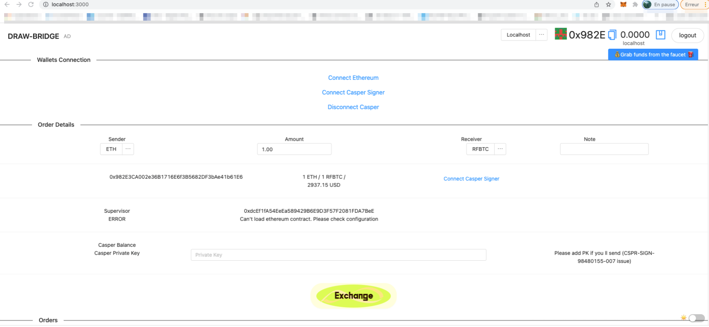
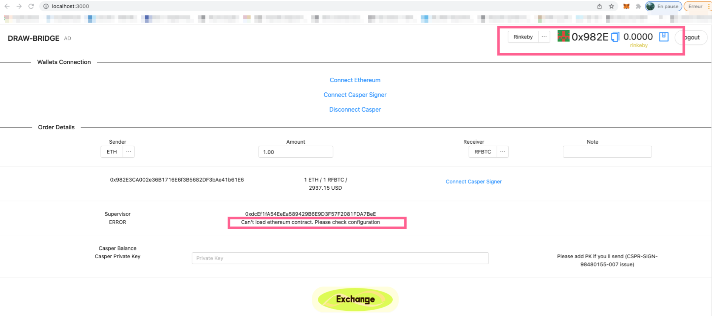
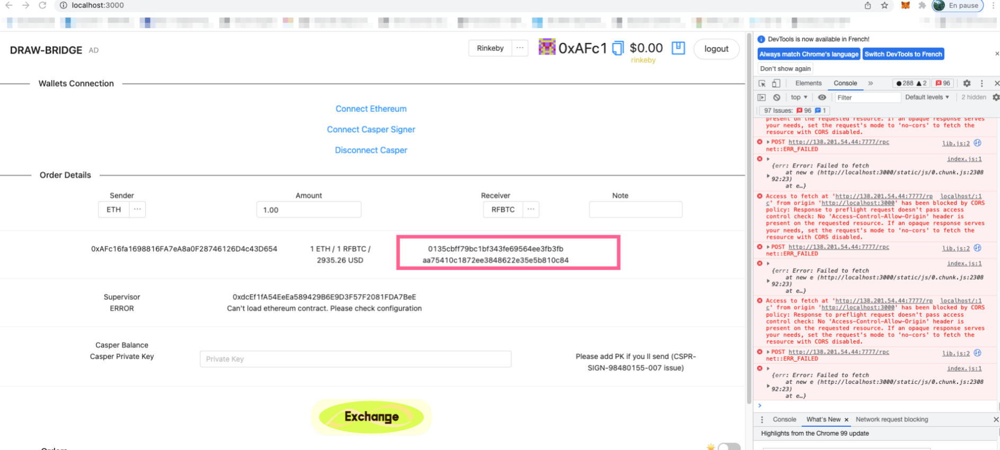

Grant Proposal | [337 - 1 - Royal web wallet and casper connector](https://portal.devxdao.com/public-proposals/337)
------------ | -------------
Milestone | 1
Milestone Title | Royal web wallet and casper connector
OP | web3crypto
Reviewer | M. Chad ABAHMANE

## Details & Acceptance Criteria

Development - Submission 1

**Details of what will be delivered in milestone:**

Fully functional webpage, including:
- Login with metamask
- Login with Casper Signer
- Check balance of any token in logged in wallet
- Assignment of token assets (Requires 0x address, token amount, and CSPR address)
    - Repeatable for an arbitrary number of assignments
- CSV export of token assignments

**Acceptance criteria**: 

- Can log in with Metamask on an Ethereum testnet
- Can log in with Casper Signer on Casper testnet
- Accurately reports token wallet balance
- Assignment of token assets takes 0x address, token amount, and CSPR address
- Assignment fails if any of 0x address, token amount, or CSPR address is invalid
- Assignment of token assets is shown for many (more than 10) recipients
- CSV of assignments is accurate


## Milestone Submission

The following milestone assets/artifacts were submited for review:

Repository | Revision Reviewed
------------ | -------------
https://github.com/RoleFarming/Draw-Bridge | 1c94aa9

# Install & Usage Testing Procedure and Findings

The reviewer was able to build the project using the command line instructions given in the README file on the repository.
**However, documentation on 'configure variables' is not sufficient. It is not clair what each of these variables is used for and 
it is not specified where or how to define these variables.**


````bash
const Supervisor = "<supervisor> // supervisor casper address for manage transfers
const CHAIN_NAME = "casper-test" // cspr chain name
const contractRFBTC = "<contract_address>" // eth contract address for rfbtc
const NODE_ADDRESS="http://138.201.54.44:7777/rpc" // cspr node address
const EVENT_STREAM_ADDRESS="http://138.201.54.44:9999/events/main" // cspr event stream
const RFBTC_CONTRACT_HASH = '<contract_address>' // eth contract address for rfbtc

````

The reviewer spent time looking for a configuration file that could host these variables but was unsuccessful in finding a legitimate candidate file.

The OP cites a few libraries as prerequisites to building the project:

```bash
node
yarn
```

But he does not state which versions of these libraries should be used.
The reviewer used the following versions for these dependencies : 

```bash
node-16.13.1
yarn-1.22.18-1
```

Following the instructions in the README file, the reviewer was able to :

* Install the project on a Rocky Linux virtual server :

```bash
[reviewer@rocky8-mae-vm Draw-Bridge]$ sudo yarn install
yarn install v1.22.18
warning package-lock.json found. Your project contains lock files generated by tools other than Yarn. It is advised not to mix package managers in order to avoid resolution inconsistencies caused by unsynchronized lock files. To clear this warning, remove package-lock.json.
[1/4] Resolving packages...
[2/4] Fetching packages...
warning Pattern ["@apollo/client@latest"] is trying to unpack in the same destination "/usr/local/share/.cache/yarn/v6/npm-@apollo-client-3.3.21-integrity/node_modules/@apollo/client" as pattern ["@apollo/client@^3.3.21"]. This could result in non-deterministic behavior, skipping.
[3/4] Linking dependencies...
warning "casper-erc20-js-client > casper-js-sdk > eslint-plugin-prettier@3.4.0" has unmet peer dependency "eslint@>=5.0.0".
warning "casper-erc20-js-client > casper-js-sdk > eslint-plugin-prettier@3.4.0" has unmet peer dependency "prettier@>=1.13.0".
warning "workspace-aggregator-5b97881e-83d4-4188-a5b5-41a3199ff048 > @scaffold-eth/hardhat > @nomiclabs/hardhat-waffle@2.0.1" has incorrect peer dependency "@nomiclabs/hardhat-ethers@^2.0.0".
warning "workspace-aggregator-5b97881e-83d4-4188-a5b5-41a3199ff048 > @scaffold-eth/hardhat > hardhat-deploy@0.9.0" has unmet peer dependency "@ethersproject/hardware-wallets@^5.0.14".
warning "workspace-aggregator-5b97881e-83d4-4188-a5b5-41a3199ff048 > @scaffold-eth/hardhat > eslint-config-airbnb@18.2.1" has unmet peer dependency "eslint-plugin-import@^2.22.1".
warning "workspace-aggregator-5b97881e-83d4-4188-a5b5-41a3199ff048 > @scaffold-eth/hardhat > eslint-config-airbnb@18.2.1" has unmet peer dependency "eslint-plugin-jsx-a11y@^6.4.1".
warning "workspace-aggregator-5b97881e-83d4-4188-a5b5-41a3199ff048 > @scaffold-eth/hardhat > eslint-config-airbnb@18.2.1" has unmet peer dependency "eslint-plugin-react@^7.21.5".
warning "workspace-aggregator-5b97881e-83d4-4188-a5b5-41a3199ff048 > @scaffold-eth/hardhat > eslint-config-airbnb@18.2.1" has unmet peer dependency "eslint-plugin-react-hooks@^4 || ^3 || ^2.3.0 || ^1.7.0".
warning "workspace-aggregator-5b97881e-83d4-4188-a5b5-41a3199ff048 > @scaffold-eth/react-app > @testing-library/user-event@12.8.3" has incorrect peer dependency "@testing-library/dom@>=7.21.4".
warning "workspace-aggregator-5b97881e-83d4-4188-a5b5-41a3199ff048 > @scaffold-eth/react-app > @uniswap/sdk@3.0.3" has unmet peer dependency "@ethersproject/address@^5.0.0-beta".
warning "workspace-aggregator-5b97881e-83d4-4188-a5b5-41a3199ff048 > @scaffold-eth/react-app > @uniswap/sdk@3.0.3" has unmet peer dependency "@ethersproject/contracts@^5.0.0-beta".
warning "workspace-aggregator-5b97881e-83d4-4188-a5b5-41a3199ff048 > @scaffold-eth/react-app > @uniswap/sdk@3.0.3" has unmet peer dependency "@ethersproject/networks@^5.0.0-beta".
warning "workspace-aggregator-5b97881e-83d4-4188-a5b5-41a3199ff048 > @scaffold-eth/react-app > @uniswap/sdk@3.0.3" has unmet peer dependency "@ethersproject/providers@^5.0.0-beta".
warning "workspace-aggregator-5b97881e-83d4-4188-a5b5-41a3199ff048 > @scaffold-eth/react-app > @uniswap/sdk@3.0.3" has unmet peer dependency "@ethersproject/solidity@^5.0.0-beta".
warning "workspace-aggregator-5b97881e-83d4-4188-a5b5-41a3199ff048 > @scaffold-eth/react-app > arb-ts@0.0.18" has incorrect peer dependency "ethers@~5.0.24".
warning "workspace-aggregator-5b97881e-83d4-4188-a5b5-41a3199ff048 > @scaffold-eth/react-app > graphiql@1.4.7" has incorrect peer dependency "graphql@>= v14.5.0 <= 15.5.0".
warning "workspace-aggregator-5b97881e-83d4-4188-a5b5-41a3199ff048 > @scaffold-eth/react-app > react-qr-reader@2.2.1" has incorrect peer dependency "react@~16".
warning "workspace-aggregator-5b97881e-83d4-4188-a5b5-41a3199ff048 > @scaffold-eth/react-app > react-qr-reader@2.2.1" has incorrect peer dependency "react-dom@~16".
warning "workspace-aggregator-5b97881e-83d4-4188-a5b5-41a3199ff048 > @scaffold-eth/hardhat > hardhat-gas-reporter > eth-gas-reporter@0.2.22" has unmet peer dependency "@codechecks/client@^0.1.0".
warning "workspace-aggregator-5b97881e-83d4-4188-a5b5-41a3199ff048 > @scaffold-eth/hardhat > eslint-config-airbnb > eslint-config-airbnb-base@14.2.1" has unmet peer dependency "eslint-plugin-import@^2.22.1".
warning "workspace-aggregator-5b97881e-83d4-4188-a5b5-41a3199ff048 > @scaffold-eth/react-app > eth-hooks > observable-hooks@4.0.5" has unmet peer dependency "rxjs@>=6.0.0".
warning "workspace-aggregator-5b97881e-83d4-4188-a5b5-41a3199ff048 > @scaffold-eth/react-app > web3modal > styled-components@5.3.0" has unmet peer dependency "react-is@>= 16.8.0".
warning "workspace-aggregator-5b97881e-83d4-4188-a5b5-41a3199ff048 > @scaffold-eth/react-app > react-scripts > @typescript-eslint/eslint-plugin > tsutils@3.21.0" has unmet peer dependency "typescript@>=2.8.0 || >= 3.2.0-dev || >= 3.3.0-dev || >= 3.4.0-dev || >= 3.5.0-dev || >= 3.6.0-dev || >= 3.6.0-beta || >= 3.7.0-dev || >= 3.7.0-beta".
warning "workspace-aggregator-5b97881e-83d4-4188-a5b5-41a3199ff048 > @scaffold-eth/react-app > walletlink > eth-block-tracker > @babel/plugin-transform-runtime@7.14.5" has unmet peer dependency "@babel/core@^7.0.0-0".
warning "workspace-aggregator-5b97881e-83d4-4188-a5b5-41a3199ff048 > @scaffold-eth/hardhat > ethereum-waffle > @ethereum-waffle/compiler > typechain > ts-essentials@6.0.7" has unmet peer dependency "typescript@>=3.7.0".
warning "workspace-aggregator-5b97881e-83d4-4188-a5b5-41a3199ff048 > @scaffold-eth/react-app > graphiql > codemirror-graphql > graphql-language-service-parser > graphql-language-service-types@1.8.2" has incorrect peer dependency "graphql@>= v14.5.0 <= 15.5.0".
[4/4] Building fresh packages...
success Saved lockfile.
$ husky install
husky - Git hooks installed
Done in 89.42s.
```

* Start a JSON-RPC endpoint on localhost : 

```bash
[reviewer@rocky8-mae-vm Draw-Bridge] sudo yarn chain
yarn run v1.22.18
$ yarn workspace @scaffold-eth/hardhat chain
$ hardhat node --network hardhat --no-deploy
Started HTTP and WebSocket JSON-RPC server at http://127.0.0.1:8545/

```


* Deploy a contract (**runs with warnings**):

```bash

[reviewer@rocky8-mae-vm Draw-Bridge]$ sudo yarn deploy
yarn run v1.22.18
$ yarn workspace @scaffold-eth/hardhat deploy
$ hardhat deploy --export-all ../react-app/src/contracts/hardhat_contracts.json
Downloading compiler 0.8.4
Compiling 2 files with 0.8.4
Warning: Unused function parameter. Remove or comment out the variable name to silence this warning.
  --> contracts/YourContract.sol:43:38:
   |
43 |  ... function addOrder(address account, uint256 csprHigh, uint256 csprLow, string memory cs ...
   |                                         ^^^^^^^^^^^^^^^^


Warning: Unused function parameter. Remove or comment out the variable name to silence this warning.
  --> contracts/YourContract.sol:43:56:
   |
43 |  ... address account, uint256 csprHigh, uint256 csprLow, string memory csprHex, uint256 am ...
   |                                         ^^^^^^^^^^^^^^^


Compilation finished successfully
deploying "YourContract" (tx: 0x9921342424c497b0615711fa9216e7359bc961c51da8f19588b4dcc14040bb6f)...: deployed at 0x5FbDB2315678afecb367f032d93F642f64180aa3 with 1074922 gas
$ hardhat run scripts/publish.js
✅  Published contracts to the subgraph package.
Done in 7.52s.

```

* Start the frontend on port 3000:

````bash
[reviewer@rocky8-mae-vm Draw-Bridge]$ sudo yarn start
Starting the development server...

Browserslist: caniuse-lite is outdated. Please run:
npx browserslist@latest --update-db

Why you should do it regularly:
https://github.com/browserslist/browserslist#browsers-data-updating


````

* Connect to the frontend:

The reviewer was able to connect to the frontend 



The reviewer tried to run the test scenario given in the README file :

````bash
1. Connect Metamask
2. Connect Casper Signer
3. Grab ETH Faucet (for testent)
4. Grab CSPR Faucet (for testent) 
5. Enter amount
6. Push Exchane
7. If you are Supervisor:
7.1 enter CSPR privkey for order processing
7.2 Verify tx and push Approve
7.3 Push Cancel if not sure and back ETH manually
````


1- Connect Metamask

The reviewer was able to connect to the testnet ETH network (Rinkeby) via Metamask. However, the information on the available balance is not correct.




2- Connect Casper Signer

The reviewer was unable to connect to the Casper testnet via Chrome CasperSigner extension.
An error is thrown in the web console (Chrome) when the link 'Connect Casper Signer' is hit.



The reviewer stopped at this point because the following test cases of the scenario test depend on it.


## Overall Impression of usage testing

The reviewer was able to build and run the application. 
**However, the build instructions are not very clear and some important informations are missing, especially on the use of configuration variables and how to define them in the project.**
**It is also not possible to run the whole test scenario provided in the README file. Connecting to the Casper testnet via the Casper signer plugin fails and throws an error.**


Requirement | Finding
------------ | -------------
Project builds without errors | PASS with notes
Documentation provides sufficient installation/execution instructions | PASS with notes
Project functionality meets/exceeds acceptance criteria and operates without error | Failed

# Code / Unit / Automated Testing

## Code

The reviewer was not able to run the test scenario provided in the README file.
There are no documentation on unit or automated tests.
However, the reviewer run the command "yarn test" to see if there are somes tests:

```bash

[reviewer@rocky8-mae-vm Draw-Bridge]$ sudo yarn test
yarn run v1.22.18
$ yarn workspace @scaffold-eth/hardhat test
$ hardhat test --network hardhat

  My Dapp
    YourContract
      ✓ Should deploy YourContract
      setPurpose()
0xf39fd6e51aad88f6f4ce6ab8827279cfffb92266 set purpose to Test Purpose
        ✓ Should be able to set a new purpose

·-------------------------------|---------------------------|-------------|-----------------------------·
|      Solc version: 0.8.4      ·  Optimizer enabled: true  ·  Runs: 200  ·  Block limit: 30000000 gas  │
································|···························|·············|······························
|  Methods                                                                                              │
·················|··············|·············|·············|·············|···············|··············
|  Contract      ·  Method      ·  Min        ·  Max        ·  Avg        ·  # calls      ·  usd (avg)  │
·················|··············|·············|·············|·············|···············|··············
|  YourContract  ·  setPurpose  ·          -  ·          -  ·      34210  ·            1  ·          -  │
·················|··············|·············|·············|·············|···············|··············
|  Deployments                  ·                                         ·  % of limit   ·             │
································|·············|·············|·············|···············|··············
|  YourContract                 ·          -  ·          -  ·    1074922  ·        3.6 %  ·          -  │
·-------------------------------|-------------|-------------|-------------|---------------|-------------·

  2 passing (4s)

Done in 15.29s.

```

## Unit / Automated Testing

The project contains only 2 unit tests. These tests run successfully. There are no negative path tests at all.

Requirement | Finding
------------ | -------------
Unit Tests - At least one positive path test | Pass with notes
Unit Tests - At least one negative path test | Failed
Unit Tests - Additional path tests | Failed

# Documentation

### Code Documentation

The code is overall well documented, but the reviewer thinks that some improvements are needed  :

**- Unused code can be removed in order to improve code readability (eg : hardhat/contracts/00_deploy_your_contract.js).** 

**- Secret informations (like API KEY) should not be committed to github (some "api key" found hardcoded in the repository (eg : Alchemy))**
  
Requirement | Finding
------------ | -------------
Code Documented | PASS with note

### Project Documentation

 There is a lack of documentation at several levels :
- There is no detailed documentation describing the project, its purpose and its main features
- It's hard to understand and to use the "configure variables" part in the README file
- There is no documentation on unit tests and on how to run them
- There is no documentation on the errors that can occur while running and testing the application and how to troubleshoot them.
- There is  no step-by-step usage documentation on the application : how it works, what is a Supervisor, etc.

Requirement | Finding
------------ | -------------
Usage Documented | Failed
Example Documented | Failed


## Overall Conclusion on Documentation

In the reviewer's opinion, the project and usage documentation are not sufficient. 

# Open Source Practices

## Licenses

In the grant, it's stated  that the license is an  "Apache License 2.0" one.
But the repository indicates usage of  a "MIT License" one.

Requirement | Finding
------------ | -------------
OSI-approved open source software license | Failed

## Contribution Policies

No Contributing and Security policy

Requirement | Finding
------------ | -------------
OSS contribution best practices | Failed 


# Coding Standards

## General Observations

The project builds and the webapp runs successfully. **However the lack of documentation makes it impossible to  do an "exchange" and to run a complete test case**.

# Final Conclusion

**The project needs serious improvements on  documentation.
The licence  informations provided in the repository are wrong. There are no Contributing  or Security policies attached to the repository.
There are very few unit tests  in the project, the reviewer recommends the OP to add more unit tests for the next submission.**

In the reviewer's opinion, this review should Fail


# Recommendation

Recommendation | Failed
------------ | -------------

