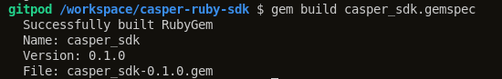
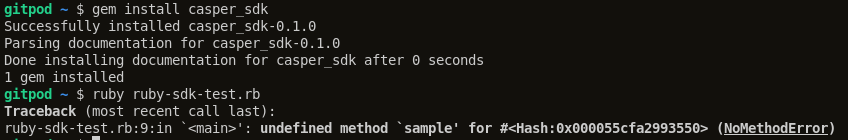
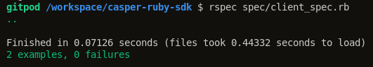

Grant Proposal | [341 - Casper Ruby SDK](https://portal.devxdao.com/public-proposals/341)
------------ | -------------
Milestone | 1
Milestone Title | Alpha
OP | sgulmez
Reviewer | Muhammet Kara

# Milestone Details

## Details & Acceptance Criteria

**Details of what will be delivered in milestone:**

- Base project of Ruby SDK will be created and published on a GitHub repository.
- Following methods of the API will be fully implemented and will return when called by the SDK:
   * chain_get_StateRootHash
   * info_get_peers

**Acceptance criteria:**

- Ruby SDK project available on a public GitHub repository
- It will be possible to connect to a Casper node and retrieve information by using the implemented methods.
- Following methods of the API fully implemented and will return when called:
   * chain_get_StateRootHash
   *  info_get_peers

**Additional notes regarding submission from OP:**

## Milestone Submission

The following milestone assets/artifacts were submitted for review:

Repository | Revision Reviewed
------------ | -------------
https://github.com/saitgulmez/casper-ruby-sdk | 792e505

# Install & Usage Testing Procedure and Findings

Following the instructions in the README of https://github.com/saitgulmez/casper-ruby-sdk, reviewer was
able to successfully build the source code for this milestone into a Ruby gem package on Ubuntu 20.04 in a cloud environment.

## Overall Impression of usage testing

The project builds successfully without errors, and reviewer has observed that it can connect to a Casper node, and run the basic queries required by the milestone after installing the locally built `casper_sdk-0.1.0.gem` package. However, it was observed that the Ruby gem which was installed from the online package repository by using the `gem install casper_sdk` command is out of date, and gives an `undefined method` error due to type mismatch returning from the `info_get_peers` method.

The reviewer recommends keeping the online package up-to-date at all times since it is the most common use case for installing Ruby gems. The reviewer also found the given usage example on the README quite basic in terms of demonstration of functionality, thus recommends improving the example and adding more examples for usage.

Requirement | Finding
------------ | -------------
Project builds without errors | PASS
Documentation provides sufficient installation/execution instructions | PASS with Notes
Project functionality meets/exceeds acceptance criteria and operates without error | PASS

# Unit / Automated Testing

The project has only 2 tests in total which are both covering positive paths. The reviewer has observed that all tests pass when run by using the command given on the README. In the reviewer's opinion, although there are no negative and additional path tests, this is still acceptable for this early milestone as the unit tests are an explicit part of a later milestone.

Requirement | Finding
------------ | -------------
Unit Tests - At least one positive path test | PASS
Unit Tests - At least one negative path test | PASS with Notes
Unit Tests - Additional path tests | PASS with Notes

# Documentation

### Code Documentation

The reviewer has observed that the critical functions of the code-base has an acceptable level of code-level documentation by means of standard inline comments which allow auto-generation of the documentation. It was also observed that the project has an already generated copy of this documentation on the repository, and the command to regenerate the documentation is provided on the README.

Requirement | Finding
------------ | -------------
Code Documented | PASS

### Project Documentation

The project has a very sparse documentation for usage and has only one example with basic usage. The reviewer recommends improving the project documentation as soon as possible. However, since this is the first milestone of the project, there is still time to fix this issue before the final milestone, thus this part of the review can pass with notes in the reviewer's opinion.

Requirement | Finding
------------ | -------------
Usage Documented | PASS with Notes
Example Documented | PASS with Notes

## Overall Conclusion on Documentation

Based on the reviewer's findings, this review should pass with notes.

# Open Source Practices

## Licenses

The Project is released under the Apache-2.0 License.

Requirement | Finding
------------ | -------------
OSI-approved open source software license | PASS

## Contribution Policies

Pull requests and Issues are enabled on the repository. However, the project doesn't contain a CONTRIBUTING or a SECURITY policy. In favor of the long-term sustainability of the open-source project, and the well-being of the projects which might be built on this SDK, the reviewer highly recommends adding these missing policies to the project as soon as possible.

Requirement | Finding
------------ | -------------
OSS contribution best practices | PASS with Notes

# Coding Standards

## General Observations

Code's structure and readability is acceptable. The project as committed to GitHub and both the unit tests and the manual tests pass.

# Final Conclusion

The project provides the functionality described in the grant application and milestone acceptance criteria.

# Recommendation

Recommendation | PASS with Notes
------------ | -------------
