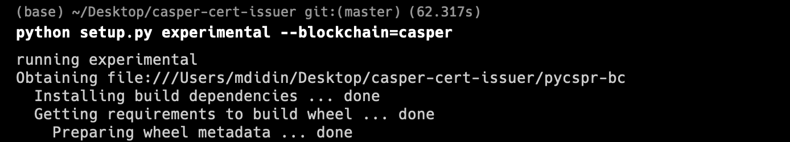
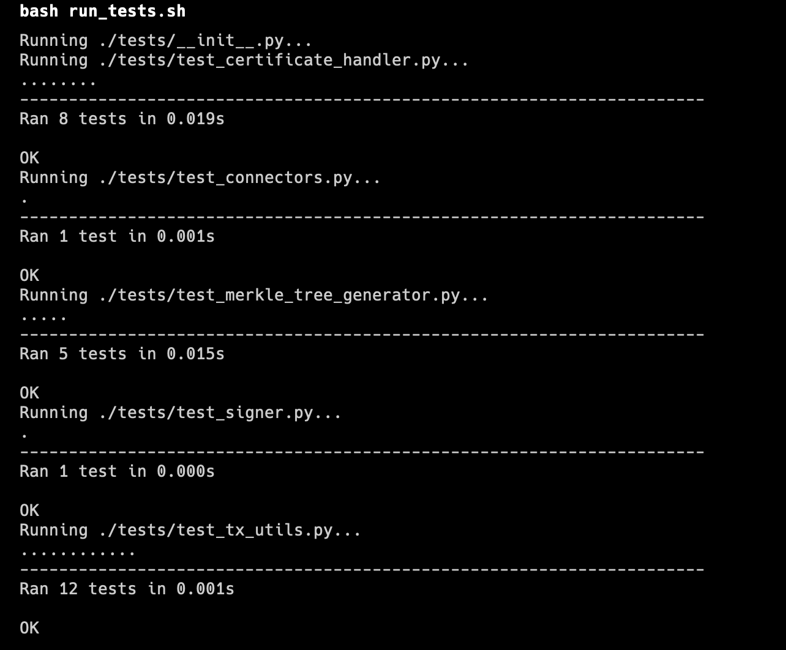

Grant Proposal | [346 - Blockcerts on Casper (with Verifiable Credentials and Open Badges capability)](https://portal.devxdao.com/app/proposal/346)
------------ | -------------
Milestone | 2
Milestone Title | Enable Issuing Casper Blockcerts (Verifiable Credentials) and Finalize Issuing
OP | Zan McNaught
Reviewer | Muhammed Didin <mdidin80@gmail.com>

# Milestone Details

## Details & Acceptance Criteria

**Details of what will be delivered in milestone:**

The forked repos will contain accurate installation and usage instructions. Using these instructions, a user will be able to instantiate and issue a batch of Casper Blockcerts (Open Badges or Verifiable Credentials). When issued, that batch’s hash will be written to the Casper blockchain. With a properly configured validator (Milestone #3 and #4), this hash will be usable for validating Casper Blockcerts.

**Acceptance criteria:**

- A user will be able to instantiate and issue a batch of Casper Blockcerts (Open Badges or Verifiable Credentials)
- That batch’s hash will be written to the Casper blockchain.
- With a properly configured validator (Milestone #3 and #4), this hash will be usable for validating Casper Blockcerts.

**Additional notes regarding submission from OP:**

– To evaluate this submission, you only need to follow the "Casper-specific Instructions" at the top of the README. The rest of the README relates to existing Bitcoin and Ethereum issuing functionality from the original repo.

– Documentation has been clarified and tests have been updated for Milestones #1 and #2 based on feedback from the Milestone #1 submission. Casper-specific tests and negative tests were added.

– Full installation, issuing, and testing functionality was confirmed on a clean Debian 10 VM.

– Help with common issues has been added to the "Troubleshooting" section of the README

## Milestone Submission

The following milestone assets/artifacts were submitted for review:

Repository | Revision Reviewed
------------ | -------------
https://github.com/amazanzan/casper-cert-issuer | 50cda6c

# Install & Usage Testing Procedure and Findings

Following the instructions in the README file of the repository, the reviewer was able to successfully build and run the source code and use the project on macOS Monterey.

### Build

[Full Build Logs](assets/build-logs.txt)

### Run

[Full Run Logs](assets/run-logs.txt)

Sample deploy: https://testnet.cspr.live/deploy/ec44882950e2a88464ad22750afd9fd729bf6ed222040415366ce9c7e44df117

## Overall Impression of usage testing

The project builds without errors, the documentation provides sufficient installation and execution instructions, and the project functionality meets the acceptance criteria and operates without errors.

Requirement | Finding
------------ | -------------
Project builds without errors | PASS 
Documentation provides sufficient installation/execution instructions | PASS
Project functionality meets/exceeds acceptance criteria and operates without error | PASS

# Unit / Automated Testing

The reviewer was able to successfully run the unit tests. The bash script provided in the README file was able to run the unit tests. The project has unit tests for all critical classes and methods.

Requirement | Finding
------------ | -------------
Unit Tests - At least one positive path test | PASS
Unit Tests - At least one negative path test | PASS
Unit Tests - Additional path tests | PASS

# Documentation

### Code Documentation

Properly formatted inline comments on the critical classes and the methods are added to the project. The reviewer thinks that there is a sufficient amount of code documentation.

Requirement | Finding
------------ | -------------
Code Documented | PASS

### Project Documentation

The Readme file has sufficient basic usage instructions for the implemented methods. The reviewer was able to build, run and use the project using project documentation. Moreover, the project has sample usage examples.

Requirement | Finding
------------ | -------------
Usage Documented | PASS 
Example Documented | PASS

## Overall Conclusion on Documentation

In the reviewer's opinion, the project has sufficient documentation. 

# Open Source Practices

## Licenses

The Project is released under the MIT License.

Requirement | Finding
------------ | -------------
OSI-approved open source software license | PASS

## Contribution Policies

The project contains contributing and security policies. In addition, pull request and issue fields are open to public participation.

Requirement | Finding
------------ | -------------
OSS contribution best practices | PASS

# Coding Standards

## General Observations

The project has well-structured and readable code. Code and project documentation is sufficient and they provide the necessary information to use the program. The project complies with open source standards.

# Final Conclusion

The project provides the functionality described in the grant application and milestone acceptance criteria. 

Thus, in the reviewer's opinion, this submission should PASS.

# Recommendation

Recommendation | PASS
------------ | -------------

