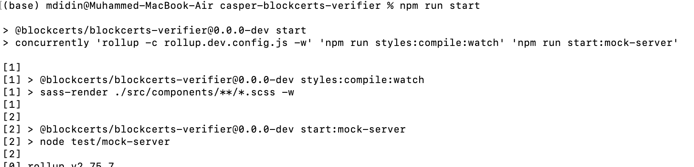
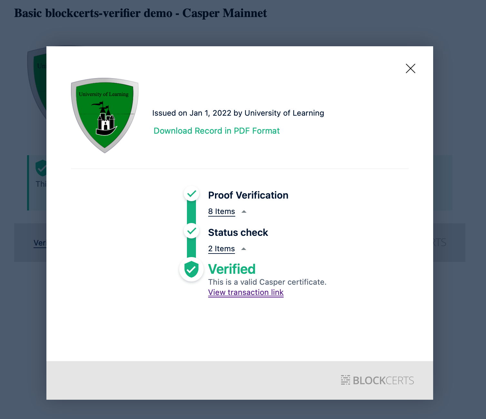

Grant Proposal | [346 - Blockcerts on Casper (with Verifiable Credentials and Open Badges capability)](https://portal.devxdao.com/app/proposal/346)
------------ | -------------
Milestone | 3-4
Milestone Title | Enable Issuing Casper Blockcerts (Verifiable Credentials) and Finalize Issuing
OP | Zan McNaught
Reviewer | Muhammed Didin <mdidin80@gmail.com>

# Milestone Details

## Details & Acceptance Criteria

**Details of what will be delivered in milestone:**

A Casper Blockcerts-compatible validator to a website or web app.

**Acceptance criteria:**

A user will be able to add a Casper Blockcerts-compatible validator to a website or web app. When a Casper Blockcert (Open Badges) is placed in this validator, it will display the credential using an attractive and sophisticated UI with several capabilities, chief of which is being able to process then validate said Blockcert against its batch’s hash.

**Additional notes regarding submission from OP:**

Milestones #3 and #4 were both completed in this repo, so both submission reports will be identical. The target branch (and only branch) to evaluate is called "cspr". All the instructions necessary for evaluation should be in the "Casper-specific Instructions" section at the top of the README.

## Milestone Submission

The following milestone assets/artifacts were submitted for review:

Repository | Revision Reviewed
------------ | -------------
https://github.com/amazanzan/casper-blockcerts-verifier | a839b15

# Install & Usage Testing Procedure and Findings

Following the instructions in the README file of the repository, the reviewer was able to successfully build and run the source code and use the project on macOS Monterey.

### Build

[Full Build Logs](assets/build.txt)

### Usage

After building, the mainpage welcomes the user. 

For verifying for Casper, the reviewer pushed "Casper Testnet" and "Casper Mainnet" buttons.

There are two options: verifying with URL or a JSON file.

The reviewer provided a JSON file both in Casper Testnet and Mainnet. After checking the cert, the program gave the result as these certs are "Verified".

Sample Testnet Deploy: https://testnet.cspr.live/deploy/6b236c80f5b324b1d175496efef10bfcc36f34a22388806d82ba47ab06a5711e

Sample Mainnet Deploy: https://cspr.live/deploy/2067c5e1030fb3ccce7872c595ffb9d3353694f2305a7aab5d2845ebbab59993

The program also gives proper error messages when providing a unverified cert.

## Overall Impression of usage testing

The project builds without errors, the documentation provides sufficient installation and execution instructions, and the project functionality meets the acceptance criteria and operates without errors. Although it is not in the Acceptance criteria, the reviewer recommends improving the mainpage user interface and considering the user experience.

Requirement | Finding
------------ | -------------
Project builds without errors | PASS 
Documentation provides sufficient installation/execution instructions | PASS
Project functionality meets/exceeds acceptance criteria and operates without error | PASS

# Unit / Automated Testing

The reviewer was able to successfully run the unit tests. The bash script provided in the README file was able to run the unit tests. The project has sufficient amount of unit tests which covers all critical classes and methods. There are 7 unit tests that are skipped. The OP told the reviewer that  these are from the forked repository and they were skipped because they are related to the old functionality.

[Full Test Logs](assets/test_logs.txt)

Requirement | Finding
------------ | -------------
Unit Tests - At least one positive path test | PASS
Unit Tests - At least one negative path test | PASS
Unit Tests - Additional path tests | PASS

# Documentation

### Code Documentation

Properly formatted inline comments on the critical classes and the methods are added to the project. The reviewer thinks that there is a sufficient amount of code documentation.

Requirement | Finding
------------ | -------------
Code Documented | PASS

### Project Documentation

The Readme file has sufficient basic usage instructions for the implemented methods. The reviewer was able to build, run and use the project using project documentation.

Requirement | Finding
------------ | -------------
Usage Documented | PASS 
Example Documented | PASS

## Overall Conclusion on Documentation

In the reviewer's opinion, the project has sufficient documentation. 

# Open Source Practices

## Licenses

The Project is released under the MIT License.

Requirement | Finding
------------ | -------------
OSI-approved open source software license | PASS

## Contribution Policies

The project has Contributing and Security Policies and a Code of Conduct.

Requirement | Finding
------------ | -------------
OSS contribution best practices | PASS

# Coding Standards

## General Observations

The project has well-structured and readable code. Code and project documentation is sufficient and they provide the necessary information to use the program. The project complies with open source standards.

# Final Conclusion

The project provides the functionality described in the grant application and milestone acceptance criteria. 

Thus, in the reviewer's opinion, this submission should PASS.

# Recommendation

Recommendation | PASS
------------ | -------------

