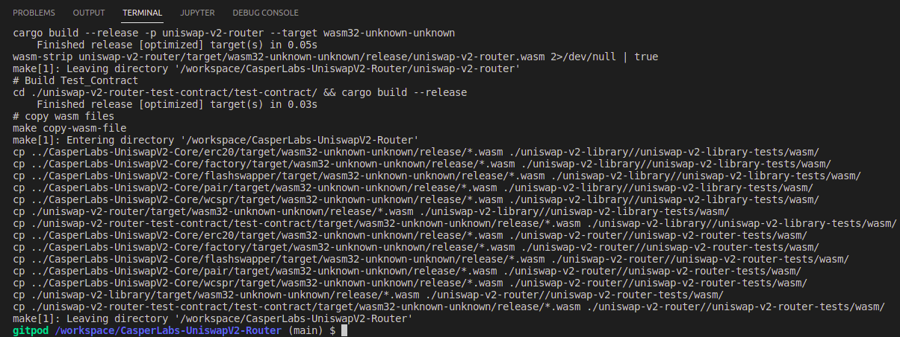
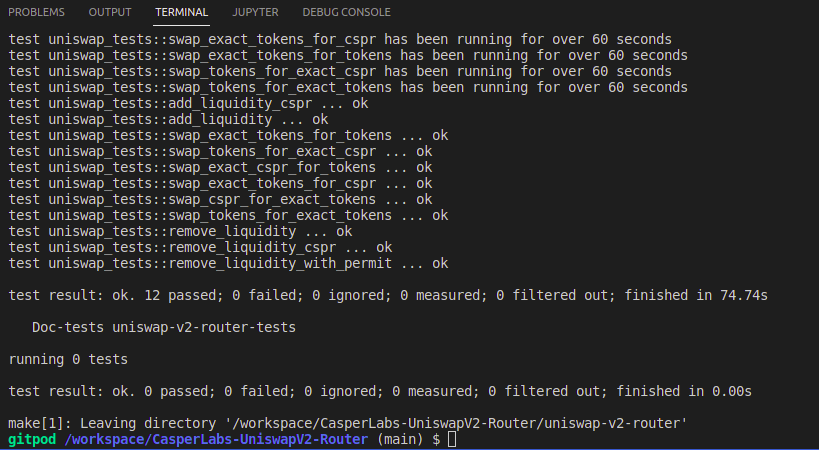

Grant Proposal | [354 - 1.4.2 Upgrades to Uniswap](https://portal.devxdao.com/public-proposals/354)
------------ | -------------
Milestone | 2
Milestone Title | Test Upgrades
OP | david
Reviewer | Furkan Ahmet Kara <furkanahmetkara.fk@gmail.com>

# Milestone Details

## Details & Acceptance Criteria

**Details of what will be delivered in milestone:**

Tests will be upgraded using the new test runner and architecture where applicable.

A 5000 advance payment is requested for this.

**Acceptance criteria:**

Smart contract tests will be upgraded to use the new test runner features and we will add tests that can (finally) verify return values for inter-contract communications.

**Additional notes regarding submission from OP:**

These are now using:

casper-contract = "1.4.4"
casper-engine-test-support = "2.2.0"
casper-execution-engine = "2.0.0"
casper-types = "1.5.0"
casper-hashing = "1.4.3"

## Milestone Submission

The following milestone assets/artifacts were submitted for review:

Repository | Revision Reviewed
------------ | -------------
https://github.com/Rengo-Labs/CasperLabs-UniswapV2-Core | 44a3e81
https://github.com/Rengo-Labs/CasperLabs-UniswapV2-Router | e128642

# Install & Usage Testing Procedure and Findings

Initially, the reviewer tried to build projects by following the instructions in both READMEs but encountered some typos, which caused the build to fail, but the reviewer informed OP about them, and OP fixed them. Now both of the repositories build and run successfully.

### `CasperLabs-UniswapV2-Core`

There were typos in the [README](https://github.com/Rengo-Labs/CasperLabs-UniswapV2-Core). After informing OP about them, OP fixed typos, so the project builds and runs successfully now. Here are logs for build and tests:

[CoreBuildLogs](assets/corebuildlogs.md)

[CoreTestLogs](assets/coretestlogs.md)

### `CasperLabs-UniswapV2-Router`

There were typos in the [README](https://github.com/Rengo-Labs/CasperLabs-UniswapV2-Core). After informing OP about them, OP fixed typos. Also, the [README's](https://github.com/furkanahmetk/CasperLabs-UniswapV2-Router/blob/main/README.md) "Install the prerequisites" part needed some improvements and clarifications. The reviewer reported them to OP, and OP fixed them immediately.

In addition to the typo in install instructions, there was a typo in [Makefile](https://github.com/Rengo-Labs/CasperLabs-UniswapV2-Router/blob/main/Makefile) which leads to an error. After informing OP, OP fixed all of them and project build and run without errors. Here are logs for build and tests:

[RouterBuildLogs](assets/routerbuildlogs.md)

[RouterTestLogs](assets/routernewtestlogs.txt)

## Overall Impression of usage testing

### `CasperLabs-UniswapV2-Core`

Usage instructions are now clear, easy to understand, and easy to apply.

Requirement | Finding
------------ | -------------
Project builds without errors | PASS
Documentation provides sufficient installation/execution instructions | PASS
Project functionality meets/exceeds acceptance criteria and operates without error | PASS

### `CasperLabs-UniswapV2-Router`

Usage instructions are now clear, easy to understand, and easy to apply.

Requirement | Finding
------------ | -------------
Project builds without errors | PASS
Documentation provides sufficient installation/execution instructions | PASS
Project functionality meets/exceeds acceptance criteria and operates without error | PASS

# Unit / Automated Testing

### `CasperLabs-UniswapV2-Core`

The project has unit tests for all critical classes and methods. [CI Actions](https://github.com/Rengo-Labs/CasperLabs-UniswapV2-Core/actions/runs/2741059743/jobs/4296943773) was active on the GitHub repository. The reviewer checked the tests in CI Actions, and they were executed on without errors. The reviewer ran tests manually by following the instructions on the README of the project, and they were completed successfully too. Here is the test logs:

[CoreTestLogs](assets/coretestlogs.md)

Requirement | Finding
------------ | -------------
Unit Tests - At least one positive path test | PASS
Unit Tests - At least one negative path test | PASS
Unit Tests - Additional path tests | PASS

### `CasperLabs-UniswapV2-Router`

The project has unit tests written for all critical classes and methods. CI Actions was not active on the GitHub repository. Initially, the reviewer ran tests manually by following the instructions on the README of the project and encountered multiple "error[E0308]: mismatched types" errors. After informing OP, OP fixed errors. After the fix, the reviewer was able to run tests run successfully. Here are the test logs:

[RouterTestLogs](assets/routernewtestlogs.txt)

Requirement | Finding
------------ | -------------
Unit Tests - At least one positive path test | PASS
Unit Tests - At least one negative path test | PASS
Unit Tests - Additional path tests | PASS

# Documentation

### Code Documentation

The code has a sufficient amount of inline comments and low-level documentation.

Requirement | Finding
------------ | -------------
Code Documented | PASS

### Project Documentation

### `CasperLabs-UniswapV2-Core`

The README file provides the necessary information to overview the project quickly. The README has a sufficient amount of instructions usage documentation overall.

Requirement | Finding
------------ | -------------
Usage Documented | PASS
Example Documented | PASS

### `CasperLabs-UniswapV2-Router`

The README file provides the necessary information to overview the project quickly. The README has a sufficient amount of instructions usage documentation overall.

Requirement | Finding
------------ | -------------
Usage Documented | PASS
Example Documented | PASS

## Overall Conclusion on Documentation

In the reviewer's opinion, install and usage instructions documentation for the project is sufficient for this milestone.

# Open Source Practices

## Licenses

### `CasperLabs-UniswapV2-Core`

The Project is released under the GNU General Public License v3.0.

Requirement | Finding
------------ | -------------
OSI-approved open source software license | PASS

### `CasperLabs-UniswapV2-Router`

The Project is released under the GNU General Public License v3.0.

Requirement | Finding
------------ | -------------
OSI-approved open source software license | PASS

## Contribution Policies

Both of the projects contain a CONTRIBUTING and SECURITY policy that links to a Code of Conduct. Pull requests and Issues are enabled.

Requirement | Finding
------------ | -------------
OSS contribution best practices | PASS

# Coding Standards

## General Observations

The code is well written and has a sufficient amount of comments as general on both repositories.

### `CasperLabs-UniswapV2-Core`

This part of the project meets the acceptance criteria. Code repo is available, test scripts have been written and included in the repository, and CI Actions are active. Source code is well written and has a sufficient amount of code-level documentation. The reviewer reported a minor typo and OP fixed them.

### `CasperLabs-UniswapV2-Router`

This part of the project meets the acceptance criteria. Code repo is available, test scripts have been written and included in the repository, and CI Actions are active. Source code is well written and has a sufficient amount of code-level documentation. The reviewer reported some minor typos and reported some necessary changes to install instructions. OP fixed the reported issues.

# Final Conclusion

The project is well structured and documented in detail, along with usage and installation instructions. Low-level code documentation is well enough. The project meets the acceptance criteria of the milestone. The reviewer recommends that this submission should PASS.

# Recommendation

Recommendation | PASS
------------ | -------------
