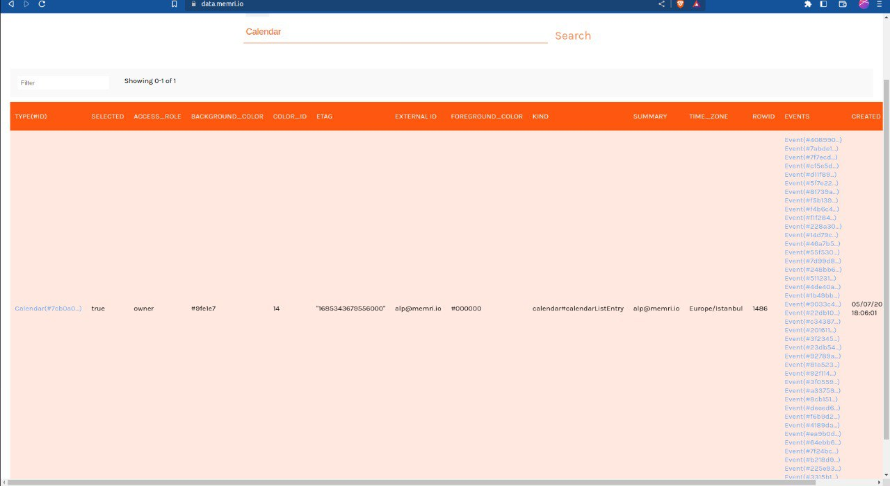
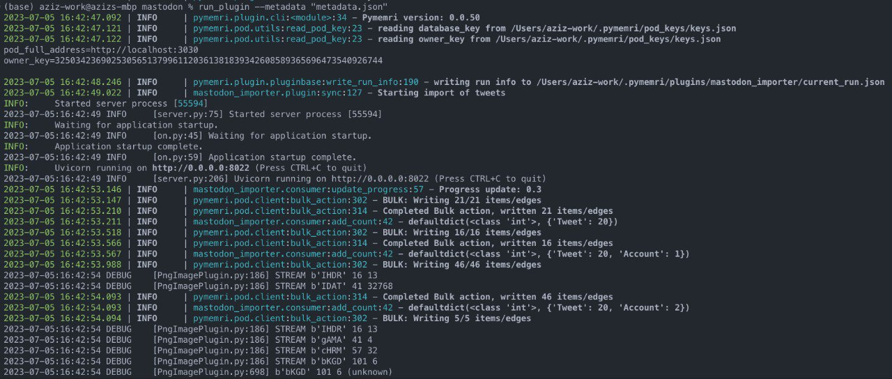

Grant Proposal | [38 - Memri Data Privacy DAO based on the MVPR](https://portal.devxdao.com/public-proposals/38)
------------ | -------------
Milestone | 5
Milestone Title | Plugins Batch 4 - Submission 2
OP | Memri
Reviewer | Muhammed Didin <mdidin80@gmail.com>

# Milestone Details

## Details & Acceptance Criteria

**Details of what will be delivered in milestone:**

5 plugins for the Memri POD.

**Acceptance criteria:**

Each plugin must adhere to the following acceptance criteria: https://gitlab.memri.io/memri/docs.memri.io/-/wikis/Acceptance-criteria-for-plugins. To test install the Memri POD and run the plugin.

**Additional notes regarding submission from OP:**

We addressed all the feedback points provided by the reviewer:
- Summarization Plugin
    - repository (tagged): [https://gitlab.memri.io/memri/plugins/summarization-plugin/-/tags/v0.1](https://gitlab.memri.io/memri/plugins/summarization-plugin/-/tags/v0.1
    - video (new): [https://www.loom.com/share/c2367a272ee144169146657bb29984fd?sid=5c51622e-2937-48fd-9199-231ba67abff2](https://www.loom.com/share/c2367a272ee144169146657bb29984fd?sid=5c51622e-2937-48fd-9199-231ba67abff2)
    - Changelog:
        - provided a test script
- RSS Plugin
    - repository (tagged): [https://gitlab.memri.io/memri/plugins/rss-importer/-/tags/v0.1](https://gitlab.memri.io/memri/plugins/rss-importer/-/tags/v0.1)
    - video (new): [https://www.loom.com/share/b2c52f8b394545e5ae070f73e79f418e?sid=2b7f72ac-ddec-495c-a5d5-b6e6d8eec7b8](https://www.loom.com/share/b2c52f8b394545e5ae070f73e79f418e?sid=2b7f72ac-ddec-495c-a5d5-b6e6d8eec7b8)
    - Changelog:
        - updated readme to reflect the recent changes
- Google Calendar:
    - repository (tagged): [https://gitlab.memri.io/memri/plugins/google-calendar/-/tags/v0.2](https://gitlab.memri.io/memri/plugins/google-calendar/-/tags/v0.2)
    - video (new): [https://www.loom.com/share/ebabd66e4f95499fa477f03796631d60?sid=3d386762-12b4-44b6-a114-19dd1408444e](https://www.loom.com/share/ebabd66e4f95499fa477f03796631d60?sid=3d386762-12b4-44b6-a114-19dd1408444e)
    - Changelog:
        - updated auth flow and provided a script
        - fixed LICENCE
- Google Photos:
    - repository (tagged): [https://gitlab.memri.io/memri/plugins/google-photos/-/tags/v0.3](https://gitlab.memri.io/memri/plugins/google-photos/-/tags/v0.3)
    - video (new): [https://www.loom.com/share/d275473fd7c9485886314bb45505512b?sid=62854ee7-122c-4bc5-8100-d27217f1fba2](https://www.loom.com/share/d275473fd7c9485886314bb45505512b?sid=62854ee7-122c-4bc5-8100-d27217f1fba2)
- Mastodon:
    - repository: [https://gitlab.memri.io/memri/plugins/mastodon](https://gitlab.memri.io/memri/plugins/mastodon)
    - video: [https://www.loom.com/share/320d4cddd8b541719dba1d1e19680170](https://www.loom.com/share/320d4cddd8b541719dba1d1e19680170)
    - Changes:
    - updated readme and fixed minor bugs

Changelogs for all:  
- added more tests as requested
- updated readme and clarified the setting up
- added CONTRIBUTING and SECURITY policies as requested
- added helper scripts for reviewing when necessary
- recorded new videos to reflect changes
- fixed repositories so that issue and pull request publicly accesible
- Improved inline comments

## Milestone Submission

The following milestone assets/artifacts were submitted for review:

Repository | Revision Reviewed
------------ | -------------
https://gitlab.memri.io/memri/plugins/rss-importer | ceb75ab63c667301b7b775c5394882ea493ee8ff
https://gitlab.memri.io/memri/plugins/summarization-plugin | c7555eadfc9a5580ab92d9b64f924f873e3fd835
https://gitlab.memri.io/memri/plugins/google-calendar| d9e2467868cd4213911da9cb1e690620e2e165fa
https://gitlab.memri.io/memri/plugins/google-photos| f6efaffc192ddee5eacda15d58d3198e385aa957   
https://gitlab.memri.io/memri/plugins/mastodon | fff0409594e5e9625c7a00586aaefc3acb98edb2

# Install & Usage Testing Procedure and Findings

Following the instructions in the README file of the repositories, the reviewer was able to successfully build and run the source code and use the project on macOS Monterey. 

Please note that this is second review of the 5. milestone. In this review, issues that failed in the previous review are reviewed.

## Build

[Google Calendar Build Logs](assets/build-google-calendar.txt)

[Google Photos Build Logs](assets/build-google-photos.txt)

[Mastodon Build Logs](assets/build-mastodon.txt)

[RSS Import Build Logs](assets/build-rss-import.txt)

[Summarization Build Logs](assets/build-summarization.txt)

## Usage

### Google Calendar

Following the instructions in the README file of the repository, the reviewer was able to successfully use the project.

Authentication worked successfully, as seen below.

The Google Calendar was successfully imported.

### Mastodon

Following the instructions in the README file of the repository, the reviewer was able to successfully use the project.

Flow worked successfully and imported tweets as seen below.

### Google Photos
Following the instructions in the README file of the repository, the reviewer was able to successfully use the project.

Authentication worked successfully, as seen below.

The photo was successfully imported via Google Photos.

### RSS Importer

Following the instructions in the README file of the repository, the reviewer was able to successfully use the project.

Get Feed

Get Entry

All Entries

Import Feed

### Summarization

Following the instructions in the README file of the repository, the reviewer was able to successfully use the project.

Below is a text that is requested to be summarized and its settings and summary text result.

## Overall Impression of usage testing

The project builds without errors, the documentation provides sufficient installation and execution instructions, and the project functionality meets the acceptance criteria and operates without errors.

Requirement | Finding
------------ | -------------
Project builds without errors | PASS 
Documentation provides sufficient installation/execution instructions | PASS
Project functionality meets/exceeds acceptance criteria and operates without error | PASS

# Unit / Automated Testing

The reviewer was able to successfully run the unit tests. The bash scripts provided in the README files were able to run the unit tests. The project has 29 unit tests which covers all critical classes and methods. 

These tests cover negative and positive paths. For example, "setup feed", "deactivate feed" and "summarize feed" tests are among the 11 tests in the RSS Importer repository; among the 6 tests in the Google Calender repository, there are tests such as "New Event" and "Corrupted Event". This also applies to other repositories. Details on the tests can be found below.

[Google Calendar Test Logs](assets/test-google-calendar.txt)

[Google Photos Test Logs](assets/test-google-photos.txt)

[Mastodon Test Logs](assets/test-mastodon.txt)

[RSS Import Test Logs](assets/test-rss-import.txt)

[Summarization Test Logs](assets/test-summarization.txt)

Requirement | Finding
------------ | -------------
Unit Tests - At least one positive path test | PASS
Unit Tests - At least one negative path test | PASS
Unit Tests - Additional path tests | PASS

# Documentation

### Code Documentation

Properly formatted inline comments on the critical classes and the methods are added to the project. The reviewer thinks that there is a sufficient amount of code documentation.

Requirement | Finding
------------ | -------------
Code Documented | PASS

### Project Documentation

The Readme file has sufficient basic usage instructions for the implemented methods. The reviewer was able to build, run and use the project using project documentation.

However, before the last milestone, the project documentation should be expanded and users should be informed about the usage status in detail.

Requirement | Finding
------------ | -------------
Usage Documented | PASS 
Example Documented | PASS

## Overall Conclusion on Documentation

In the reviewer's opinion, the project has sufficient documentation. 

# Open Source Practices

## Licenses

The Project is released under the Memri Privacy Preserving License 0.6 (an MPL 2.0-based license).

Requirement | Finding
------------ | -------------
OSI-approved open source software license | PASS

## Contribution Policies

The project has Contributing and Security Policies.

Requirement | Finding
------------ | -------------
OSS contribution best practices | PASS

# Coding Standards

## General Observations

The project has well-structured and readable code. Code and project documentation is sufficient and they provide the necessary information to use the program. The project complies with open source standards.

# Final Conclusion

The project provides the functionality described in the grant application and milestone acceptance criteria. 

Thus, in the reviewer's opinion, this submission should PASS.

# Recommendation

Recommendation | PASS
------------ | -------------

