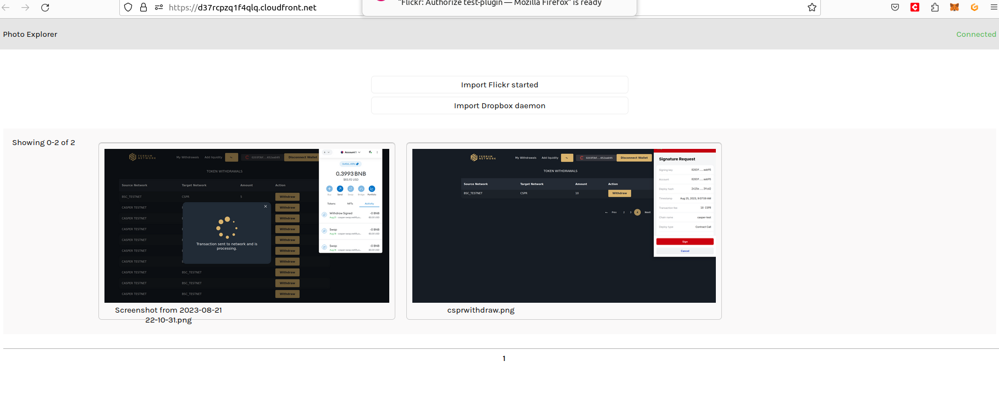
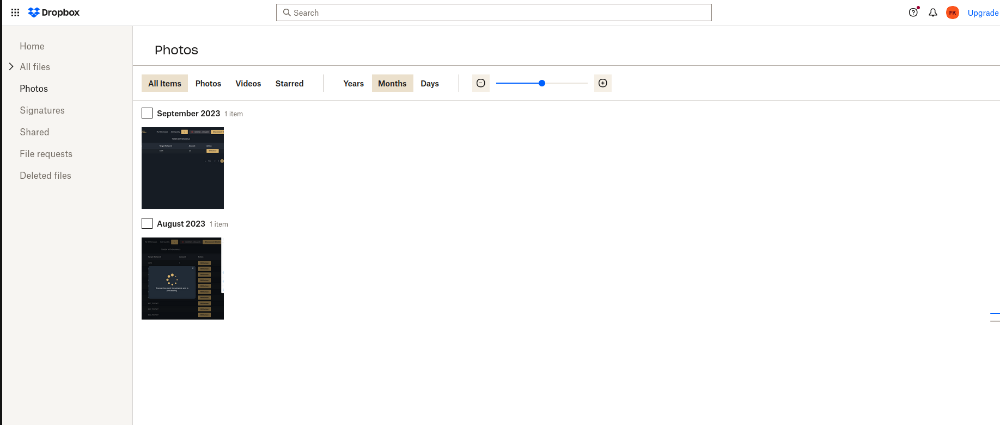
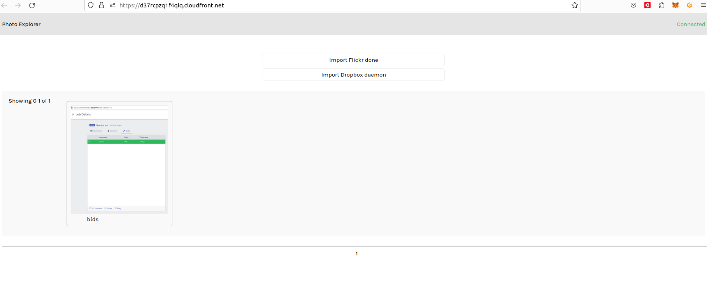
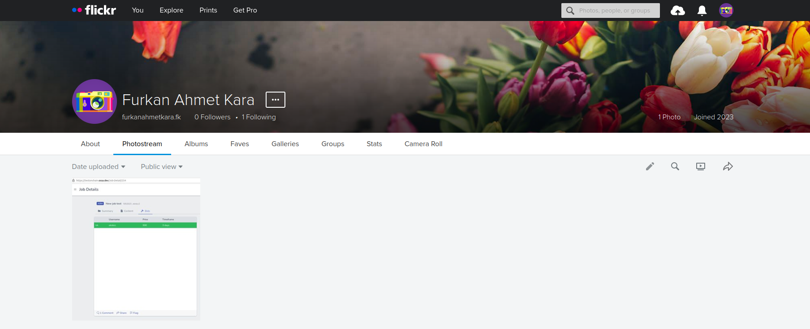

Grant Proposal | [38 - Memri Data Privacy DAO based on the MVPR](https://portal.devxdao.com/public-proposals/38)
------------ | -------------
Milestone | 6
Milestone Title | Plugins Batch 5 - Submission 1
OP | Memri
Reviewer | Furkan Ahmet Kara <furkanahmetkara.fk@gmail.com>

# Milestone Details

## Details & Acceptance Criteria

**Details of what will be delivered in milestone:**

2 plugins for the Memri POD.

**Acceptance criteria:**

Each plugin must adhere to the following acceptance criteria: https://gitlab.memri.io/memri/docs.memri.io/-/wikis/Acceptance-criteria-for-plugins. 
To test install the Memri POD and run the plugin.

**Additional notes regarding submission from OP:**

Dropbox
repository: https://gitlab.memri.io/memri/plugins/dropbox-v2/
video: https://www.loom.com/share/490d044abe3343f3b2903087f71b54e4

Flickr
repository: https://gitlab.memri.io/memri/plugins/flickr/
video: https://www.loom.com/share/7f295c614e614fef9323cdab67872505

## Milestone Submission

The following milestone assets/artifacts were submitted for review:

Repository | Revision Reviewed
------------ | -------------
https://gitlab.memri.io/memri/plugins/dropbox-v2/ | ea7da1e3
https://gitlab.memri.io/memri/plugins/flickr/ | 84cbb391

# Install & Usage Testing Procedure and Findings

## General Notes
It is assumed that the user of the plugins is familiar with setting up a Memri POD as well as examining data in Memri Datastream Explorer at https://data.memri.io/

To test the following plugins the reviewer used https://dev.backend.memri.io/.

## Dropbox Plugin

### Install
By following the instructions in the README the reviewer was able to run the build and tests. Logs can be found below:

[Docker Build](assets/dropboxinstall.md)

### Usage

To test the plugin, the reviewer followed along and performed the same steps as in the videos below: 

[First video](https://www.loom.com/share/490d044abe3343f3b2903087f71b54e4)
[Second video](https://www.loom.com/share/10bd7407ea1244329b8fe2b1ce78093f?sid=a6a57fdf-a620-4791-a738-2f72b813814b)

Here are the usage testing screenshots:

## Flickr Plugin

### Install
By following the instructions in the README the reviewer was able to run the build and tests. Logs can be found below:

[Flickr Build](assets/flickrinstall.md)

### Usage

To test the plugin, the reviewer followed along and performed the same steps as in the videos below: 

[First video](https://www.loom.com/share/7f295c614e614fef9323cdab67872505)
[Second video](https://www.loom.com/share/10bd7407ea1244329b8fe2b1ce78093f?sid=a6a57fdf-a620-4791-a738-2f72b813814b)

Here are the usage testing screenshots:

## Overall Impression of usage testing

Requirement | Finding
------------ | -------------
Project builds without errors | PASS
Documentation provides sufficient installation/execution instructions | PASS with notes
Project functionality meets/exceeds acceptance criteria and operates without error | PASS

# Unit / Automated Testing

## Dropbox plugin
Repo has both positive and negative path tests. Tests are passed but there are some warnings that might need to be checked.

[Docker tests](assets/dropboxtests.md)

## Flickr plugin
Repo has both positive and negative path tests. Tests are passed but there are some warnings that might need to be checked.

[Flicker tests](assets/flickertests.md)

Requirement | Finding
------------ | -------------
Unit Tests - At least one positive path test | PASS with Notes
Unit Tests - At least one negative path test | PASS with Notes
Unit Tests - Additional path tests | PASS with Notes

# Documentation

### Code Documentation

As general the code is clear, well structured and readable. But in the reviewer's opinion code level documentation should be improved so that sufficient level of auto-generated documentation can be created.

Requirement | Finding
------------ | -------------
Code Documented | PASS with Notes

### Project Documentation

Overall, the project documentation of the plugins should be improved. README has instructions to install, build and test the projects but instructions for the connection between plugin and the backend should be more clear and detailed. Usage video is provided to help the reviewer.

More information about the backend and backend usage should be added.

Requirement | Finding
------------ | -------------
Usage Documented | PASS with Notes

## Overall Conclusion on Documentation

The reviewer concludes that the project documentation should be improved.

# Open Source Practices

## Licenses

The required license for these plugins is the Memri Privacy Preserving License. This license is present in the repositories of each plugin.

Requirement | Finding
------------ | -------------
Memri Privacy Preserving License | PASS

## Contribution Policies

Pull requests and Issues are enabled for all repositories. All repositories contain a CONTRIBUTING or a SECURITY  policy. Relevant tags can be added to repository.

Requirement | Finding
------------ | -------------
OSS contribution best practices | PASS with Notes

# Coding Standards

## General Observations

The Code is generally well-structured and readable. Documentation should be improved. 

The README file is very clear on how to install, build and test the plugins but instructions for the backend should be improved.

# Final Conclusion

The project meets the acceptance criteria. The reviewer suggests adding in the missing policies and adding tags to each repository to improve discoverability. Unit test warnings should be checked. Clear instructions for the backend usage and instructions to connect the pod and plugin is needed.

# Recommendation

Recommendation | PASS with Notes
------------ | -------------
